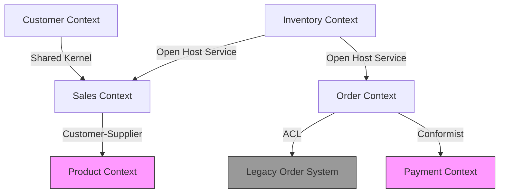

# Bounded Context（境界コンテキスト）設計ガイド

## 目次

- [Bounded Context とは](#bounded-context-とは)

---

## Bounded Context とは

「モデルが一意に定義される境界」。境界の内側では用語の意味が一貫している。

### 境界が必要な理由

同じ言葉が異なる意味を持つ場所では、単一モデルを無理に共有しようとするとモデルが複雑になりすぎる。

```
「顧客（Customer）」の例:

Sales Context:
  → 見込み客も含む、氏名・連絡先・購買履歴・ランク

Support Context:
  → サポートチケットの発行者、問題履歴・対応状況

Billing Context:
  → 請求先住所・支払方法・未払い残高

それぞれ異なるモデル。無理に統合すると全員にとって使いにくいモデルになる。
```

---

## 境界の引き方

### 引き方の4つの観点

**1. 言語境界（最重要）**

同じ言葉が異なる意味で使われる境界を探す。

```
イベントストーミングで「言葉の意味が変わる場所」に境界を引く

例（予約システム）:
  "Booking" が...
    Customer Context: 希望日時・人数・要望
    Operations Context: テーブル番号・調理の指示・アレルギー情報
    Billing Context: 金額・支払方法・領収書情報
  → 3つの Bounded Context
```

**2. チーム境界（Conway の法則）**

「システムの構造はコミュニケーション構造を反映する」

```
チームA（ECサイト担当）→ EC Context
チームB（物流担当）   → Logistics Context
チームC（CRM担当）    → CRM Context

→ チームをまたぐところに BC 境界を引くと自然
```

**3. ビジネス能力（Capability）境界**

```
注文管理能力   → Order Management Context
在庫管理能力   → Inventory Context
顧客管理能力   → Customer Context
支払い処理能力 → Payment Context
配送管理能力   → Shipping Context
```

**4. データの変化の頻度・トランザクション境界**

```
高頻度で変わるデータ（在庫数）と
低頻度で変わるデータ（顧客情報）は
別のコンテキストに置く
```

### 間違いやすいポイント

```
悪い境界: 技術的な層で区切る
  UI Context / API Context / Database Context
  → これは技術アーキテクチャであり、ビジネス境界ではない

悪い境界: 細かすぎるマイクロサービス境界
  CreateOrderContext / UpdateOrderContext / DeleteOrderContext
  → 「操作」単位は BC ではない

良い境界: ビジネス能力単位
  Order Management Context（注文の全ライフサイクルを管理）
```

---

## コンテキスト間連携パターン（Context Map パターン）

### パターン一覧と選択基準

#### 1. Shared Kernel（共有カーネル）

**概要:** 2チームが共通のモデル（コード）を共有する。

**適用条件:**
- 小チーム（2〜3人）で密接な協力が可能
- 変更頻度が低い共通概念
- 統合コストが高すぎる場合の暫定手段

**注意点:**
- どちらかが変更すると双方に影響
- 合意なく変更できないため、変更が遅くなる
- スケールしない（チームが大きくなると機能しにくい）

```
例: EC サイトで Sales と Support が
    Customer ID の型定義を共有する
```

#### 2. Customer-Supplier（顧客-供給者）

**概要:** 上流（Supplier）が下流（Customer）のニーズに応じてモデルを提供する。

**適用条件:**
- 明確な上流・下流の依存関係
- 下流が上流に要求を出せる関係（優先度に影響できる）

```
例:
  Order Context（下流: 顧客）が
  Product Context（上流: 供給者）の商品情報を使う

  Order チームは Product チームに「価格の履歴が必要」と要求できる
  Product チームはスプリントに組み込む（合意形成が必要）
```

#### 3. Conformist（追随者）

**概要:** 下流が上流のモデルに完全に従う。翻訳なし。

**適用条件:**
- 上流を変更できない（外部SaaS、レガシーシステム）
- 翻訳コストより従う方が安い
- 上流のモデルが十分に優れている

**注意点:**
- 上流の変更が直接下流に影響する
- 上流のモデルの問題点を引き継ぐ

```
例:
  Salesforce の CRM API をそのままのモデルで使う
  AWS のサービスの API モデルをそのまま使う
```

#### 4. Anti-Corruption Layer（腐敗防止層）

**概要:** 下流が翻訳層を持ち、上流の概念を自分のモデルに変換する。

**適用条件（最重要パターン）:**
- レガシーシステムとの統合
- 外部サービスとの統合（品質に自信がない）
- 上流のモデルを自分のコンテキストに持ち込みたくない
- 上流が変更されても自分への影響を最小化したい

```typescript
// 例: レガシーシステムの顧客モデルを ACL で変換
class LegacyCustomerACL {
  toDomain(legacyCustomer: LegacyCustomerDTO): Customer {
    return new Customer(
      new CustomerId(legacyCustomer.CUST_CD),
      new CustomerName(
        legacyCustomer.LAST_NM,
        legacyCustomer.FIRST_NM
      ),
      new EmailAddress(legacyCustomer.EMAIL_ADDR)
      // レガシーの冗長なフィールドは取り込まない
    );
  }
}
```

#### 5. Open Host Service（公開ホストサービス）

**概要:** 上流が複数の下流に対して明確なプロトコル（API）を公開する。

**適用条件:**
- 多数の下流コンテキストが存在する
- プロトコルを安定させたい
- REST API、gRPC、メッセージブローカーなど

```
例:
  Payment Context が他の全コンテキスト向けに
  REST API（Open Host Service）を公開する
```

#### 6. Published Language（公開言語）

**概要:** Open Host Service のプロトコルとして使われる共通言語。

**具体的な形:**
- OpenAPI（Swagger）仕様
- Protocol Buffers（gRPC）
- JSON Schema
- イベントスキーマ（Avro, JSON Schema）

```
Open Host Service ≒ プロトコルを公開する仕組み
Published Language ≒ プロトコルの具体的な表現形式
多くの場合セットで使われる
```

#### 7. Separate Ways（完全分離）

**概要:** 統合しない。それぞれが独自に実装する。

**適用条件:**
- 統合コストが高すぎる
- 依存関係による制約を避けたい
- 機能が重複してもよい（DRY原則より自律性を優先）

---

## Context Map の作り方

### ステップ1: 全 Bounded Context を列挙する

```
1. どのドメインの概念のまとまりがあるか
2. それぞれに名前をつける
3. 責務の範囲を1〜2文で記述する
```

### ステップ2: 依存関係を矢印で表す

```
矢印の方向: 依存する方向（依存される側が上流）

Order Context → Product Context
（Order が Product を参照する = Order が依存している）
```

### ステップ3: 各依存にパターン名を付ける

```
Order Context → [ACL] → Legacy Order System
Sales Context → [Customer-Supplier] → Product Context
Payment Context → [Open Host Service / Published Language] → 全コンテキスト
```

### Mermaid での Context Map 表現



### Context Map の読み方

| 記法 | 意味 |
|------|------|
| U（Upstream）| 上流（供給する側） |
| D（Downstream）| 下流（依存する側） |
| [ACL] | Anti-Corruption Layer（下流側に翻訳層あり） |
| [OHS] | Open Host Service（上流がAPIを公開） |
| [PL] | Published Language（公開言語を使用） |
| [SK] | Shared Kernel（コードを共有） |

---

## ECサイトの Context Map 例

### Bounded Context 一覧

| Context | 責務 |
|---------|------|
| Catalog（カタログ） | 商品情報の管理・検索 |
| Cart（カート） | ショッピングカートの管理 |
| Order（注文） | 注文の作成・管理 |
| Payment（支払い） | 決済処理 |
| Inventory（在庫） | 在庫管理・引当 |
| Shipping（配送） | 配送管理・追跡 |
| Customer（顧客） | 顧客情報・認証 |
| Notification（通知） | メール・プッシュ通知 |

### 関係性

```
Cart → Catalog: Conformist（カタログのProductモデルをそのまま使う）
Order → Cart: Customer-Supplier（CartがOrderの前提）
Order → Customer: ACL（顧客の詳細をOrderに引き込まない）
Order → Inventory: イベント連携（OrderConfirmed → 在庫引当）
Order → Payment: Customer-Supplier（PaymentがOrderの支払状態を管理）
Shipping → Order: Customer-Supplier（OrderConfirmedで配送開始）
Notification → Order, Payment, Shipping: Conformist（イベントを受け取る）
Payment → 外部決済API: ACL（Stripeなどの外部APIを内部モデルに変換）
```

---

## サブドメインの分類と投資優先度

### コアサブドメイン（Core Subdomain）

**定義:** 競争優位の源泉。自社の差別化要因。

**対応:** 最高品質のコードで内製。DDD の戦術的設計を全適用。

```
ECサイトの例:
  - レコメンデーションエンジン
  - 動的価格設定ロジック
  - 顧客ロイヤルティプログラム
```

### サポートサブドメイン（Supporting Subdomain）

**定義:** コアを支援するが差別化要因ではない。

**対応:** 内製だが簡略化した設計で十分。

```
ECサイトの例:
  - 注文管理
  - 在庫管理
  - 顧客管理
```

### 汎用サブドメイン（Generic Subdomain）

**定義:** どの企業でも同じ機能が必要。

**対応:** 外部サービス・SaaS・パッケージを利用。内製しない。

```
ECサイトの例:
  - 決済処理 → Stripe, PayPal
  - メール送信 → SendGrid, SES
  - 認証 → Auth0, Cognito
  - 全文検索 → Elasticsearch, Algolia
```
