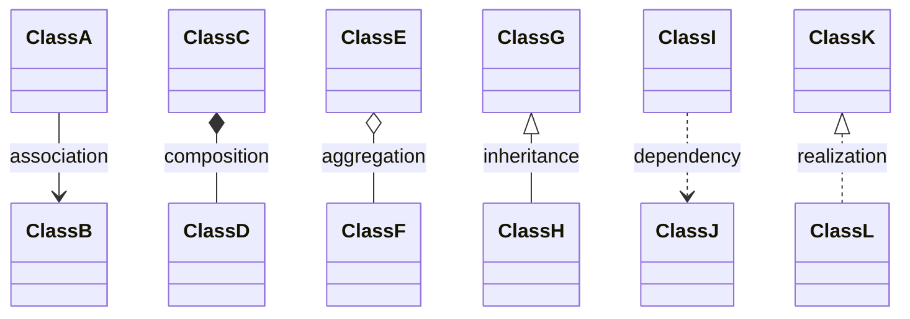
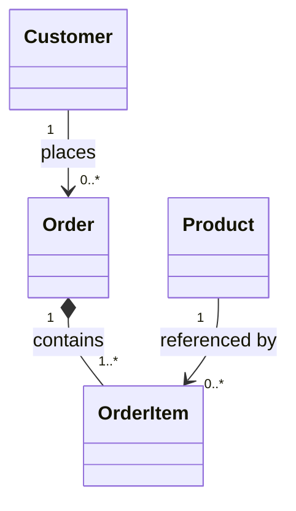
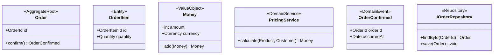
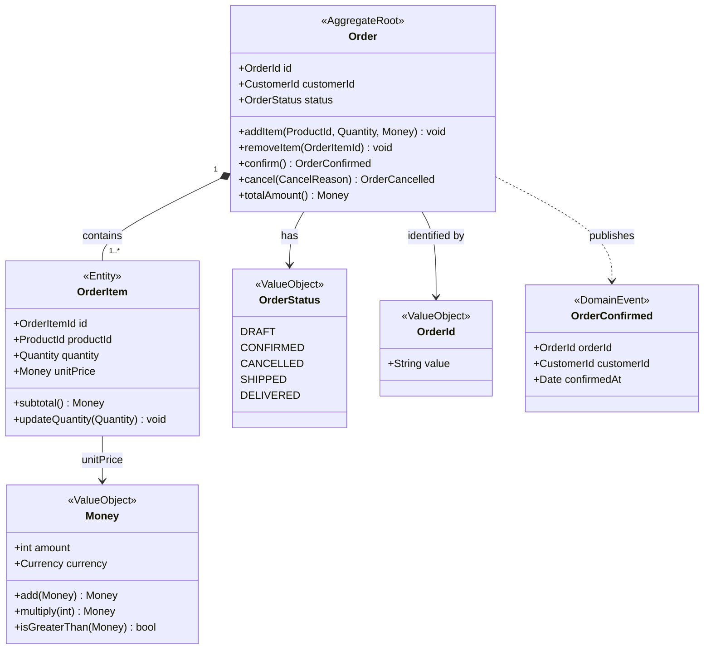
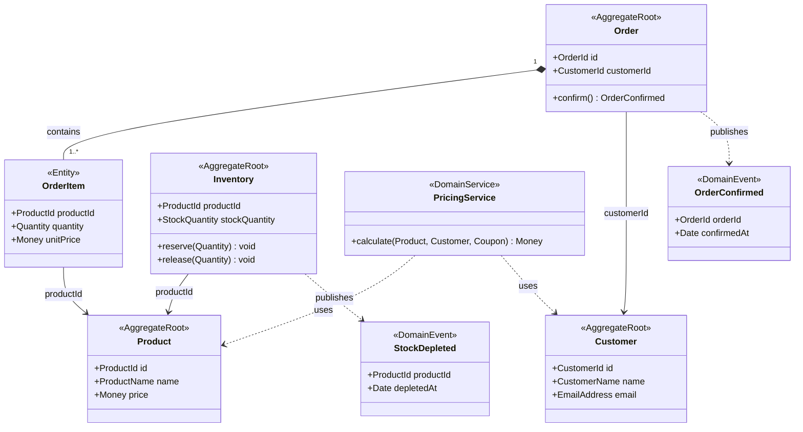
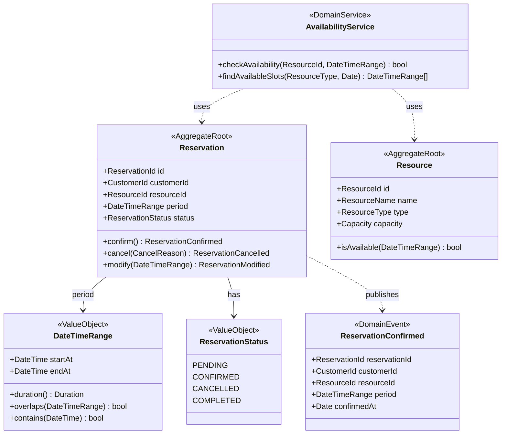
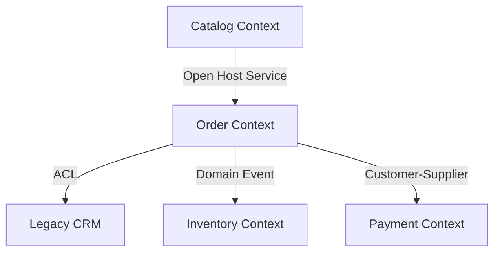

# Mermaid classDiagram によるドメインモデル表現

---

## 基本記法リファレンス

### 関係線の種類



### 多重度（Multiplicity）の記法



| 記法 | 意味 |
|------|------|
| `1` | 必ず1つ |
| `0..1` | 0または1つ |
| `1..*` | 1以上 |
| `0..*` または `*` | 0以上 |
| `n` | ちょうどn個 |

---

## ステレオタイプの使い方

### DDDの主要ステレオタイプ



### ステレオタイプ一覧

| ステレオタイプ | 対象 |
|-------------|------|
| `<<AggregateRoot>>` | 集約ルート（Entityの一種） |
| `<<Entity>>` | 集約内のEntityで Rootでないもの |
| `<<ValueObject>>` | 値オブジェクト |
| `<<DomainService>>` | ドメインサービス |
| `<<DomainEvent>>` | ドメインイベント |
| `<<Repository>>` | リポジトリインターフェース |
| `<<Factory>>` | ファクトリー |

---

## 何を図に含め、何を省くか

### 含めるべきもの

1. **ドメインの概念上重要な属性**
   - 不変条件に関わる属性
   - 識別子（ID）型（ただし技術的なDB IDは省く）
   - 主要なステータス・フラグ

2. **ドメイン操作（コマンドメソッド）**
   - 状態を変更するメソッド
   - ファクトリーメソッド
   - 重要なクエリメソッド

3. **集約間のID参照**
   - 集約間の関係を表すID型フィールド

4. **多重度**
   - ビジネス上の制約を表す多重度

### 省くべきもの

1. **getter/setter（読み書きアクセサ）**
   - モデルの概念を表さない
   - 図が汚くなる

2. **技術的なID（DBのサロゲートキー）**
   - `private Long id` などのDB都合のフィールド

3. **インフラ詳細**
   - `@Column`, `@Table` などのアノテーション情報

4. **全てのプライベートメソッド**
   - ドメインの概念として重要なものだけ

5. **コンストラクタ（ファクトリー経由でない場合）**

---

## ECサイト：完全なドメインモデル図の例

### 注文集約（Order Aggregate）



### 全体コンテキスト図



---

## 予約システム：ドメインモデル図の例



---

## よくある記法ミスと修正

### ミス1: 集約境界を表現しない

```mermaid
%% 悪い例: どこが集約境界か不明
classDiagram
    class Order { }
    class OrderItem { }
    class Customer { }
    Order --> OrderItem
    Order --> Customer

%% 良い例: ステレオタイプと関係線で境界を表現
classDiagram
    class Order {
        <<AggregateRoot>>
    }
    class OrderItem {
        <<Entity>>
    }
    class Customer {
        <<AggregateRoot>>
    }
    Order "1" *-- "1..*" OrderItem : Composition（同一集約）
    Order --> Customer : CustomerId（ID参照のみ）
```

### ミス2: 双方向参照を多用する

```mermaid
%% 悪い例: 双方向参照
classDiagram
    Order --> Customer : belongs to
    Customer --> Order : has

%% 良い例: 主たる方向のみ
classDiagram
    Order --> Customer : customerId（ID参照）
    %% Customer → Order はクエリで取得（参照線なし）
```

### ミス3: DBスキーマをそのままクラス図にする

```mermaid
%% 悪い例: DBテーブルのようなクラス図
classDiagram
    class orders {
        id INT PK
        customer_id INT FK
        created_at TIMESTAMP
        updated_at TIMESTAMP
        is_deleted BOOLEAN
    }

%% 良い例: ドメインの概念を表すクラス図
classDiagram
    class Order {
        <<AggregateRoot>>
        +OrderId id
        +CustomerId customerId
        +OrderStatus status
        +confirm() OrderConfirmed
    }
```

---

## 図のレベル分け（何を1枚の図に入れるか）

### レベル1: 戦略的設計図（Context Map）

対象: Bounded Context の全体像・依存関係



### レベル2: 集約全体図

対象: 1つの Bounded Context 内の全集約・関係

```mermaid
classDiagram
    %% 主要な集約とその関係のみ
    %% 内部の詳細は次レベルに委ねる
```

### レベル3: 集約詳細図

対象: 1つの集約の詳細な構造・不変条件

```mermaid
classDiagram
    %% 1集約の全Entity・VO・操作を詳細に記述
```

**原則:** 1枚の図に5〜7個以上のクラスが入ったら分割を検討する。
