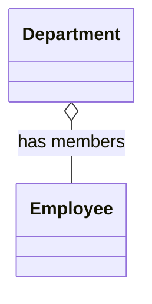
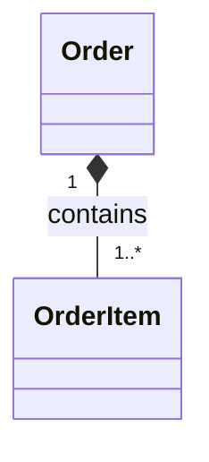
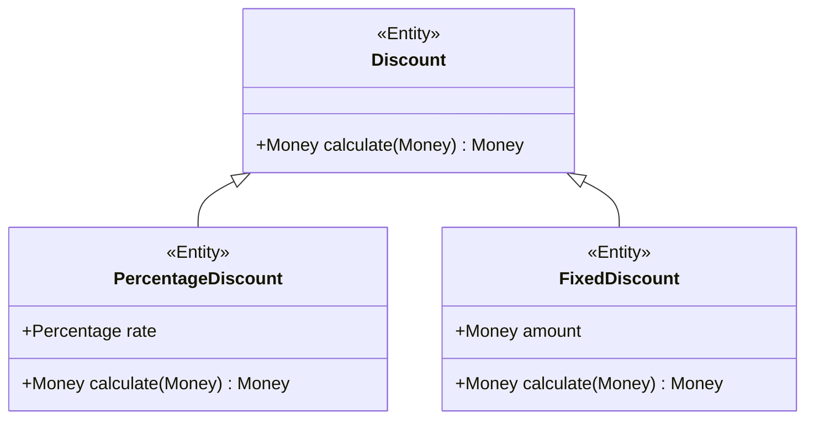
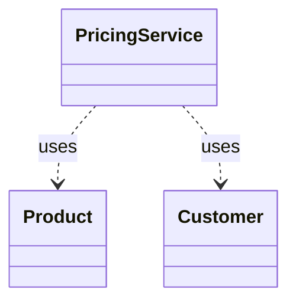
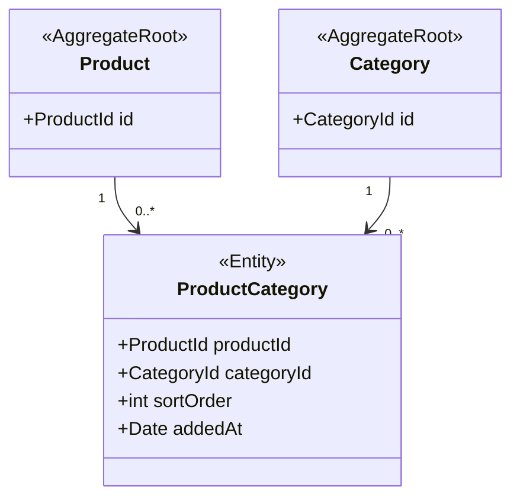

# ドメインモデルの関係性の種類と使い分け

## 目次

- [関係性の種類](#関係性の種類)

---

## 関係性の種類

### 1. Association（関連）

**意味:** オブジェクトが他のオブジェクトを「知っている」弱い参照関係。

**特徴:**
- ライフサイクルは独立している
- 参照先は別の集約のIDで保持する（DDD的に正しい形）

**DDDでの使い方:**
```typescript
class Order {
  private customerId: CustomerId;  // Customer Aggregate への Association
  // Customer 全体は持たない、IDのみ
}
```

### 2. Aggregation（集約）

**意味:** 全体-部分の関係だが、部分は全体がなくても存在できる。

**UML記号:** 白いひし形 `o--`



**DDDでの使用頻度:** 低い。集約（Aggregate）と混同されやすいため、Composition か Association を使うことが多い。

### 3. Composition（コンポジション）

**意味:** 全体-部分の関係で、部分は全体なしに存在できない。全体が削除されると部分も削除される。

**UML記号:** 黒いひし形 `*--`

**DDDでの使い方（最重要）:**
```typescript
// Order（全体）と OrderItem（部分）は Composition
// Order が削除されたら OrderItem も削除される
// OrderItem は Order なしには存在しない
class Order {
  private items: OrderItem[];  // Composition: Order 内に封じ込め
}
```



### 4. Inheritance（継承）

**意味:** is-a 関係。サブクラスはスーパークラスの全特性を引き継ぐ。

**DDDでの注意点:**
- ドメインモデルでの継承は慎重に使う
- 「真の is-a 関係」にのみ使用する
- 実装の再利用目的で使わない



**代替案（ポリモーフィズム+コンポジション）:**
```typescript
// 継承の代わりに Strategy パターンを使う
interface DiscountPolicy {
  calculate(price: Money): Money;
}

class PercentageDiscountPolicy implements DiscountPolicy { ... }
class FixedDiscountPolicy implements DiscountPolicy { ... }
```

### 5. Dependency（依存）

**意味:** あるクラスが別のクラスを「使う」一時的な関係。保持はしない。

**UML記号:** 点線矢印 `..>`

**DDDでの使い方:**
```typescript
class PricingService {
  // Product と Customer に依存するが保持しない
  calculate(product: Product, customer: Customer): Money {
    // メソッドの引数として受け取るだけ
  }
}
```



---

## 双方向 vs 単方向の選択基準

### 原則: 単方向を優先する

双方向参照は「本当にビジネス上の双方向ナビゲーションが必要か」を問う。

**双方向参照の問題:**
1. 整合性維持のコストが2倍（A→BとB→Aを常に同期する必要）
2. モデルの複雑さが増す
3. 循環依存のリスク

### 判断フロー

```
「A から B を必要とする操作があるか？」
  YES → A → B の参照が必要

「B から A を必要とする操作があるか？」
  YES → 双方向参照が必要（ただし本当に必要か再検討）
  NO  → 単方向参照のみ

「B から A への操作がクエリ（検索）か？」
  YES → 双方向参照ではなくクエリで取得する方が良い
        例: Customer が持つ全 Order → OrderRepository.findByCustomerId()
```

### 具体例

```typescript
// 単方向で十分なケース
class Order {
  customerId: CustomerId;  // Order → Customer（単方向）
}

// Customer → Order のナビゲーションが必要な場合
// 双方向参照ではなく、クエリで取得する
class OrderRepository {
  findByCustomerId(customerId: CustomerId): Order[] { ... }
}

// Application Service でのナビゲーション
class OrderHistoryService {
  getOrderHistory(customerId: CustomerId): Order[] {
    return this.orderRepository.findByCustomerId(customerId);
  }
}
```

---

## 多重度（Multiplicity）の決め方

### ビジネスルールから多重度を導く

```
問い: 「注文（Order）は何個の注文明細（OrderItem）を持つか？」
  ビジネスルール: 「注文には必ず1つ以上の商品が必要」
  多重度: Order "1" *-- "1..*" OrderItem

問い: 「顧客（Customer）は何個の注文（Order）を持つか？」
  ビジネスルール: 「注文がない顧客も存在する（会員登録後に注文する）」
  多重度: Customer "1" --> "0..*" Order

問い: 「商品（Product）はいくつのカテゴリに属するか？」
  ビジネスルール: 「商品は複数カテゴリに属せる」
  多重度: Product "0..*" --> "0..*" Category
```

### 多対多の処理

**多対多は関連クラスで解決する:**

```typescript
// 多対多の直接表現（避ける）
class Product {
  categories: Category[];  // 多対多
}

// 関連クラスで表現（推奨）
class ProductCategory {
  productId: ProductId;
  categoryId: CategoryId;
  sortOrder: number;       // 関連固有の属性
  addedAt: Date;          // 関連固有の属性
}
```



---

## ドメインモデルの関係性チェックリスト

設計をレビューする際に確認すること:

1. **双方向参照は必要最小限か？**
   - 逆方向のナビゲーションをクエリで代替できないか

2. **Composition の親子関係は正しいか？**
   - 子は親なしに存在できないか
   - 親が削除されたら子も削除されるか

3. **集約間参照はIDのみか？**
   - 別集約のオブジェクト全体を参照していないか

4. **多対多は関連クラスで表現されているか？**
   - 関連固有の属性が存在しないか確認する

5. **継承は真のis-a関係か？**
   - 実装再利用のための継承になっていないか
   - Strategyパターン等で代替できないか
