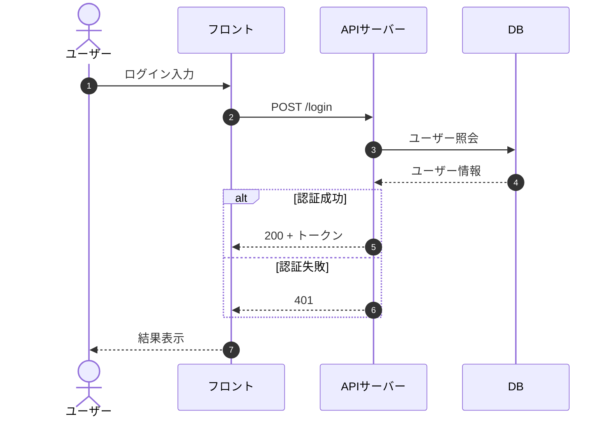
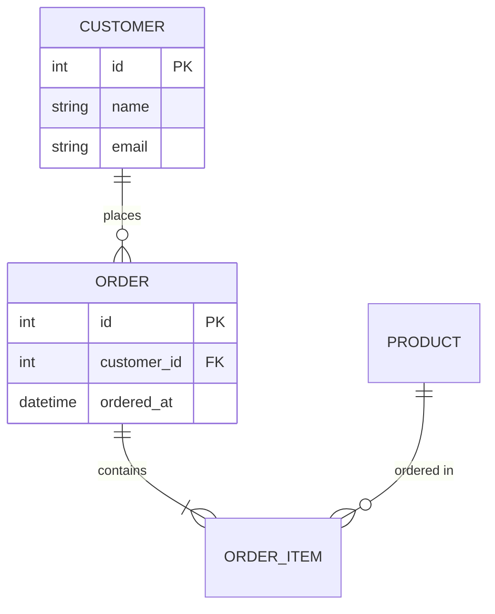
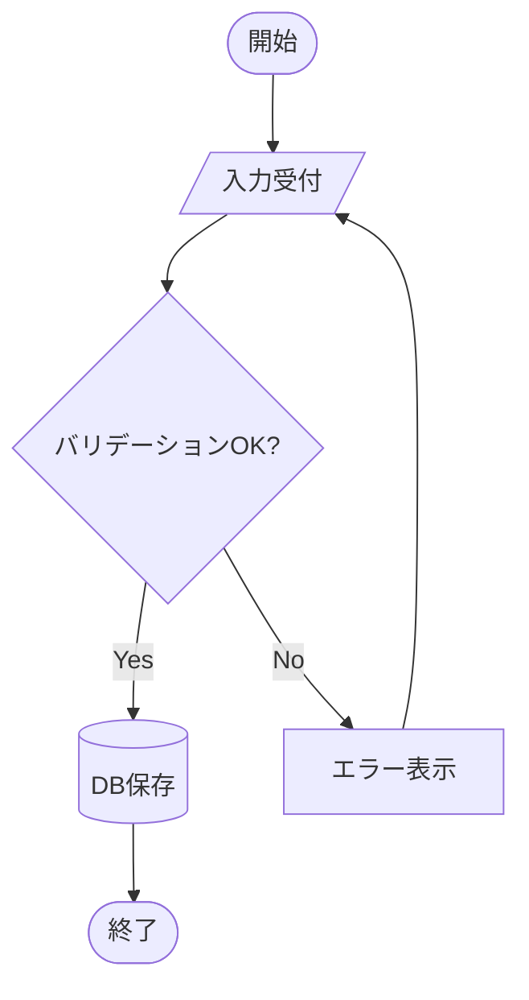
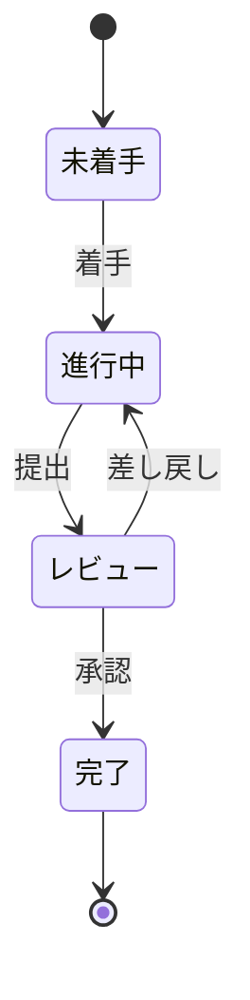
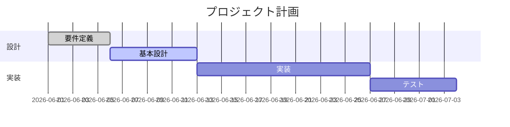
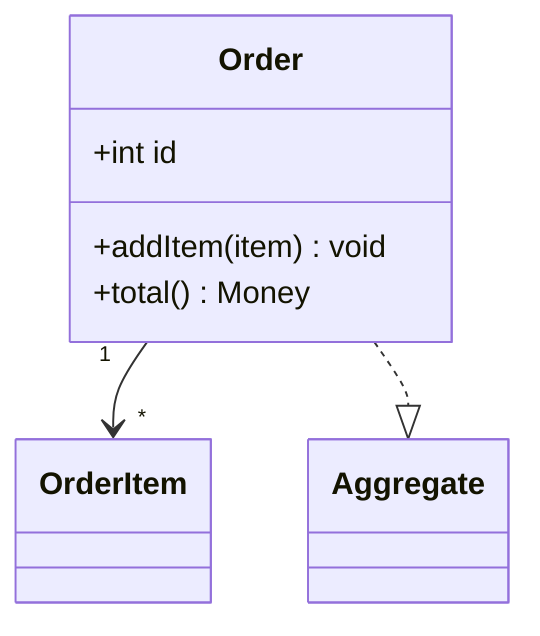
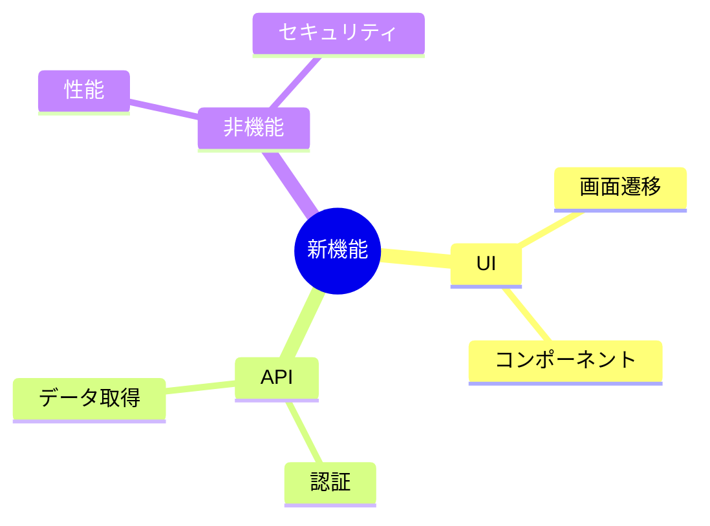

# Mermaid 記法ミニリファレンス

各図タイプの最小テンプレートと頻出パターン。詳細は公式（https://mermaid.js.org/）参照。

## 目次

- [シーケンス図](#シーケンス図)
- [ER図](#er図)
- [フローチャート](#フローチャート)
- [状態遷移図](#状態遷移図)
- [ガントチャート](#ガントチャート)
- [クラス図（簡易・DDD は domain-modeler 優先）](#クラス図簡易ddd-は-domain-modeler-優先)
- [マインドマップ](#マインドマップ)
- [よくあるエラー回避](#よくあるエラー回避)

## シーケンス図

- `->>` 同期, `-->>` 戻り（破線）, `-)` 非同期
- 制御: `alt/else/end`, `opt/end`, `loop/end`, `par/and/end`
- `Note over A,B: 補足`

## ER図

- 基数: `||`(1) `o{`(0..多) `|{`(1..多) `o|`(0..1)
- 例: `A ||--o{ B` = A 1 に対し B 0個以上

## フローチャート

- 方向: `TD`(上→下) `LR`(左→右)
- 形状: `[]`処理 `()` 角丸 `([])`端点 `{}`判断 `[()]`DB `[//]`入出力
- `subgraph 名称 ... end` でグループ化

## 状態遷移図

## ガントチャート

- `done`/`active`/`crit` でステータス, `after <id>` で依存

## クラス図（簡易・DDD は domain-modeler 優先）

- 関係: `<|--`継承, `*--`コンポジション, `o--`集約, `-->`関連, `..|>`実現

## マインドマップ

## よくあるエラー回避

- ラベルに `()` `:` `,` を含むときは `"..."` で囲む: `A["処理 (重要)"]`
- 日本語ノード ID は避け、ID は英数字・表示名はラベルで指定する
- 予約語（`end` 等）を素の ID に使わない
- インデント崩れに注意（特に `mindmap`/`gantt` は階層をスペースで表現）
