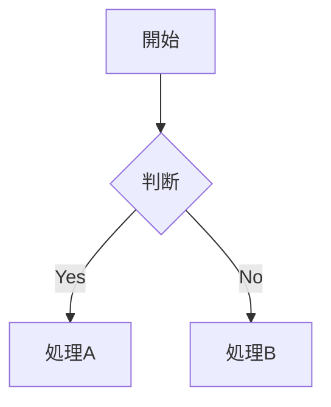

## 目次

- [ワークフロー](#ワークフロー)
- [内部リンク（ウィキリンク）](#内部リンクウィキリンク)
- [埋め込み](#埋め込み)
- [コールアウト](#コールアウト)
- [プロパティ（フロントマター）](#プロパティフロントマター)
- [タグ](#タグ)
- [コメント](#コメント)
- [Obsidian固有の書式](#obsidian固有の書式)
- [数式（LaTeX）](#数式latex)
- [ダイアグラム（Mermaid）](#ダイアグラムmermaid)
- [脚注](#脚注)
- [完全な例](#完全な例)

# Obsidian Flavored Markdown

有効なObsidian Flavored Markdownを作成・編集する。ObsidianはCommonMarkとGFMをウィキリンク・埋め込み・コールアウト・プロパティ・コメント等で拡張している。標準Markdown（見出し・太字・イタリック・リスト・引用・コードブロック・テーブル）は既知の前提とし、Obsidian固有の拡張のみを説明する。

## ワークフロー

1. **フロントマター追加**: ファイル先頭にプロパティ（title・tags・aliases）を設定
2. **コンテンツ記述**: 標準Markdown + Obsidian固有記法でコンテンツを作成
3. **ノートのリンク**: ボルト内ノートへの接続にウィキリンク (`[[ノート]]`) を使用。外部URLには標準Markdownリンクのみ使用
4. **コンテンツ埋め込み**: `![[埋め込み]]` でノート・画像・PDFを埋め込む
5. **コールアウト追加**: `> [!type]` でハイライト情報を追加
6. **確認**: Obsidianのリーディングビューで正しくレンダリングされることを確認

> ウィキリンクと標準Markdownリンクの選択: ボルト内ノートへは `[[ウィキリンク]]`（Obsidianが名前変更を自動追跡）、外部URLへは `[テキスト](url)` のみ使用する。

## 内部リンク（ウィキリンク）

```markdown
[[ノート名]]                          ノートへのリンク
[[ノート名|表示テキスト]]             カスタム表示テキスト
[[ノート名#見出し]]                   見出しへのリンク
[[ノート名#^ブロックID]]              ブロックへのリンク
[[#同じノートの見出し]]               同一ノート内の見出しリンク
```

ブロックIDの定義（段落の末尾に追記）:

```markdown
このパラグラフにリンクできる。^my-block-id
```

リスト・引用のブロックIDはブロックの後の行に記述:

```markdown
> 引用ブロック

^quote-id
```

## 埋め込み

ウィキリンクの前に `!` をつけるとコンテンツをインライン埋め込み:

```markdown
![[ノート名]]                          ノート全体を埋め込む
![[ノート名#見出し]]                   セクションを埋め込む
![[image.png]]                         画像を埋め込む
![[image.png|300]]                     幅指定で画像を埋め込む
![[document.pdf#page=3]]               PDFページを埋め込む
```

## コールアウト

```markdown
> [!note]
> 基本的なコールアウト。

> [!warning] カスタムタイトル
> カスタムタイトル付きコールアウト。

> [!faq]- デフォルトで折りたたむ
> 折りたたみ可能（- で折りたたみ、+ で展開）。
```

一般的なタイプ: `note`・`tip`・`warning`・`info`・`example`・`quote`・`bug`・`danger`・`success`・`failure`・`question`・`abstract`・`todo`

## プロパティ（フロントマター）

```yaml
---
title: ノートタイトル
date: 2024-01-15
tags:
  - プロジェクト
  - 進行中
aliases:
  - 別名
cssclasses:
  - custom-class
---
```

デフォルトプロパティ: `tags`（検索可能ラベル）・`aliases`（リンク候補の別名）・`cssclasses`（スタイリング用CSSクラス）

## タグ

```markdown
#タグ                    インラインタグ
#ネスト/タグ             階層タグ
```

タグには英数字・数字（先頭不可）・アンダースコア・ハイフン・スラッシュが使用可能。フロントマターの `tags` プロパティでも定義可能。

## コメント

```markdown
表示されるテキスト %%だがこれは非表示%% テキスト。

%%
このブロック全体がリーディングビューで非表示になる。
%%
```

## Obsidian固有の書式

```markdown
==ハイライトテキスト==                 ハイライト構文
```

## 数式（LaTeX）

```markdown
インライン: $e^{i\pi} + 1 = 0$

ブロック:
$$
\frac{a}{b} = c
$$
```

## ダイアグラム（Mermaid）

````markdown

````

MermaidノードをObsidianノートにリンクする場合: `class ノード名 internal-link;` を追加。

## 脚注

```markdown
脚注付きテキスト[^1]。

[^1]: 脚注の内容。

インライン脚注。^[これはインライン。]
```

## 完全な例

````markdown
---
title: プロジェクトアルファ
date: 2024-01-15
tags:
  - プロジェクト
  - 進行中
status: in-progress
---

# プロジェクトアルファ

このプロジェクトは [[ワークフロー改善]] を目指す。

> [!important] 重要な期限
> 最初のマイルストーンは ==1月30日== 締切。

## タスク

- [x] 初期計画
- [ ] 開発フェーズ
  - [ ] バックエンド実装
  - [ ] フロントエンド設計

## ノート

アルゴリズムは $O(n \log n)$ ソートを使用。詳細は [[アルゴリズムノート#ソート]] 参照。

![[アーキテクチャ図.png|600]]

[[ミーティングノート 2024-01-10#決定事項]] でレビュー済み。
````

## 参考リンク

- Obsidian Flavored Markdown: https://help.obsidian.md/obsidian-flavored-markdown
- 内部リンク: https://help.obsidian.md/links
- 埋め込みファイル: https://help.obsidian.md/embeds
- コールアウト: https://help.obsidian.md/callouts
- プロパティ: https://help.obsidian.md/properties
