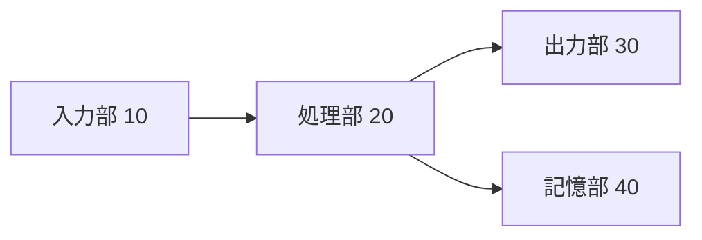
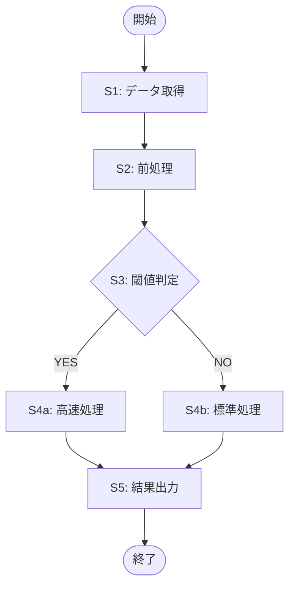
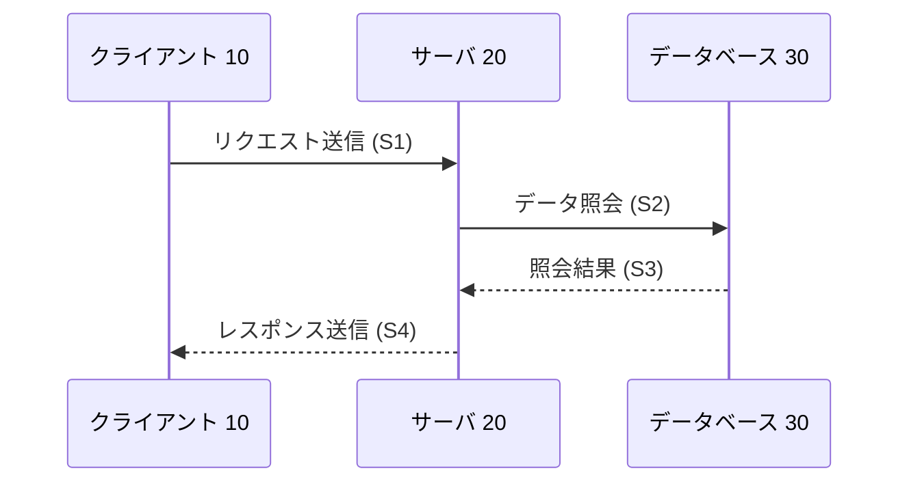
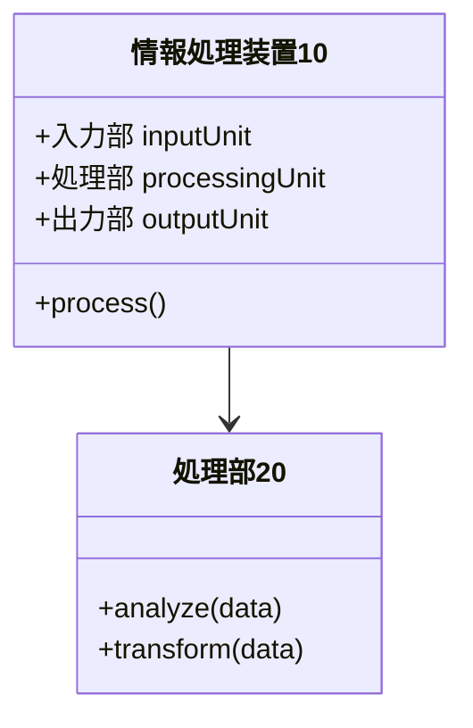

# Patent Spec Writer（ソフトウェア発明専用）

ソフトウェア発明のアイデアから、日本特許庁への出願に対応した特許明細書（Markdown形式）を段階的に作成するスキル。
**対象はソフトウェア関連発明に限定する**（ハードウェア固有の発明・化学・機械等は対象外）。
各セクションの注意点は `references/` フォルダにまとめてある。

## 前後の工程

- **前工程**: 発明の概要・技術的な特徴・従来技術との差分が把握できている状態で開始する
- **後工程**: 弁理士レビュー → 図面の清書 → 特許庁電子出願システムへの変換

---

## 実行ルール（必須）

- 各 Phase は **ヒアリング → 執筆 → ユーザー確認** の順で進める
- Phase をまたいで一気に書かない。必ず1Phaseごとに確認を取る
- 不明点は推測で埋めず、ユーザーに質問する
- 専門用語は出願全体で統一して使う（用語ブレは拒絶理由になる）
- 図面は **Mermaid コードブロック** で記述する（清書は人手に委ねる）
- 出力ファイルは `patent-spec-YYYYMMDD.md`（または指定ファイル名）に書き出す

---

## ソフトウェア発明の成立要件（必須確認）

参照: [references/software-patent-requirements.md](references/software-patent-requirements.md)

執筆前に以下を確認する。**すべての条件を満たさない場合は発明の構成を見直す**。

```
✅ チェックリスト（ソフトウェア発明として特許を受けるための条件）
- [ ] ソフトウェアによる情報処理がハードウェア資源（CPU・メモリ等）を用いて具体的に実現されているか
- [ ] 単なるアルゴリズム・数学的手法・ビジネスルールの羅列ではなく、技術的手段として構成されているか
- [ ] 自然法則を利用した技術的思想として説明できるか
- [ ] プログラム・装置・方法のうち、どのカテゴリで権利化するかが明確か
```

---

## Phase 1: 発明のヒアリング

### 必須ヒアリング項目

以下をすべて確認してから執筆に進む。未入力は「未定」でも可（後から補完）。

```
1. 発明の名称（仮称でも可）
2. 技術分野（例: 画像処理・自然言語処理・ネットワーク制御・組込みシステム）
3. 従来のソフトウェア・システムの問題点・課題
4. 発明が課題を解決するための手段（コアのアイデア）
5. 発明の効果（従来技術と比べた優位性）
6. 実施形態（具体的な実装例・処理フロー・使用シーン）
7. 主要な構成要素（モジュール名・クラス名・処理ステップ）
8. 発明者名・出願予定日（任意）
```

### ヒアリングテンプレート（未入力時に使う）

```
ソフトウェア特許明細書の作成を始めます。以下を教えてください（未定は「未定」で可）。

1. 何を発明しましたか？（1〜3文で）
2. どんなソフトウェア・システムですか？（例: Webアプリ・組込みシステム・AI・API）
3. 従来の方法・ソフトウェアでは何が困っていましたか？
4. あなたの発明はその問題をどう解決しますか？
5. 従来と比べてどんな良いことがありますか？（効果・メリット）
6. 具体的にどう動くか教えてください（処理の流れ・入出力・主要な計算やロジック）
7. 主なモジュール・コンポーネント・処理ステップを挙げてください
```

### Phase 1 の出力

- `発明概要サマリー`（ヒアリング内容の整理）
- `用語統一リスト`（以降で使う専門用語の定義）
- `ソフトウェア発明成立要件チェック結果`

---

## Phase 2: 特許請求の範囲の作成

参照: [references/claims-guide.md](references/claims-guide.md)

### ソフトウェア発明の4種クレームセット

ソフトウェア発明は以下の4カテゴリで多面的に権利化する。

| クレームカテゴリ | 記載形式 | 侵害の特定しやすさ |
|----------------|---------|----------------|
| 装置クレーム | 「〜部を備える情報処理装置」 | 製品への適用で立証しやすい |
| 方法クレーム | 「〜するステップを含む情報処理方法」 | サービス・処理への適用で立証しやすい |
| プログラムクレーム | 「コンピュータに〜を実行させるためのプログラム」 | ソフトウェア頒布への適用 |
| 記録媒体クレーム | 「〜プログラムを記録したコンピュータ読み取り可能な記録媒体」 | メディア販売への適用 |

### 執筆手順

1. **独立請求項（請求項1）** を最初に書く（装置クレームが最も一般的）
   - 課題解決に**必須の構成要素のみ**を列挙する
   - 機能・目的は書かず、**構成（手段）** で記載する
   - 「〜部」「〜手段」で構成要素を表現する

2. **従属請求項（請求項2以降）** で限定・具体化する

3. **方法クレーム・プログラムクレーム・記録媒体クレーム** を追加する

### 請求項テンプレート

```
【請求項１】（装置クレーム）
　[構成要素A]部と、
　[構成要素B]部と、
　[構成要素C]部と、
を備える情報処理装置。

【請求項２】（従属）
　前記[構成要素A]部は、[限定事項]である、
請求項１に記載の情報処理装置。

【請求項３】（方法クレーム）
　[処理A]するステップと、
　[処理B]するステップと、
　[処理C]するステップと、
を含む情報処理方法。

【請求項４】（プログラムクレーム）
　コンピュータに、
　[処理A]する手順と、
　[処理B]する手順と、
　[処理C]する手順と、
を実行させるためのプログラム。

【請求項５】（記録媒体クレーム）
　コンピュータに、
　[処理A]する手順と、
　[処理B]する手順と、
　[処理C]する手順と、
を実行させるためのプログラムを記録したコンピュータ読み取り可能な記録媒体。
```

### Phase 2 の出力

- `【特許請求の範囲】`（請求項1〜N）
- `請求項設計メモ`（独立項・従属項の設計意図）

---

## Phase 3: 明細書の作成

参照: [references/description-guide.md](references/description-guide.md)

各セクションを順番に執筆し、1セクション終わるごとに確認を取る。

### セクション順序と執筆内容

#### 【発明の名称】

- ソフトウェアのカテゴリ（情報処理装置/情報処理方法/プログラム）を末尾に明記する
- 「最新」「革新的」等の修飾語は使わない
- 請求項1のカテゴリと統一する

```
例: 情報処理装置、データ処理方法、推論プログラム
```

---

#### 【技術分野】

```
テンプレート:
本発明は、情報処理技術に関し、特に[より具体的な分野（例: 機械学習を用いた異常検知）]に関する。
```

---

#### 【背景技術】

- 従来のソフトウェア・アルゴリズム・システムの概要を**客観的に**記述する
- 公知文献がある場合は【特許文献1】【非特許文献1】として記載する

```
テンプレート:
従来、[技術分野]においては、[従来技術の概要]が知られている（特許文献1参照）。
```

---

#### 【先行技術文献】（文献がある場合のみ）

```
【特許文献】
【特許文献１】特開20XX-XXXXXX号公報

【非特許文献】
【非特許文献１】著者名,「論文タイトル」,雑誌名,巻,号,ページ,発行年
```

---

#### 【発明が解決しようとする課題】

- 従来のソフトウェア・アルゴリズムの**具体的な問題点**を記載する
- 課題は請求項・効果と整合させる（三点セット）

---

#### 【課題を解決するための手段】

- **請求項の文言をほぼそのまま引用する**（写してよい）
- 「本発明に係る情報処理装置は、〜部を備える」の形式で書く
- 各請求項に対応するパラグラフを設ける

---

#### 【発明の効果】

- 課題がどう解決されたかを**定量的に・具体的に**記載する
- 「〜という効果を奏する」で締める

---

#### 【図面の簡単な説明】

```
テンプレート:
【図１】本発明の実施形態に係る[装置名]の全体構成を示すブロック図である。
【図２】[処理名]の流れを示すフローチャートである。
【図３】[データ構造名]を示す説明図である。
```

---

#### 【発明を実施するための形態】

- 請求項の各構成要素を**具体的に説明**する
- 符号（10、20…）を付けて図面と対応させる
- 「〜について、図1を参照して説明する」の形式でナビゲートする
- ソフトウェアの場合、**ハードウェア構成**（CPU、メモリ、ストレージ）への言及を入れる

```
記載例:
情報処理装置10は、CPU、RAM、ROM、ストレージ及び通信インターフェースを
備える汎用コンピュータとして実現される。
```

---

#### 【産業上の利用可能性】

```
テンプレート:
本発明は、[産業分野]において利用可能であり、
[具体的なソフトウェア製品やサービス]に好適に適用できる。
```

---

#### 【符号の説明】

```
テンプレート:
1　情報処理システム
10　情報処理装置
11　[サブ構成要素名]
20　[構成要素名]
```

### Phase 3 の出力

- `【明細書】` 全文（上記セクションをすべて含む）

---

## Phase 4: 図面（Mermaid）の作成

参照: [references/drawings-guide.md](references/drawings-guide.md)

- 図面は **Mermaid コードブロック** で記述する
- 清書（PNG/SVG への変換・フォント調整）は人手で行う前提
- 符号は Mermaid のノードラベルに含める

### 図面の記述フォーマット

**ブロック図（システム・装置構成）— `graph LR` or `graph TD`:**

````markdown
【図1】情報処理システム1の全体構成を示すブロック図



符号の説明:
- 1: 情報処理システム全体
- 10: 入力部（外部データを受け取る）
- 20: 処理部（データを変換・分析する）
- 30: 出力部（結果を外部に送出する）
- 40: 記憶部（中間データを保持する）
````

**フローチャート（処理・方法）— `flowchart TD`:**

````markdown
【図2】処理部20における処理の流れを示すフローチャート


````

**シーケンス図（コンポーネント間の通信）— `sequenceDiagram`:**

````markdown
【図3】クライアントとサーバ間の通信シーケンスを示す図


````

**クラス図（データ構造・モジュール構成）— `classDiagram`:**

````markdown
【図4】情報処理装置10の主要クラス構成を示すクラス図


````

### Phase 4 の出力

- 各図の Mermaid コードブロック（符号の説明付き）

---

## Phase 5: 要約書の作成

```
【要約】

【課題】[発明が解決する課題を1文で]

【解決手段】[請求項1の構成を簡潔に]

【選択図】図[N]
```

- 400字程度を目安にする
- 最も代表的な図（通常は全体構成のブロック図）を【選択図】に指定する

---

## 最終出力フォーマット

以下の順序で1つのMarkdownファイルにまとめて出力する。

```markdown
# 特許出願書類

---

## 【書類名】特許請求の範囲

【請求項１】
...

---

## 【書類名】明細書

### 【発明の名称】
...

### 【技術分野】
...

### 【背景技術】
...

### 【先行技術文献】
...

### 【発明が解決しようとする課題】
...

### 【課題を解決するための手段】
...

### 【発明の効果】
...

### 【図面の簡単な説明】
...

### 【発明を実施するための形態】
...

### 【産業上の利用可能性】
...

### 【符号の説明】
...

---

## 【書類名】要約書

【要約】
...

---

## 図面

### 【図1】
```mermaid
...
```

### 【図2】
```mermaid
...
```
```

---

## Definition of Done（DoD）チェックリスト

```
ソフトウェア発明固有:
- [ ] 請求項にハードウェア資源（CPU、メモリ等）との協働が示唆されているか
- [ ] 「プログラム」クレームと「装置」クレームの両方を作成したか
- [ ] 実施形態にハードウェア構成の言及があるか

共通:
- [ ] 発明の名称が請求項1のカテゴリと一致している
- [ ] 請求項1に「あってもなくてもよい要素」が含まれていない
- [ ] 課題・手段・効果の三点セットが論理的に整合している
- [ ] 明細書中の用語が全体で統一されている
- [ ] 符号が明細書・図面説明・符号の説明・Mermaid図で一致している
- [ ] 各請求項の構成要素が実施形態で説明されている
- [ ] 要約書が400字程度に収まっている
```

---

## リファレンス

- ソフトウェア発明の成立要件: [references/software-patent-requirements.md](references/software-patent-requirements.md)
- 請求項の書き方: [references/claims-guide.md](references/claims-guide.md)
- 明細書各セクションの詳細ガイド: [references/description-guide.md](references/description-guide.md)
- 図面（Mermaid）の書き方: [references/drawings-guide.md](references/drawings-guide.md)
