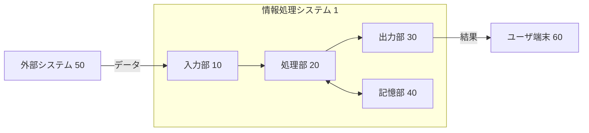
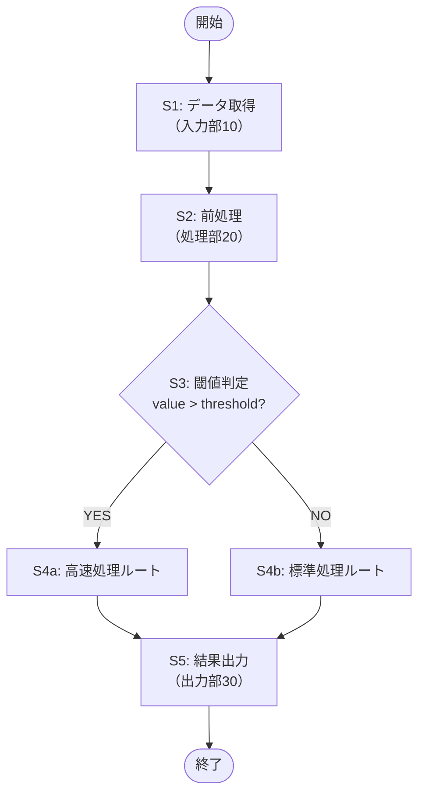
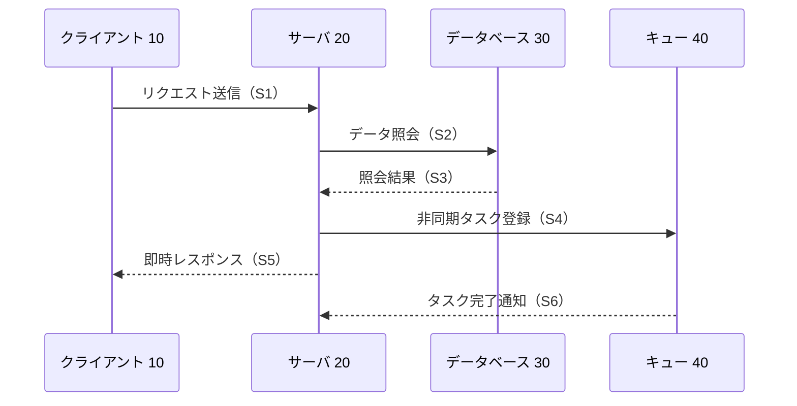
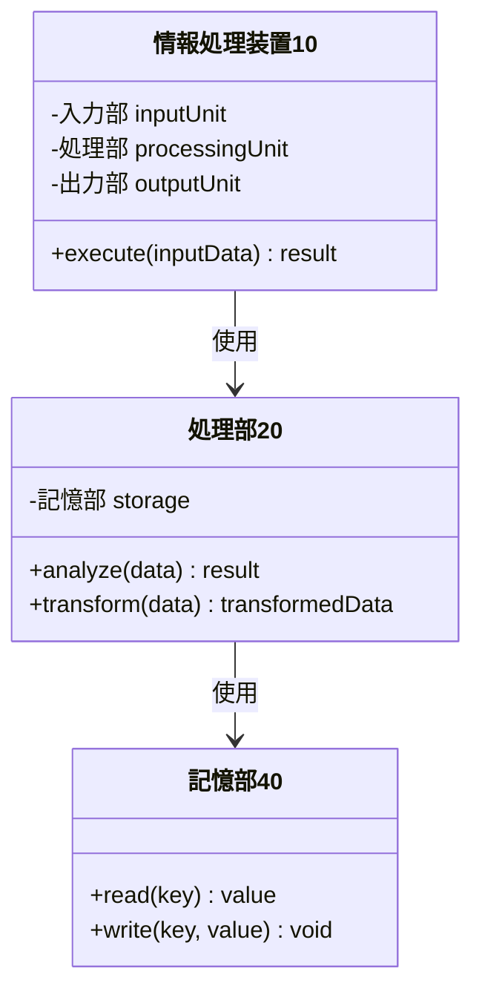
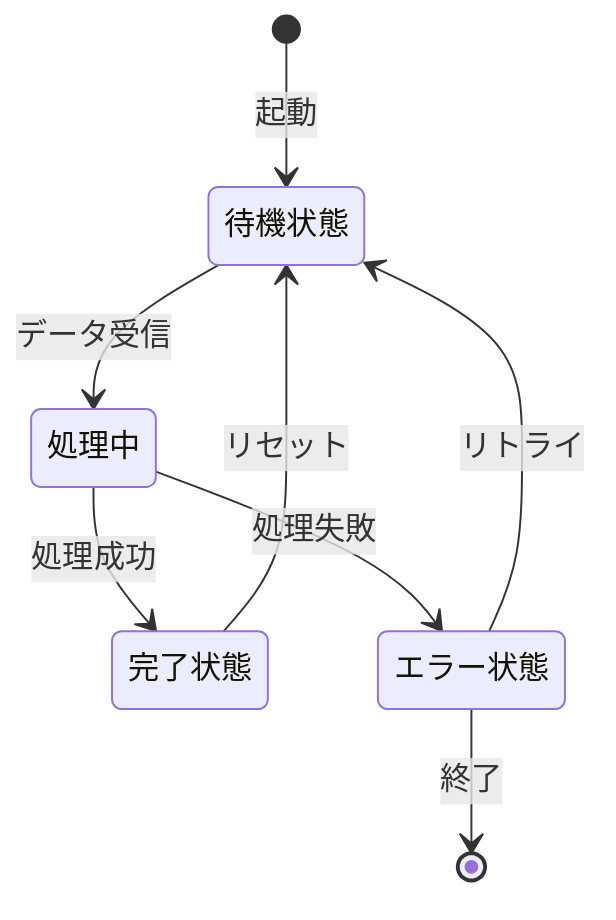
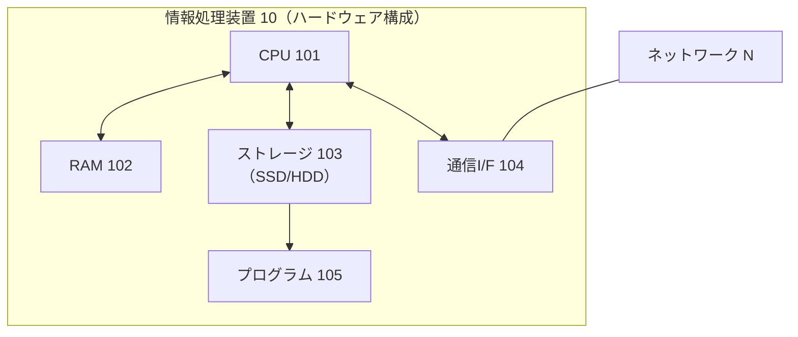

# 図面作成ガイド（Mermaid版）

特許出願における図面の役割・種類と、Mermaidを使った草稿の書き方。
本スキルでは **Mermaid コードブロック** で図面の草稿を作成し、清書は人手で行う。

---

## 図面の役割と法的位置づけ

図面は明細書を補完し、発明の理解を助けるための書類（特許法第36条第2項）。
Mermaidで草稿を作成し、最終的な清書（PNG/SVG・書式調整）は人手で行う。

---

## ソフトウェア発明で使う図の種類

| 図の種類 | 用途 | Mermaid記法 |
|---------|------|------------|
| ブロック図 | システム・装置のコンポーネント構成 | `graph LR` / `graph TD` |
| フローチャート | 処理手順・アルゴリズム | `flowchart TD` |
| シーケンス図 | コンポーネント間の通信・呼び出し順序 | `sequenceDiagram` |
| クラス図 | データ構造・モジュール関係 | `classDiagram` |
| 状態遷移図 | システムの状態と遷移 | `stateDiagram-v2` |
| ER図 | データベーススキーマ | `erDiagram` |

---

## 図番号と符号のルール

```
図番号:
- 【図1】から順番に付ける
- 図1の中にサブ図がある場合: 【図1(a)】【図1(b)】
- 最も発明を代表する図を要約書の【選択図】に指定する

符号:
- 主要構成要素: 1, 10, 20, 30 ... (10刻み)
- サブ要素: 11, 12, 21, 22 ...
- 同じ構成要素は全図面を通じて同じ符号を使う
- 図面に出てくる符号はすべて【符号の説明】に記載する
```

---

## 各図タイプのMermaidテンプレート

### 1. ブロック図（システム・装置全体構成）

````markdown
【図1】情報処理システム1の全体構成を示すブロック図



符号の説明:
- 1: 情報処理システム
- 10: 入力部
- 20: 処理部
- 30: 出力部
- 40: 記憶部
- 50: 外部システム
- 60: ユーザ端末
````

### 2. フローチャート（処理・方法）

````markdown
【図2】情報処理方法の処理フローを示すフローチャート


````

### 3. シーケンス図（コンポーネント間の通信）

````markdown
【図3】クライアントとサーバ間の通信シーケンスを示すシーケンス図


````

### 4. クラス図（データ構造・モジュール関係）

````markdown
【図4】情報処理装置10の主要クラス構成を示すクラス図


````

### 5. 状態遷移図（システムの状態管理）

````markdown
【図5】情報処理装置10の動作状態の遷移を示す状態遷移図


````

### 6. ハードウェア構成図（実施形態必須）

````markdown
【図6】情報処理装置10のハードウェア構成を示すブロック図



※ CPUがプログラム105をRAMに読み込んで実行することにより、
  各機能部（取得部・処理部・出力部）がソフトウェアとして実現される。
````

---

## Mermaidの書き方ルール（特許向け）

### 符号の付け方

```
# ノードラベルに符号を含める
A["取得部 10"]       # 正式名称 + 符号
B["処理部 20"]
C["記憶部 30"]
```

### 矢印（データフロー・依存関係）

| 用途 | Mermaid記法 | 例 |
|------|------------|-----|
| データの流れ（一方向） | `-->` | `A --> B` |
| 信号・制御（一方向） | `->>` | `A ->> B` |
| 双方向通信 | `<-->` | `A <--> B` |
| 破線（非同期・応答） | `-.->` | `A -.-> B` |
| ラベル付き | `-->|ラベル|` | `A -->|データ| B` |

### フローチャートのノード形状

| 形状 | 用途 | 記法 |
|------|------|------|
| 角丸（開始/終了） | ターミネータ | `([テキスト])` |
| 矩形（処理） | 処理ステップ | `[テキスト]` |
| ひし形（判断） | 条件分岐 | `{テキスト}` |
| 平行四辺形（入出力） | I/O | `[/テキスト/]` |

---

## Mermaidから清書へのハンドオフ指示

図面の草稿を人手で整形してもらうときに渡す指示書テンプレート。

```markdown
## 図面清書依頼

### 対象ファイル
patent-spec-YYYYMMDD.md の「図面」セクション内の Mermaid コードブロック

### 清書ツール（いずれか）
- draw.io（推奨）: Mermaid をインポートして調整可能
- Visio / PowerPoint: 手動で再現
- Mermaid Live Editor: https://mermaid.live/ でSVG/PNGにエクスポート

### 書式要件（特許庁提出用）
- 用紙: A4 縦（幅210mm × 高さ297mm）
- 線の太さ: 主要線 0.5mm、補助線 0.25mm
- フォント: 明朝体 or ゴシック体、10pt以上
- モノクロ（白黒）で判別できること
- 解像度: 300dpi以上

### 符号の確認事項
- [ ] 符号が【符号の説明】と一致しているか
- [ ] 図番号が【図面の簡単な説明】と一致しているか
- [ ] 符号が図面と明細書本文で一致しているか
```

---

## Do & Don't

| Do（推奨） | Don't（禁止・非推奨） |
|----------|--------------------|
| 1図 = 1つのポイント | 1図に情報を詰め込みすぎる |
| 符号を全図で統一する | 図ごとに符号が違う |
| ハードウェア構成図を必ず1枚入れる | ソフトウェアの図だけで終わる |
| 選択図（代表図）を1つ指定する | 選択図を指定しない |
| モノクロで伝わるデザインにする | 色だけで情報を区別する |

---

## 参考

- 特許庁「特許・実用新案出願書類等の書き方ガイド」- 図面の項
- 特施規第24条（図面の様式）
- Mermaid 公式ドキュメント: https://mermaid.js.org/
