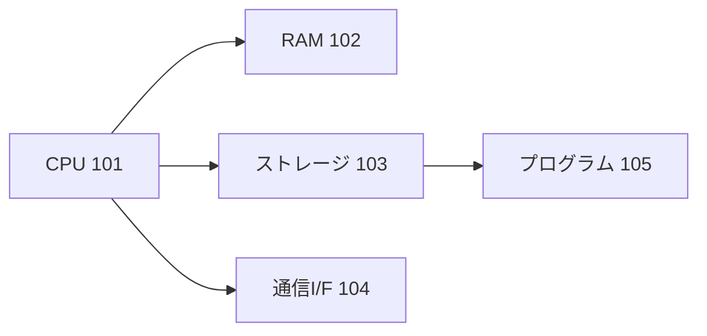

# ソフトウェア発明の成立要件ガイド

特許法第2条に基づくソフトウェア関連発明の発明該当性と、特許を受けるための要件。

参考: ライトハウス国際特許事務所「ソフトウェア特許が認められるための要件」
参考: 特許庁「審査ハンドブック 附属書B 第1章 コンピュータソフトウエア関連発明」

---

## 目次

1. [発明該当性の判断基準](#1-発明該当性の判断基準)
2. [特許を受けるための実体的要件](#2-特許を受けるための実体的要件)
3. [ソフトウェア発明の権利カテゴリ](#3-ソフトウェア発明の権利カテゴリ)
4. [明細書でのハードウェア言及の必須ポイント](#4-明細書でのハードウェア言及の必須ポイント)
5. [進歩性の主張ポイント](#5-進歩性の主張ポイント)
6. [記録媒体クレームの注意点](#6-記録媒体クレームの注意点)
7. [ビジネスモデル特許との関係](#7-ビジネスモデル特許との関係)
8. [参考文献・法令](#参考文献法令)

---

## 1. 発明該当性の判断基準

ソフトウェアが特許法上の「発明」（自然法則を利用した技術的思想の創作）に該当するためには、
以下の条件を満たす必要がある。

### 核心要件

> **ソフトウェアによる情報処理が、ハードウェア資源を用いて具体的に実現されていること**

具体的には：
1. 入力されたデータが演算される手順が具体化されていること
2. プログラムによる処理がハードウェア資源（コンピュータ装置、CPU、メモリ等）により実現されていること

この2条件を満たせば、特許法上の発明に該当する。

### 発明に該当しない例

| 該当しないもの | 理由 |
|-------------|------|
| 単なるアルゴリズム・数式 | 自然法則を利用していない（数学的手法） |
| ビジネスルールのみの記載 | 技術的手段による実現が示されていない |
| プログラム言語・プログラムリスト | 創作物であって技術的思想ではない |
| データ構造のみ（処理なし） | 技術的思想の創作に該当しない |
| 人間の精神活動のルール | 自然法則を利用していない |

---

## 2. 特許を受けるための実体的要件

| 要件 | 内容 | ポイント |
|------|------|---------|
| 新規性（29条1項） | 出願前に公知・公用でないこと | 発表・論文・販売前に出願する |
| 進歩性（29条2項） | 当業者が容易に想到できないこと | 技術的な驚き・困難さを明細書で示す |
| 産業上利用可能性 | 産業で利用できること | ソフトウェアはほぼすべて満たす |
| 先願（39条） | 同一発明の先出願がないこと | 公開・発表前に出願する |

---

## 3. ソフトウェア発明の権利カテゴリ

### 日本での取り扱い（最重要）

| カテゴリ | 認められるか | 記載形式 |
|---------|-----------|---------|
| 装置クレーム | ✅ | 「〜部を備える情報処理装置」 |
| 方法クレーム | ✅ | 「〜するステップを含む情報処理方法」 |
| プログラムクレーム | ✅ | 「コンピュータに〜を実行させるためのプログラム」 |
| 記録媒体クレーム | ✅ | 「〜プログラムを記録したコンピュータ読み取り可能な記録媒体」 |
| プログラムリスト | ❌ | — |
| プログラム言語 | ❌ | — |

### 各国比較

| カテゴリ | 日本 | 米国 | 欧州 | 中国 |
|---------|-----|------|------|------|
| 装置 | ✅ | ✅ | ✅ | ✅ |
| 方法 | ✅ | ✅ | ✅ | ✅ |
| プログラム | ✅ | ❌ | 条件付き | ❌ |
| 記録媒体 | ✅ | ✅ ※ | 条件付き | ✅（2017年〜） |

※ 米国では「non-transitory（非一時的）」の明記が必要

---

## 4. 明細書でのハードウェア言及の必須ポイント

ソフトウェア発明であっても、**ハードウェア資源との協働を明示**しなければならない。

### 必須記載例（実施形態に含める）

```
情報処理装置10は、CPU、RAM、ROM、ストレージ及び通信インターフェース
を備える汎用コンピュータとして実現される。CPUがROMまたはストレージに
記憶されたプログラムをRAMに読み込んで実行することにより、後述する各部
（取得部11、処理部12、出力部13）が機能として実現される。
```

### ハードウェア構成図の記載（Mermaid例）

````

````

---

## 5. 進歩性の主張ポイント

ソフトウェア発明で進歩性が問題になりやすい点と対策。

| 問題 | 対策 |
|------|------|
| 「単なる自動化」と認定される | 従来の手動処理との技術的差異・困難さを詳述する |
| 「周知技術の組み合わせ」と認定される | 組み合わせにより生じる相乗効果を定量的に記載する |
| 機能的クレームが広すぎる | 請求項を具体的な構成で限定し、実施例を増やす |
| データの「特定」だけで処理がない | 処理アルゴリズムの具体的な手順を記載する |

---

## 6. 記録媒体クレームの注意点

### 進歩性は独立して判断されない

> プログラムクレームの進歩性が否定される場合、同じプログラムを「記録媒体に記録した」という
> 限定を加えても、それだけでは進歩性が推認されない。

### 「伝送媒体」は認められない

情報を伝送するという媒体固有の機能のみで特定された請求項（例: 「所定の情報を伝送可能な媒体」）は
新規性・進歩性の欠如で拒絶される。**物理的記録媒体（ROM、フラッシュメモリ等）** に限定して記載する。

---

## 7. ビジネスモデル特許との関係

ソフトウェアで実装されたビジネスモデルも特許化可能だが、以下が必要：

- ビジネスルールを実現する**具体的な技術的手段**の記載
- ハードウェア資源との協働
- 技術的課題を解決する技術的効果の特定

```
❌ NG（ビジネスルールのみ）:
「利用者の購買履歴に基づいて商品を推薦するシステム」

✅ OK（技術的手段を具体化）:
「利用者の購買履歴データをベクトル化し、コサイン類似度に基づいて
類似商品を特定する推薦エンジンを備える情報処理装置」
```

---

## 参考文献・法令

- 特許法第2条第1項（発明の定義）
- 特許庁「審査ハンドブック 附属書B 第1章 コンピュータソフトウエア関連発明」
- 特許庁「特許・実用新案審査基準 第III部 第1章 産業上利用することができる発明」
- ライトハウス国際特許事務所「ソフトウェア特許が認められるための要件」
