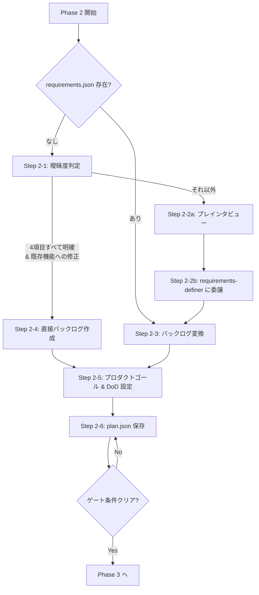

# Phase 2: バックログ作成

> **開始時出力**: `=== PHASE 2: バックログ作成 開始 ===`

## フロー概要



## 目次

- [Step 2-0: requirements.json の存在チェック](#step-2-0-requirementsjson-の存在チェック)
- [Step 2-1: 曖昧度判定](#step-2-1-曖昧度判定)
- [Step 2-2: scrum-master がプレインタビューを実施し、requirements-definer に委譲する](#step-2-2-scrum-master-がプレインタビューを実施しrequirements-definer-に委譲する)
- [Step 2-3: requirements.json → バックログ変換](#step-2-3-requirementsjson--バックログ変換)
- [Step 2-4: 直接バックログ作成（小さく明示的なタスクのみ）](#step-2-4-直接バックログ作成小さく明示的なタスクのみ)
- [Step 2-5: プロダクトゴールと完成の定義を設定する](#step-2-5-プロダクトゴールと完成の定義を設定する)
- [Step 2-6: plan.json 保存](#step-2-6-planjson-保存)
- [ゲート条件（Phase 3 に進む前に確認）](#ゲート条件phase-3-に進む前に確認)

ユーザーのプロンプトからバックログを作成する。曖昧な指示の場合は requirements-definer を介して要件を明確化してからバックログに変換する。

## Step 2-0: requirements.json の存在チェック

作業ディレクトリのルートに `requirements.json` が存在するか確認する。

- **存在する** → Step 2-3 へスキップ（Step 2-5 は引き続き必ず実行する）
- **存在しない** → Step 2-1 へ進む

## Step 2-1: 曖昧度判定

ユーザーのプロンプトを以下の4項目で評価する:

| # | 判定項目 | 明確の例 | 曖昧の例 |
|---|----------|---------|---------|
| a | ゴールが1文で定義可能か | 「REST APIにページネーションを実装して」 | 「ECサイト作って」 |
| b | 対象ユーザー/利用シーンが特定できるか | 「管理者画面のダッシュボード」 | 「Webアプリで」 |
| c | スコープ（In/Out）が推定可能か | 「src/api/users.tsに追加」 | 「いい感じに」 |
| d | 3タスク以内で分解可能か | 「バリデーションを追加してテストを書いて」 | 機能数が不明 |

**判定ルール:**

- **4項目すべて明確 かつ 既存機能への単純な追加・修正** → Step 2-4 へ
- **それ以外（1項目でも不明確、または新規開発）** → Step 2-2 へ

> **迷ったら Step 2-2**。LLM はプロンプトを「明確」と解釈しがちだが、新規開発・新規機能追加は対象ユーザーやスコープが暗黙的に不明確なケースが多い。Step 2-4 に進んでよいのは「既存ファイルへの具体的な追加・修正」のような小さく明示的なタスクに限る。

## Step 2-2: scrum-master がプレインタビューを実施し、requirements-definer に委譲する

> **方針**: サブエージェントはユーザーと対話できない環境（VSCode Copilot など）に対応するため、
> scrum-master がユーザーから必要情報を収集してからサブエージェントに渡す。

### Step 2-2a: scrum-master 自身が簡易インタビューを実施する

以下の3点を確認する（ユーザーのプロンプトから自明な場合は省略可）:

```
要件定義を進めます。いくつか確認させてください。

1. このプロジェクトの対象ユーザーは誰ですか？（例: 個人利用、チーム共有、エンドユーザー向けなど）
2. スコープの範囲は？（例: Webアプリのみ、API含む、モバイル対応など）
3. 規模感はどのくらいですか？（例: シンプルな機能3つ以内、中規模のシステムなど）
```

回答を収集し、`[収集した情報]` として記録する。

> **未回答チェック**: 3項目のうち1つでもユーザーから回答が得られなかった場合、委譲前に再度確認するか、「不明」として明示的に記録する。未回答項目が残ったまま委譲する場合は、テンプレートの該当欄に `[未回答 — サブエージェントが推定してよい]` と記載すること。

### Step 2-2b: requirements-definer に委譲する

> **⛔ STOP**: この先、requirements を自分で作成・整理しようとしていないか？  
> 要件定義はサブエージェントの仕事。自分でやってはならない。

**⚠️ サブエージェントを即時起動する**（GitHub Copilot: `#tool:agent/runSubagent` / Claude Code: `Task` ツール）。

テンプレート（`subagent-templates.md`「requirements-definer 呼び出し時」の完全版を参照）:
```
requirements-definer スキルで要件を定義する。

手順: まず ${SKILLS_DIR}/requirements-definer/SKILL.md を読んで手順に従ってください。
ユーザーのプロンプト: [元のプロンプト]
収集済みコンテキスト:
  対象ユーザー: [Step 2-2a で収集した回答]
  スコープ: [Step 2-2a で収集した回答]
  規模感: [Step 2-2a で収集した回答]
出力先: requirements.json（作業ディレクトリのルート）
出力スキーマ: ${SKILLS_DIR}/requirements-definer/references/requirements-schema.md を参照すること。
注意: 収集済みコンテキストが提供されているため、ユーザーへの追加質問（Step 1）はスキップして
      Step 2 の規模判定から開始すること。計画立案やタスク分解は行わないこと。
      ただし、収集済みコンテキストに「未回答」の項目がある場合や、Step 2 以降で情報不足を
      検出した場合は、合理的に推定して進めてよい。推定した内容は requirements.json 内に
      明記すること。

結果を以下の形式で返してください:
ステータス: 成功 / 失敗
goal: [requirements.json の goal フィールドの値]
要件数: 機能要件 [N] 件 / 非機能要件 [M] 件
サマリー: [1〜2文で結果を説明]
```

完了後、`requirements.json` が生成される → Step 2-3 へ進む。

## Step 2-3: requirements.json → バックログ変換

`requirements.json` を読み込み、以下のマッピングルールで `plan.json` のバックログに変換する:

| requirements.json | plan.json | 変換ルール |
|---|---|---|
| `goal` | `goal` | そのまま転記 |
| — | `requirements_source` | `"requirements-definer"` を設定 |
| `functional_requirements[].user_story` or `description` | `backlog[].action` | 具体的な作業内容を導出 |
| `functional_requirements[].acceptance_criteria` | `backlog[].done_criteria` | 検証可能な完了条件に変換 |
| `functional_requirements[].moscow` or 出現順 | `backlog[].priority` | must=1, should=2, could=3 |
| `non_functional_requirements` | 横断タスク or 制約 | パフォーマンス → 専用タスク、それ以外 → done_criteria に付与 |
| `scope.out` | バックログに含めない | 除外スコープとして記録のみ |

**変換の粒度:**
- 1タスク = 1スキルの1回の実行
- acceptance_criteria が複数ある場合、同一タスクの done_criteria に統合するか、テスト用の別タスクに分離する

→ **Step 2-5 へ進む**（requirements.json 経由でここに来た場合も省略しない）。

## Step 2-4: 直接バックログ作成（小さく明示的なタスクのみ）

1. ゴール（最終目標）を1文で定義する
2. ゴール達成に必要な全タスクを洗い出す
3. 各タスクに以下を設定する:
   - **action**: 具体的な作業内容
   - **priority**: 実行優先度（1が最高）
   - **done_criteria**: 完了の定義
   - **skill**: Phase 1のスキル一覧からマッチするスキル名。該当なしは null
   - **depends_on**: 先行タスクのID

→ Step 2-5 へ進む。

## Step 2-5: プロダクトゴールと完成の定義を設定する

スクラムガイド2020の3つの確約（コミットメント）のうち、バックログ作成時に定義できる2つを設定する。

### プロダクトゴール（プロダクトバックログのコミットメント）

`goal` からより大きな視点で「なぜこのプロダクトを作るか」を1文で定義する。

- `goal` がすでに長期的なビジョンを含む場合は `goal` と同じ内容でよい
- 判断できない場合はユーザーに確認する:
  ```
  プロダクトゴール（最終的に何を実現したいか）を教えてください。
  例: 「チームの開発効率を上げるCI/CD基盤を提供する」
  （スキップする場合は Enter）
  ```

### 完成の定義（インクリメントのコミットメント）

リリース可能なインクリメントとみなす共通の品質基準を定義する。プロジェクトのコンテキストから推定し、ユーザーに確認する:

```
完成の定義（Done の基準）を確認します。以下で問題ありませんか？
- [推定した基準1]（例: テストが全て通過している）
- [推定した基準2]（例: コードレビュー済み）
- [推定した基準3]（例: 動作確認済み）

変更・追加がある場合はお知らせください。
```

- ソフトウェア開発タスクが含まれる場合の推奨基準: テスト通過・コードレビュー済み・動作確認済み
- スキル作成・ドキュメント作成など非コーディングタスクの場合: レビュー済み・想定通りに動作すること

## Step 2-6: plan.json 保存

スキーマ詳細は `plan-schema.md` を参照する。作業ディレクトリのルートに `plan.json` として保存する。

```json
{
  "current_phase": 2,
  "goal": "...",
  "product_goal": "...",
  "definition_of_done": "...",
  "requirements_source": "direct",
  "backlog": [
    {"id": "b1", "action": "...", "priority": 1, "done_criteria": "...", "skill": "...", "depends_on": [], "status": "pending", "result": null}
  ],
  "sprints": [],
  "velocity": {"completed_per_sprint": [], "remaining": 0}
}
```

タスク分解の粒度:
- 1タスク = 1スキルの1回の実行
- 「AしてBする」は2タスクに分ける
- 汎用タスク（skill: null）は判断・調査・確認など、スキル不要な軽微な作業に限定する

## ゲート条件（Phase 3 に進む前に確認）

- [ ] `plan.json` がルートに保存されている（未保存なら保存してから進む）
- [ ] `plan.json` に `goal` と `backlog[]` が含まれている
- [ ] `plan.json` に `product_goal` と `definition_of_done` が設定されている

> **plan.json なしで Phase 3 に進むことは禁止。**

→ 条件を満たしたら **Phase 3: スキルギャップ解決** へ進む
