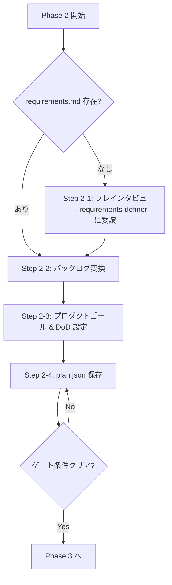

# Phase 2: バックログ作成

> **開始時出力**: `=== PHASE 2: バックログ作成 開始 ===`

## フロー概要



## 目次

- [Step 2-0: requirements.md の存在チェック](#step-2-0-requirementsmd-の存在チェック)
- [Step 2-1: scrum-master がプレインタビューを実施し、requirements-definer に委譲する](#step-2-1-scrum-master-がプレインタビューを実施しrequirements-definer-に委譲する)
- [Step 2-2: requirements.md → バックログ変換](#step-2-2-requirementsmd--バックログ変換)
- [Step 2-3: プロダクトゴールと完成の定義を設定する](#step-2-3-プロダクトゴールと完成の定義を設定する)
- [Step 2-4: plan.json 保存](#step-2-4-planjson-保存)
- [ゲート条件（Phase 3 に進む前に確認）](#ゲート条件phase-3-に進む前に確認)

ユーザーのプロンプトから **必ず requirements-definer を経由して** バックログを作成する。プロンプトが明確に見えても要件定義は省略しない。`requirements.md` が存在する場合のみスキップできる。

---

## Step 2-0: requirements.md の存在チェック

作業ディレクトリのルートに `requirements.md` が存在するか確認する。

- **存在する** → Step 2-2 へスキップ（Step 2-3 は引き続き必ず実行する）
- **存在しない** → Step 2-1 へ進む

---

## Step 2-1: scrum-master がプレインタビューを実施し、requirements-definer に委譲する

> **方針**: サブエージェントはユーザーと対話できない環境（VSCode Copilot など）に対応するため、
> scrum-master がユーザーから必要情報を収集してからサブエージェントに渡す。

### Step 2-1a: scrum-master 自身が簡易インタビューを実施する

以下の3点を確認する（ユーザーのプロンプトから自明な場合は省略可）:

```
要件定義を進めます。いくつか確認させてください。

1. このプロジェクトの対象ユーザーは誰ですか？（例: 個人利用、チーム共有、エンドユーザー向けなど）
2. スコープの範囲は？（例: Webアプリのみ、API含む、モバイル対応など）
3. 規模感はどのくらいですか？（例: シンプルな機能3つ以内、中規模のシステムなど）
```

回答を収集し、`[収集した情報]` として記録する。

> **未回答チェック**: 3項目のうち1つでもユーザーから回答が得られなかった場合、委譲前に再度確認するか、「不明」として明示的に記録する。未回答項目が残ったまま委譲する場合は、テンプレートの該当欄に `[未回答 — サブエージェントが推定してよい]` と記載すること。

### Step 2-1b: requirements-definer に委譲する

> **⛔ STOP**: この先、requirements を自分で作成・整理しようとしていないか？
> 要件定義はサブエージェントの仕事。自分でやってはならない。

**⚠️ サブエージェントを即時起動する**（GitHub Copilot: `#tool:agent/runSubagent` / Kiro: `Run subagents to` / Claude Code: `Task` ツール）。

`subagent-templates.md`「requirements-definer 呼び出し時」のテンプレートを使用する。テンプレートに以下のフィールドを追加して起動すること:
```
収集済みコンテキスト:
  対象ユーザー: [Step 2-1a で収集した回答]
  スコープ: [Step 2-1a で収集した回答]
  規模感: [Step 2-1a で収集した回答]
注意: 収集済みコンテキストが提供されているため、ユーザーへの追加質問（Step 1）はスキップして
      Step 2 の規模判定から開始すること。
      ただし、収集済みコンテキストに「未回答」の項目がある場合や、Step 2 以降で情報不足を
      検出した場合は、合理的に推定して進めてよい。推定した内容は requirements.md 内に記録すること。
要件数: 機能要件 [N] 件 / 非機能要件 [M] 件
サマリー: [1〜2文で結果を説明]
```

完了後、`requirements.md` が生成される → Step 2-2 へ進む。

---

## Step 2-2: requirements.md → バックログ変換

`requirements.md` を読み込み、以下のマッピングルールで `plan.json` のバックログに変換する。

### requirements.md からの読み込み方法

| requirements.md セクション | 読み取り方法 |
|--------------------------|------------|
| `## プロジェクト概要` の **ゴール**: | プロジェクトの目標文字列を抽出 |
| `### F-NN:` の H3 セクション | 各機能要件。見出しからIDと名前を取得 |
| F-NN > **ユーザーストーリー**: | `As a ... I want ... so that ...` 形式の文字列 |
| F-NN > **MoSCoW**: | Must / Should / Could の文字列 |
| F-NN > **受け入れ条件** 表 | Given / When / Then の各行 |
| `## 非機能要件` 表 | ID / 要件名 / 内容の各行 |
| `## スコープ` > Out スコープ 表 | 除外機能の一覧 |

### plan.json へのマッピング

| 読み取り元 | plan.json フィールド | 変換ルール |
|-----------|---------------------|-----------|
| **ゴール**（プロジェクト概要） | `goal` | そのまま転記 |
| — | `requirements_source` | `"requirements-definer"` を設定 |
| F-NN > ユーザーストーリー または H3 見出しの名前 | `backlog[].action` | 具体的な作業内容を導出 |
| F-NN > 受け入れ条件 表の Then 列 | `backlog[].done_criteria` | 検証可能な完了条件に変換 |
| F-NN > MoSCoW または出現順 | `backlog[].priority` | Must=1, Should=2, Could=3 |
| 非機能要件 | 横断タスク or 制約 | パフォーマンス → 専用タスク、それ以外 → done_criteria に付与 |
| Out スコープ | バックログに含めない | 除外スコープとして記録のみ |

**変換の粒度:**
- 1タスク = 1スキルの1回の実行
- acceptance_criteria が複数ある場合、同一タスクの done_criteria に統合するか、テスト用の別タスクに分離する

**スキルの割り当て（`skill` フィールド）:**
各タスクへのスキル割り当ては **skill-selector を自身で実行して決定する**（サブエージェント不要）。バックログ項目一覧（id / action / done_criteria）を作成した後、`${SKILLS_DIR}/skill-selector/SKILL.md` を読んで手順に従い、各タスクへのスキル推薦を取得する。推薦結果は役割別に扱う。

- `skill`: skill-selector の `primary_skills[].name` だけを設定する
- `selection`: skill-selector の `supporting_skills` / `notes` を構造のまま保持する

補助スキルを `skill` 配列へ混在させてはならない。scrum-master 側で具体的な補助スキル名を再判定してはならない。

→ **Step 2-3 へ進む**（requirements.md 経由でここに来た場合も省略しない）。

---

## Step 2-3: プロダクトゴールと完成の定義を設定する

スクラムガイド2020の3つの確約（コミットメント）のうち、バックログ作成時に定義できる2つを設定する。

### プロダクトゴール（プロダクトバックログのコミットメント）

`goal` からより大きな視点で「なぜこのプロダクトを作るか」を1文で定義する。

- `goal` がすでに長期的なビジョンを含む場合は `goal` と同じ内容でよい
- 判断できない場合はユーザーに確認する:
  ```
  プロダクトゴール（最終的に何を実現したいか）を教えてください。
  例: 「チームの開発効率を上げるCI/CD基盤を提供する」
  （スキップする場合は Enter）
  ```

### 完成の定義（インクリメントのコミットメント）

リリース可能なインクリメントとみなす共通の品質基準を定義する。プロジェクトのコンテキストから推定し、ユーザーに確認する:

```
完成の定義（Done の基準）を確認します。以下で問題ありませんか？
- [推定した基準1]（例: テストが全て通過している）
- [推定した基準2]（例: コードレビュー済み）
- [推定した基準3]（例: 動作確認済み）

変更・追加がある場合はお知らせください。
```

- ソフトウェア開発タスクが含まれる場合の推奨基準: テスト通過・コードレビュー済み・動作確認済み
- スキル作成・ドキュメント作成など非コーディングタスクの場合: レビュー済み・想定通りに動作すること

---

## Step 2-4: plan.json 保存

スキーマ詳細は `plan-schema.md` を参照する。作業ディレクトリのルートに `plan.json` として保存する。

```json
{
  "current_phase": 2,
  "goal": "...",
  "product_goal": "...",
  "definition_of_done": "...",
  "requirements_source": "requirements-definer",
  "backlog": [
    {"id": "b1", "action": "...", "priority": 1, "done_criteria": "...", "skill": "...", "selection": {"source": "skill-selector", "supporting_skills": {"principle": {"mode": "none", "name": null, "instruction": null, "timing": null, "reason": null}, "conditional": {"mode": "none", "name": null, "instruction": null, "timing": null, "reason": null}}, "notes": []}, "depends_on": [], "status": "pending", "result": null}
  ],
  "sprints": [],
  "velocity": {"completed_per_sprint": [], "remaining": 0}
}
```

タスク分解の粒度:
- 基本は 1タスク = 1スキルの1回の実行
- 「AしてBする」で責務が異なる場合は2タスクに分ける
- 密接に連携する**プライマリスキル同士**を1タスクで組み合わせたい場合は `skill` を配列で指定できる（例: `["react-frontend-coder", "webapp-testing"]`）。配列指定も skill-selector が推薦する
- 汎用タスク（skill: null）は判断・調査・確認など、スキル不要な軽微な作業に限定する
- **`skill` フィールドの値は Step 2-2 で skill-selector を自身で実行して決定する**（scrum-master が自己判断でスキル名を直接記入しない）
- `selection` は skill-selector の出力契約をそのまま保持する。補助スキル名を scrum-master が列挙・再分類してはならない

---

## ゲート条件（Phase 3 に進む前に確認）

- [ ] `plan.json` がルートに保存されている（未保存なら保存してから進む）
- [ ] `plan.json` に `goal` と `backlog[]` が含まれている
- [ ] `plan.json` に `product_goal` と `definition_of_done` が設定されている

> **plan.json なしで Phase 3 に進むことは禁止。**

→ 条件を満たしたら **Phase 3: スキルギャップ解決** へ進む
