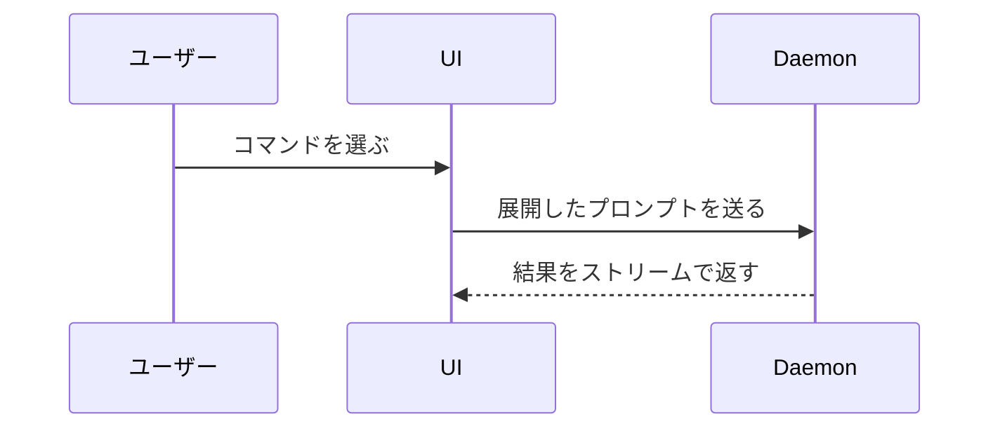

# show-me

いま話している内容を、視覚的に見せて理解させる。前置きは省き、文章は短く保つ。**要点が伝わる最小の表現を1つ選ぶ**のが原則。

> **棲み分け**: 成果物としての作図（設計書に貼る図・AWS構成図）は `mermaid-diagrammer` / `aws-architecture-diagram` に委譲する。本スキルは「会話の理解を助ける即席の視覚化」を担う。

## 表現の選び方

| 見せたいもの | 表現 |
|--------------|------|
| ロジック・アルゴリズム | 擬似コード |
| 実行時の制御フロー | 呼び出しツリー |
| UI の構造・状態・モジュール境界 | コンポーネントツリー |
| ファイルの責務・大きなリファクタ | 浅いファイルツリー |
| コンポーネント間のやり取り・データフロー | Mermaid |
| 「何が変わるか」（周囲の形は既にある） | diff |
| 大半が新規・順序や所有が文脈依存・コピーして使わせたい | コードブロック全体 |
| Mermaid では密度が高すぎる UI・レイアウト・状態比較・概念 | HTML ファイル1枚 |

## 表現ごとの型

### 擬似コード（ロジック・アルゴリズム）

```text
on(save)
  if content is unchanged
    return cached result
  write new content
  return fresh result
```

### 呼び出しツリー（実行時の制御フロー）

```text
submitForm
  createSession
    persistPrompt
    launchAgent
  navigateToSession
```

### コンポーネントツリー（UI 構造）

状態とモジュール境界のうち、意味のあるものだけ添える。

```tsx
<SessionPage> (apps/example/src/routes/session.tsx)
  useSessionEvents()
  <SessionToolbar>
    <RunSkillButton> (packages/ui)
```

### ファイルツリー（責務・リファクタ範囲）

深く掘らず、責務コメントを添える。

```text
src/
├── commands/       # ユーザー操作の解釈
├── sessions/       # セッション状態の保持
└── transport/      # API リクエストの送信
```

### Mermaid（相互作用・制御フロー・データフロー）



### diff（変化そのものが要点のとき）

**diff の形は話題に合わせる**。コンポーネントの話ならコンポーネントツリーの diff、ファイル配置の話ならファイルツリーの diff を出す。

コンポーネントの変更:

```diff
 <SessionPage>
   useSessionEvents()
   <SessionToolbar>
+    <RunSkillButton />
   <SessionTimeline>
+    <SkillResultCard />
```

ファイル配置の変更:

```diff
 src/
 ├── commands/
+│   └── show-me.ts       # スラッシュコマンドを展開する
 ├── sessions/
-└── transport.ts
+└── transport/
+    ├── client.ts
+    └── stream.ts
```

呼び出しツリー・コールスタックの変更:

```diff
 submitForm
   createSession
     persistPrompt
+    expandSkillMention
     launchAgent
-  navigateToSession
+  navigateToSession
+    subscribeToEvents
```

状態・制御フローの変更:

```diff
 on(save)
-  write content
+  if content is unchanged
+    return cached result
+  write new content
+  invalidate cache
```

### コードブロック全体

大半が新規のとき、文脈を省くと所有や順序が分からなくなるとき、コピーできる完成形が要るときは、部分ではなく全体を見せる。

```ts
function expandSkill(command: string): string {
  const skillName = command.slice(1)
  return `use the ${skillName} skill`
}
```

### HTML ファイル1枚

視覚的な UI・レイアウト・状態の比較・Mermaid では密度が高すぎる概念は、目的に合わせて図・インフォグラフィック・短いスライドのいずれかを HTML 1ファイルで書く。

- 対象プロダクトの配色・タイポグラフィ・余白・コンポーネントに合わせる
- ラベルとデータは実物を使う（ダミーで埋めない）
- デスクトップとモバイルの両方で読めるようにする

書いたら開いて見せる:

```bash
open path/to/show-me-{description}.html
```

## ガードレール

| 制限 | 内容 |
|------|------|
| 分量 | 1つ使うのが基本、複数使うこともある、全部使うことはまずない。詰め込んでユーザーを圧倒しない |
| 配置 | 各図は、それを支える短い文章のすぐ隣に置く |
| 粒度 | いま答えるべき問い（または論点の選択肢）に必要な呼び出し・ファイル・props・状態・境界だけを残す |
| 事実性 | コードから描く場合は対象ファイルを読んで実体を確認する。推測で描かない |
| 前置き | 「では図で説明します」のような前口上を書かない。いきなり見せる |
