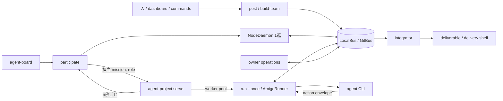
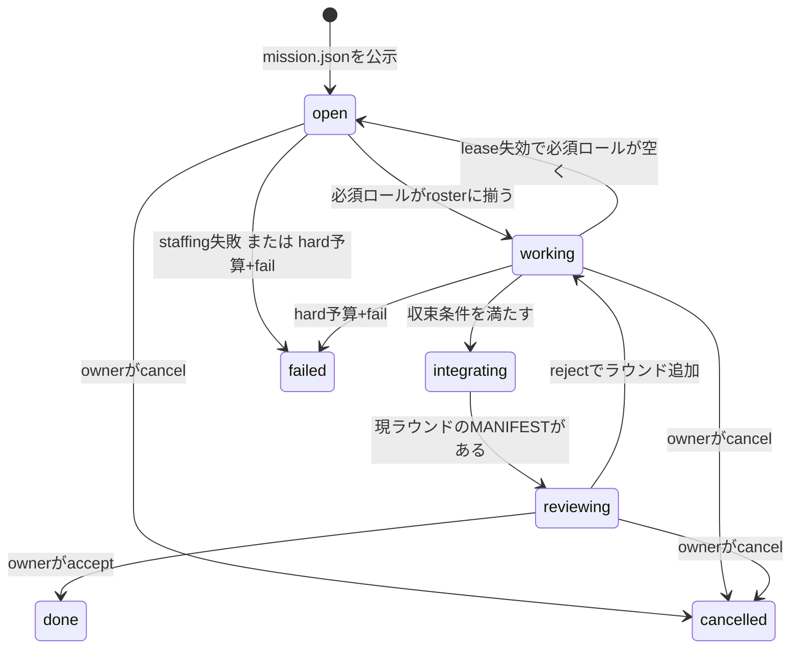

# agent-amigos 設計書

> 対象: `tools/agent-amigos/`
> 更新: 2026-08-29
> 契約: [`agent-amigos-spec.md`](../specs/agent-amigos-spec.md)
> 利用手順: [`tools/agent-amigos/README.md`](../../tools/agent-amigos/README.md)
> 関連: [`agent-project-design.md`](./agent-project-design.md) / [`agent-flow-design.md`](./agent-flow-design.md) / [`agent-cli-plugin-design.md`](./agent-cli-plugin-design.md)

## TL;DR

agent-amigos は、役割の違う複数のエージェントに一つの成果物を作らせる実行系である。オーナーが設計書と役割表を公示し、参加ノードがロールを引き受ける。各ロールは質問、回答、レビュー、成果物をファイルバスへ書き、オーナーが最後に受け入れる。

設計の中心は次の3点にある。

- ミッションの状態はバス上のファイルから導出する。オーナー、参加ノード、各amigo、integratorで書き込み先を分ける。
- 常駐運用では `agent-project serve` が参加確認と手番の起動を受け持つ。agent-amigosは、参加判定と1ロール1手番の処理を単発コマンドとして提供する。
- LLMの応答は4種類のアクションに限定する。ランナーが検査してバスへ反映し、収束判定と成果物の統合はPythonコードで行う。

専用のhubサーバを置く案は撤回した。現在の共有手段はローカルディレクトリと専用Gitリポジトリだけである。

この文書は、agent-amigosの実装を変更する人、`agent-project serve` やdashboardから接続する人、障害時にバスを調べる人を対象にしている。設定キー、CLI引数、メッセージ型の全一覧は仕様書に置く。

## 目的と範囲

### 解く問題

agent-flowは、実行時に仕事を分割し、独立したタスクをワーカーへ配る。ワーカー同士の相談は前提にしていない。

agent-amigosが扱うのは、途中の相談が成果に影響する仕事である。実装者から設計者への質問、レビュアーから実装者への差し戻し、複数案の比較といった往復を、オーナーが毎回手作業で中継せずに済ませる。

| 観点 | agent-flow | agent-amigos |
|---|---|---|
| 作業の形 | 実行時に作るタスクグラフ | 公示時に決めるロール表 |
| 実行単位 | 使い捨てタスク | ミッション中は継続するロール |
| ワーカー間通信 | 結果ファイルの受け渡し | 型付きメッセージと成果物 |
| 完了判定 | タスクグラフの終端 | ロールの完了、合意、静穏化、予算 |
| 向く仕事 | 分割して個別に処理できる仕事 | 質問とレビューを挟む成果物づくり |

### 目標

- 一つのミッションを複数ロールで進め、会話と成果物を同じ記録上に残す。
- 参加ノードが同じバスを見れば、中央の調整プロセスがなくても担当と状態を再計算できるようにする。
- 参加ノードが一台しかない場合も、未充足ロールをオーナーノードで補って完走できるようにする。
- LLMの種類を実行プロトコルから切り離し、agent CLI定義の差し替えで選べるようにする。
- 実行時間の上限、差し戻し回数、未回答質問を機械的に監視し、人が判断すべき箇所をowner inboxへ集める。
- 受け入れた成果物をバスの外へ搬出し、ミッションの削除後も残す。

### 扱わないもの

- 実行中のタスクグラフ探索。探索木や動的分解が必要ならagent-flowへ渡す。
- サブ秒のチャット。GitBusでは会話速度がpull間隔に制約される。
- オーナーの自動フェイルオーバー。`owner_node` は一つで、受入、差し戻し、編成変更の権限もそこに寄る。
- 成果物リポジトリのcheckout、ブランチ作成、マージ。`workspace.repo` は参照情報として運ぶだけである。
- バス独自の認証と暗号化。GitBusの到達制御はGitサーバに任せる。
- エージェント人格の長期保存。継続性はロール定義、status、events、artifactsで扱う。

## システム構成



### 部品の責務

| 部品 | 責務 | 持たない責務 |
|---|---|---|
| CLIとcommands取込 | 公示、手動claim、assign、restaff、accept、reject、cancel、say | 手番の内容判断 |
| `NodeDaemon` | 1巡分の募集確認、claim、roster維持、自己補充、owner職務 | 永続的な正本、プロセス間ロック |
| `AmigoRunner` | 1ロールの1手番、プロンプト作成、封筒検査、statusとeventsの更新 | ミッション全体の受入 |
| `Bus` / `GitBus` | パスの提供、pullとpush、ミッションの発見 | ロール割当や収束の判断 |
| `agentcore` | agent CLI定義、claim規約、node id、実行予算などの共通部品 | amigos固有のロールや会話 |
| `agent-project serve` | 本番常駐、周期実行、PC単位の同時実行上限 | ミッション状態の解釈 |
| team-builder | ゴールから役割表を作る前処理、agent-flowへの振り分け | 公示後の通常ターン |
| integrator | artifactsのコピー、席グループの決定的集約、manifest作成 | 内容の編集、受入判断 |
| owner operations | 編成変更、差し戻し、受入、自動受入 | 各ロールの成果物作成 |

`NodeDaemon` という名前は残っているが、本番常駐時は短命な `participate` プロセスの中で1巡だけ使う。単体運用向けの `join` は同じクラスをループ実行する。`drive` は指定ミッションが終端するまで前景で回す。

## 正本と書き込み所有者

ミッションの正本はバスである。プロセス内のオブジェクトはキャッシュにすぎず、次の巡回で作り直せる。

```
<mission>/
  mission.json
  design-doc.md
  roles/<role>.json
  assignments/<role>/<node>.json
  roster.json
  status/<node>--<role>.json
  events/<node>--<role>.jsonl
  channels/all/<sender>/<ulid>.json
  inbox/<role>/<ulid>-<sender>.json
  artifacts/<role>/...
  decisions.jsonl
  rejections/<round>.json
  pruned/<role>.json
  conductor.json
  deliverable/.../MANIFEST.json
  final.json
  cancelled.json
```

| データ | 書き手 | 読み手が信頼する内容 |
|---|---|---|
| `mission.json`、公示時のdesign doc | オーナー | ゴール、収束条件、予算、所有者 |
| `roles/*` | オーナー | ロールの仕事、要件、成果物、承認権限 |
| `assignments/<role>/<node>.json` | そのノード | claim時刻とlease |
| `roster.json` | オーナー | 現在確定している担当 |
| `status/<who>.json` | そのamigo | 既読、ターン、完了宣言、状態、引継ぎメモ |
| `events/<who>.jsonl` | そのamigo | CLI実行時間と手番のreceipt |
| `channels`、`inbox` | 送信者 | 会話。設計指示としては扱わない |
| `artifacts/<role>` | そのロール | ロールが提出した成果物 |
| `decisions`、`rejections`、`pruned` | オーナー操作 | 編成、予算変更、差し戻しの履歴 |
| `deliverable`、`MANIFEST.json` | integrator | 現ラウンドで統合したファイルと由来 |
| `final.json`、`cancelled.json` | オーナー操作 | 受入または中止 |

書き込み所有権はアプリケーションの規約である。LocalBusのファイル権限やGitリポジトリのACLが、パスごとの所有者まで強制するわけではない。バスへ直接書ける利用者は、この規約を迂回できる。

次の三つはバス外のローカル状態である。

- `~/.agents/control/control.json`: 管理面からの停止、実行候補、モデル上書き。
- `~/.agents/budget/`: PC全体の実行予算と利用記録。
- `~/.agents/amigos/turns/`: 現在走っている手番のPID付きマーカー。

納品棚の `deliveries/<mission>/` は受入済み成果物のコピーであり、ミッション状態の正本には使わない。

## ミッションの状態機械

phaseフィールドは保存しない。`derive_phase` がファイルの有無と現ラウンドの収束結果から毎回導く。



`staffing_policy: fail` が `failed` を作るのは、募集期限を過ぎ、必須ロールが欠け、まだ一度もstatusが書かれていない場合に限る。走り始めた後の欠員は `open` に戻して再募集する。ミッション予算の `on_exhausted: fail` は、手番開始後でもhard上限へ達した時点で `failed` になる。

`paused` と `away` はamigoの状態で、ミッションphaseではない。あるamigoが止まっても、他ロールとオーナー処理は続けられる。

## 公示

### 入り口

公示は次の経路から同じ `post_mission` へ合流する。

- `post`: 人がdesign docと役割表を渡す。
- commands: dashboardや別プロセスが `commands/*.json` を投函する。
- agent-board: `workload: amigos` の公示を落札したノードがオーナーとして変換する。
- `build-team`: ゴールと制約をagent CLIへ渡し、team-builderの指示に従った役割表を作る。

team-builderが探索型の仕事と判定した場合は、amigosのrolesを作らずagent-flow用の委譲封筒を返す。これは公示後の動的分解ではなく、実行系を選ぶ前処理である。

### 正規化と公開順

`normalize_mission` は役割ID、収束条件、予算、受入方式を検査する。`seats: N` は `<role>#0` から `<role>#N-1` の具体席へ展開する。integratorが無ければ組み込みロールを一つ足す。

`post_mission` はroles、design doc、`mission.json` の順に書く。`mission.json` がミッションディレクトリ内の公開済み印になる。GitBusではミッションごとに `mission/<id>` ブランチを作り、`main` の `index/<id>.json` から発見できるようにする。

公示後のdesign docを更新する専用CLIはない。役割追加と停止は `restaff` が行い、変更履歴を `decisions.jsonl` に残す。

## 募集と担当確定

### 参加判定

`participate` はバスをpullし、未終端ミッションごとに次を行う。

1. `pruned` でないrolesを読む。
2. ノードのtags、agent CLI、担当repositoriesとroleの `requires` を照合する。
3. 未充足ロールへclaimまたは応募を書く。
4. オーナーノードならrosterを更新し、期限後の自己補充、受入判定、conductorを処理する。
5. roster上で自ノードが持つ `(mission_id, role_id)` を呼び出し元へ返す。

integratorはオーナーノードだけが引き受ける。通常ロールは能力条件を満たす任意のノードが候補になる。

### first-come

各候補は自分名義のclaimファイルを書く。lease内のclaimを `(ts, node)` で昇順に並べ、先頭を勝者とする。claim直後は強制pullして同じ候補集合を読み直す。負けたノードは自分のclaimを取り下げる。

rosterはオーナーが勝者を鏡写ししたものだ。手番はrosterに載った担当だけが実行する。

### owner-picks

claimは応募として残る。オーナーが `assign` を実行するまでrosterは埋まらない。能力だけで決められないロールに使う。

### 自己補充と再募集

`staffing_policy: self-staff` では、`staffing_timeout` 後も空いている必須ロールをオーナーノードが引き受ける。単機運用はこの経路で成立する。

担当のleaseが切れ、statusが有効なawayでもなければ、オーナーはrosterから担当を外す。ミッションは再び `open` になり、同じclaim手順で後任を決める。前任のstatus、events、artifactsは削除しない。

## 常駐と手番の起動

### 本番常駐

PC上の常駐プロセスは `agent-project serve` にまとめている。既定の流れは次の通り。

1. 常駐体が約5秒ごとに `agent-amigos participate --json` を起動する。
2. `participate` は募集とowner職務だけを1巡して、担当中のmissionとroleを返す。
3. 常駐体は各担当を `agent-amigos run --once` としてworker poolへ投入する。
4. worker poolは同じ `amigos/<mission>/<role>` の二重投入を止め、PC単位の同時実行上限を守る。
5. `AmigoRunner` は手番の開始から終了までturn markerを置く。人が直接実行した手番も同じ上限の観測対象になる。

通常のamigoターンを参加tickの外へ出すことで、長いLLM呼び出しが募集確認を止めない。現在はownerの自動受入とconductorが `participate` 内で動くため、この二つはまだ60秒の参加tick timeoutに入っている。これは後述の実装課題である。

### 単体実行

- `drive` は対象ミッションが終端するまで `NodeDaemon.cycle()` を前景で回す。手番も同じプロセス内で実行する。
- `join` は同じcycleを常駐ループとして実行する。互換用の入口として残っている。
- `run --once` は指定した一つのロールを一手番だけ進める。

同じノードで `join` と `agent-project serve` を同時に動かす構成は避ける。claimと手番起動が二系統になる。

## amigoの一手番

### 通常ロール

`AmigoRunner.turn_once` は次の順で処理する。

1. バスをpullし、mission、roles、rosterを読む。
2. cancel、accept済み、pruned、存在しないroleなら終了する。
3. 自分のclaim leaseを延長し、awayから戻った場合はworkingへ戻す。
4. 現ラウンド、収束、ミッション予算を計算する。
5. 自ロール宛inboxと全体channelから未読を集め、回答済み質問を閉じる。
6. 新着への応答も未完了作業も無ければLLMを呼ばずidle更新だけを行う。
7. 管理面、ノード予算、agent CLIを解決する。実行不能ならamigoをpausedにし、ownerへ一度通知する。
8. design doc、roles、decisions、新着、自分のstatus、artifact名をプロンプトに組み立てる。
9. agent CLIを一回呼び、アクション封筒を取り出す。
10. 各アクションを検査し、成果物、メッセージ、status、eventを反映する。
11. ミッション予算用のeventとPC予算用のローカル台帳へ実行時間を記録する。

agent CLIの選択は、管理面のselection policyまたは上書き、ノード既定、role指定の順で行う。どこにも指定がなければ `stub` へ逃がさずpausedにする。`stub` はテストや配線確認で明示した場合だけ使う。

プロンプトへ入るartifact情報は自ロールのファイル名一覧で、内容は自動では読まない。他ロールのstatusとartifact内容も入らない。agent CLIが作業ディレクトリを読めるかどうかは、CLIプラグインの権限設定に依存する。

### アクション封筒

LLMが返せる操作は次の4種類である。

| kind | ランナーが行う処理 | 主な検査 |
|---|---|---|
| `send` | inboxまたは全体channelへメッセージを書く | 宛先とメッセージ型 |
| `write_artifact` | 自ロールのartifactsへ全文を書く | 相対パスが領域内に収まること |
| `update_status` | statusのnoteを更新する | 文字列化と長さ制限 |
| `declare_done` | 現ラウンドの完了をstatusへ記録する | `approve` はapproverだけ |

不正なアクションは捨て、プロセスログへ理由を出す。eventsには棄却件数だけを記録する。現状は棄却理由を次ターンのプロンプトへ戻していない。

この封筒が制限するのはバスへの反映である。起動したagent CLI自体のファイル操作やコマンド実行をsandbox化するものではない。

### 反映単位

`TurnTxn` は一手番の書き込みをメモリに積み、artifactとmessage、statusとeventsの順で反映する。statusとeventsを最後に置くため、読み手はそれらを手番完了の目印にできる。

LocalBusでは各ファイルの `tmp + rename` は原子的だが、複数ファイルをまとめたトランザクションにはならない。途中でプロセスが落ちると、artifactだけが先に見えることはある。

GitBusでは一連の変更を一つのGitコミットへ入れてpushする。rebaseが衝突した場合はoriginへ戻し、未pushの手番を捨てて次巡でやり直す。したがって `TurnTxn` の保証は「順序付きの一括反映」であり、LocalBusまで含むACIDトランザクションではない。

## 会話

ロール宛メッセージは `inbox/<role>`、全体向けは `channels/all/<sender>` に置く。送信者名とULIDをパスへ含め、複数ノードが同じファイルを書かないようにしている。既読は各amigoのstatus内にID集合として保存する。

questionを送ると、送信側statusの `open_questions` に質問IDと宛先を残す。answerの `reply_to` が一致したら閉じる。自ターン数で `question_timeout` を超えた質問はownerへ `decision-request` として送る。宛先がaway中なら時計を進めず、送信者へ不在通知を一度返す。

他amigoのメッセージはプロンプト内で「情報」と明記する。優先する入力はdesign docとdecisionsである。ただしこれはプロンプト上の区切りで、悪意ある入力を技術的に無害化するものではない。

## チーム構成の拡張

### 複数席と討論

`seats: N` は公示時に独立したNロールへ展開される。claim、status、events、artifactsは各席に通常ロールと同じ規約を使う。

`rounds` を指定した席グループは、全席の `round-(k-1).md` が揃うまで次へ進まない。`topology` は各席が前ラウンドで読む相手を制限するが、バリア自体は全席を待つ。`done_when: consensus` なら所定の比率へ達した時点で早く終えられる。

integratorは席の回答を決定的に集約する。majority、consensus、weighted-vote、approval-count、gatherの計算にLLMは使わない。票が同じ場合の順序も文字列と席IDで固定する。

### restaffとconductor

オーナーは実行中にroleを追加し、`pruned/<role>.json` を置いてroleを止められる。pruned roleは募集、実行、収束計算から外れる。既存artifactは残る。

現在のintegratorはprunedを除かず全rolesのartifactsを走査する。pruneは後続ターンと収束条件から外す操作であり、提出済みartifactを納品物から除外する操作にはなっていない。

`conductor.enabled` を明示したミッションでは、オーナーノードのagent CLIがラウンドごとに編成を評価する。出力はaddとpruneだけで、integrator、唯一のapprover、最後の必須workerはpruneしない。1回とミッション全体の操作数に上限を設ける。

通常運用のロール構成は公示時に固定する。conductorは停滞時の補助機能で、既定は無効である。

## 収束、統合、受入

### 収束

`convergence_state` は現ラウンドのroster、status、質問、予算から結果を計算する。

| 条件 | 完了の判定 |
|---|---|
| `all-required-done` | integratorを除く必須workerが現ラウンドでdone |
| `reviewer-approved` | 必須workerがdoneで、全approverが現ラウンドをapprove |
| `consensus` | 席グループが閾値へ達し、席外の必須workerがdone |
| quiescence | 必須worker全員のidleが閾値以上で、未回答質問がない |
| budget wrap-up | ミッション予算がhardへ達した |

quiescenceとbudgetによる収束はpartialになる。通常のdone条件を後から満たした場合、integratorは完全版を作り直す。

### 統合

組み込みintegratorはagent CLIを呼ばない。全roleのartifactsを `deliverable/<role>/` へコピーし、ファイルごとの由来とSHA-256短縮値を `MANIFEST.json` に書く。現ラウンドのmanifestができるとphaseは `reviewing` になる。

integratorはファイル内容を編集しない。複数roleが同じ名前のファイルを出してもroleごとのディレクトリに分かれる。コードのマージも行わない。

### 受入と差し戻し

`acceptance: manual` では、オーナーが `accept` または `reject` を実行する。acceptは `final.json` を書き、deliverableをオーナーホームの納品棚へコピーする。大きすぎるファイルは納品書に参照だけ残す。

rejectは `rejections/<round>.json` を追加する。ファイル数が新しいラウンド番号になり、旧ラウンドのdoneとmanifestは収束判定から外れる。全体channelへfeedbackも送る。

`acceptance: agent` では、オーナーノードのagent CLIがdesign doc、manifest、deliverableの有界抜粋を見て判定する。差し戻し回数が `review_rounds` に達したらowner inboxへ上げ、人の判断を待つ。`final.json` を書く処理はオーナーノード上のowner operationに限る。

自動受入が読むのは最大20ファイル、各4000文字の抜粋である。大きい成果物を網羅的に検査する仕組みではない。

## 予算と管理面

### ミッション予算

依頼側は `execution_minutes` と `per_role_turns` をmissionへ書く。実行時間は全amigoの `events/*.jsonl` にある `cli_seconds` の合計で、待機時間とPC停止時間は含めない。

soft閾値を超えると、新規論点を増やさず納品可能な形へ寄せるwrap-upプロンプトを使う。hard到達時の動作は二つある。

- `on_exhausted: wrap-up`: partialとして収束させ、integratorと受入へ進む。
- `on_exhausted: fail`: ミッションをfailedにする。

deadlineは通知にだけ使い、自動終了には使わない。

### ノード予算とcontrol

請負側のPCは `~/.agents/budget/` に全workload共通の利用記録を持つ。上限へ達した通常amigoはpausedになり、他ノードが持つロールは続く。上限解除後の次ターンでworkingへ戻れる。

`agent-control` はworkload全体またはroleごとに実行候補、model、lifecycleを上書きする。selection policyでparkされた候補、quota、auth、CLI未導入は環境要因としてpausedにする。timeoutや一時的な通信失敗はその手番をerrorで終え、次巡に再試行する。

## 転送と整合性

### LocalBus

一つのディレクトリを全プロセスが共有する。pullとpushは何もしない。単機運用とテストで使う。各JSONは一時ファイルからrenameするが、jsonl追記を含む複数ファイルの同時更新までは保証しない。

### GitBus

専用リポジトリを使う。`main` は公示index、各 `mission/<id>` ブランチは一ミッション分の状態を持つ。各ノードは自分専用cloneを作り、定期的にpullし、変更があればcommitしてpushする。

claimの勝者確認はpull間隔を無視して最新化する。通常pullは既定間隔で抑え、push競合はrebaseして再試行する。force pushは使わない。同じパスを複数の主体が書かない前提で衝突を減らしている。

Gitの認証待ちは禁止し、各コマンドにtimeoutを付ける。pushが規定回数失敗した場合はログを残し、次の同期で再試行する。

## 停止と回復

| 事象 | 観測 | 現在の回復動作 |
|---|---|---|
| 通常ターン中のプロセス停止 | status/eventが更新されない | 次巡で同じターンを再実行。先に書けたartifactやmessageは残る場合がある |
| Git push競合 | rebase失敗 | originへ戻し、未push手番を捨てて再実行 |
| claim lease失効 | roster担当のclaimが期限切れ | awayでなければrosterから外して再募集 |
| standalone `join` のSIGTERM/SIGINT | signal handler | そのプロセスが生成したrunnerをawayにし、最後にpush |
| agent CLIのquota/auth/env | 失敗タグ | amigoをpausedにし、ownerへ一度通知 |
| agent CLIのtimeout/transient | ターン結果がerror | 次巡で再試行 |
| 未回答質問 | 自ターン数 | ownerへdecision-request。宛先away中は保留 |
| staffing失敗 | timeoutと未充足role | `self-staff`、`wait`、または開始前failed |
| owner停止 | owner操作とroster更新が止まる | 状態を残したまま待機。自動引継ぎはない |
| accept後の搬出失敗 | ログ | acceptは維持。`collect` か再搬出が必要 |

awayには `resume_at` と猶予時間があり、その間はleaseが切れても担当を保持する。ただし現在の本番常駐経路では、`agent-project serve` の停止時にミッション内statusへawayを書く接続がない。awayが確実に働くのはsignal handlerを持つstandalone `join` である。

## 信頼境界

- バスへ置くdesign doc、message、artifactは参加者が読める。秘密情報を置かない。
- GitBusの参加権限はGitサーバの認証で決まる。missionやrole単位の認可はない。
- owner-only操作はCLIとcommands取込で `owner_node` を検査する。バスへの直接書き込みまでは防げない。
- messageは未信頼入力としてプロンプト内で区切る。design docとdecisionsを上位に置くが、プロンプトインジェクション防止の完全な境界ではない。
- アクション封筒はbus書き込みを狭める。agent CLIの実行権限は各プラグイン定義とOSユーザー権限に従う。
- 納品物のハッシュは破損確認用で、署名ではない。

## 実装上の未完了事項

設計を読む際に隠してはいけない穴をここへ集める。

| 項目 | 現状 | 影響 |
|---|---|---|
| 本番常駐のaway | `agent-project serve` 停止時にmission statusへawayを書かない | 計画停止でもlease失効後に再募集される |
| owner LLM処理の分離 | acceptanceとconductorが `participate` 内で動く | 60秒の参加tick timeoutに掛かり得る |
| TurnTxn | LocalBusでは複数ファイルの原子性がない | 中断時にartifactだけ見える場合がある |
| アクション棄却の再入力 | 理由はログだけで、eventは件数のみ | LLMが同じ不正操作を繰り返し得る |
| 後任用プロンプト | 前任のstatus、events、artifact内容を自動合成しない | 後任が自力でバスを調べる必要がある |
| code workspace | repoとintegration branch名を納品書へ書くだけ | checkout、branch作成、mergeは各role任せ |
| 自動受入 | deliverableの有界抜粋だけを読む | 大きな成果物の判定には人か別検証が要る |
| `requires.cli` | ノード側CLI宣言が空の場合はrole照合がfail-closeにならない | 実行時まで不適合が分からない場合がある |
| 討論席の抑制順 | rounds用ターンは通常roleのlifecycle、mission hard wrap-up、node budget事前チェックを通らない | 停止と上限の扱いが通常roleと揃わない |
| pruned roleの成果物 | integratorはprunedを含む全rolesのartifactsをコピーする | 停止したroleの古い成果物が納品へ混ざり得る |
| owner failover | 引継ぎ手順と選挙がない | owner長期停止で受入と再編が止まる |

仕様書にも二つの記述差が残っている。`agent-amigos-spec.md` のphase説明はbudget failまで「開始前のみ」と読めるが、実装ではbudget failは開始後にも成立する。また、アクション棄却理由を次プロンプトへ返すという記述に対し、現在の実装は件数だけをeventsへ残す。契約を変更する際は、実装と仕様書を同時に直す。

## 変更時に守る不変条件

1. missionのdoneは、オーナーノード上のaccept処理が `final.json` を書いた場合だけ成立する。
2. rosterの確定者だけが通常roleの手番を実行する。
3. 各amigoは自分名義のstatus、events、artifactだけを書く。
4. 差し戻し後のdoneとmanifestは、現ラウンド番号が一致しなければ無効である。
5. integratorは成果物を編集せず、コピー、集約、manifest作成だけを行う。
6. LLM出力をそのままbusへ書かず、アクション封筒を検査する。
7. mission予算とnode予算を混ぜない。前者は依頼側、後者は請負側が所有する。
8. production residentから通常のLLM手番を参加tick内で直接実行しない。
9. GitBusでforce pushしない。
10. accept時にdeliverableをbus外へ搬出する。

## 実装の参照先

| 関心 | 実装 |
|---|---|
| busレイアウト、TurnTxn | [`bus.py`](../../tools/agent-amigos/agent_amigos/bus.py) |
| Git転送 | [`gitbus.py`](../../tools/agent-amigos/agent_amigos/gitbus.py) |
| 公示、正規化、phase、収束 | [`mission.py`](../../tools/agent-amigos/agent_amigos/mission.py) |
| claim、lease、roster | [`assign.py`](../../tools/agent-amigos/agent_amigos/assign.py) |
| 参加巡回と自己補充 | [`daemon.py`](../../tools/agent-amigos/agent_amigos/daemon.py) |
| 一手番、封筒、integrator、討論 | [`runner.py`](../../tools/agent-amigos/agent_amigos/runner.py) |
| メッセージ | [`messages.py`](../../tools/agent-amigos/agent_amigos/messages.py) |
| 受入、差し戻し、restaff、conductor | [`ownerops.py`](../../tools/agent-amigos/agent_amigos/ownerops.py) |
| 納品棚 | [`delivery.py`](../../tools/agent-amigos/agent_amigos/delivery.py) |
| commands取込 | [`commands.py`](../../tools/agent-amigos/agent_amigos/commands.py) |
| board参加 | [`board.py`](../../tools/agent-amigos/agent_amigos/board.py) |
| team-builder接続 | [`teambuilding.py`](../../tools/agent-amigos/agent_amigos/teambuilding.py) |
| 本番常駐からの起動 | [`agent-project/resident_cli.py`](../../tools/agent-project/agent_project/resident_cli.py) |

契約の正本は [`mission.schema.json`](../../schemas/mission.schema.json)、[`amigos-command.schema.json`](../../schemas/amigos-command.schema.json)、[`delivery.schema.json`](../../schemas/delivery.schema.json)、[`agent-control.schema.json`](../../schemas/agent-control.schema.json)、[`node-budget.schema.json`](../../schemas/node-budget.schema.json) にある。

## ADR

### ADR-1: 専用hubを置かず、ファイルバスを正本にする

- 決定: LocalBusとGitBusを使い、担当、会話、成果物、受入をファイルから導出する。
- 背景: 参加PCは常時稼働しない。中央調整サーバを増やすと、運用先と復旧手順が一つ増える。
- 退けた案: HTTP long-pollのHubBus。旧 `agent-amigos serve` の撤去で公開元がなくなり、現在は `hub+` をエラーにしている。
- 代償: 会話速度がpull間隔に制約され、バスの書き込み規約をストレージ側では強制できない。
- 見直す条件: Gitの往復がミッション時間の大半を占める、または多数ノードでclone数が運用限界へ達したとき。
- 確信度: 高い。

### ADR-2: ロールは公示前に決める

- 決定: 通常のrolesは公示時に確定する。自動作成はbuild-teamで公示前に行う。実行中の変更はownerのrestaffと明示的に有効化したconductorへ限定する。
- 背景: amigosは役割間の継続した相談を扱う。毎ターン役割を作り直すと、担当、既読、成果物の名義が安定しない。
- 退けた案: 実行中にLLMが自由なタスクグラフを作る方式。これはagent-flowの責務と重なる。
- 代償: 最初の役割表が悪いと停滞する。restaffするまで自動では直らない。
- 見直す条件: conductorの運用実績が集まり、安全な自動再編の条件をコードで表せるようになったとき。
- 確信度: 中。

### ADR-3: LLMのbus操作をアクション封筒に限定する

- 決定: agent CLIはJSONのactionsを返し、ランナーが宛先、パス、承認権限を検査して代書する。
- 背景: プロンプトだけでパス所有権を守らせると、誤出力が共有状態を壊す。
- 退けた案: LLMへbusディレクトリを直接編集させる方式。
- 代償: 表現できる操作はsend、write_artifact、update_status、declare_doneに限られる。CLI自体の外部副作用は別途制御が要る。
- 見直す条件: 新しい操作が複数のロールで必要になり、所有者と検査条件を一意に決められるとき。
- 確信度: 高い。

### ADR-4: 予算を実行時間で測り、依頼側と請負側に分ける

- 決定: missionはbus eventsのCLI実行秒、nodeはローカル共有台帳の実行量で上限を持つ。
- 背景: PCの停止時間をwall-clock予算へ含めると、何も実行していない夜間に予算がなくなる。PC側には他workloadを含む上限も必要である。
- 退けた案: deadlineだけで停止する方式、中央の一つの課金台帳へ全ノードを書かせる方式。
- 代償: 同じ実行をmission eventとnode ledgerの二か所へ記録する。途中停止では片方だけ残る可能性がある。
- 見直す条件: agent CLIから信頼できるtokenとcostが常に取得でき、全workloadで同じ会計単位を採用できるとき。
- 確信度: 高い。

### ADR-5: 統合と受入を分ける

- 決定: integratorは決定的なコピーと集約を行い、受入はowner operationが行う。自動受入もownerノード上で実行する。
- 背景: ファイルを揃えたことと、成果物が要件を満たしたことは別の判定である。
- 退けた案: 最後に終わったworkerがそのままdoneを確定する方式、integratorに編集と受入を兼ねさせる方式。
- 代償: reviewingで人を待つミッションが残る。owner停止中はdoneへ進めない。
- 見直す条件: 受入基準を決定的な検査へ落とせる成果物種別が増えたとき。検査器をowner acceptanceへ追加し、doneの所有者は変えない。
- 確信度: 高い。

## 文書を一緒に更新する箇所

設計変更時は、影響する契約と利用手順も同じ変更で揃える。

| 変更 | 同時に見るもの |
|---|---|
| phase、収束、予算 | `agent-amigos-spec.md`、`mission.schema.json`、mission/turnsテスト |
| busパス、所有者 | `agent-amigos-spec.md`、`bus.py`、GitBusテスト |
| action、message | `agent-amigos-spec.md`、`runner.py`、`messages.py`、turnsテスト |
| CLI、commands | README、`amigos-command.schema.json`、CLIテスト |
| 常駐連携 | `agent-project-design.md`、`resident_cli.py`、residentテスト |
| 受入と納品 | `delivery.schema.json`、delivery/owneropsテスト、dashboard表示 |
| team-builder | `.github/skills/team-builder/`、`mission.schema.json`、teambuildingテスト |
