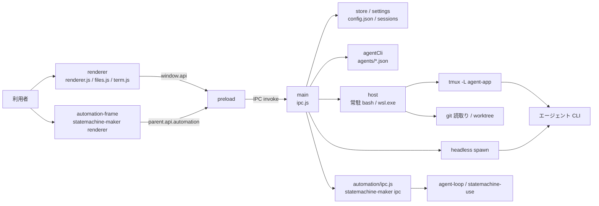

# agent-app 設計書

> 最終更新: 2026-09-06  
> 実装: [`tools/agent-app/`](../../tools/agent-app/)  
> 外部契約: [`agent-app-spec.md`](../specs/agent-app-spec.md)  
> 操作方法: [`tools/agent-app/README.md`](../../tools/agent-app/README.md)  
> 関連設計: [エージェント CLI プラグイン](./agent-cli-plugin-design.md) / [agent-loop](./agent-loop-design.md) / [agent-dashboard](./agent-dashboard-design.md)

## TL;DR

agent-app は、ローカルリポジトリを登録し、`agents/*.json` に定義したエージェント CLI（copilot / claude /
codex / kiro / cursor / aider …）と会話形式で作業する Electron アプリである。GitHub 連携は持たず、
見に行くのは登録したフォルダだけ、呼ぶのはこの PC（Windows なら WSL）に入っている CLI だけである。
対象読者は、agent-app に機能を足す人と、agent-app から起動される CLI 定義や statemachine-maker の
契約を変更する人。

設計上の要点は四つある。

1. 会話 1 つ = tmux セッション 1 つ。CLI は定義の `interactive` 節で対話起動し、画面は `capture-pane`
   の写し（端末ミラー）を正として見せる。CLI の文言解析は履歴の補助記録に留め、入力可否や送信状態を
   支配させない。
2. renderer は表示と入力だけを持つ。触ってよいのは登録済みリポジトリの内側だけで、生のパスは画面から
   受け取らない（worktree は名前、添付は ID、ファイルは相対パス）。
3. 起動方針（おすすめ / 節約 / 品質重視）は設定の tier へ決定的に写す。利用不能でも別 tier へ黙って
   倒さない。共通指示・開始アクション・スキル選択も同じ 1 か所（`runTurn`）で合成する。
4. タスク・ワークフローは statemachine-maker の domain と IPC をそのまま借り、agent-app は登録
   リポジトリと設定だけをアダプトして iframe に載せる。実行・定期発火・履歴は agent-loop が正典。

却下した中心案は、node-pty で tmux へ直接 attach する構成と、CLI ごとに構造化出力アダプターを書いて
共通メッセージへ変換する構成である。前者は Windows 配布と PTY 境界を増やし、後者は CLI の出力形式が
変わるたびに追跡が要る。既存の capture-pane / send-keys ミラーを主表示へ昇格させる案を採った。

## 1. 目的と境界

### 1.1 解く問題

エージェント CLI は端末で対話するのが本来の姿だが、リポジトリを切り替えながら複数の会話を並行し、
別の CLI へ渡り歩き、その差分を確認する作業は端末だけでは散らばる。特に次が見落としやすい。

- どの会話が応答中で、どれが端末で許可を求めて止まっているか
- 同じ作業ツリーを複数の CLI が同時に書き換えて混ざること
- 会話の続きを別の CLI へ渡すときに、相手がまだ見ていないやり取り
- CLI 自身が管理するセッション ID と再開の作法が CLI ごとに違うこと

agent-app は次を一つの操作面へまとめる。

- 会話ごとの依頼入力、端末ミラー、応答履歴、送信状態
- 起動方針・エージェント・モデル・Ask モード・作業フォルダ・スキルの、ターンごとの実行設定
- 作業フォルダの差分（作業ツリー / ブランチ）とファイルビュアー
- 共通指示、開始アクション、スキル候補、tier 割当の設定
- 同じリポジトリのタスク（ステートマシン）とワークフロー（複数 AI の工程）

### 1.2 担当しないこと

- GitHub / GitLab 連携（PR、Issue、クラウドセッション）
- ツール呼び出しの逐次承認 UI。CLI が端末で聞いてきたら端末ミラーで答える
- 差分の適用・取り消し、コミット・マージ・push。git へ書くのは worktree の追加・削除とブランチ作成だけ
- ファイルの編集。ビュアーは読むだけで、「開く」で既定のアプリへ渡す
- CLI の思考・回答・質問を意味解析して共通形式へ完全変換すること
- 独自の scheduler、cron evaluator、run journal。定期実行は agent-loop に任せる
- 品質評価によるエージェント・モデルの自動順位付け、予算連動の tier 降格

### 1.3 守る不変条件

- 触ってよいのは登録したリポジトリだけ。登録に無いパスは実在していても断る（`requireRepo`）。
- renderer が送る値を信用しない。worktree は名前、添付は ID、ファイルは相対パスを main で検査する。
- 会話 1 つにつきライブの CLI は 1 つ。tmux とヘッドレスを同時に持たず、別 CLI へ移るときは前を止める。
- 送信成功は「tmux へ本文と Enter の両方が届いた」時点で確定する。CLI の文言から完了を推測しない。
- 会話の作業フォルダは作ったあと変えない（tmux の cwd も CLI 側の文脈もそこで始まっている）。
- 起動方針は tier へ決定的に解決し、自動フォールバックしない。解決結果はメッセージに残す。
- 設定・会話の保存先は Electron の userData だけ。リポジトリ側に置くのは `.worktrees/` と
  `.git/info/exclude` の 1 行だけ。

## 2. 実行時構成

### 2.1 プロセスと境界



CLI との会話は二つの経路を持つ。対話定義（`interactive`）を持つ CLI で tmux が使える場合は tmux 経路、
それ以外は 1 ターン 1 プロセスのヘッドレス経路である。どちらも `runTurn` が起動条件を確定してから分岐し、
renderer は経路の違いを `transport` の値として受け取るだけである。

### 2.2 Electron の三層

| 層 | 主な実装 | 責務 |
|---|---|---|
| main | `src/main/*.js`、`src/main/automation/ipc.js` | 設定と会話の保存、CLI 定義の解決、tmux とヘッドレスの起動、git 読取り、worktree、添付、ダイアログ |
| preload | `src/preload.js` | IPC チャネルを `window.api` へ写し、失敗 envelope を `Error` へ戻す。`api.automation.*` も同じ窓口 |
| renderer | `src/renderer/*.js`、`automation-frame.html` | 画面状態、描画、入力、端末ミラーの描画。ファイル・OS・git には触れない |

`BrowserWindow` は `contextIsolation` 有効、`nodeIntegration` 無効、preload の `sandbox` も有効である。
renderer の CSP は `script-src 'self'` で、外部ライブラリは `npm install` 時に `scripts/vendor.js` が
`src/renderer/vendor/` へ写す。CDN は使わない。`will-navigate` と `window.open` は止め、`http(s)` だけを
既定ブラウザへ渡す。

### 2.3 起動手順

1. main が IPC を登録する。先に `registerAutomationIpc` が statemachine-maker の IPC を `automation:`
   接頭辞で載せ、続いて agent-app 自身のチャネルを登録する。
2. 送らずに閉じた添付を `attachments.sweep` で掃除する。
3. ウィンドウを作り、`index.html` を読む。
4. renderer は `config:get` と `host:info`（tmux / git の有無）を取り、応答中の会話 ID を `turn:running` で
   引き継ぐ。
5. 最後のリポジトリを選び、会話一覧・エージェント一覧・worktree 一覧を読む。最後の領域と表示を復元する。
6. 起動直後と 1 時間ごとに、期限切れの tmux セッションを `sweepTerminalSessions` で回収する。

タスク・ワークフローの iframe は、その領域を初めて開いたときに `src` を差し替えて遅延ロードする。

## 3. 画面の情報構造

### 3.1 三領域と共通リポジトリ

左サイドバーは上から、アプリ名、主要メニュー `会話 / タスク / ワークフロー`、共通のリポジトリ選択、
選択中領域の一覧見出しと作成操作（＋）、対象一覧、設定の順に並ぶ。主要メニューはタブではなく
ページナビゲーションで、`aria-current="page"` で現在地を示す。

| 領域 | 対象 | 中央 | 一覧の出どころ |
|---|---|---|---|
| 会話 | 対話セッション | 会話ヘッダー、端末ミラー、会話履歴、入力欄 / ファイルビュー | `session:list` |
| タスク | `.statemachine/` の定義と agent-loop の設定エントリ | statemachine-maker の教示・概要・手順・履歴 | `automation:run:snapshot` + `machine:list` + `teaching:list` |
| ワークフロー | 複数 AI の工程定義 | statemachine-maker の概要・編集・実行履歴 | `automation:flow:list` + `flow:run:list` |

リポジトリは三領域の共通文脈で、領域を切り替えても変えない。領域ごと・リポジトリごとの最後の対象は
`config.json` の `lastTask` / `lastWorkflow` / `lastWorktree` に覚える。旧設定の `work` / `automation`
は `conversation` / `tasks` へ読み替える（`navigation.js`）。

### 3.2 会話画面

会話画面は開始前後で共通の CSS Grid を使い、入力欄を常に最下段の同じ位置に置く。

```text
会話ヘッダー   会話名 / phase / 会話・ファイル切替 / 変更を確認 / その他
中央面         開始前はニュートラルな開始面、tmux 会話では端末ミラー
会話履歴       折りたたみ。tmux 会話では既定で閉じ、ヘッドレス会話では常時展開
入力欄         入力モード切替 / 本文 or 端末キー / 添付・実行設定・送信
```

依頼の実行条件は入力欄付近の「実行設定」ポップオーバーへ段階表示する。要約行は
`おすすめ · codex / model · スキル 自動 · 実行 · 分離フォルダ` の形で、ラベルの無いアイコンだけでは表さない。

応答は「思考・進捗」「回答」「実行情報」の三層で表示する。回答は常に展開した吹き出し、思考・進捗と
実行情報は折りたたみで、エラー・停止・非 0 終了のときだけ実行情報を自動展開する。空の区分は出さない。

### 3.3 タスク・ワークフローの埋め込み

`#automation` セクションの iframe が `automation-frame.html` を読み、statemachine-maker の renderer
（`vendor.js` が `api.` を `automationBridge.` へ書き換えて写したもの）を動かす。iframe 側は親の
`window.parent.api.automation` に接続し、独自のフォルダ一覧やホームタブは出さない。

親と iframe は `postMessage` で同期する。

| 向き | type | 内容 |
|---|---|---|
| 親 → 子 | `agent-app:navigate` | `area`、`root`、`selected`、`action`（`new` など）、`intent`（タスク教示の引き継ぎ） |
| 子 → 親 | `agent-app:changed` | `root`、`area`、`selected`。親は一覧を再読込し、最後の対象を保存する |
| 子 → 親 | `agent-app:teaching-started` | `root`、`intentId`、`machine`。親は intent を消費済みにし、選択を新しい machine へ移す |

会話の利用者メッセージにある「この依頼をタスクにする」は、依頼本文・添付名・現在の実行設定だけを
一回限りの intent（`taskIntent.js`）へ写し、タスク領域の教示画面へ渡す。会話全体や思考ログは渡さない。

## 4. 会話の実行経路

### 4.1 ターンの流れ

```text
renderer: turnOptions()（方針 / 直接指定 / Ask / スキル）+ 本文 + 添付
  → turn:send
main: guardedRunTurn … 同時実行枠を取る
  → runTurn
      1. executionSpec … 方針を tier へ解決し、CLI / model / readonly を確定
      2. agentCli.load … 定義を読む。listAgents でホスト側の PATH に実体があるか確認
      3. transport を決める（tmux か headless か）
      4. withAttachments … 添付を確かめ、依頼文の末尾に所在を添える
      5. その CLI の初回だけ: 開始アクション（コマンドは先に実行、スキルは後で送る）
      6. skillSelection.select / deliver … 依頼単位のスキルを選び、CLI の能力に合わせて渡し方を決める
      7. sessionSetup.withInstructions … 共通指示をマーカー付きで前置
      8. 会話の「次のターンの既定」を更新
  → runTmux | runHeadless
```

同時実行枠（`executionGate`）は main が正典で、上限到達時はキューへ積まず `CONCURRENCY_LIMIT` で断る。
正常終了・失敗・停止・spawn 失敗のすべてで枠を解放する。

### 4.2 起動方針の解決

`settings.resolve` は副作用のない一関数で、次の順に決める。

```text
policy=direct、または policy 無しで cli がある → 指定の CLI / model（source: direct）
policy が recommended / saving / quality      → medium / small / large の tier
指定なし                                       → config.execution.defaultPolicy の tier
tier → config.execution.tiers[tier] の CLI / model（source: policy）
```

tier の CLI が空なら送信前に止める。CLI がホストで利用不能なら `AGENT_UNAVAILABLE` で断り、別 tier へ
倒さない。解決結果（`policy` / `tier` / `cli` / `model`）は利用者メッセージと応答メッセージの両方に残す。

### 4.3 transport の選択

| 条件 | transport |
|---|---|
| 設定 `transport: tmux` かつ定義に `interactive` 節があり、ホストに tmux がある | `tmux` |
| それ以外（設定が headless、対話定義なし、tmux なし） | `headless` |

ヘッドレスへ移るターンでは、動いていた tmux の CLI を先に止める。会話の `transport` はターンごとに
更新され、一覧の印と画面の構成（端末ミラーの有無）はこの値で決まる。

### 4.4 tmux 経路

1. `openConversation` が会話の tmux セッションを持つ。無ければ `interactiveCmd` で argv を組んで起動し、
   生きていれば再接続する。起動条件（CLI / model / readonly）が動いているものと違えば起動し直す。
2. 起動し直す前に、旧 CLI の画面を `agent_switch` スナップショットとして会話へ残す。
3. `waitReady` が定義の `ready_pattern` を待つ。起動中の信頼確認や権限確認（attention）はタイムアウト
   させず、人が端末で答えるまで待つ。
4. 開始スキルは本依頼へ連結せず、1 件ずつ独立した入力として送り、完了を待つ（codex の `$skill` は
   候補確定のため Enter を 2 回）。
5. その CLI がまだ見ていないやり取りがあれば `replayPrompt` で依頼の前に添える。
6. `Conversation.send` が本文を 1 行へ畳んで `send-keys -l`、少し置いて Enter を送る。両方成功した時点で
   受付済みとし、応答は `ready_pattern` が 2 回続けて見えた時点でスクロールバックの差分から拾う。
7. 応答中に利用者が追加入力した場合は `term:submit` が既存ターンを壊さず本文を送り、履歴には利用者
   メッセージだけを足す（`followup: true`）。

### 4.5 ヘッドレス経路

`turnCmd` が 1 ターン分の argv と stdin を組み、`spawn` する。Windows では `wsl.exe -e bash -lc` に載せて
WSL の中で走らせる。stdout / stderr は行ごとに `turn:line` で流し、codex の JSONL は `response.js` が
reasoning / command / file change を共通イベントへ変換する。終了後に output file または stdout を回答とし、
定義の `errors` で失敗理由を分類する。

### 4.6 エージェントの渡り歩きとセッション継続

会話は CLI ごとに「セッション ID」と「そこまで見たメッセージ数」を `cliSessions` に覚える。

| 作法 | CLI | 初回 | 作り直すとき |
|---|---|---|---|
| mint | claude / copilot | こちらで UUID を発行して `--session-id` | `--resume <UUID>` |
| capture | codex | `--json` の `thread_id` を拾う | `codex resume <id>`（ID が無ければ新規起動） |
| list | kiro | ターン後に一覧から最新を拾う | `--resume-id` |
| continue | 定義に `continue_args` がある | なし | `--continue`（直前セッション。並行運転で混線しうる） |
| replay | 上記のいずれも無い | 会話全体を依頼に添える | 同左 |

別の CLI で進めた分は、戻ってきたときに「あなたのセッションの外で進んだやり取り」として差分だけを
添える。全部を毎回送り直しはしない。tmux の会話は 1 つの CLI しか持たないので、別の CLI へ移ると前の
CLI は止め、戻るときは resume で続ける。

## 5. 端末ミラーと入力

### 5.1 画面の写し方

tmux サーバは自前のソケット `-L agent-app` に持ち、利用者の tmux とは干渉しない。ホストとの会話は
`host.js` の常駐 `bash -l`（Windows は `wsl.exe -e bash -l`）1 本へコマンドを流し、開始・終了マーカーと
終了コードで区切る。毎回 spawn しないのは、Windows で wsl.exe を起こすと 1 回に数十〜数百 ms かかり、
画面が追いつかないためである。

画面は `capture-pane -e` を 0.25 秒（見ている画面がある、または応答中）〜1.2 秒（それ以外）ごとに写し、
xterm.js に丸ごと描き直す。xterm は表示とキーボードだけで、スクロールバックとカーソルは tmux が正である。
node-pty も attach も使わない。

### 5.2 画面の判定

`classify` は ANSI を剥がした画面を `attention → busy → ready → starting → unknown` の順に見る。
attention（y/n、許可、信頼確認）は末尾行から拾い、その後ろに入力欄が見えていれば解除する。定義の
`ready_pattern` / `busy_pattern` に加え、共通の既定パターンを常に有効にするので、配布済みの古い定義でも
起動待ちがタイムアウトまで続かない。

判定の使い道は次の三つに限る。

- ターン完了（ready が 2 回連続、または `idle_quiet_sec` の無変化）
- 会話一覧と phase 表示（起動中 / 待機 / 応答中 / 確認待ち / 終了 / セッション消失）
- 応答本文の抽出（送信前後のスクロールバック差分から入力欄・枠線・フッター・依頼の echo を除く）

入力欄の可否は判定に依存しない。CLI が処理中や質問待ちに見えても、メッセージモードから文章を送れる。

### 5.3 入力の 2 モード

入力先は CLI 出力から推測せず、利用者が見分けられる明示的な 2 モードとする（`inputMode.js`）。

| モード | 入口 | 動作 |
|---|---|---|
| メッセージ | 初期状態、入力欄クリック、Escape 2 回 | Enter で本文を tmux へ貼り付けて送信。Shift+Enter は改行。成功まで本文を保持 |
| 端末操作 | xterm クリック、切替ボタン、仮想キー | 文字・矢印・Tab・Escape・Ctrl+C を `send-keys` へ直接渡す。Escape 1 回目は CLI へ、600 ms 以内の 2 回目でメッセージへ戻る |

同じキーイベントを両方へ送らない。tmux が終了・消失したときは端末操作を無効化し、メッセージモードへ
戻す。送信状態は `受付済み・<agent>を準備中` / `✓ <agent>へ送信済み HH:mm:ss` / `送信失敗・入力内容を
保持しました` / `セッション終了` の、アプリ自身が確認できる 4 つだけである。

### 5.4 tmux セッションのライフサイクル

```text
未作成 ─初回送信→ 起動中 → 利用中
                        ├─ 起動条件の変更 → スナップショット保存 → 起動し直し → 利用中
                        ├─ pane 終了 → 終了済み（最終画面をスナップショット）
                        ├─ 会話削除 → 即時 kill
                        └─ アプリ終了 → idle（24 時間以内なら再接続、超過で回収）
```

会話の `terminalSession` に名前、状態、所有インスタンス、最終利用時刻、期限を持つ。回収するのは
「期限を過ぎ、会話が追跡外で、名前が会話 ID から導いた期待値と一致する」セッションだけで、実行中や
管理外のセッションは消さない。スナップショットは件数と文字数の上限つきで会話に残し、再実行用の
構造化メッセージには使わない。

## 6. 共通指示・開始アクション・スキル選択

三つは適用タイミングが違う。

| 設定 | 適用 | 実装 |
|---|---|---|
| 共通指示 | 依頼ごと | `sessionSetup.withInstructions` がマーカー付きブロックを前置。二重注入はマーカーで防ぐ |
| 開始アクション | CLI ごとの新しいセッションで一度だけ | コマンドは作業フォルダで先に実行（1 件 60 秒・全体 120 秒）、スキルは対話セッションへ先に 1 件ずつ送る |
| スキル選択 | 依頼ごと（自動 / 手動選択 / 使用しない） | `skillSelection.select` がローカルで採点（LLM 不使用）、`deliver` が CLI の能力で渡し方を決める |

スキルの渡し方は定義の `slash_native` で分かれる。ネイティブなら `skill_command_prefix` 付きの
呼び出し（`/name` や `$name`）を依頼より前に送り、そうでなければ選んだ `SKILL.md` の本文だけを予算内で
インライン化し、はみ出した補助スキルは丸ごと外して実行情報に理由を残す。候補一覧や全スキル本文は
モデルへ送らない。

同じ合成はタスクの手動実行にも使う。`automation/ipc.js` の `prepareRun` が共通指示・開始アクション・
スキル選択を 1 つの `instruction` にまとめ、statemachine-maker の runner へ実行時オーバーレイとして渡す。
設定ファイルは書き換えない。

## 7. 作業フォルダと添付

### 7.1 作業フォルダ（git worktree）

置き場は `<リポジトリ>/.worktrees/<名前>` に決め打つ。名前だけを保存すれば、Windows でも
「登録したパス + `.worktrees` + 名前」から fs 用（`C:\…`）と git 用（`/mnt/c/…`）の両方を作れる。
初回に `.worktrees/` を `.git/info/exclude` へ足し、リポジトリの `.gitignore` は触らない。

この画面の外で作った worktree は一覧に出すが会話には選べない。削除は未コミットの変更が残っていると
git が断り、確認のうえ `--force` で押し切れる。その作業フォルダを使う会話の tmux は先に止める。
ワークフローの納品（agent-flow が origin へ公開したブランチ）は `fetchRemote` 付きの `create` で
作業フォルダとして開く。

### 7.2 添付

外のファイル（選択・ドロップ・貼り付け）は userData の `attachments/<ID>/<名前>` へ写し、CLI には
依頼文の末尾に「添付ファイル: <パス>」として伝える。画面は生のパスを持たず、以後の参照は ID だけ。
リポジトリの中のファイル（ファイル画面の「会話に添付」）は写さず相対パスを伝える。`file_flag` を
宣言する定義（aider 等）には argv でも渡す。会話を削除すると写した添付も消える。

## 8. 正典と保存データ

| 種類 | 置き場 | 所有者 | 扱い |
|---|---|---|---|
| 設定 | userData の `config.json` | agent-app | `settings.normalize` で既知キーを正規化し、未知キーは保持。temp + rename で保存 |
| 会話 | userData の `sessions/<id>.json` | agent-app | 1 会話 1 ファイル。読み出し時に旧形式（`cliSession` 1 つ）を `cliSessions` へ写す |
| 添付 | userData の `attachments/<id>/` | agent-app | 会話から参照されないものは起動時に掃除 |
| CLI 定義 | `agents/*.json`（探索順は agent-cli 仕様） | agent-tools | 読むだけ。同名は先勝ち |
| CLI 側のセッションログ | `~/.claude/projects` など | 各 CLI | 触らない。ID だけを会話に覚える |
| worktree | `<リポジトリ>/.worktrees/` | git | 追加・削除だけ書く |
| タスク・ワークフロー定義 | `<リポジトリ>/.statemachine/`、agent-loop 設定 | statemachine-maker / agent-loop | agent-app は登録リポジトリの検査だけを足す |

renderer の `state` は取得結果・選択・下書き・実行中 ID のキャッシュで、再起動後の正典にしない。
応答中の会話 ID は起動時に `turn:running` で main から引き継ぐ。

会話ファイルの `messages[]` には、利用者メッセージに起動条件（`cli` / `model` / `readonly` /
`policy` / `tier` / `attachments` / `skillSelection`）、応答メッセージに `text`（回答の正典）と
任意の `parts.thinking` / `parts.information` を残す。`parts` が無い旧メッセージも回答表示を妨げない。
Aider と copilot の応答は読み出し時に `presentSession` が思考と回答へ分け、ディスク上の生データは変えない。

## 9. タスク・ワークフローの統合

statemachine-maker の domain module と IPC 実装（`statemachine-maker/src/main/ipc`）をそのまま
`require` し、agent-app は次の三点だけをアダプトする。

| アダプト | 実装 | 内容 |
|---|---|---|
| 設定 | `configAdapter` | maker の `roots` / `lastRoot` を agent-app の `repos` / `lastRepo` へ写す。maker の roots 設定は持たない |
| 登録検査 | `isRegistered` | maker の全 IPC が agent-app の登録リポジトリを要求する |
| フック | `prepareRun` / `selectSkills` / `openDelivery` | 手動実行の指示合成、依頼単位のスキル選択、納品ブランチの worktree 展開 |

チャネルは `automation:` 接頭辞で登録し、preload の `api.automation.*` と 1 対 1 に対応させる。
maker 側の renderer は `vendor.js` が写すときに `api.` を `automationBridge.` へ書き換えるだけで、
本文は改変しない。maker の実行系（agent-loop の起動、`drain`、`log --json`、statemachine-use の検査）は
maker の `agent-loop.js` / `runner.js` が担い、agent-app はコマンドの綴りを持たない。

この構成の代償は、maker の renderer を iframe に載せるため親と子の状態同期（`postMessage`）が要ることと、
maker 側の画面変更が agent-app の見え方へ直接波及することである。独立版 statemachine-maker は既存利用者と
比較検証のため残す。

## 10. 失敗時の扱い

| 失敗 | 現在の動作 | 回復方法・残る課題 |
|---|---|---|
| tier の CLI が未設定 | 送信前に `<tier> Tier のエージェントを設定してください` | 設定 > 実行制御で割り当てる |
| CLI がホストの PATH に無い | `AGENT_UNAVAILABLE` で送信を止める。別 tier へ倒さない | WSL / ログインシェルの PATH を直す |
| tmux が無い | ヘッドレスで動く（設定画面に「tmux なし」） | 入れれば次のターンから tmux |
| tmux セッションを作れない | 入力を保持し、`tmux セッションを作れません: <理由>` | WSL、tmux、CLI 定義を確認 |
| `send-keys` / Enter が失敗 | 送信済みにせず、`送信失敗・入力内容を保持しました` | 再送 |
| ready を検出できない | `ready_timeout_sec` 後に待機扱いで送る（画面で分かる）。attention 中はタイムアウトしない | 定義の `ready_pattern` を直す |
| pane が終了 | 最終画面を `pane_dead` スナップショットに残し、phase を `dead`。次の依頼で作り直す | 「再接続」か次の依頼 |
| tmux セッションが消えた | phase を `gone`、応答中なら error で終える | 「再接続」（`term:restart`） |
| 応答を画面から読み取れない | `（応答を画面から読み取れなかった。端末を確認）` を残す | 端末ミラーで確認。判定パターンを直す |
| 開始コマンドが失敗 | 設定どおり続行（warn）または開始中止（fail）。実行情報に残す | 設定 > 共通指示 |
| 手動選択したスキルが無い | `SKILL_NOT_FOUND` で送信を止める | 選び直す |
| 同時実行上限 | `CONCURRENCY_LIMIT`。キューへ積まない | 終わってから再送 |
| worktree に未コミットの変更 | git が断り、「変更ごと削除」で押し切れる | 確認のうえ force |
| 会話ファイルへ保存できない | tmux へは送信済みなので失敗扱いにせず warning で伝える | userData の書込み権限 |
| `config.json` が壊れている | 既定値で起動する | 現在は警告も退避もない |
| iframe が未準備 | intent を親に保持し、`load` 後に一度だけ再送 | — |

## 11. 検証

設計上の境界は次のテストで固定する（`npm test`。tmux / git / Electron が無い環境では該当分を skip）。

| テスト | 固定するもの |
|---|---|
| `test/app.test.js` | 画面の情報構造、三領域、preload と IPC の 1 対 1、vendor と index.html の対応、argv の組み立て、店（store）、git、ファイル、添付、tmux セッションの保持とスナップショット |
| `test/tmux.test.js` | パス変換、画面判定（Kiro / Codex / Copilot / Cursor / Claude の実画面）、`waitReady` の attention、send-keys の畳み方、応答抽出、キー変換、常駐シェル、疑似 CLI との統合 |
| `test/worktree.test.js` | 名前検査、パスの組み方、`--porcelain` の読み方、作成・削除・納品ブランチの統合 |
| `test/settings.test.js` | 旧設定の tier 移行、方針解決、未知キー保持、推奨スキルの候補移行 |
| `test/session-setup.test.js` | 共通指示の no-op、開始アクションの分解と順次実行 |
| `test/skill-selection.test.js`、`test/skills.test.js` | 自動 / 手動 / 明示の選定、ネイティブとインラインの渡し方、予算超過、候補の読み方 |
| `test/response.test.js` | codex JSONL、Aider、copilot の思考・回答分離 |
| `test/input-mode.test.js`、`test/task-intent.test.js`、`test/execution-gate.test.js` | 入力 2 モードの遷移、教示 intent の一回限り消費、同時実行枠 |
| `test/electron-smoke.test.js` | Electron 実機で三領域を移動し、登録済み項目を開ける |

`test/smoke.js` は画面のある環境で疑似 CLI と会話しスクリーンショットを撮る手動スモークで、`npm test` には
含めない。Windows / WSL の実機確認は推奨だがリリース必須条件にはしない。

## 12. 既知の制約

- 端末ミラーは capture-pane のポーリングなので、キー入力の反映に最大 0.25 秒の遅れがある。
- ターン完了と応答抽出は画面判定に依存する。新しい CLI の入力欄が既定パターンに合わなければ、完了が
  `ready_timeout_sec` まで遅れるか、本文の切り出しが崩れる（端末ミラーの表示は影響を受けない）。
- 会話 1 つにつきライブ CLI は 1 つ。複数エージェントの端末を同時に維持しない。
- `--continue` 型の CLI は「直前のセッション」を拾うため、同じ CLI を並行して使うと混線しうる。
- 思考・進捗の詳しさは CLI と経路で違う。tmux 経路では Aider / copilot の画面解析だけで、他は
  アプリ自身の進捗しか出ない。
- `config.json` の破損を通知せず、既定値で静かに起動する。
- 同時実行枠は agent-app が起動したターンだけを数える。ワークフローエンジンの内部並列は対象外。
- Windows / WSL の CJK・絵文字の表示幅と、`/mnt/c` の I/O 低下は実機でしか確かめられない。
- タスク・ワークフローの画面は statemachine-maker の renderer を iframe に載せているため、親子の状態同期が
  `postMessage` に依存し、maker 側の画面変更が直接波及する。

見直しの優先順位は、設定破損の可視化、判定パターンの外部化と実測の拡充、iframe の解消の順とする。

## 13. 変更時の見取り図

| 変更内容 | 主に触る場所 | 同時に確認するもの |
|---|---|---|
| 新しい IPC | `src/main/ipc.js`、`src/preload.js` | `requireRepo` / `dirsOf` を通すこと、`{ok, data|error}`、preload と 1 対 1 のテスト |
| CLI の作法（セッション ID、再開） | `src/main/agentCli.js` の `SESSION` 表、`agents/<name>.json` | argv テスト、README の作法表、agent-cli 仕様との整合 |
| 画面判定 | `src/main/tmux.js` の既定パターン、定義の `interactive` 節 | 実画面の fixture を `tmux.test.js` に足す |
| 実行設定の項目 | `src/main/settings.js`、`renderer.js` の `turnOptions` / `settingsPatch`、`index.html` | 正規化、移行、`executionSpec`、メッセージに残す項目 |
| 開始アクション・スキル | `src/main/sessionSetup.js`、`skillSelection.js`、`automation/ipc.js` の `prepareRun` | tmux とヘッドレスの両経路、タスク手動実行 |
| 保存形式 | `src/main/store.js` | `normalizeSession` の後方互換、`presentSession` |
| 外部ライブラリの追加 | `scripts/vendor.js`、`index.html` | vendor と index.html の対応テスト、CSP |
| タスク・ワークフローの機能 | statemachine-maker 側 | `api.automation.*` の対応、`automation-frame.html` の DOM、親子メッセージ |

## 付録 A. ADR

### ADR-1 tmux ミラーを主表示にし、直接 attach と CLI 別アダプターを採らない

- 決定: `capture-pane` / `send-keys` による端末ミラーを会話の主表示へ昇格し、CLI の文言解析は履歴の
  補助記録に留める。
- 背景: 思考・回答・質問・承認待ちの表現は CLI ごと、版ごとに違い、文字列解析で共通メッセージへ変換すると
  回答の欠落や「処理中のまま終わらない」誤判定が続いた。
- 却下: node-pty で tmux へ直接 attach（Electron のネイティブ依存、Windows 配布、WSL との PTY 境界が増える）、
  CLI 別の構造化出力アダプター（出力形式の変化を追い続ける必要がある）。
- 代償: 意味単位の回答分離は行わず、利用者が文章送信と端末操作を切り替える。ポーリング負荷と表示互換性を
  管理する。
- 見直し条件: capture-pane で応答性や再現性を満たせない場合、または node-pty の Windows 配布を安定運用できる場合。
- 確信度: 高。

### ADR-2 触るのは登録リポジトリの内側だけ。画面から生のパスを受け取らない

- 決定: 全 IPC は `requireRepo` を通し、worktree は名前、添付は ID、ファイルは相対パスで受ける。
- 背景: renderer は信頼境界の外側にあり、`..` や絶対パスを持ち込ませない形が最も単純な防御になる。
- 却下: renderer で組み立てたパスを main が検証して受ける案（検証漏れが起きやすい）。
- 代償: 画面の外で作った worktree は会話に選べない。任意の場所のファイルは添付として写す必要がある。
- 見直し条件: 複数リポジトリをまたぐ作業を 1 会話で扱う要件が出た場合。
- 確信度: 高。

### ADR-3 起動方針は tier へ決定的に写し、自動フォールバックしない

- 決定: おすすめ / 節約 / 品質重視を medium / small / large へ固定で写し、利用不能なら送信前に止める。
- 背景: agent-dashboard の予算・適格性・実行レベル切替は会話用途には重く、根拠データも agent-app には無い。
- 却下: 品質評価による自動順位付け、利用量に応じた降格、生 JSON の編集画面。
- 代償: tier の割り当ては利用者が設定する。CLI が落ちていても別の CLI へは移らない。
- 見直し条件: agent-app 自身が信頼できる品質データを持つ場合、または全実行の統一スケジューラが要る場合。
- 確信度: 高。

### ADR-4 タスク・ワークフローは statemachine-maker を借り、agent-app は登録と設定だけをアダプトする

- 決定: maker の domain と IPC を `require` し、`automation:` 接頭辞と config adapter、3 つのフックで載せる。
  画面は maker の renderer を iframe で動かす。
- 背景: 同じ仕様を agent-app 側で二重に発展させると必ずずれる。maker は独立版として残す必要もあった。
- 却下: agent-app 独自の再実装、maker を別ウィンドウで起動する案（リポジトリ選択と実行環境が二重になる）。
- 代償: 親子の状態同期が `postMessage` に依存し、maker 側の画面変更が直接波及する。初回は maker 側に
  `embedded` 表示の分岐が要った。
- 見直し条件: maker を廃止できる場合、両アプリを同じ package graph で配布できる場合、第 3 の利用 UI が
  同じ domain を必要とした場合。
- 確信度: 中。

### ADR-5 会話 1 つに tmux セッション 1 つ。24 時間保持して再接続する

- 決定: セッション名は会話 ID から決定的に導き、エージェント切替でもセッション数を増やさない。
  アプリ終了では kill せず 24 時間保持し、期限超過かつ管理対象だけを回収する。
- 背景: メッセージ単位やエージェント単位でセッションを作ると無制限に増える。一方で、アプリを閉じるたびに
  CLI を落とすと文脈が失われる。
- 却下: 終了時に全 kill、無期限保持。
- 代償: 回収の照合が要る。所有権不明や管理外のセッションは残る。
- 見直し条件: 複数の agent-app が同じ WSL を共有する運用が主になった場合（所有権の調停を強める）。
- 確信度: 高。

### ADR-6 スキル選択はローカルで決め、追加の LLM 呼び出しをしない

- 決定: 候補（設定）から依頼ごとに最大 3 件（プライマリ 1、補助 2）を bigram の一致で選び、送信前に上書きできる。
- 背景: 全スキル本文を毎回投入するとコンテキストと指示の競合が増え、毎回手動選択は操作負担が大きい。
  選定専用の LLM 呼び出しは起動時間と障害点を増やす。
- 却下: 全件投入、毎回手動、リモートの推薦サービス。
- 代償: 採点は粗く、誤選定は手動上書きで直す。定期実行には適用しない。
- 見直し条件: 誤選定が多い、主要 CLI が統一的なスキル API を提供する、定期実行へ広げる場合。
- 確信度: 中。

## 付録 B. 関連文書

- [`agent-app-spec.md`](../specs/agent-app-spec.md): 利用手順、IPC、設定、保存形式、上限。
- [`agent-cli-spec.md`](../specs/agent-cli-spec.md): `agents/*.json` の探索順と `interactive` 節の項目。
- [`agent-loop-design.md`](./agent-loop-design.md): タスクの実行・定期発火・履歴の正典。
- [`2026-09-05-agent-app-statemachine-integration-design.md`](../plans/2026-09-05-agent-app-statemachine-integration-design.md): statemachine-maker 統合の検討記録。
- [`2026-09-05-agent-app-response-settings-design.md`](../plans/2026-09-05-agent-app-response-settings-design.md): 三層レスポンス、三分類設定、tier の検討記録。
- [`2026-09-05-agent-app-simple-navigation-ux-design.md`](../plans/2026-09-05-agent-app-simple-navigation-ux-design.md)、[`2026-09-05-agent-app-task-workflow-navigation-design.md`](../plans/2026-09-05-agent-app-task-workflow-navigation-design.md): 三領域とサイドバーの検討記録。
- [`2026-09-06-agent-app-terminal-first-tmux-design.md`](../plans/2026-09-06-agent-app-terminal-first-tmux-design.md): 端末中心の会話 UI と tmux ライフサイクルの検討記録。
- [`2026-09-06-agent-app-agent-loop-task-catalog-design.md`](../plans/2026-09-06-agent-app-agent-loop-task-catalog-design.md): タスクカタログの統合規則。
- [`2026-09-06-agent-app-skill-selection-design.md`](../plans/2026-09-06-agent-app-skill-selection-design.md): 依頼単位スキル選択の検討記録。
- [`2026-09-06-agent-app-ai-teaching-integration-design.md`](../plans/2026-09-06-agent-app-ai-teaching-integration-design.md): 会話からタスク教示への引き継ぎ。

個別画面の検討経緯は `docs/plans/` に残す。本書は、現在の実装を変更するときに必要な境界、データの流れ、
実行経路、失敗時の扱いを持つ。
