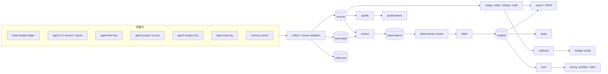
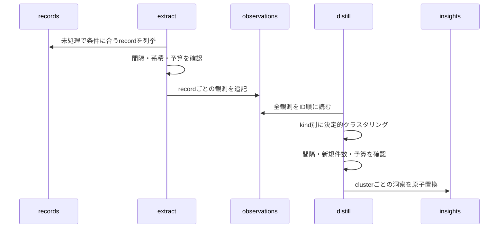

# agent-audit 設計書

> 対象: `tools/agent-audit/`
> 更新: 2026-08-29
> 契約: [`agent-audit-spec.md`](../specs/agent-audit-spec.md)
> 利用手順: [`tools/agent-audit/README.md`](../../tools/agent-audit/README.md)
> 関連: [`agent-tools-concept.md`](./agent-tools-concept.md) / [`agent-cli-plugin-design.md`](./agent-cli-plugin-design.md)

## TL;DR

agent-audit は、エージェント実行系が残したファイルと各 agent CLI のセッションストアを読み、ローカルの監査ストアへ揃える単発CLIである。常駐プロセスや中央サーバは持たない。定期実行はagent-loop、cron、CIなど外側の実行系が行う。

収集後の処理は三つに分かれる。

- 利用量、品質、trial、記憶層の状態はPythonコードで集計する。数字を出す経路にLLMは入れない。
- 失敗や長時間セッションから改善点を拾うときだけ、`extract` と `distill` でLLMを使う。入力件数、実行間隔、予算に上限がある。
- `calibrate`、`tune`、`qualify` は測定結果を設定へ戻す。ただし書き先と値の型を限定し、根拠と以前の値を監査ストアへ残す。

設計上の決め事は、収集元ごとの差をadapterに閉じること、事実とLLMの解釈を別ファイルに置くこと、各段を単発コマンドにして定期実行を外へ出すことの三つである。各実行系へ監査用のsession IDとusage出力を追加する案は採らなかった。agent-auditを使わない環境まで改造するわりに、既存ログを読む方式で必要な情報の大半を取れるからだ。

監査ストアの `records/` は収集した事実、`observations/` はレコードから抽出した観測、`insights/` は複数の観測をまとめた知見である。生の会話は `transcripts/` に分離する。各層を別ファイルにすることで、集計値とLLMの解釈を混同せず、洞察から元ログまで参照を戻せる。

この文書はagent-auditの実装を変更する人、収集元を追加する人、設定反映の範囲を監査する人を対象にしている。CLI引数と設定キーの一覧は仕様書に置く。

## 目的と範囲

### 解く問題

agent-flow、agent-project、agent-amigos、agent-loopは、それぞれ自分の実行に必要な証跡を残す。node-budgetには実行時間と利用量があり、agent CLI自身のストアには会話と実測トークンがある。置き場所と粒度が違うため、そのままでは次の問いに答えにくい。

- どのworkload、CLI、モデルが、どれだけの時間とトークンを使ったか。
- 失敗、再試行、verifyの失敗がどの実行系で増えているか。
- 同じ失敗や設定上の問題が複数の実行で繰り返されていないか。
- 設定変更後に品質と消費がどう変わったか。
- agent CLIの契約枠が尽き、次の候補へ切り替えるべき状態か。

agent-auditは、既存の証跡を共通レコードへ写し、決定的な集計と根拠付きの知見生成を行う。

### 目標

- 収集元を改造せず、ファイルと既存APIから増分収集する。
- 同じ実体を同じIDで記録し、通常の再実行で二重計上しない。
- 実測値と推定値を別に扱い、相関に確信が持てない実行を無理に結ばない。
- LLMを使う処理と使わない処理をファイル境界で分ける。
- 洞察から観測、正規化レコード、収集元へ戻れる参照鎖を残す。
- 設定への反映を少数の型付き経路へ絞り、適用後の悪化を検出して戻せるようにする。
- 一回の起動で処理量が決まり、予算超過時に止まるようにする。

### 扱わないもの

- リアルタイム監視画面。agent-dashboardはagent-auditのJSON出力やストアを読む側である。
- 実行系のdone判定、成果物の受入、再試行制御。それぞれの実行系が所有する。
- 生ログを集める中央サービス。監査ストアは一台のノード内に置く。
- agent CLIログの恒久保管。transcriptには保持期限を設け、既定では一時データとして扱う。
- 任意のファイルやコマンドへ洞察を適用する仕組み。反映先はコードで許可した宣言だけである。
- 正確な請求額の算定。agent-auditが扱うのはCLIや台帳から得られる利用量と補助的なUSD値である。

## システム構成



### 部品の責務

| 部品 | 責務 | 持たない責務 |
|---|---|---|
| `collect.py` | 収集元の走査、増分カーソル、共通レコードへの変換 | 集計、ログの意味解釈 |
| `readers.py` / `cleaning.py` | agent CLIセッションの読取りと宣言済みノイズ除去 | CLI名ごとの業務判断 |
| `store.py` | ID生成、JSONL追記、JSON原子置換、処理状態 | 複数プロセス間の排他 |
| `usage.py` / `stats.py` / `memory.py` | 利用量、品質、trial、記憶層の決定的集計 | 改善案の作文 |
| `extract.py` | 一つのレコードから観測を抽出 | 複数実行にまたがる一般化 |
| `distill.py` | 観測の決定的クラスタリングと洞察生成 | 設定ファイルへの直接反映 |
| `llm.py` | agent CLI選択、controlと予算の確認、実行、利用量記帳 | 観測や洞察の保存方針 |
| `tuning.py` | 洞察を型付きdecisionへ変換し、昇格と退役を行う | 任意パスの変更 |
| `qualifications.py` | 実行receiptから候補の適格性を更新する | 実行中の候補選択 |
| `report.py` / `tasksout.py` | 人や他ツールが読む形式への変換 | state repoへの投入 |
| `gccmd.py` / `reclean.py` / `doctor.py` | 保持、再クリーニング、到達性診断 | 常駐スケジューリング |

すべてのサブコマンドは一回分の仕事をして終了する。`collect → extract → distill` をまとめた本体コマンドはない。途中失敗の再開位置を各段のカーソルで管理し、実行順と頻度は呼び出し側が決める。

## 正本と保存形式

収集元のファイルが一次事実で、監査ストアはその正規化スナップショットである。監査ストアから収集元へ状態を復元したり、実行系の成否を書き戻したりはしない。

```
<audit-dir>/
  state.json
  records/<YYYYMMDD>.jsonl
  transcripts/<agent-cli>/<session-id>.jsonl
  observations/<YYYYMMDD>.jsonl
  insights/<insight-id>.json
  decisions/<decision-id>.json
  reports/<timestamp>-<kind>.md
```

| 場所 | 内容 | 更新方法 | 保持 |
|---|---|---|---|
| `records/` | 収集元を揃えた事実レコード | 追記 | 既定90日 |
| `transcripts/` | clean済みの会話本文 | セッション単位で置換 | 既定30日 |
| `observations/` | extractが返した短い観測 | 追記 | 既定90日 |
| `insights/` | 観測クラスタをまとめた洞察 | ID単位で原子置換 | 自動削除しない |
| `decisions/` | tuning候補、適用値、以前の値、退役理由 | ID単位で原子置換 | 自動削除しない |
| `reports/` | スクラブ済みMarkdown | 新規作成 | 既定30日 |
| `state.json` | cursor、seen、extracted、段の最終実行時刻 | 原子置換 | 自動削除しない |

### レコード

すべてのレコードは `id`、`kind`、`source` を持つ。`tool`、`workload`、`agent_cli`、`model`、`status`、`tokens_in`、`tokens_out` などは、収集元が持つ範囲で埋める。無い値を推測して補わない。

`id` は `source + store + native_id` のSHA-256から作る。同じ収集元の同じ実体なら日をまたいでも同じIDになる。`state.json` の `seen` にIDがあれば再度追記しない。`seen` はrecordsをGCした後も残すため、保持期限切れのデータが再収集されてLLMへ戻ることはない。

CLIセッションは後からトークン数が増える。同じセッションIDの最初の行は変えず、更新時は `session-usage` の補正行を追加する。集計時に `(agent_cli, session_id)` ごとにparser revisionと更新時刻が最も新しい行を採る。追記ログを書き換えずに読み方の修正を反映するための方式である。

### 観測と洞察

観測IDは元レコードIDと配列内の位置から作る。観測は必ず `record_id` と `evidence` を持ち、抽出に使ったCLIとモデルも記録する。

洞察IDは観測のkindとクラスタ内で辞書順が最初の観測IDから作る。その先頭IDが変わらない間は同じファイルを改訂し、`observation_ids` と `occurrences` を更新する。洞察から元の観測とレコードへ辿れるため、生成文だけが根拠から離れて残ることはない。

### `state.json`

`state.json` は集計結果の正本ではない。次にどこから読むか、どのレコードを処理済みにしたかを覚えるためのローカル状態である。

- `cursors`: ファイルのbyte offset、セッション更新時刻、quota snapshotの署名など。
- `seen`: 収集済みレコードID。
- `extracted`: extractが正常に処理したレコードID。観測が0件でも、JSON契約に従った応答なら処理済みになる。
- `last`: extract、distill、gcなどの最終実行時刻。
- `clusters`: 洞察化したクラスタと、その時点の観測数。

recordsやobservationsへの追記とstateの保存は一つのトランザクションではない。プロセスが両者の間で落ちると、次回実行で同じIDの行が重複する可能性がある。この制約は後述の実装課題に残している。

## 収集

### 収集元と増分単位

| source | 読む単位 | recordsの粒度 | 増分判定 |
|---|---|---|---|
| `budget-ledger` | `ledger/*.jsonl` | 消費1行、quotaやescalationのevent 1行 | ファイルごとのbyte offset |
| `cli-native` | `agents/<name>.json` が宣言したsession store | 1 session。更新は補正行 | parser revision、store、session ID、updated_at |
| `cli-quota` | Claude/Copilotの`/usage`、Codex app-server、Kiro ACP | CLIごとのquota snapshot | 内容の署名 |
| `flow-bus` | 終端runのmeta、graph、events、results | run 1件とnode result 1件 | run IDとresult ID |
| `project-root` | `run-log.jsonl`、終端したstatemachine log | project run 1件、loop run 1件 | byte offsetまたはlog名 |
| `amigos-bus` | 終端missionのrole event | role集計1件、候補選択済みturn 1件 | mission、role、turn |
| `loop-log` | 本体ログのERROR/WARNING行 | 粗いrun 1件 | byte offset |
| `memory-store` | ltm、wiki、persona、moltbookのローカル状態 | storeごとのmetadata snapshot | snapshot固有ID |

flowのrunレコードはresultsをすべて読んだ後に書く。run IDが「収集済み」の印になるため、先にrunを書いて落ちるとresultが永遠に欠けるからである。走行中のrunやmissionは収集せず、終端後にまとめて読む。

agent-projectの収集器は `run-log.jsonl` に加え、`project_roots/.statemachine-use/logs/agent-loop-*.jsonl` も読む。候補選択の `execution_decision` と終端事実が揃ったrunだけを適格性評価へ回す。

agent-loop本体ログは標準出力やセッションIDを持たない。ERRORとWARNINGの時刻、タグ、先頭200文字だけを記録する。成功率やトークン数をこのsourceから作ることはできない。

### `collect` の処理順

1. `--source` または設定のsource名を検査する。未指定なら全収集器を順に試す。
2. 収集元ごとのcursor以降を読む。
3. 共通フィールドへ変換し、決定的なIDを付ける。
4. `seen` に無いレコードを日別JSONLへ追記する。
5. その収集元のcursorを進める。
6. 全収集器が終わったらstateを保存する。
7. `gc_auto` が有効で間隔を超えていれば、監査ストア内の期限切れファイルを掃除する。

`collect` 全体はトランザクションではない。途中の収集元でエラーになっても、それ以前に追記したrecordsとcursorは保存してexit 2で終わる。再実行は保存済みcursorから続く。部分収集を破棄して最初からやり直す設計ではない。

明示したパスが存在しない場合と、設定済みmemory storeが読めない場合はexit 2にする。quota APIが応答しない、CLIが未インストール、既定位置にログが無い、といった状態はそのsourceだけ未収集として続ける。壊れたJSONL行も読み飛ばす。したがって「到達できない設定」と「個々の不正行」は同じ扱いではない。

### agent CLIセッション

セッションログの場所と形式は `agents/<name>.json` の `session_log` に置く。定義ファイルの探索順はagent CLIプラグインと共通で、同名定義は先に見つかったものを使う。agent-audit本体がCLI名でパスを切り替えることはしない。

現在のreader formatは `jsonl-dir` と `kiro-sqlite` である。既存formatに沿うCLIは定義の追加だけで収集できる。未知のformatは警告して未収集にする。

`session_log.clean` は本文のノイズ除去規則を宣言する。ルールは閉じた種類だけを受け付け、ログversionに応じて一組を選ぶ。未知のルール、不正な正規表現、閉じていないタグは該当ルールだけを飛ばし、本文を残す側へ倒す。監査証跡を消し過ぎないためである。

`session_log.usage: true` の定義だけを実測トークンとして扱う。readerが数字を拾えても宣言がfalseなら `measured` にしない。読み方を変えたときは `SESSION_PARSER_REVISION` を上げ、既存セッションを一度だけ読み直して補正行を足す。

`--with-transcripts` または設定の `with_transcripts` が有効なら、1セッションをmeta 1行とmessage行からなる共通JSONLへ保存する。更新されたセッションは同じファイルを置き換える。recleanは元のCLIストアを読み直し、既に保存済みのtranscriptだけを現在のclean規則で再生成する。recordsとextract済み状態は変えない。

### quota収集

quota収集はモデルへプロンプトを送らない。ClaudeとCopilotは対話CLIのusage画面、Codexはapp-server API、KiroはACP commandを使う。Kiroは照会用の一時セッションを作り、終了時に削除する。このため「収集元を一切変更しない」という説明は正確ではない。実行成果物へは書かないが、quota照会に必要なCLIの一時状態は作られる。

quota snapshotは監査ストアへ重複排除して書く。同時に、候補選択側が直ちに読めるようnode-budgetのledgerへ0秒のeventを毎回追記する。監査ストア側で同じsnapshotだった場合もledger追記は行う。

## 利用量と品質の集計

### 実行とセッションの相関

node-budgetのledger行とCLIセッションは、次の条件で読み出し時に結ぶ。

1. `agent_cli` が一致する。
2. 両方にmodelがある場合は、片方の表記がもう片方を含む。
3. セッション期間が、ledgerの終了時刻と実行秒から作った時間窓に重なる。
4. 同じセッションを二つのledger行へ使わない。

候補が一つなら結ぶ。複数ある場合は終了時刻と実行時間の差で並べ、終了差が2秒以内で次点と同点でない場合だけ採る。それ以外は未結合のままにする。現行実装はcwdを相関条件に使っていない。

相関結果はrecordsへ書き戻さない。同じ入力と `join_slack_sec` から毎回計算する。相関ロジックを直したときに過去recordsを書き換えず再集計できる一方、同じ時間帯に同じCLIを並列実行すると未結合が増える。

### measuredとestimated

利用量の出し方は次の順で決める。

1. ledger行にトークンがあれば実測として使う。
2. 一意に結べたsessionが `measured` なら、sessionの値で補う。
3. 未結合でも実測sessionは独立行として数える。
4. 実測が無いledger行だけをrateで推定する。

agent-audit自身の短いLLM呼び出しは、同じpurpose、CLI、modelの実測が3件以上あればその中央値を使う。他ツールは `rates.per_cli` のtokens/秒を使う。近傍に実測sessionがあるのに一意に結べなかった行には推定を足さない。実測sessionと同じ呼び出しを二度数える危険があるためである。

出力は `measured_in`、`measured_out`、`estimated_tokens`、`unmeasured_runs` を別列にする。合計を一つの「実測トークン」として見せる出力は作らない。

### 決定的な読出し

- `usage`: workload、tool、CLI、model、purposeなどの軸で利用量を集計する。
- `stats`: status、失敗class、retry、verify、escalationをtool別に数える。
- `ratings`: flowのnode resultを品質、ledgerとsessionを消費として、purposeとmodelごとに順位を出す。
- `trials`: 同じtrialのvariant間でPASS率と平均消費を比較する。サンプル下限未満なら優劣を断定しない。
- `report`: 上記の集計、洞察、memory storeのmetadataをMarkdownへ描画する。
- `sessions`: CLIネイティブストアを直接検索する。監査ストアのrecords検索ではない。

これらは入力が同じなら同じ集計になる。時刻を埋め込むレポート名や保持期限の判定を除き、LLM応答には依存しない。

## 観測と洞察の生成



### extract

extractの候補は、失敗、複数回のretry、verify fail、escalation、長時間sessionのいずれかに当たる未処理レコードである。選別はPythonコードで行う。

LLMへ渡すのは共通フィールドのダイジェストで、transcriptが保存されていれば末尾の抜粋を追加する。入力文字数には上限がある。LLMは `learn`、`avoid`、`skill-gap`、`prompt-issue`、`config-issue` の配列だけを返す。

JSON契約に合わない場合は一度だけ修復を依頼する。二度とも不正なら、そのレコードを処理済みにせず次へ進む。CLI失敗も同じで、呼出し回数には数えるが次回のextractで再試行できる。正常な空配列は「観測なし」として処理済みにする。

### clusterとdistill

clusterはdistillの内部処理で、独立したサブコマンドを持たない。観測をID順に並べ、同じkindの中で英数字tokenと日本語bigramのoverlap係数が0.5以上になる最初のclusterへ入れる。走査順と閾値が固定されているため、同じ観測集合なら同じclusterになる。

観測が既定2件以上あり、前回より増えたclusterだけをdistillへ渡す。LLMは一般化した文、kind、提案、confidence、scope、失効条件、任意の型付きdeclarationを返す。JSON修復は一度までで、失敗したclusterは処理数に数えるが既知件数を進めない。次回また対象になる。

`--review` は別purposeのLLMに洞察と観測を突き合わせさせる。reviewが失敗しても洞察は `review: null` で保存する。`refuted` になった洞察はtasksへ出さない。

### 実行ゲートと予算

extractとdistillには、最終実行からの間隔、未処理件数、1回の呼出し上限がある。`--force` が外すのは間隔と蓄積のゲートだけで、呼出し上限とnode-budgetは残る。

各LLM呼出しの前にagent-controlとnode-budgetを読む。workload `audit` がpauseまたはstopなら呼ばない。soft上限または `on_exhausted: degrade` ではcontrolが指定した低コスト候補へ切り替える。実行したCLI、model、purpose、時間、取得できたtokenはnode-budget ledgerへ記録する。現在の実効値はcontrolのstatusへbest-effortで書く。

agent CLIの選択順はcontrolのpurpose指定、workload指定、全体既定、agent-audit設定のpurpose指定、agent-audit全体設定である。最後にagent CLI定義のvariant routingを通し、`extract`、`distill`、`review` に対応する実行定義を選ぶ。

## 測定結果を設定へ戻す経路

agent-auditには監査ストアの外へ書く経路がある。業務設定、budget、インストール先に触る箇所を次に挙げる。

| 経路 | 発火条件 | 書き先 | 保護 |
|---|---|---|---|
| quota collect | `cli-quota` を収集するたび | budget `ledger/*.jsonl` | 0秒のeventだけを追記 |
| Kiro quota照会 | Kiroのquotaを収集するとき | Kiroの一時session | 照会後に同じsessionを削除 |
| LLM実行 | extract / distill / reviewの実行時 | budget ledger、control status | workloadを`audit`に固定、statusはPID別 |
| `report --out` | 出力先を明示したとき | 指定したMarkdownファイル | report用スクラバを通す |
| `calibrate --write` | 明示フラグ | budget `config.json` のrates | 実測中央値だけ。実測化したCLIの古いrateは削除 |
| `tune --apply` | 明示フラグ | tuning、profiles、ratesの許可パス | review、再現数、品質、confidence、総量上限を検査 |
| tuneの退役 | 昇格済みdecisionが失効または品質悪化 | 以前に適用した同じ宣言 | 現在値が自分の適用値と同じ場合だけ戻す |
| `qualify --apply` | 明示フラグ | control `qualifications.json` | 契約検査とrevision照合 |
| `seed --apply` | 明示フラグ | control `qualifications.json` | recommendation契約を検査し、実測済みセルの上書きは `--force` 要求 |
| `update` | 初回のbaseline記録、または `--now` | update state、インストール先 | 本体digestを比較し、更新時だけinstallerを実行 |

`tasks --mark-exported` は監査ストア内のinsightに `exported` を記録する。`gc` とcollect末尾のauto GCは同ストア内の期限切れファイルを削除し、`reclean` は保存済みtranscriptを置き換える。

### calibrate

実測tokenと実行秒が揃うledger/sessionからCLI別のtokens/秒の中央値を出す。`session_log.usage: true` のCLIはrate推定の対象外にし、`--write` 時に古いrateを削除する。推定から実測へ切り替えた日は `usage_switch` eventを一度だけledgerへ残す。

budget configにはrevision照合がない。複数の書き手が同時に更新しない運用が前提である。

### tune

distillが返した `declaration` をそのまま書かず、次の許可形に絞る。

- tuning: `profiles.<name>.injections` または `profiles.<name>.env` の文字列配列。
- profiles: `tiers.<name>.candidates` の候補配列。
- rates: `rates.per_cli.<cli[:model]>` の正数。

reviewがsupported、観測数と品質サンプルが下限以上、confidenceが既定high以上のdecisionだけを新規昇格できる。1回の昇格数と累計昇格数にも上限がある。適用時は以前の値をdecisionへ保存する。

昇格後は通常の `tune` 実行でも退役判定を行う。最大日数、品質下限、baselineからの低下率のいずれかに当たると以前の値へ戻す。新しい昇格だけが `--apply` を必要とし、既存昇格の退役には不要である。現在値が別の書き手に変更済みなら巻き戻さず `superseded` と記録する。

### qualifyとseed

qualifyは `execution_decision` を持つflow result、amigos turn、statemachine runだけを使う。集計単位は `(agent_cli, model, operation_class)` で、operation classが無ければpurposeへ限って補う。モデル名だけで広い適格性を与えない。

評価窓内のsample数、PASS率、timeout率、禁止failure modeから `qualified`、`trial`、`blocked` を決める。期限内に新しい実測が無いqualifiedはunknownへ戻す。`--apply` は文書全体のrevisionが読み始めた時点から変わっていない場合だけ原子置換する。格付けも観測件数も変わらなければ書かない。実測も既存文書も無い初回には空ファイルを作らない。qualified の `valid_until` は定期実行のたびに延長せず、期限後に基準を満たしていれば更新する。

seedは別途作られたrecommendationのqualifications部分を初期値として取り込む。すでにreceipt由来の実績がある場合、`--force` なしでは置き換えない。

## 設定、常駐、並行実行

### 設定の解決

audit directory、budget directory、収集元、LLM設定は `CLI引数 > 設定ファイル > 組み込み既定` で決める。agent-audit固有の場所を環境変数で上書きする経路は持たない。

共有基盤との接続には共有側の環境変数を使う。たとえばagent-controlは `AGENT_CONTROL_DIR`、自己更新状態は `KIRO_STATE_HOME`、skill registryは `KIRO_SKILL_REGISTRY` を参照する。環境変数を避ける対象はaudit directoryと収集元の解決である。

設定ファイルはcwd、cwd配下の `.agents` と `.agent`、ユーザーの `.agents` の順に探す。YAMLを使う場合だけPyYAMLが必要で、JSON設定なら追加依存はない。

### 常駐

agent-audit自身はwatch、daemon、内部schedulerを持たない。定期処理は外側から個別サブコマンドを呼ぶ。collectにGCを相乗りさせているのは、通常運用で必ず周期実行される入口がcollectだからである。

外側のhookが `collect → qualify → calibrate → extract → distill → tune` を順に呼ぶ場合も、各段は前段の成功を暗黙に保証しない。終了コードを見て次へ進むか決めるのはhook側の責務である。

### 並行実行

一つのaudit directoryには同時に一つの書き手だけを置く。JSONLは `O_APPEND`、単独JSONは一時ファイルからのrenameで壊れにくくしているが、`seen` の確認と追記、cursor更新、cluster更新をまとめるロックはない。二つのcollectやextractを同時に走らせると、重複行やstateの後勝ちが起こりうる。

tuningの一部とqualificationsはrevisionを照合するが、budget ratesやprofilesの全経路が楽観ロックを持つわけではない。外部schedulerは同じノードのagent-auditジョブを直列化する。

## データの扱い

### 会話本文

recordsには会話本文を入れず、transcriptsへ分ける。通常のusage、stats、ratings、reportはtranscriptを読まない。personaの収集も件数と滞留日数だけで、本文やタイトルを記録しない。

ただし、transcriptを保存したレコードをextractへ回すと、末尾の抜粋がLLMプロンプトへ入る。選択したagent CLIがクラウドサービスへ送信する実装なら、その抜粋はノード外へ出る。`with_transcripts` を有効にする運用者は、この経路を含めて送信可否を判断する必要がある。現行実装にはextract用の明示的な送信許可や秘密情報スクラブはない。

`sessions --messages` もclean後の本文をJSONで標準出力へ出す。これはローカルdashboard向けの読取り口で、一般的なexport用スクラバを通らない。

### export

report、tasks、集計系のJSON出力は決定的スクラバを通し、既知のtoken形式と `password=...` などを伏せる。ホーム配下の絶対パスは `~/...` に縮める。ホーム外のパスは絶対パスのまま残る場合がある。

スクラバが扱うのは、登録済みのパターンに一致する秘密だけである。任意の自然文に埋め込まれた機密情報までは検出できない。transcriptそのものを共有物へコピーしないことが第一の境界である。

## 失敗と復旧

| 状況 | その回の動作 | 次回の扱い |
|---|---|---|
| 明示した収集元が無い、memory storeが読めない | それまでのstateを保存してexit 2 | 修正後、保存済みcursorから再開 |
| quota照会が失敗、CLIが未導入 | ログを出して他sourceを続行 | 次回collectで再照会 |
| 未対応のsession format | 未収集と表示して続行 | reader追加または定義修正後に収集 |
| JSONLの不正行 | その行を飛ばす | cursorが進むため自動再試行しない |
| extractのCLI失敗またはJSON契約違反 | recordを未処理のまま次へ進む | 次回extractで再試行 |
| controlまたはbudgetがLLMを止める | stateを保存してexit 1 | 制御解除または予算更新後に再試行 |
| distill失敗 | clusterの既知件数を進めない | 次回distillで再試行 |
| review失敗 | insightを未reviewで保存 | 後のdistill実行でclusterが更新されたとき再試行 |
| 設定適用中にrevisionが変わる | 書かずに競合理由を残す | 最新文書から再計算 |
| GC | records、observations、transcripts、reportsだけを期限で削除 | seen、insights、decisionsは残る |

`doctor` は収集元の到達性、session_log宣言、clean規則の警告、memory store、効かない設定キーを表示する。recordsの内容が正しいことや、全JSONL行がschemaに合うことまでは検査しない。

## 現在の制約と実装課題

### 追記ログとstateの原子性

recordsまたはobservationsへ追記した後、state保存前に落ちる窓がある。次回は `seen`、cursor、`extracted` が古いため、同じIDをもう一度追記できる。読出し側もIDで重複排除していない。厳密なat-least-once取込として扱うか、日別ファイルから処理状態を再構築する修復口が必要である。

### cluster IDの変化

新しい観測のIDが既存clusterの先頭IDより前に来ると、同じ内容のclusterでも洞察IDが変わる。古いinsightは自動削除されず、別の洞察として残る。clusterの同一性を長期運用で使うなら、先頭観測IDとは別の安定したID管理が要る。

### schemaと実レコードの差

現行実装は `session-usage` と `calibration` をrecordsへ書くが、`audit-record.schema.json` のkind enumには含まれていない。calibration行は同schemaの必須 `source` も持たない。仕様書のsource、CLI、外部書込み一覧にもqualify、seed、quota台帳追記などの反映漏れがある。設計変更時にschemaと仕様書を同時更新する運用へ戻す必要がある。

### 相関の限界

エンジン側のledgerにCLI session IDが無いため、時刻、CLI、modelだけで結んでいる。同じCLIを短時間に並列実行すると未結合になり、usageの `unmeasured_runs` が増える。session IDをreceiptへ載せる契約が全実行系に入るまでは解消しない。

### transcriptの送信境界

保存した会話の末尾をextractへ渡す経路に、秘密情報スクラブと送信先別の許可設定がない。ローカルモデルだけに限定する、抜粋をscrubする、transcript利用をextract側で別フラグにする、のいずれかを決める必要がある。

### 単一書き手

audit storeにはロックがなく、budget configとprofilesの一部にもrevision照合がない。複数schedulerや手動実行が重なる環境では、外部ロックが必要になる。

### 観測できない領域

agent-loop本体は成功実行の細かいreceiptを持たず、loop-logからはERROR/WARNINGしか取れない。review purposeは実装済みだが、継続運用での有効性はまだ評価されていない。

## ADR

設計判断はここに残す。本文が現在の構造と動作を説明し、この節は採用理由と見直し条件だけを持つ。

### ADR-1: 実行系を改造せず、収集adapterで読む

決定: flow、project、amigos、loopの内部へ監査用コードを足さず、既存ファイルとagent CLIの既存APIを読む。

この形にした理由: auditを導入しない利用者へ回帰リスクを持ち込まず、agent CLIだけを使う環境でもsession集計を使える。収集元の所有権も変わらない。

採らなかった案は、各実行系にsession IDとusage出力を追加すること、中央collectorを常駐させること、既存run logへ監査結果を書き足すことである。前二つは導入範囲と秘密管理が広がり、最後の案は収集元の正本を二つの実装が書くことになる。

代償は、時刻相関が曖昧なrunを結べず、sourceごとのreaderを保守する必要があること。全実行系が共通session IDをreceiptへ載せるようになったら見直す。確信度は高い。

### ADR-2: 数字は決定的に計算し、意味の抽出だけLLMへ渡す

決定: 収集、clean、相関、集計、cluster、report描画はPythonコードで行い、LLMはextract、distill、任意reviewに限る。

この形にした理由: 改善前後の比較に使う数字がモデル応答で変わると、変更の効果を測れない。一方、未知の失敗から一般化した改善点を見つける処理は固定ルールだけでは足りない。

すべてをLLMへ読ませる案と、観測抽出まで正規表現で済ませる案は採らなかった。代償は二種類の実装と中間データを保守すること。決定的な抽出器で同等のrecallが得られる分野が増えたら、そのkindからLLMを外す。確信度は高い。

### ADR-3: LLM処理をrecord単位のmapとcluster単位のreduceに分ける

決定: extractは一つのrecordだけを読み、distillは複数のobservationをまとめる。purposeごとにCLIとmodelを選べるようにする。

この形にした理由: 全recordsを強いモデルへ一度に渡すと、入力上限と費用が収集量に直結する。mapなら失敗したrecordだけ再試行でき、reduceは再現した観測だけに費用を使える。

一段の要約処理は採らなかった。代償はgate、処理済み状態、cluster IDの管理が増えること。弱いmapが必要な観測を継続的に落とす、または二段の総費用が一段処理を上回る測定結果が出たら見直す。確信度は中程度。

### ADR-4: 事実は追記し、相関と集計は読出し時に行う

決定: recordsとobservationsは追記専用とし、session更新は補正行、実行との相関は読出し時の計算で扱う。insightとdecisionだけをID単位で改訂する。

この形にした理由: parserや相関規則の修正で過去の事実を書き換えず、同じrecordsから再計算できる。洞察はclusterの成長に追随する必要があるため、一ファイル一IDの改訂物にした。

SQLiteへ正規化してUPDATEする案は採らなかった。配布と障害調査は簡単になる一方、migrationとロックを持つ必要がある。追記とstateの非原子性による重複が無視できない頻度になったら、SQLiteまたはjournal付きcommitへ移す。確信度は中程度。

### ADR-5: agent CLI差分を `session_log` 宣言へ置く

決定: ログの場所、format、usageの信頼可否、clean規則をagent CLI定義に置き、readerはformatごとに実装する。

この形にした理由: CLI名の分岐をagent-auditへ増やすと、同じCLI契約が実行側と監査側へ分裂する。既存formatを使うCLIならJSON変更だけで収集を始められる。

CLI名ごとの専用collectorと、全CLIへ共通ログ形式の出力を要求する案は採らなかった。代償はformat enum外のストアにreader追加が要ること。agent CLI共通のsession export APIが普及したら、この宣言とreader群を縮小できる。確信度は高い。

## 変更時に確認する文書

| 変更 | 一緒に確認する場所 |
|---|---|
| record、observation、insightの形 | `schemas/audit-record.schema.json`、`schemas/audit-insight.schema.json` |
| source、CLI、設定、上限 | [`agent-audit-spec.md`](../specs/agent-audit-spec.md) |
| session format、clean規則 | `schemas/agent-cli.schema.json`、`agent_audit/readers.py`、`agent_audit/cleaning.py` |
| 操作手順 | [`tools/agent-audit/README.md`](../../tools/agent-audit/README.md)、setup guide |
| 外部設定への反映 | `agent_audit/usage.py`、`agent_audit/tuning.py`、`agent_audit/qualifications.py` |
| 保持と再処理 | `agent_audit/store.py`、`agent_audit/gccmd.py`、`agent_audit/reclean.py` |
