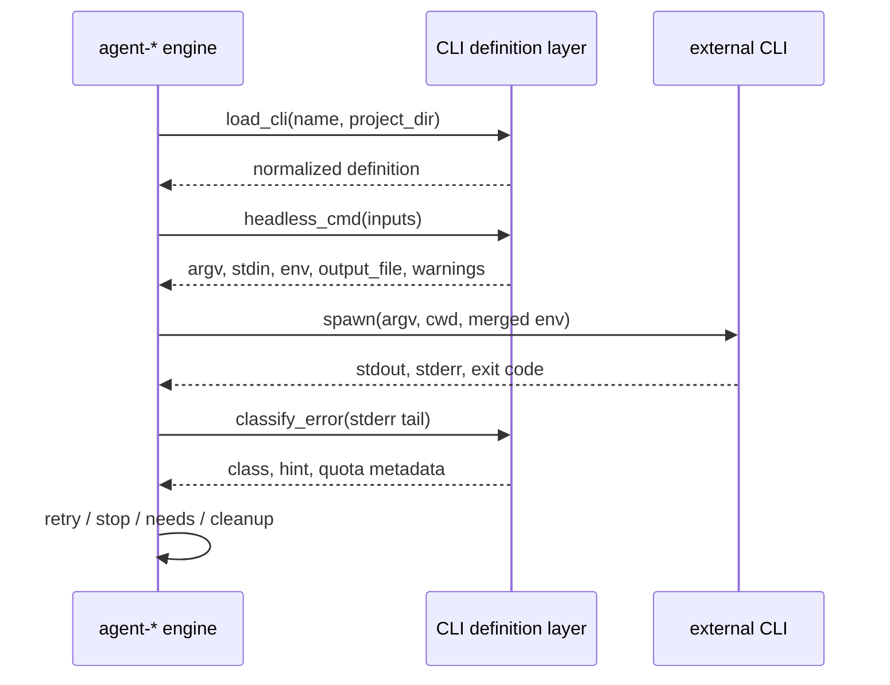

# エージェント CLI 定義レイヤ 設計書

- 状態: 実装済み
- 対象: agent-project / agent-flow / agent-amigos / agent-loop / agent-dashboard / agent-audit
- 契約: [agent-cli-spec.md](../specs/agent-cli-spec.md)、[agent-cli.schema.json](../../schemas/agent-cli.schema.json)
- 主実装: [agentcli.py](../../tools/agent-tools/agentcore/agentcore/agentcli.py)
- Dashboard 実装: [agentCli.js](../../tools/agent-dashboard/src/features/agent-project/main/agentCli.js)

## TL;DR

この設計の対象は、エージェント CLI ごとに異なる起動方法を JSON 定義へ閉じ込め、各ツールから同じ手順で解決・起動できるようにする層である。ここでいう「プラグイン」は `agents/<name>.json` に置くデータ定義を指し、実行コードは含まない。

ここで固定するのは次の三点。

1. CLI 固有のコマンド、権限フラグ、対話判定、エラー規則は JSON に置く。呼び出し元へ CLI 名の分岐を増やさない。
2. Python 実装を基準に正規化と argv 生成を行う。Dashboard は UI 操作のたびに Python を起動しないため、必要な範囲だけ JavaScript で実装し、共通部分をゴールデンテストで揃える。
3. CLI の失敗は正規表現で分類し、`[agent-error:<class>]` を付けて後段へ渡す。再試行や人への差し戻しは、タグを受け取った実行エンジンが決める。

主な不採用案は、各ツールが Claude、Codex、Kiro などを個別に判定してコマンドを組み立てる方式である。変更箇所が散らばり、同じ CLI が呼び出し元によって別の動きをするため採らない。

対象読者は、CLI 定義を追加する人、agent-* の実行経路を変更する人、失敗分類を追う人である。

## 1. この層が扱うもの

### 1.1 「プラグイン」の意味

このリポジトリでエージェント CLI プラグインと呼んでいるものは、動的にロードする Python や JavaScript のモジュールではない。CLI の起動契約を記した JSON ファイルである。

定義には次の情報を置く。

- 実行ファイルと固定引数
- モデル、ファイル、プロンプトの渡し方
- 書き込み可、読み取り専用、セッションを残さない場合の引数
- 対話セッションの起動方法と ready / busy / failure の判定規則
- 用途別の起動差と、別定義へ振り替える規則
- CLI 固有の失敗パターン、利用量、セッションログの所在

定義そのものはコードを実行せず、プロセス隔離の境界にもならない。名称を正確に言うなら「CLI 定義」または「CLI アダプタ」である。既存のコマンド名やファイル名との互換性のため、plugin という呼称は残している。

### 1.2 責任範囲

定義レイヤの責任は次のとおり。

- 名前から定義ファイルを探索する
- JSON を読み、既定値を補って正規化する
- profile と用途別 variant を解決する
- headless / interactive の argv、stdin、環境変数、出力先を組み立てる
- エラー本文を決定的に分類する
- audit が読むセッションログの場所を返す

次の処理は呼び出し元が持つ。

- subprocess や tmux の起動、停止、タイムアウト
- cwd と実行環境の決定
- 出力ファイルと退避したプロンプトの回収、削除
- 再試行、予算、フォールバック、タスク状態の更新
- OS やコンテナによる書き込み防止
- 利用可能なモデルや CLI のインストール確認

この境界により、定義ローダがワークフローエンジンやプロセス管理まで抱え込むのを防ぐ。

### 1.3 不変条件

- CLI 固有の起動作法は `agents/<name>.json` に置く。
- 定義は標準ライブラリの JSON と正規表現だけで読める。
- 同名の定義が複数ある場合は、探索順で最初の一件を使う。
- 壊れた高優先度の定義を、低優先度の定義へ黙って差し替えない。
- 分類できない失敗はタグを付けず、タスク内容の問題として扱う。
- 定義レイヤが done 状態を作ったり、再試行回数を増やしたりしない。
- `readonly: best-effort` は保証ではない。警告を呼び出し元へ返す。

## 2. 全体構成

```mermaid
flowchart LR
    A[agents/*.json] --> B[定義探索]
    B --> C[読み込みと正規化]
    C --> D[profile 解決]
    D --> E[用途別 variant 解決]
    E --> F[headless / interactive argv 生成]
    F --> G[agent-* の実行側]
    G --> H[外部 CLI]
    H --> I[stdout / stderr / output file / pane]
    I --> J[失敗分類]
    J --> K[agent-error タグ]
    K --> L[再試行・停止・人への差し戻し]
```

| 部品 | 実装 | 役割 |
|---|---|---|
| 定義ファイル | `agents/*.json` | CLI 固有の起動契約を宣言する |
| スキーマ | `schemas/agent-cli.schema.json` | 定義できる項目と型を定める |
| Python ローダ | `agentcore.agentcli` | 探索、正規化、profile、argv、分類の基準実装 |
| Dashboard ローダ | `agentCli.js` | UI が使う範囲を Node.js 内で解決する |
| 用途調停 | `agentcore.slashroute` | purpose とモデル決定元から variant を選ぶ |
| 実行側 | 各 agent-* | プロセスまたは tmux を動かし、結果を状態へ反映する |

Python ローダと Dashboard ローダは同じ JSON を読むが、公開 API 全体を二重実装しているわけではない。Dashboard 側は、画面から使う定義解決、コマンド生成、対話判定、失敗分類に範囲を絞っている。

## 3. 定義の探索と解決

### 3.1 探索順

Python ローダは、次の順で `<name>.json` を探す。

1. `KIRO_AGENTS_DIR`
2. 呼び出し元が渡した project directory の `agents/`。未指定なら cwd の `agents/`
3. agent のユーザーディレクトリ。既定は `~/.agents/agents`
4. `~/.kiro/agents`
5. リポジトリに同梱した `agents/`

Dashboard は Windows と WSL の共有ホーム、Electron パッケージの `resources/agents` も探索対象に加える。環境固有のパス解決は違うが、先に見つかった定義を採用する規則は同じである。

同梱名は予約しない。プロジェクトまたはユーザーの定義で同じ名前を上書きできる。上書きを無効にしたい場合は探索順を保ち、呼び出し側が明示したディレクトリを制御する。

### 3.2 解決手順

`load_cli(name, project_dir)` は次の順で処理する。

1. 名前を小文字化し、`[\w.-]+` に一致しない値を拒否する。
2. 探索ディレクトリを上から調べ、完全一致する `<name>.json` を探す。
3. 見つかった JSON を読み、型、必須項目、列挙値、正規表現を検査する。
4. 完全一致がなければ、`<base>-<profile>` と解釈できる候補を長い base 名から試す。
5. base 定義の `profiles` に profile があれば、上書きを適用してもう一度正規化する。
6. 解決した定義と由来のパスを、名前と project directory の組でキャッシュする。

完全一致するファイルは profile の別名より優先する。たとえば `x-y.json` が存在する場合、`x.json` の profile `y` より `x-y.json` を読む。

高優先度のファイルが不正な JSON、または契約違反だった場合はその場で失敗する。次の探索先へ進むと、利用者が修正したつもりのファイルを無視して同梱定義が動くためである。

定義が見つからない場合も明示的なエラーにする。例外は Dashboard の cowork 対話起動で、日常作業を止めないため旧来の Kiro 起動コマンドへ退避し、警告を表示する。この経路は互換措置であり、通常の解決規則には含めない。

### 3.3 canonical name

profile の綴りは入力互換のために受け付けるが、台帳、監査、利用資格のキーには base 名を使う。`canonical_name()` は実際の定義解決を通して base 名を返す。

文字列の `-` を機械的に分割しない。ハイフンを含む通常の定義名と profile の別名を区別できないためである。

### 3.4 キャッシュ

キャッシュはプロセス内だけで有効で、キーは `(name, project_dir)` である。定義ファイルを更新しても、実行中プロセスは自動で再読込しない。テストや長時間動く UI から更新を反映するときは `clear_cache()` を呼ぶか、プロセスを再起動する。

## 4. 正規化後のデータ

ローダは JSON をそのまま呼び出し元へ渡さない。省略値を補い、後段が同じ形で扱える辞書へ正規化する。

| 区分 | 主な項目 | 用途 |
|---|---|---|
| 識別 | `name`, `relative_cost`, 解決元 | 表示、費用順、監査キー |
| headless 起動 | `command`, `prompt_via`, `model_flag`, `output` | argv、stdin、出力先の生成 |
| 権限とセッション | `write_args`, `readonly_args`, `no_session_args`, `session` | 実行モードの切り替え |
| 入出力 | `file_flag`, `read_flag`, `command_suffix`, `env`, `timeout` | CLI ごとの引数と環境 |
| 対話 | `interactive.command`, `ready_pattern`, `busy_pattern`, `failure_pattern` | tmux セッションの操作と状態判定 |
| 派生定義 | `profiles`, `variants` | 起動差の再利用と用途別の振り替え |
| 観測 | `errors`, `usage`, `session_log` | 失敗分類、利用量、監査ログ |

`command` は空でない文字列配列を必須とする。`output.type` が `file` なら、コマンド内に `{output_file}` が必要になる。エラー規則の正規表現はロード時にコンパイルできることを確認する。

JSON Schema をランタイム依存として読み込まず、ローダが必要な制約を検査する。配布物を標準ライブラリだけで動かすためである。スキーマと実装検査のずれは契約テストで検出する。

### 4.1 profile

profile は、同じエージェントの起動形だけを変える。例は、同じローカル CLI を JSON 出力、配列出力、読み取り用の道具付きで起動する場合である。

上書きは raw JSON に適用してから正規化する。`env` は base と profile をキー単位で重ね、その他の指定済み項目は profile の値で置き換える。空配列も明示的な置換として扱う。

`interactive`、`variants`、`slash_native` は profile へ暗黙継承しない。用途別定義や対話面が意図せず別 profile に漏れるのを防ぐため、必要な profile が自分で宣言する。

### 4.2 variant

variant は `purpose -> 別の定義名` の対応である。用途を知っている調停層が `resolve_variant()` を呼び、実行エンジンは CLI 名ごとの分岐を持たない。

profile と variant の使い分けは次のとおり。

| 仕組み | 表すもの | 選ぶ主体 | canonical name |
|---|---|---|---|
| profile | 同じエージェント内の起動差 | 指定した名前の解決 | base に戻す |
| variant | split、verify など用途に合う別定義 | 用途調停 | 解決先を canonical 化する |

variant の解決は一段だけで、連鎖させない。指す先がない場合や自分自身を指す場合は base を使い続ける。設定ミスで実行全体を止めないための扱いだが、誤記が表面化しにくい制約は残る。

振り替え後の `default_model` を使うかは、モデルを誰が決めたかで変わる。人が用途を指定して選んだモデルや用途別の実測順位は維持する。共通候補や tier から自動選択しただけなら、variant の用途向け既定値を採用する。この調停は `agentcore.slashroute` に集約する。

## 5. コマンド生成

コマンド生成は決定的な変換であり、プロセスを起動しない。同じ正規化済み定義と入力から同じ argv を返す。

### 5.1 headless

`headless_cmd()` は次の情報を受け取る。

- 正規化済みの定義
- prompt
- model、file、read file
- `readonly`、`no_session`
- continue / resume のセッション指定

生成手順は次のとおり。

1. `command` の `{model}` と `{output_file}` を展開する。
2. 書き込み可なら `write_args`、読み取り専用なら `readonly_args` の一方を選ぶ。
3. `no_session` のときだけ `no_session_args` を重複なしで加える。
4. 呼び出し元が `spill_path` を渡し、定義に spill 指示があれば、権限引数を `spill.args` で置き換える。
5. `command` に `{model}` がなく、model が指定されていれば `model_flag` を加える。
6. `command_suffix` を加え、continue / resume の引数を先頭のプログラム名とサブコマンドの後へ差し込む。
7. read file、file、prompt の順に追加する。

prompt は `prompt_via` に従い argv または stdin へ置く。戻り値には argv だけでなく、stdin、出力ファイル、追加環境変数、タイムアウト、空出力の扱い、readonly 警告を含める。

headless で model が未指定のとき、`{model}` を含む引数トークンは落とせる。定義側の既定モデルを CLI 自身に選ばせるためである。

### 5.2 interactive

`interactive_cmd()` は `interactive.command` を基に argv を作る。対話起動を宣言していない定義は、headless では使えても tmux 対話セッションには使えない。

対話コマンドでは、書き込み用引数を top-level から暗黙継承しない。読み取り専用、セッションを残さない指定、continue / resume は契約に従って加える。`{model}` を使うコマンドで model が決まっていなければ、曖昧な argv を作らずエラーにする。`{output_file}` は対話起動では認めない。

起動後の prompt 注入は `send-keys` またはファイル経由で行う。clear、save、exit が必要な CLI は対話定義にコマンドを明示する。空文字は「操作なし」を表す。
### 5.3 実行側との境界

コマンド生成後の処理は各ツールが担当する。

定義レイヤが返す `env` は追加分である。親プロセスの環境と結合するのは実行側とする。timeout 後の kill、output file の読込、空出力判定、一時ファイルの削除も同じく実行側の責任である。

### 5.4 読み取り専用

定義は readonly の強さを `enforced` または `best-effort` で申告する。

- `enforced`: CLI が読み取り専用の起動フラグを提供する。
- `best-effort`: 安全側の引数は渡すが、CLI の副作用を封じる保証はない。

`best-effort` の場合、builder は警告を戻す。呼び出し元は診断画面やログへ表示できる。定義レイヤは sandbox を作らないため、強い隔離が必要な処理は実行環境側で行う。

### 5.5 二種類の prompt 退避

退避処理は目的が違うため統合しない。

| 仕組み | 判断材料 | 権限引数 | 後始末 |
|---|---|---|---|
| 定義内の `spill` | positional prompt 使用時に stdin を読まない、といった CLI の癖 | `spill.args` で置換できる | 実行側 |
| `agentcli.spill_prompt()` | OS の argv 長上限 | 変更しない | 呼び出し元が一時ファイルを削除 |

`spill_prompt()` は prompt を stdin で渡す定義には何もしない。argv を短くしても OS 上限を超えた場合の `E2BIG` は、失敗分類で `env` にする。

## 6. 対話セッションの状態判定

agent-loop と Dashboard は tmux pane の末尾を読み、定義の対話規則で状態を判定する。

判定順は次のとおり。

1. `busy_pattern` が一致したら busy
2. `ready_pattern` が一致したら ready
3. 明示パターンがなく、一定時間出力が変わらなければ quiet
4. それ以外は busy または unknown

busy を先に見るのは、画面内に前回の prompt と現在の処理表示が同居するためである。ready を先にすると、処理中の pane を空きと誤判定して次の prompt を送る。

定義上の正規表現は ERE とする。Python 側は利用している POSIX 文字クラスの一部を Python 正規表現へ変換する。変換またはコンパイルに失敗した規則は警告し、安全側の状態へ倒す。

`failure_pattern` は CLI が対話シェルへ戻った、認証画面で停止した、といった pane 上の失敗を検出する。検出した本文は headless と同じ分類器へ渡す。

## 7. 失敗分類と伝播

### 7.1 分類順

失敗分類に LLM は使わない。本文と正規表現から同じ入力を常に同じ結果へ分類する。

実行側を含む優先順は次のとおり。

1. `[agent-control]`、`[node-budget]` など、上位層が付けた発生源タグ
2. すでに付いている `[agent-error:<class>]`
3. 現在実行した CLI 定義の `errors[]`
4. 追加でロードした定義の規則
5. 実行側が持つ汎用規則

CLI 固有規則を汎用規則より先に評価する。認証エラーを接続失敗として transient にしないためである。

解析対象には stderr の末尾を残す。CLI のバナーや起動案内が長い場合、先頭だけでは本来のエラーを失う。

### 7.2 class と後続処理

| class | 代表例 | 基本処理 |
|---|---|---|
| `control` | 管理設定による停止 | 人が許可を戻すまで止める |
| `quota` | 利用上限、rate limit | リセット時刻まで待つかプランを変える |
| `auth` | 未ログイン、期限切れ | 再認証を案内する |
| `env` | CLI 不在、モデル不正、`E2BIG` | 実行環境を直す |
| `transient` | timeout、接続断 | 予算内で再試行する |
| タグなし | 出力内容、受入条件、タスク固有の失敗 | 通常の retry / judge へ渡す |

`quota` は `quota_kind` で恒久的な枯渇と時限の rate limit を区別できる。rate limit のリセット時刻は、絶対時刻または `retry after` の相対表現から決定的に抽出する。相対時刻を処理するときは現在時刻を引数で受け取り、隠れた依存を作らない。

hint は実際に一致した規則のものだけを使う。同じ class という理由で別 CLI の hint を流用すると、利用者へ誤った復旧操作を案内してしまう。

### 7.3 各ツールの扱い

- agent-flow は `control`、`quota`、`auth`、`env` を検出すると再計画せず run を失敗で終える。完了済み node は残し、再開時に続きから動けるようにする。
- agent-project は環境要因で retry と judge を消費せず、原因と復旧方法を needs に記録する。人の承認後に再開する。
- agent-amigos は mission を pause し、手当てが終わるまで次の担当へ進めない。
- agent-loop は pane 実行と headless 実行の双方で同じ class を使う。
- agent-dashboard は状態名だけでなく、再認証や再開承認など利用者が行う操作を表示する。

タグは層をまたぐための契約であり、分類後の状態遷移は各エンジンの設計に従う。

## 8. 呼び出し元ごとの利用範囲

| 呼び出し元 | 定義レイヤから使うもの | 実行側が持つもの |
|---|---|---|
| agent-project | 定義解決、headless argv、variant、分類 | task retry、judge、needs、承認再開 |
| agent-flow | 定義解決、headless argv、variant、費用順、分類 | node 実行、予算、fallback、run 状態 |
| agent-amigos | 定義解決、argv、prompt 退避、usage | mission 進行、プロセス、pause |
| agent-loop | 対話定義、ready / busy、headless 退避、分類 | tmux、周期実行、pane 回収 |
| agent-dashboard | JavaScript 版の解決、argv、対話、分類 | Electron IPC、画面表示、cowork |
| agent-audit | 定義解決、session log、headless LLM 呼び出し | transcript 収集、監査結果 |

Python の呼び出し元は `agentcore.agentcli` を直接使うか、薄い互換ラッパーを通す。ラッパーへ新しい CLI 名の分岐を足してはいけない。CLI ごとの差は JSON 定義に戻す。

## 9. 失敗時の扱い

| 失敗 | 検出箇所 | 呼び出し元へ返すもの | 回復 |
|---|---|---|---|
| 定義がない | 探索 | `AgentCliError` | 定義を追加するか名前を直す |
| JSON が壊れている | load | ファイル位置付きエラー | 高優先度のファイルを修正する |
| 必須項目・型が不正 | normalize | 契約違反 | スキーマに沿って修正する |
| 正規表現が不正 | normalize / 対話変換 | エラーまたは警告 | 定義の規則を直す |
| interactive がない | interactive builder | 対話未対応エラー | headless で動かすか対話定義を足す |
| readonly が best-effort | builder | 警告付きの起動情報 | 強い隔離が要るなら実行環境で制限する |
| argv が長すぎる | runner / OS | `env` 分類 | prompt を退避するか閾値を調整する |
| output file が空・ない | runner | CLI 失敗 | stderr と exit code を分類する |
| variant の参照先がない | variant resolver | base 定義 | 設定を修正する。実行自体は継続する |
| 定義更新が見えない | cache | 古い解決結果 | cache clear または再起動 |

## 10. 配布

リポジトリ直下の `agents/` を同梱定義の正本とする。

- 通常のインストールでは、定義をユーザーの agent directory へコピーする。
- agent-loop の zipapp には Python ローダを含める。
- Electron パッケージには `agents/` を `extraResources` として含める。
- 開発中は project-local の `agents/` が同梱定義より先に解決される。

同梱定義の個数や profile の一覧は変わるため、この設計書には固定値を置かない。利用可能な定義は `agents/` と [agents/README.md](../../agents/README.md) を参照する。

## 11. テスト方針

### 11.1 Python 基準実装

次を単体テストで固定する。

- 探索順、上書き、欠落、不正 JSON
- 正規化の既定値と検証
- exact file と profile alias の優先関係
- profile の置換と `env` の重ね合わせ
- headless / interactive の argv と stdin
- readonly、no-session、continue / resume
- 二種類の spill
- variant と canonical name
- エラー class、hint、quota metadata
- usage 行と session log の解釈

主なテストは `tools/agent-tools/agentcore/agentcore/tests/` に置く。

### 11.2 Dashboard

Dashboard は Python と共有する代表的な JSON を入力し、共通するコマンド生成結果をゴールデンテストで比較する。対象は `tools/agent-dashboard/test/agent-cli-golden.test.js` である。

このテストは両実装の全 API 等価を保証しない。Dashboard が使わない variant 調停、詳細な quota 処理、prompt 退避などは Python 側だけに存在する。JavaScript 側の用途を広げるときは、先に必要な契約を列挙し、対応するゴールデンケースを追加する。

### 11.3 契約テスト

スキーマ、ローダ、同梱 JSON の三者をまとめて検査する。ランタイムでは jsonschema に依存しないため、スキーマで許可した項目をローダが拒否する、またはローダだけが未知の項目を受け付けるずれをテストで見つける。

## 12. 変更するときの見方

| 変更 | 触る場所 | 確認すること |
|---|---|---|
| 新しい CLI を追加 | `agents/<name>.json` | headless、readonly、必要なら interactive と errors |
| 同じ CLI の起動形を追加 | base 定義の `profiles` | canonical name、非継承項目 |
| 用途別に別定義へ振る | `variants` と slashroute | モデルの決定元、自己参照、欠落先 |
| 新しい定義項目を追加 | schema、Python normalize、必要なら JS | 既定値、後方互換、ゴールデンテスト |
| argv の順序を変える | Python builder、必要なら JS | continue / resume、suffix、prompt の位置 |
| エラー規則を追加 | 対象 CLI の `errors[]` | 汎用規則より先に一致するか、hint の出所 |
| 新しい失敗 class を追加 | spec、全エンジン、Dashboard | retry、終端、表示、既存タグの互換性 |
| 対話判定を変える | interactive 定義、agent-loop、Dashboard | busy 優先、quiet、無効な正規表現 |

定義だけで表せる変更に Python や JavaScript の CLI 名分岐を追加しない。定義項目そのものを増やす場合は、利用しない呼び出し元へまで同時に実装を広げず、責任範囲と互換値を先に決める。

## 13. 既知の制約

- plugin はデータ定義であり、任意コード、依存注入、プロセス隔離を提供しない。
- Python と JavaScript のローダは完全な単一実装ではない。Windows の探索経路を含め、差分を明示して維持する必要がある。
- キャッシュにより、実行中の定義更新は即時反映されない。
- 解決元のパスは内部データにあるが、すべての UI から確認できるわけではない。
- `readonly: best-effort` の CLI はファイルを変更する可能性がある。
- ERE、Python `re`、JavaScript `RegExp` の表現力は同一ではない。対話パターンの変換は利用中の一部構文に限る。
- 汎用エラーパターンは一部の実行ラッパーにもあり、追加時に重複や優先順位のずれが起こりうる。
- `relative_cost` は CLI 単位の相対値で、provider、model、時間帯ごとの実費を表さない。
- variant の欠落を base へ戻す仕様は可用性を優先する一方、設定ミスを見逃しやすい。
- 一時ファイルの削除は実行側に委ねるため、プロセスが異常終了すると残る場合がある。

## 14. ADR

### ADR-1: CLI 固有差を JSON 定義に置く

- 決定: argv、権限、対話、失敗規則を `agents/<name>.json` へ置く。
- 背景: 複数の agent-* が同じ CLI を呼び、起動差が各実装へ散っていた。
- 不採用: CLI ごとの Python クラス、呼び出し元の `if name == ...`、任意コードをロードするプラグイン。
- 代償: JSON で表せない特殊処理は、まず一般化できる定義項目として設計する必要がある。
- 見直し条件: 宣言だけでは表せない CLI が増え、共通 builder に不自然な例外が続く場合。
- 確信度: 高い。現在の同梱 CLI はこの契約で起動できている。

### ADR-2: 探索は first wins とし、同梱名を予約しない

- 決定: project、user、bundled の順で最初の定義を採用する。
- 背景: ローカル修正や組織内定義を、配布物を変更せず試す必要がある。
- 不採用: 同梱名の上書き禁止、全ファイルをマージ、壊れた定義を無視して次へ進む。
- 代償: どのファイルが選ばれたかを把握しにくく、キャッシュも調査を難しくする。
- 見直し条件: 誤った上書きが頻発する場合。解決元の表示を先に改善する。
- 確信度: 高い。

### ADR-3: Python を基準実装とし、Dashboard は必要な範囲を再実装する

- 決定: 通常の実行経路は `agentcore.agentcli`、Dashboard は Node.js 内のローダを使う。
- 背景: UI 操作ごとの Python subprocess は起動コスト、配布、障害点を増やす。
- 不採用: Dashboard から毎回 Python を呼ぶ、JavaScript を全機能の第二基準実装にする。
- 代償: 二実装間のずれをゴールデンテストと変更時の確認で管理する必要がある。
- 見直し条件: Dashboard が Python 専用機能を広く使う、または共通ライブラリを無理なく配布できるようになった場合。
- 確信度: 中程度。用途を限定している間は妥当だが、差分管理は残る。

### ADR-4: 起動差は profile、用途別振替は variant に分ける

- 決定: 一エージェント内の起動差を profile、用途に応じた別定義の選択を variant とする。
- 背景: 用途ごとの別名ファイルを増やすと、実エージェント数、資格、監査キーが別名ごとに分裂する。
- 不採用: 用途ごとに独立 JSON を並べる、各エンジンが用途別の CLI 対応表を持つ。
- 代償: 継承規則と canonical name を理解する必要があり、variant 欠落時の非エラー動作もある。
- 見直し条件: profile 間で共有できる項目がほとんどなくなり、base との同一性が実態に合わなくなった場合。
- 確信度: 高い。

### ADR-5: 失敗分類を正規表現で決定する

- 決定: CLI 定義の `errors[]` と汎用規則を順に評価し、機械可読タグを付ける。
- 背景: quota や auth をタスク内容の失敗として再試行すると、予算を消費し、利用者への案内も遅れる。
- 不採用: LLM による分類、終了コードだけの判定、呼び出し元ごとの独立分類。
- 代償: CLI の文言変更へ追従が必要で、未知の文言はタグなしになる。
- 見直し条件: CLI が安定した構造化エラーを提供し、stderr の正規表現より信頼できる場合。
- 確信度: 高い。分類結果が再試行や停止を左右するため、再現性を優先する。

## 15. 関連資料

- [agent-cli-spec.md](../specs/agent-cli-spec.md): JSON 項目、既定値、用途とフラグの詳細契約
- [agent-cli.schema.json](../../schemas/agent-cli.schema.json): 機械可読スキーマ
- [agents/README.md](../../agents/README.md): 定義の追加方法
- [agent-loop-design.md](./agent-loop-design.md): 対話セッションと headless fallback
- [agent-flow-design.md](./agent-flow-design.md): node 実行、再試行、失敗終端
- [agent-project-design.md](./agent-project-design.md): task retry、judge、needs
- [agent-audit-design.md](./agent-audit-design.md): session log の収集と監査
- [agent-dashboard-design.md](./agent-dashboard-design.md): UI での対話起動と失敗表示
