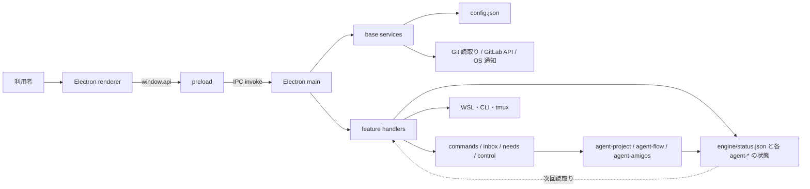

# agent-dashboard 設計書

> 最終更新: 2026-08-29  
> 実装: [`tools/agent-dashboard/`](../../tools/agent-dashboard/)  
> 外部契約: [`agent-dashboard-spec.md`](../specs/agent-dashboard-spec.md)  
> 操作方法: [`tools/agent-dashboard/README.md`](../../tools/agent-dashboard/README.md)

## TL;DR

agent-dashboard は、Windows から WSL または別 PC 上の agent-project、agent-flow、agent-loop、
agent-amigos などを監視・操作する Electron アプリである。対象読者は、dashboard に機能を足す人と、
dashboard から操作される agent-* の契約を変更する人。

設計上の要点は三つある。

1. renderer は表示用スナップショットと入力途中の下書きだけを持つ。共有状態の正典は各 agent-* の
   ファイルと CLI に置く。
2. renderer から OS、ファイル、WSL、外部 API へは触れない。preload の限定 API と main の IPC
   ハンドラを通す。
3. 更新は用途別の契約へ送る。状態フィールドの直書きと、状態リポジトリに対する dashboard 発の
   Git 書込みは禁止する。

却下した中心案は、dashboard 自身が状態リポジトリを pull / commit / push する構成である。
過去に viewer と実行エンジンが同じ状態を更新し、競合マーカーの混入と状態消失を起こした。

## 1. 目的と境界

### 1.1 解く問題

実行エンジンが複数になると、人は端末、状態ディレクトリ、tmux、委譲板を順番に見て回ることになる。
特に見落としやすいのは、人の回答待ち、失敗した run、受入待ちの成果、止まった定常業務である。

dashboard は次を一つの操作面へまとめる。

- プロジェクト、run、ミッション、定常業務、利用量の現在値
- 人の判断が必要な項目と、その判断材料
- 承認、差し戻し、投入、中止、設定変更などの操作
- 設計 run から実装 run までの作業準備
- WSL や別 PC との接続不良を含む診断情報

### 1.2 担当しないこと

- `agent-project serve` の起動、再起動、常駐監視
- `backlog/*.md` の status、`project.json`、agent-flow の run 状態の直接更新
- 状態リポジトリの pull、commit、push、rebase、ロック掃除
- GitLab / GitHub 上の承認、マージ、コメント投稿
- 信頼できない第三者コードの動的ロード
- AI の回答だけを根拠にした操作確定

ただし、dashboard は「完全な閲覧専用アプリ」ではない。上位入力ファイルの編集、公式の file-drop、
dashboard ローカルデータの保存、orchestration 契約の更新、cowork の成果物 Git 操作、短命 CLI の起動を
行う。何を更新してよいかは §6 で分ける。

### 1.3 守る不変条件

- 完了の根拠は実行エンジンが記録した検証結果である。画面上の操作成功を done と同一視しない。
- 共有状態の更新者は、その状態を所有する agent-* に限定する。
- 人の操作は、受信側が検証できる契約へ変換して渡す。
- AI は下書きと診断を返す。保存、投函、実行は人が明示した後に行う。
- renderer が送ったパス、ID、scope、URL、列挙値を信用しない。main 側で用途ごとに検証する。

## 2. 実行時構成

### 2.1 プロセスと境界



renderer から更新契約を投函した後、その場で共有状態を書き換える処理は置かない。受信側が契約を取り込み、
状態を更新し、次回の読取りで画面へ戻る。この一周が操作の基本単位になる。

### 2.2 Electron の三層

| 層 | 主な実装 | 責務 |
|---|---|---|
| main | `src/base/main/`、`src/features/*/main/` | ファイル I/O、WSL と CLI の起動、Git 読取り、外部 API、ダイアログ、通知 |
| preload | `src/preload.js`、各 feature の `preload.js` | IPC チャネルを用途名付きの `window.api` へ変換し、失敗 envelope を例外へ戻す |
| renderer | `src/renderer/` | 取得結果の保持、画面描画、入力中データの保護、操作要求の作成 |

`BrowserWindow` はローカルの `index.html` だけを読む。`contextIsolation` は有効、renderer の
`nodeIntegration` は無効である。preload が feature をローカル `require` するため、preload の sandbox は
無効にしている。したがって feature はすべて同じ信頼境界に入る。

### 2.3 起動手順

main は次の順に立ち上がる。

1. Chromium にプロキシ環境変数を引き継ぐ。
2. 単一起動ロックと `agent-dashboard://` プロトコルを登録する。
3. base IPC、続いて feature IPC を登録する。
4. 設定を読み、ヘッドレス資源制御を開始する。
5. ウィンドウを作り、preload とローカル HTML を読み込む。

renderer は設定とプロジェクト発見だけを初期表示前に待つ。ホームを描画した後、cowork、amigos、
orchestration、登録済み feature のデータを並列で温める。大きい run や全登録フォルダの走査が、
最初の一画面を止めないようにしている。

二重起動時とディープリンク受信時は既存ウィンドウを前面へ出し、`app:openTarget` で対象を renderer へ渡す。

## 3. 機能の組み立て

### 3.1 feature 記述子

制御面は `src/features/<id>/index.js` から次の三要素を公開する。

```js
{
  id: 'agent-project',
  configDefaults: {},
  registerIpc(ctx) {},
  preloadApi() {},
}
```

`src/features/index.js` の配列が唯一の合成点である。現在の順序は次のとおり。

```text
agent-project → routines → cowork → amigos → orchestration
→ delegation → participation → agent-audit → adhoc-flow
```

この順序には意味がある。

- 設定既定値は base から順に deep merge される。同名キーは後ろの feature が上書きする。
- IPC も同じ順で登録される。同じチャネルを二度登録すると Electron が起動時に失敗する。
- preload API は後ろのオブジェクトで上書きされる。同名メソッドはエラーにならない。

そのため、新しい feature の ID、設定キー、IPC チャネル、preload メソッドには feature 名の接頭辞を付ける。
配列順の変更は、設定と API の優先順位変更として扱う。

`src/features/preparation/` は feature ではない。adhoc-flow と renderer から使う共有の保存モジュールで、
記述子も IPC 登録も持たない。

### 3.2 renderer の合成

renderer はバンドルせず、`index.html` に書かれた順に classic script を読む。

```text
renderer.js → sections/*.js → renderer/features/*.js → bootstrap.js
```

`renderer.js` が共有 `state` とユーティリティを定義し、section は描画関数、feature script は登録処理、
`bootstrap.js` はイベント配線と `init()` を担当する。`import` / `export` は使わない。

拡張口は三つある。

| 登録口 | 配置先 | 主なフック |
|---|---|---|
| `registerFeatureTab(name, hooks)` | 領域内のタブ | `render`、`refresh`、`refreshNeeds`、`available`、`badge` |
| `registerPortalCard(id, hooks)` | ホーム | `order`、`html`、`wire` |
| `registerGlobalSettingsPanel(section, hooks)` | 全体設定の節 | `html`、`wire`、`reveal`、`refresh` |

全体設定の追加面は専用の slot だけを描き直す。他の設定欄を含む親要素を描き直すと、入力途中の値や
フォーカスが失われるためである。

### 3.3 制御面の分担

| 制御面 | 読む対象 | 操作の出口 |
|---|---|---|
| agent-project | charter、backlog、needs、履歴、agent-flow run | needs、inbox、commands、上位入力、viewer sidecar |
| routines | loop-state、tmux、メッセージキュー | `agent-loop send` / `msg` |
| cowork | agent-loop 設定、state machine、実行履歴 | CLI 起動、設定書戻し、成果保存 |
| amigos | ホーム、ミッション、納品棚 | ホームの commands |
| orchestration | budget、control、status、CLI 定義、指示、手法 | `~/.agents/` 配下の各契約 |
| delegation | flow、amigos、委譲板の正規化ビュー | workload 別の投函、ノード宛て command |
| participation | 参加可能な flow run | run 限定 worker の起動 |
| agent-audit | audit の集計、診断、セッション | LLM を使わない audit CLI |
| adhoc-flow | run、フロー定義、設計セッション、作業準備 | flow inbox、ユーザー用定義、ローカル準備データ |

agent-flow のプロジェクト内 run は agent-project と同じ対象選択を使うため、agent-project feature に含める。
delegation は独立画面を持たず、プロジェクト、参加、全体設定へ必要な表示だけを差し込む。

## 4. 正典と画面状態

### 4.1 データの種類

| 種類 | 例 | 所有者 | dashboard の扱い |
|---|---|---|---|
| 実行状態 | `engine/status.json`、backlog、run、mission、loop-state | 各 agent-* | 読取り。状態フィールドを更新しない |
| 操作契約 | needs、inbox、commands、flow interaction response | 受信する agent-* | 検証して投函する |
| 上位入力 | charter、policy、repos、workflow、method、control、budget | 利用者または管理面 | 対象を限定して編集する |
| viewer sidecar | assignments、review comments、flow archive | dashboard | 表示補助として保存・削除する |
| ローカル作業 | config、設計セッション、作業準備、cwd 履歴 | dashboard | 原子的に保存する |
| renderer state | 取得結果、選択、入力下書き、busy/dirty フラグ | renderer の現プロセス | キャッシュ。再起動後の正典にしない |

「dashboard は状態を書かない」という規則が指すのは、実行エンジンが所有する状態遷移である。
明示的なタスク削除、run 削除、viewer sidecar の掃除、上位入力の編集まで一律に禁止する規則ではない。
破壊操作は対象 ID と実行中状態を main で確認し、関連する viewer 所有データだけを同時に片付ける。

### 4.2 プロジェクト発見

agent-project の一覧は `<agents home>/engine/status.json` の `children[].root` から作る。dashboard 用の
プロジェクト登録簿と親ディレクトリ走査は持たない。稼働状態、契約版、同期の健康状態、隔離状態、
委譲板の所在も同じ status を根拠にする。

定常業務専用フォルダは例外で、`cowork.roots` に登録する。これらは agent-project が管理せず、
実行主体も dashboard の cowork なので、登録簿の所有者は一つのままである。

Windows から WSL 側の agents home を扱う場合、feature ごとに `os.homedir()` から組み立ててはいけない。
`engine.agentsHome()` とパス変換を共通入口にする。読み手と受信側が別ファイルを指す事故を避けるためである。

### 4.3 画面用スナップショット

main はファイル群をそのまま renderer へ流さず、feature ごとに表示用モデルへまとめる。たとえば
agent-flow のノード状態は graph、results、claims、waits、events から導出し、amigos と flow の委譲は
共通 envelope へ正規化する。

renderer の `state` は次を保持する。

- 発見済み対象と選択中の対象
- プロジェクト、run、cowork、amigos、orchestration の直近スナップショット
- 画面ごとの取得済み詳細とキャッシュ
- ダイアログの下書き、dirty、busy、通知の前回件数
- タイマーと領域ごとの選択履歴

キャッシュを共有状態へ書き戻す処理は置かない。更新後に楽観的な表示を出す場合も、確定状態は次回取得で
置き換える。

## 5. 読取りと更新

### 5.1 初回読取り

初回表示は次の順に進む。

1. `config:get` で合成済み設定を取得する。
2. `engine:status`、`dashboard:discover`、委譲板の概要を読む。
3. ホーム、領域ナビ、対象一覧を描く。
4. 前回選択は各領域の候補として復元する。対象の詳細はまだ読まない。
5. 最初の描画後、cowork、amigos、orchestration、feature tab を並列更新する。
6. 利用者が対象を選んだ時点で、その対象の project と run 詳細を読む。

ホームを出すために全 run や全ログを読まない。詳細は開いた箇所で取得する。

### 5.2 定期更新

更新周期は feature の設定が持つ。プロジェクトの要対応、cowork、amigos、delegation、orchestration、
tmux capture、audit collect は同じ重さではないため、一つの全件ポーリングへまとめない。

手動更新では `refreshAll()` が discovery と各 feature を更新し、選択中の対象を再取得する。定期更新では
軽い `refreshNeedsOnly()` や feature 固有の更新を使う。ある feature の失敗で他の feature の更新を
止めない。

次の間は定期描画を止める。

- 編集ダイアログ、確認ダイアログ、対話画面が開いている
- input または textarea にフォーカスがある
- 要対応カードに未送信の文字がある
- orchestration や cowork の dirty フラグが立っている

停止中のデータは古くなる。ダイアログを閉じた後の更新、または手動更新で追いつく。

### 5.3 通知

要対応通知は `discover()` が返した `needsCount` の前回値との差分で作る。初回観測、新規発見、件数減少では
通知せず、観測済み対象の件数が増えたときだけ OS 通知、タスクバーバッジ、ウィンドウフラッシュを要求する。
通知クリックは `agent-dashboard://open?root=...` で対象を開く。

通知は配送の補助であり、処理済み記録の正典ではない。件数の正典は次回の discovery にある。

### 5.4 flow 履歴の補助保存

agent-flow の live run を一覧化するとき、project 内の `flow-archive/` に表示用スナップショットを残す。
bus 側の GC 後も履歴を表示するための viewer sidecar である。保存に失敗しても live run の読取りは返す。
この archive を run 状態の正典として使ってはいけない。

## 6. 更新操作

### 6.1 共通の流れ

更新操作は次の形に揃える。

```text
入力 → renderer の最小 payload → preload API → IPC handler
     → main 側の検証 → 契約の保存または CLI 起動 → 受付結果
     → 次回読取りで状態を確認
```

IPC の成功は「要求を保存した」「プロセスを起動した」「ファイルを更新した」のどれかを表す。
受信側での処理完了とは限らない。画面文言は「要求しました」「開始しました」とし、完了表示には実行側の
状態または receipt を使う。

### 6.2 更新先の分類

| 分類 | 具体例 | 実装上の条件 |
|---|---|---|
| 人の回答 | `needs/<id>.md`、flow の interaction response | ID と対象を検証し、書きかけを見せない方法で保存する |
| 仕事の投入 | project / adhoc-flow の `inbox/` | payload を正規化し、main が run ID と snapshot を確定する |
| 状態変更の依頼 | approve、reject、pause、resume、stop、cancel、force-complete | `commands/` または workload 固有の inbox へ投函し、状態は受信側が変える |
| 委譲 | post、award、accept、reject、cancel、ノード宛て操作 | 共通 envelope を検証後、flow / amigos / board 用の契約へ変換する |
| 上位入力 | charter、policy、repos、project 作成、note | 許可したファイル名と root の内側だけを編集する |
| 管理契約 | budget、control、profiles、agent 定義、instructions、session commands、methods | revision を更新して原子的に置換する。baseRevision がある契約は保存前に照合する |
| dashboard ローカル | config、preset、ユーザー用 workflow、設計セッション、作業準備 | ユーザーデータまたは dashboard 管理ディレクトリへ保存する |
| 成果物 | cowork の作業ブランチ、commit、push、納品の export | 人の成果物リポジトリに限定し、状態リポジトリと混ぜない |

JSON の単一ファイル更新は、原則として同じディレクトリへ一時ファイルを書いてから rename する。
応答ファイルのように重複受理を避ける箇所では排他的作成または link を使う。複数ファイルにまたがる操作には
共通トランザクションがないため、途中失敗を返し、次回読取りで整合状態を確認する。

### 6.3 禁止する更新

- dashboard の Git 層から状態リポジトリを変更する操作
- renderer が組み立てた workflow 本文や scope を未検証で保存する操作
- `backlog/*.md` の status や agent-flow の node state を操作結果として直接書く処理
- repository / builtin scope の workflow と method の上書き
- GitLab / GitHub API の書込み
- AI 応答から確定ファイルへ直行する経路

`test/no-git-writes.test.js` は cowork を除く `src/` を走査し、Git 書込みサブコマンドが戻っていないことと、
検査対象から新 feature が漏れていないことを確認する。

### 6.4 削除と強制操作

タスク削除は実行中と委譲中を拒否し、対象 backlog、needs、flow sidecar、review sidecar を片付ける。
実行エンジン所有の検証記録やロック、後続タスクの依存修復は engine 側の整合処理に任せる。

run 削除、project reset、workflow 削除、agent 定義削除も個別の main handler を通す。workflow の削除は
ユーザー用 scope に限り `.trash/` へ移す。force-complete は理由を必須にし、未検証であることを実行側の
記録に残す。

### 6.5 起動するプロセス

dashboard が起動するプロセスは participation だけではない。常駐エンジンを起動しないことと、短命の
操作 CLI を起動しないことは別の制約である。

| 入口 | 起動するもの | 用途 |
|---|---|---|
| participation | `agent-flow ... work --idle-exit` | 選択した run へ、この端末の worker を一つ参加させる |
| adhoc-flow | `agent-flow ... run --from-inbox`、`force-complete` | 単発の設計・実装 run、明示的な強制完了 |
| routines | `agent-loop send`、`agent-loop msg`、tmux 読取り | 稼働ループへの復旧送信とキュー投函 |
| cowork | agent-loop、statemachine-use、対話 CLI | 定常業務とアドホック作業。必要なら別ウィンドウと tmux を使う |
| agent-audit | collect、usage、stats、doctor などの非 LLM サブコマンド | 監査データの収集と集計 |
| Viewer アシスタント | 設定された agent CLI、tmux chat | 診断、計画レビュー、文面の下書き |
| review handoff | protocol、exe、設定済み command | gitlab-review-viewer へ対象を渡す |

Windows から Linux 側を起動する場合は `wsl.exe` を使い、パスとディストリビューションを main で解決する。
長時間処理は main を同期的に塞がない。事前検査を持つ入口では WSL とコマンドの存在を確認し、起動後の
終了状態を追う処理は用途ごとに timeout、ログ、tmux、run 状態のいずれかへ委ねる。

## 7. IPC と設定

### 7.1 IPC の戻り値

すべての IPC handler は `base/main/handle.js` で包む。

```json
{ "ok": true, "data": {} }
```

```json
{ "ok": false, "error": "利用者向けの失敗理由" }
```

preload は失敗 envelope を `Error` に変換する。renderer の共通 `guard(label, fn)` は例外を toast に出し、
画面全体を落とさない。継続更新では feature ごとに失敗を閉じ込める。

payload の検証は handler または handler が呼ぶ domain module の責務である。共通 schema registry はない。
特に次を main で確定する。

- run、task、mission、workflow の ID
- root 配下へ収まるファイル名とパス
- workflow の scope と登録済み repository
- URL の scheme と API 件数上限
- lifecycle、period、group key などの列挙値
- revision、mtime、application ID などの競合検知情報

### 7.2 設定

設定は Electron の userData 内の `config.json` に置く。base 既定値と feature の `configDefaults` を起動時に
deep merge する。配列は要素単位に merge せず、後から来た配列で置き換える。

保存は temp file と rename で行う。読取りまたは JSON parse に失敗した場合は既定値へフォールバックする。
現在はこのフォールバックを画面へ通知しないため、破損時に「設定が消えた」ように見える。改善する場合は、
既定値で起動できる性質を残したまま、破損ファイルの退避先と警告を追加する。

GitLab token は同じ `config.json` に平文で保存される。OS 資格情報ストアは使っていない。token 未設定時は
bus 上の情報だけで表示し、設定時も GitLab API は読取りに限定する。

### 7.3 シェルと外部 URL

`shell:openExternal` は `http://` と `https://` だけを受け付ける。ローカルファイルは `shell:openPath` を使い、
Windows では WSL の絶対パスを UNC へ変換する。任意の protocol や shell command を renderer から直接渡す
API は作らない。

## 8. 画面設計

### 8.1 領域、対象、タブ

第一ナビは workload ごとの領域で、タブは領域内の表示切替である。領域の正典は HTML の `data-area`。
選択中対象はアプリ全体で一つだが、領域ごとに最後の対象を `areaSelection` へ覚える。

領域を切り替えたときは、次の順で対象を選び直す。

1. その領域で前回見ていた対象
2. 現在選択中で、その領域に表示内容がある対象
3. 要対応件数が多い対象
4. 作業を一件以上持つ対象
5. 一覧の先頭

表示できるタブがない領域はホームへ戻し、console log に理由を残す。タブの非表示と領域による絞込みは別の
class / attribute で管理し、一方を切り替えた結果でもう一方の状態を失わないようにする。

### 8.2 描画と入力保護

描画関数は取得済み `state` から HTML を作り、必要なイベントを描画後に配線する。外部データを HTML へ
埋める箇所では `esc()` を通す。Markdown や diff の表示は専用変換を使い、外部リンクは click delegation で
main の `openExternal` へ送る。

全画面の再描画は避ける。設定面、登録 feature、重い詳細は自分の slot を更新する。ダイアログの入力、
スクロール位置、`details` の開閉、dirty 状態を保持できない更新は止めるか、描画前後で復元する。

### 8.3 人の判断

要対応カードは、現在の停止理由、次に必要な操作、判断材料の順に出す。過去の操作失敗は現在状態と混ぜず、
履歴として畳む。承認、差し戻し、保留、強制完了は既存の agent-* 契約へ写し、新しい viewer 独自状態を
増やさない。

検証の決着は retry、amend、park、accept-unverified の四つに限定する。前の三つは既存の revise / hold、
最後は理由付き force-complete へ変換する。画面独自の resume 状態は作らない。

### 8.4 AI 補助

Viewer アシスタントは、全体相談、失敗診断、計画レビュー、検収理由の整理に使う。入力は選択中対象から作った
読み取りスナップショットで、出力は回答またはフォーム用の下書きである。

失敗診断の対話では、大きいコンテキストを tmux の一行へ埋め込まない。短い brief と、読める場合にだけ使う
全文ファイルのパスを渡す。AI が生成した shell command を検証欄へ自動保存する処理は置かない。

### 8.5 設計 run と実装 run

adhoc-flow は workflow の保存場所から用途を推測せず、`purpose: design | implementation` を見る。
参照キーは `id + scope + repository`。選択時に main が定義を再解決し、正規化した nodes、origin、digest を
snapshot として保存する。

設計 run は `workspace: null`、対象 repository は読み取り reference として扱う。成果は dashboard ローカルの
作業準備項目へ保存し、必須節を満たした時だけ実装 run へ handoff する。元 workflow が後で変わっても、保存済み
準備項目と run は snapshot を使い続ける。

repository と builtin の workflow / method は読取り専用。編集できるのはユーザー用 scope で、削除は `.trash/`
へ移動する。

## 9. 失敗時の扱い

| 失敗 | 現在の動作 | 回復方法・残る課題 |
|---|---|---|
| `engine/status.json` を読めない | 発見と稼働情報を正常値として作らない | 実行エンジンの場所、WSL、契約版を診断画面で直す |
| 一つの feature の更新が失敗 | その feature に error を保持し、他の更新を続ける | 次回ポーリングまたは手動更新。古い表示には共通の鮮度表示がない |
| IPC handler が失敗 | error envelope を返し、renderer は toast または面内エラーを出す | 入力を残して再試行。toast だけの操作は後から追いにくい |
| config が壊れている | 既定値で起動する | 現在は警告も自動バックアップもない |
| file-drop 保存後に受信側が止まっている | 投函成功だけを返し、状態は変わらない | engine status と経過時間を表示し、再投函は契約の冪等性を確認して行う |
| WSL または CLI がない | 起動前検査または spawn error を返す | distro、PATH、コマンド設定を直す。常駐エンジンは dashboard から起こさない |
| CLI が時間切れ | child を終了するか、切離し run の状態監視へ移る | 用途ごとの timeout とログを使う。共通キャンセル機構はない |
| flow archive の保存失敗 | live run の一覧は返す | 履歴の欠落を許容する。run 正典へは影響しない |
| GitLab API が失敗 | bus の情報を残し、補完だけ欠ける | token、proxy、URL を確認する。書込み API は使わない |
| 複数画面から管理契約を更新 | baseRevision や mtime を照合する契約は競合を拒否する | 照合を持たない契約は最後の保存が勝つ |

## 10. 配布と検証

配布対象は Windows の portable と NSIS。`index.html` がソースと依存ファイルを相対参照するため、
electron-builder の `build.files` と `extraResources` に必要な JS、CSS、CLI 定義、methods、workflows を明示する。
開発環境に node_modules があるだけでは、配布物へ入った保証にならない。

設計上の境界は次のテストで固定する。

| テスト | 固定するもの |
|---|---|
| `test/no-git-writes.test.js` | 状態リポジトリへの Git 書込み禁止、検査範囲、常駐体を起動しないこと |
| `test/feature-split.test.js` | feature の順序、記述子、preload API |
| `test/discover-engine.test.js` | project 発見を engine status に一本化すること |
| `test/portal-home.test.js` | ホームの登録口と要対応集計 |
| `test/needs-notify.test.js`、`test/needs-sla.test.js` | 通知差分と滞留表示 |
| `test/packaging-assets.test.js` | HTML 参照と配布対象の対応 |
| `test/adhoc-flow.test.js`、`test/preparation.test.js` | workflow snapshot、設計 run、handoff |
| `test/state-machine-window.test.js` | Windows から WSL / tmux へ起動する経路 |
| `test/agent-audit.test.js` | audit CLI の引数、収集間隔、失敗表示 |

テスト追加時は `package.json` の `scripts.test` にも追加する。現在は test ディレクトリを自動走査しない。

## 11. 既知の制約

- preload の sandbox は無効。feature は信頼済みローカルコードとして扱う。
- renderer は classic script のグローバル名前空間と読込み順に依存する。名前衝突を実行時に検出しない。
- preload API の同名メソッドは後勝ちだが、重複検査がない。
- IPC payload の検証方法が feature ごとに分かれ、共通 schema registry がない。
- main に同期ファイル I/O が多い。大きいディレクトリ走査はウィンドウを止める可能性がある。
- `config.json` の破損を通知せず、GitLab token も平文保存である。
- renderer の共有 `state` が大きく、busy / dirty の組合せを型や状態機械で検査していない。
- 定期更新を止めた画面に、共通の「最終更新時刻」は出ない。
- 複数ファイル更新をまとめるトランザクションはない。
- ソース文字列を結合して検査する renderer テストがあり、ES module 化の変更費用が高い。

見直しの優先順位は、設定破損の可視化、IPC 重複検査、重い I/O の非同期化、renderer state の分割、
credential 保管の順とする。いずれも既存の file-drop と状態所有権を変えずに進められる。

## 12. 変更時の見取り図

| 変更内容 | 主に触る場所 | 同時に確認するもの |
|---|---|---|
| 新しい制御面 | `src/features/<id>/`、`features/index.js` | 設定 key、IPC / preload 名、renderer の登録口、no-git-writes の対象 |
| 新しい更新操作 | feature の main handler と domain module | 所有者、受信契約、冪等性、受付と完了の区別、path 検証 |
| 新しい画面 | `renderer/sections/` または `renderer/features/`、`index.html` | script 順、slot 単位の再描画、入力中のポーリング停止 |
| project 発見の変更 | agent-project の engine / project adapter | `engine/status.json` の契約と `discover-engine` テスト |
| WSL / CLI 起動の追加 | main の feature module | argv 引渡し、path 変換、事前検査、timeout、ログ、no-git-writes |
| workflow / method の変更 | adhoc-flow、preparation、orchestration tuning | scope、snapshot、digest、readonly、handoff |
| 配布アセットの追加 | `index.html`、`package.json` | `packaging-assets.test.js` とパッケージ版での実在 |

## 付録 A. ADR

### ADR-1 状態更新は所有するエンジンへ渡す

- 決定: dashboard は共有状態のフィールドを更新せず、needs、inbox、commands などの受信契約へ送る。
- 背景: viewer と実行エンジンが同じ状態リポジトリを書いた際、競合マーカーと状態消失が起きた。
- 却下: dashboard に pull / commit / push と競合解消を実装する案。
- 代償: 操作反映は受信側の監視周期ぶん遅れ、投函成功と処理完了を分けて表示する必要がある。
- 見直し条件: 受信側が排他的かつトランザクション付きの更新 API を提供した場合。
- 確信度: 高。実障害と非退行テストが根拠。

### ADR-2 feature は静的に合成する

- 決定: feature はソースツリーで分け、`features/index.js` の配列で main、preload、設定を合成する。
- 背景: 制御面ごとの所有範囲は分けたいが、配布時に第三者 plugin を受け入れる要件はない。
- 却下: 動的 plugin loader、権限 sandbox、個別 version negotiation。
- 代償: すべての feature が main と preload の権限を共有し、配列順と名前衝突を人が管理する。
- 見直し条件: 外部配布の feature、独立更新、信頼境界の分離が必要になった場合。
- 確信度: 高。

### ADR-3 project 発見は engine status を正典にする

- 決定: agent-project の一覧と稼働情報は `engine/status.json` から取得する。
- 背景: host 設定、dashboard 登録簿、ディレクトリ走査が並ぶと、同じ project の有無について答えが割れる。
- 却下: dashboard 設定への project 列挙、親フォルダの自動走査、lock file の直接観測。
- 代償: 実行エンジンが status を書けない間は project が発見できない。
- 見直し条件: engine status が project catalog を外部サービスへ移す場合。
- 確信度: 高。

### ADR-4 renderer はビルド工程を持たない

- 決定: classic script を core、sections、features、bootstrap の順に読み、登録口で画面を合成する。
- 背景: 配布とテストが現在のソース構成を直接扱い、小規模な Electron アプリとして動いている。
- 却下: Vite / webpack と UI framework の導入。
- 代償: グローバル名前空間、読込み順、文字列ベースのテストに依存する。
- 見直し条件: 名前衝突や部分更新の不具合が継続し、移行テストを用意できた場合。
- 確信度: 中。

### ADR-5 YAML の読取りと書戻しを分ける

- 決定: 読取りは `yaml` パッケージへ集約し、cowork の限定書戻しは物理行アンカーで行う。
- 背景: 行指向の値パーサはコメントや複数行値で設定を見失う。一方、再シリアライズは人のコメントと並びを壊す。
- 却下: 独自 YAML parser の継続、書戻しを含む全面再シリアライズ。
- 代償: 値の解析結果と物理行アンカーの対応をテストで保つ必要がある。
- 見直し条件: コメントと書式を保持する YAML CST 編集へ安全に移行できる場合。
- 確信度: 高。

## 付録 B. 関連文書

- [`agent-project-design.md`](./agent-project-design.md)
- [`agent-flow-design.md`](./agent-flow-design.md)
- [`agent-loop-design.md`](./agent-loop-design.md)
- [`agent-amigos-design.md`](./agent-amigos-design.md)
- [`agent-audit-design.md`](./agent-audit-design.md)

個別画面の検討経緯は `docs/plans/` に残す。本書は、現在の実装を変更するときに必要な境界、データの流れ、
更新規則、失敗時の扱いを持つ。
