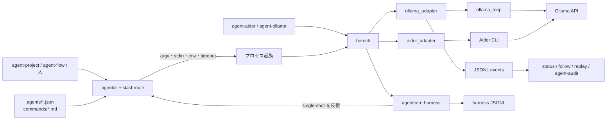
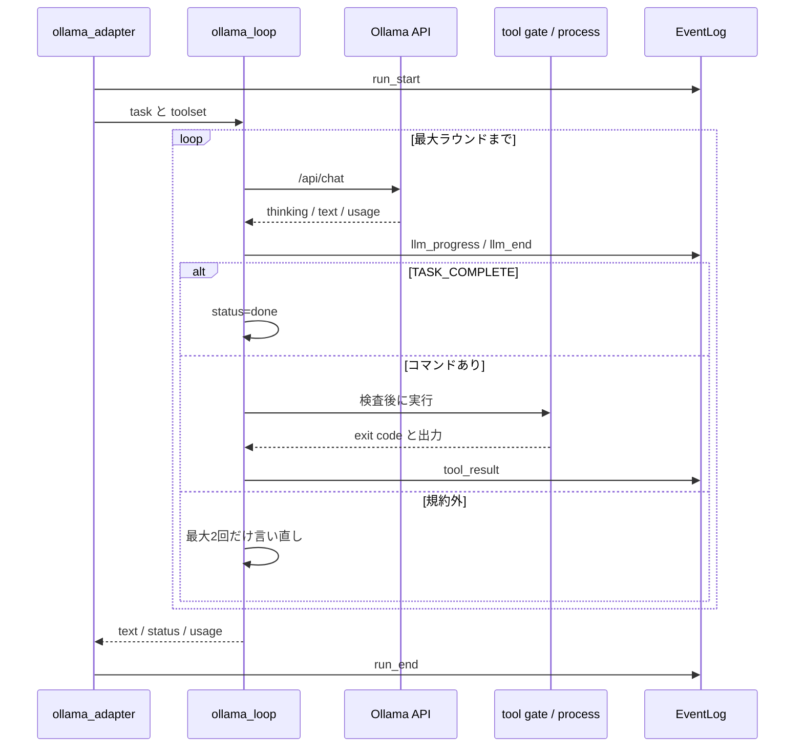

# agent-herd 実行系設計

対象は `tools/agent-tools/agentcore/agentcore/`、`agents/{ollama,aider}.json`、
`commands/`、`tools/agent-tools/install.sh`。CLI の綴りと終了コードは
[`agent-herd-spec.md`](../specs/agent-herd-spec.md)、定義ファイルの項目は
[`agent-cli-spec.md`](../specs/agent-cli-spec.md)を正とする。この文書は、実装の分け方と
実行時の流れを説明する。

opencode adapter は 2026-08-29 に同梱を外した。経緯は
[`2026-08-27-agent-herd-cloud-cli-parity-slash-dispatch-design.md`](../plans/2026-08-27-agent-herd-cloud-cli-parity-slash-dispatch-design.md)
の §6 に残してある。

## TL;DR

`agent-herd` は、LAN 上の Ollama と Aider を agent-* 系から使うための実行系である。
呼び出し側は `agents/*.json` を読み、用途と権限に合う argv を組み立てる。実行側は渡された
argv を忠実に処理し、用途を推測し直さない。この分離により、agent-project や agent-flow は
`ollama` 固有の分岐を持たずに済む。

主要な決定は次の3点。

1. 定義と明示用途は子プロセスを起こす前に解決する。プロンプト先頭のスラッシュ行も、
   provider を呼ぶ前に決着させる。どちらの判断にも LLM は使わない。
2. 自前のツールループを持つ CLI はそのまま1回呼ぶ。single-shot CLI に反復が必要な場合だけ、
   `agentcore.harness` が限定ツール契約を付ける。
3. 長時間実行は経過時間だけで殺さない。接続、順番待ち、prefill、decode を分けて観測し、
   無進捗と文脈枯渇を明示的な終了状態にする。

全クラウド CLI を `agent-herd` 経由にする案と、Ollama 内蔵ループと外付けハーネスを1本に
まとめる案は採らなかった。どちらも責務の違うものを同じ入口へ押し込むだけで、故障点を増やす。

読むべき人は、adapter、`agents/*.json`、ハーネス、実行ログのどれかを変更する人。
CLI の使い方だけ知りたい場合は `tools/agent-tools/README.md` で足りる。

## 範囲

### 目標

- agent-* の各エンジンが、共通の CLI 定義だけを見てローカル推論を選べること。
- plain、ツール実行、対話、再生の各経路で、stdout、stderr、usage、ログの意味を揃えること。
- CPU 推論の長い待ち時間を許しつつ、停止、空回り、文脈枯渇を検知できること。
- 読み取り専用を宣言した経路では、モデルへの依頼文ではなく実行直前の検査で書き込みを止めること。
- single-shot CLI を tmux や agent-loop デーモンなしでも工程実行に使えること。

### 非目標

- クラウド CLI の置き換え。claude、codex、kiro、copilot、cursor の定義は素の CLI を指す。
- `bash` ツールセットのサンドボックス化。これは OS ユーザー権限で動く。
- 実行中の read から edit や bash への自動昇格。
- クライアント側の自動要約と、失敗時の無制限なクラウド再実行。
- モデルの回答を正解と判定すること。実行完了と成果の受入は別に扱う。

## 構成

実行系は、起動方法を決める部分、実際にモデルや CLI を動かす部分、実行を観測する部分に分かれる。

### 部品の責務

| 部品 | 担当 | 担当しないこと |
|---|---|---|
| `herdcli.py` | `argv[0]` とサブコマンドの振り分け、トップレベル引数、`exec`、`chat`、`harness` | モデル呼び出し、定義項目の独自解釈 |
| `agentcli.py` | 定義探索、profile 適用、variant 解決、argv と stdin の組み立て | プロセス実行、用途の意味づけ |
| `slashroute.py` | 先頭のスラッシュ行と用途宣言の解決、実行形の選択 | LLM によるルーティング、ファイルやコマンドの実行 |
| `ollama_adapter.py` | Ollama 用の引数、スキル展開、実行ログの開始、plain と内蔵ループの選択 | 定義ファイルの探索 |
| `ollama_loop.py` | ストリーミング API、待ち状態、bash/read ループ、コマンド検査 | agent-* の台帳、profile の選択 |
| `aider_adapter.py` | 接続環境、固定 policy、Aider の起動、実測 usage の抽出 | 反復制御、受入判定 |
| `harness/toolloop.py` | single-shot CLI への限定ツール契約、受入条件の検査 | provider 固有 API、常駐処理 |
| `harness/statemachine.py` | YAML の状態、アクション、検査、遷移の実行 | tmux、スケジュール管理 |
| `hostenv.py` | Ollama 接続変数の補完とプロキシ迂回 | 利用者が明示した環境の上書き |
| `ollama_context.py` | 文脈上限の解決と使用量の追跡 | 自動要約 |
| `ollama_events.py` / `ollama_replay.py` | JSONL の記録、状態表示、同一入力の再生 | 実行結果の採点、副作用の再現 |

`agentcore.harness` は agent-loop からも使う。本文は agentcore 側だけに置き、agent-loop 側は
import してフックを差し込む。既定のフックは台帳へ書かず、selection policy も読まない。

## 起動形の決定

### 定義と profile

`agents/*.json` は1ファイルを1エージェントとして扱う。`ollama-json` や `ollama-read` は
独立したエージェントではなく、`ollama.json` 内の profile である。旧綴りで読み込んでも
`spec["name"]` は `ollama` のままなので、台帳と格付けの実測が用途別の偽名へ分散しない。

profile は接続先、コスト、出力の取得方法など、エージェント単位の項目を base から引き継ぐ。
`interactive`、`variants`、`slash_native` は引き継がない。これらは起動形ごとの性質であり、
継承すると single-shot profile に TUI が生えたり、用途の振り替えが二重に掛かったりする。

### ローカル2定義の差

`aider` と `ollama` はどちらも `relative_cost: 0` のローカル実行系で、入口も既定モデルも同じ
（`agent-herd` / `gemma4:e4b`）。人がどちらを選ぶかで結果が変わるのは編集の担い手だけである。
判定・抽出・検索・分割は、どちらを base にしても同じ `ollama` の profile へ振り替わる。

| 項目 | `aider` | `ollama` | 差の理由 |
|---|---|---|---|
| `headless_autonomy` | `single-shot` | `tool-loop` | 渡されたファイルを直すだけか、自分で bash を回すか。外側のハーネスが要るかどうかがここで決まる |
| `prompt_via` / `prompt_flag` | argv `--message` | stdin | CLI の作法 |
| `file_flag` / `read_flag` | `--file` / `--read` | なし | Aider はチャットに入っていないファイルを編集しない。渡さないと着手せず「説明だけ返す」で終わる |
| `write_args` | なし（権限は起動 argv に内蔵） | `--tools bash --max-rounds 12 --command-timeout 900` | ツールループの有無がそのまま出る |
| `readonly_args` | `--dry-run`（適用しない） | `--think off`（道具を付けない＝副作用が起きない） | 担保の仕方が違う。どちらも `readonly: enforced` |
| `slash_native` | false | true | ヘッドレスで先頭のコマンド行を CLI へ残すか、ランチャが消費するか |
| `profiles` | なし | `json` `list` `list-thinking` `read` `verify` | 用途別の起動形は `ollama` 側が実体を持つ |
| `session_log` | なし | `~/.agents/logs/ollama`（usage つき） | 下記 |

`variants` の15用途は2定義で一致する。以前は `split` だけ base によって振り替え先が違い、
`aider` 経路のみ `ollama-list-thinking` を指していた。実測があるのは `--format array`
（`ollama-list`）の 4/6 のほうで、Thinking 版に split の数字はない。同じ用途に2つの答えを
持つ理由がないため、測ってあるほうへ統一した（2026-08-29）。`list-thinking` の起動形自体は
残す。think の効きを測り直すときの対照になるためで、いまはどの用途もそこへ振り替わらない。

`slash_native` はヘッドレスの話であり、対話面の `/sm` とは別の層である。段12以降、対話面は
両者とも共通 TUI で、`/sm` や `/edit` は TUI 側のルータが読む。`aider` が `slash_native: false`
なのは、ヘッドレスで `agent-herd aider` を呼んだときにコマンド行をランチャが消費するという意味で、
対話ペインで `/sm` が効かないという意味ではない。

`session_log` の欠落は宣言漏れではなく実体の欠落である。`aider_adapter` は Aider の
`--analytics-log` を一時ファイルへ書かせ、`@agent-usage` を読み取った直後に消す。残るものが
ないので宣言できない。結果として agent-audit の transcript 収集は `ollama` 側だけで、
`agent-audit doctor` はこれを未収集として明示する。usage の実測は `@agent-usage` 経由で
両方から取れるため、格付けに使う数値そのものは欠けない。

base をどちらに置くかは実測が決めている。`aider / gemma4:e4b` はコード編集で T2/T4 9/9、
ツールループ側のコード worker は退行する（自前の編集エンジンでも T4 は 0/3）。したがって
ローカルの base は `aider` に置き、判定・抽出・検索は宣言が自動で `ollama` の profile へ回す。
`ollama` を base にする理由は編集もツールループでやりたいときだけで、実測はそれを支持しない。

人に選ばせない口も用意してある。実行レベルの候補には `herd` の1語を書けばよく、具体の
`(agent_cli, model)` は管理面が埋める。実測（`qualifications.json`）があればそれを使い、
無ければ一族の定義が言う既定モデルへ展開する。

### 解決順

ヘッドレス実行では、次の順で起動形を決める。

1. 呼び出し側が agent 名、モデル、用途、権限、対象ファイルを渡す。
2. `agentcli.load_cli()` が定義を探索し、必要なら profile を適用する。
3. `--purpose` など、呼び出し側が明示した用途を `slashroute` と `variants` で解決する。
4. `agentcli.headless_cmd()` が command、mode args、session args、ファイル引数、プロンプト、環境、
   timeout を1つの実行記述にまとめる。
5. 呼び出し側がその記述どおりに子プロセスを起動する。

プロンプト先頭のスラッシュ行は別の入口からも来るため、プロンプトを所有する launcher が読む。
`agent-herd ollama` では子プロセス内の `ollama_adapter`、外付けハーネスでは `cmd_run()` などの
入口が担当する。OS プロセスは既に起動している場合があるが、provider 呼び出しとツール実行より
前には必ず決着する。

明示したモデルは用途別の既定より強い。selection policy が用途別の実測から選んだモデルも、
用途宣言の既定で上書きしない。詳しい優先順位は
[`agent-cli-spec.md`](../specs/agent-cli-spec.md)のモデル解決規則に置く。

### スラッシュ行

先頭から連続する `/name [args]` だけをコマンドとして読む。空行より後ろは本文である。
`slashroute` が扱う名前は次の4種類だが、実装上の入口は1つ。

| 種類 | 例 | 結果 |
|---|---|---|
| セッション操作 | `/model`、`/status` | TUI など、その操作を持つ面が処理する |
| 実行形 | `/ask`、`/find`、`/edit`、`/sm` | ツールセットかハーネスを決める |
| 用途 | `/verify`、`/judge` | `commands/*.md` と variant から起動形を決める |
| スキル | `/wiki-use` など | `SKILL.md` を実行材料へ加える |

未知の名前は本文へ流さず止める。`/verfy` のような打ち間違いを通常の依頼として実行すると、
失敗理由がログから分からなくなるためである。先頭を `/` で始めたい通常文には、空行を1つ置く。

## 実行経路

### plain

用途は JSON 生成、判定、要約などの1往復である。

1. `ollama_adapter` が引数と接続環境を確定し、スラッシュ行と明示スキルを展開する。
2. `ollama_context` が文脈上限を `--context-limit`、`num_ctx`、`/api/ps`、`/api/show` の順で探す。
3. adapter が `run_start` を JSONL へ書き、`ollama_loop.run_plain()` を呼ぶ。
4. `run_plain()` が `/api/generate` のストリームを読み、本文と実測トークン数を集約する。
5. adapter が本文を stdout、usage と文脈使用量を stderr、`run_end` を JSONL へ出す。

plain はツールを持たない。したがって、Ollama の readonly 宣言はモデルの自制ではなく、
そもそも書き込み手段を渡さないことで成立する。

### Ollama 内蔵ループ

`ollama` base と `ollama-read` は `ollama_loop.run_loop()` を使う。1ラウンドは、モデル呼び出し、
コマンド抽出、権限検査、コマンド実行、結果の追記で構成する。

`bash` セットはシェルへ渡すため強い。`read` セットは許可コマンドと git の読取 subcommand を
検査し、引用外のシェルメタ文字や書き込みを伴う `find` を拒否する。許可後もシェルを介さず
argv で起動する。

同じコマンド、終了コード、出力が3回続けば `no_progress` で止める。出力はダイジェストだけを
比較し、長いツール結果を会話とは別に抱えない。残り文脈が少ない場合はツール出力を詰め、最低限の
結果も入らなければ `context_exhausted` で止める。サーバ側の黙った切り捨てには任せない。

### 外付けハーネス

`agentcore.harness` は、Aider のような `headless_autonomy: single-shot` の CLI に反復を付ける。
`run_prompt()` は定義の `headless_autonomy` だけを見て分岐する。

- `tool-loop` なら CLI を1回呼ぶ。反復とツール実行は CLI の内側にある。
- `single-shot` ならモデルに `read_files`、`write_files`、`run`、`final` の JSON を返させ、
  ハーネスが検査して実行する。

外付けハーネスでは、ファイルパスを作業ディレクトリ内へ正規化し、シンボリックリンク経由の逸脱も
拒否する。`run` はシェルを受け付けず、作業ディレクトリかロード済みスキル内の実行ファイルだけを
許す。スクリプトは拡張子ごとの固定インタプリタで起動し、shebang に実行方法を決めさせない。

`statemachine` は workflow を検査してから初期状態へ入り、各状態でアクションを実行する。
`check` がある状態では検査に通るまで同じ状態を再試行し、上限に達したら fail または escalate を
返す。遷移はモデルの完了報告だけでは決めず、状態出力と検査結果を `next_state.py` に渡して決める。

tmux はこの経路に含めない。agent-loop が tmux で見せる場合も、実行の本文は同じハーネスである。

### Aider

`aider_adapter` は Aider の手前で次の処理だけを行う。

- `hostenv` で `OLLAMA_API_BASE` とプロキシ除外を補う。
- 固定 policy と `num_ctx`、`num_predict` を一時的な model settings に変換する。
- `--analytics-log` から実測トークン数を読み、`@agent-usage` に直す。
- Aider の終了コードをそのまま返す。

Aider 自体は single-shot の編集役である。複数ラウンドや受入検査が要る仕事では、外側のハーネスが
Aider を呼び直す。対話時も前面は共通 TUI だが、1入力ごとに Aider を1回起動し、会話履歴を
adapter 内には積まない。

## データと出力

### 標準入出力

| チャネル | 内容 |
|---|---|
| stdin | プロンプト本文。定義が `prompt_via: argv` の場合は `agentcli` が argv へ移す |
| stdout | 成果本文だけ |
| stderr | 診断、`@agent-usage`、`@agent-context`、`@agent-note`、`@agent-log` |
| 終了コード | 実行ファイルの値。`herdcli` は丸めない |

Ollama 内蔵ループは `done`、`no_command`、`max_rounds`、`no_progress`、
`context_exhausted`、`tool_denied` のいずれかで終わる。`done` 以外でも途中成果は捨てず、通常の
text 出力では末尾に `{"ok": false, "issues": [...]}` を加える。`--format json` では本文契約を
壊すので加えない。呼び出し側の形式検査と受入検査が未完了を拾う。

`TASK_COMPLETE` はループ規約を終えた印であり、成果の受入判定ではない。エンジンまたはハーネスは
テスト、ファイル検査、受入条件を別に実行する。ここを混ぜると、モデルが終了マーカーを書いただけで
作業全体が完了扱いになる。

### セッション継続

継続には2種類ある。

- ネイティブのセッション機能を持つ CLI では、定義の `continue_args` と `resume_args` を argv に
  差し込む。履歴は各 CLI が保持する。
- Ollama と Aider では、自分の JSONL から直近6メッセージを読み、次のプロンプトの前へ載せる。

材料を再構築できない場合は新規実行へ黙って落とさない。継続したつもりで履歴なしの実行が走るため、
起動前にエラーを返す。

### 接続環境

Ollama adapter と Aider adapter は、起動時に同じ `hostenv.load_profile_env()` を呼ぶ。
呼び出し元が `OLLAMA_HOST`、`OLLAMA_API_BASE`、`NO_PROXY` を揃えていれば、それをそのまま使う。
不足がある場合だけ `~/.profile` から `OLLAMA_*`、`AGENT_OLLAMA_*`、プロキシ設定を補う。
既にある値は上書きしない。

`OLLAMA_HOST` と `OLLAMA_API_BASE` は片方からもう片方を作る。Ollama のホストは `NO_PROXY` と
`no_proxy` の両方へ常に加える。urllib と Aider/LiteLLM が別の変数を見るため、どちらか一方だけを
設定すると、同じサーバを使うはずの2経路が別の接続先へ向かう。

### ログ

Ollama のログは `~/.agents/logs/ollama/` の JSONL で、run、message、skill、LLM、tool、context、
error、end のイベントを追記する。`status` と `follow` はこのイベントを読む。書き込みや表示 sink の
失敗で推論を落とさないため、ログは監査材料ではあるがトランザクション境界ではない。

ハーネスは工程ごとに別の JSONL を持つ。子の stdout がまだ出ていなくても Ollama が生きていると
分かるように、一時的な progress beacon を子へ渡す。beacon は会話記録ではなく、無進捗監視だけに
使い、子の終了時に消す。

### 再生

`replay` は Ollama の JSONL から `run_start` と最初の user メッセージを読み、同じ入力を
model、think、format の組み合わせへ渡す。各組み合わせの結果は別の JSONL に追記し、stdout には
空応答率、失敗率、所要時間、一致率の集計だけを出す。

元の実行がツールを使っていても、再生時はツールを渡さず、記録されたコマンドも実行しない。
これは副作用込みのデバッガではなく、推論設定を比べるための入口である。正解ラベルは持たないので、
一致率が高いことを品質が高いこととは扱わない。

## 待ちと失敗

### Ollama の待ち状態

| 状態 | 進んだとみなす条件 | 既定の打ち切り |
|---|---|---|
| connect | HTTP 応答を開いた | 120秒。到達時に `/api/version` が通れば queue へ移る |
| queue | サーバの生存確認が通る | 時間上限なし。生存確認が連続失敗したら止める |
| prefill | 最初の thinking または本文が届く | なし |
| decode | thinking または本文が増える | 180秒の無進捗 |

CPU 推論では prefill に10分以上かかることがある。そこで一律の壁時計 timeout は置かない。
ただし外付けハーネスには、出力も beacon も動かない子を止める idle timeout と、動き続ける異常系を
止める4時間の天井がある。ツールコマンドの timeout は通常の壁時計であり、モデル呼び出しの
無進捗 timeout とは別物である。

### 失敗の伝え方

| 失敗 | 返し方 | 再試行の扱い |
|---|---|---|
| 引数、定義、スキル、接続設定の不備 | stderr と非0終了 | 同じ入力のままでは直らない |
| decode stall、通信断 | stderr と非0終了 | transient として有界に再試行できる |
| ループの未完了 | 途中本文と未完了 envelope | 成果を読んだ上で上位が判断する |
| 受入条件または state check の失敗 | harness の失敗か escalate | 同じ state の再試行回数を定義で制限する |
| ログや任意 UI の失敗 | 実行を続ける | 観測だけが欠ける |

エラー分類の文字列と hint は `agents/*.json` に置く。engine ごとに分類を持たせると、同じ失敗が
経路によって transient と env に割れるためである。

## 配布

`install.sh` は agentcore を同梱した `agent-herd` zipapp を1つ作る。`agent-aider` と
`agent-ollama` は同じファイルへのハードリンクで、ファイルシステムが対応しない場合だけコピーに
落とす。インストーラはコピーも毎回更新する。

`herdcli.resolve()` は `basename(argv[0])` を1回だけ見て別名を adapter に変換する。
`agent-aider X` と `agent-herd aider X` は同じ関数へ同じ引数で届く。別名用のラッパは置かない。

クラウド CLI の定義はこの zipapp を経由しない。人が `agent-herd exec codex` やトップレベルの
`--agent codex` を使えば定義経由で起動できるが、エンジンが通常実行する command は素の CLI の
ままである。adapter が必要になった場合だけ追加する。

## 役割ごとの代替可否

ローカル herd（既定 `gemma4:e4b`・レビューのみ `gemma4:12b`）へ任せる役割の確定表。
判定の根拠は `tools/agent-tools/eval` の実測で、表の eval 列はそのシナリオ番号
（台帳とチェッカーの対応は [eval README](../../tools/agent-tools/eval/README.md)）。
機械列に実装箇所を挙げた役割は、**その機械が発火して初めて成立する**——機械を迂回する
呼び出し方（宣言を落とす・材料を渡さない）をした場合、この表の判定は適用されない。
機械の実装は herd 本体（agentcore）に限らず消費側（agent-flow / agent-project /
agent-amigos）にもある。herd はどの役割にも同じ argv 契約で応え、役割を成立させる形の
手当ては呼び出し側が持つ——この分担は ADR-1 の帰結である。

### 素のまま任せる

モデルへ丸ごと渡して成立する役割。機械は形式修復（`agent._repair_json_output`・
split / extract / retrieve に 1 回）と寛容パーサだけで、内容には介在しない。

| 役割 | eval |
|---|---|
| 実装（成果物 1 つ・局所修正） | T1min・T2・T4 |
| 定型のテキスト業務 | T7digest・T8log |
| 選別・比較（単一基準） | F1・J2 |
| 集約（reduce）・分割（split） | R1・R2・S1 |
| 分析・抽出・短い要約 | AN・EX・SM1・EX1F |
| 候補生成（選ぶ: パス・テスト名） | CG2・CG3 |
| 環境診断（dashboard doctor 4 モード） | DR1〜DR4 |
| ルーティング（`route`。決定論で決まらないときだけ呼ぶ） | RO1〜RO3 |
| 評価役・検証役・分類 | E1〜E3・V1〜V3・CL1 |
| 取得（`retrieve`。`ollama-read` profile・道具 read） | RT1・RT2 |
| 統合（`synthesize`。落とさず足さず） | SY1 |
| 順序付け・事前採点・門番・蒸留 | PR1・AS1〜2・AD1〜2・DS1 |
| dashboard の下書き・候補提案 | MD1・AC1・EA1・CD1・CR1・FS1・SC1 |
| チーム編成・合議の手続き（amigos） | TB1・CO1・RA1 |

稼働診断（`doctor`）もここに入るが、config カテゴリのうち「設定と実行の矛盾」は弱いまま
任せる（代替が無い。PD1〜PD3）。「設定どうしの矛盾」は後述のとおりモデルに訊かない。

### 機械を前提に任せる

機械が形を整えることで成立する役割。左が役割、中央が**どこに入れたどの処理か**。

| 役割 | 機械（実装箇所と処理） | eval |
|---|---|---|
| 実装（成果物 2 つ以上） | `nodecontract.split_by_deliverables` と `patterns._expand_deliverable_slots` が 1 成果物 1 呼び出しの直列へ割る。単発実行は `agent-herd harness run --deliverable` | T3autosplit |
| 実装（大きい参照を読む） | `agent.prepare_read_allocation_files` が Python 参照を symbol slice の一時ファイルへ差し替え、判断を result の receipt に残す | T5slice・T6slice |
| 選別・比較（多基準） | decision 契約。モデルは事実の転記のみ、採否は `agent._apply_decision` → `nodecontract.decide_candidates`（AND 条件 + tie_break・欠測は undecided） | F2P・J1P |
| 組合せ最適（予算内で効果最大） | `nodecontract.decide_candidates` の `optimize`。予算内で目的値最大の部分集合を総当たり（候補上限 16）で選び、undecided では確定しない | PR1P |
| 計画（タスクグラフ） | `patterns._coerce_tasks` と flow-planner スキルの `normalize_tasks`（規則は 2 層）が静的後段の除去・同一ファイル併合・宣言の器直しを行う | PL1〜PL6 |
| 要素ごとの適用（`map`） | `continuation._split_child_readonly` が split の readonly 宣言を実行時の map / reduce / gate へ伝播する（split が readonly かつ配った要素が非パス形のときのみ）。readonly の起動形（`agents/ollama.json` の `readonly_args`）は道具ゼロ・think on | MP1 |
| 統合（依存が申告した欠落を運ぶ） | `nodecontract.carry_dependency_gaps` が依存の `warnings` / `issues` を集約結果へ転記する | SY2P |
| 分解（agent-project `plan`） | `plan._plan_next_spec` が 1 件ずつ受け取り件数は本体が持つ（器の分岐は `_plan_object_only`: `json_object_only` の器だけ 1 件契約）。受け方は 1 件許容の `_items_from_output`、件数下限は成果物数の過半 | PP1 |
| 敵対的レビュー（agent-project `review`） | `plan._review_prompt` へ決定的材料 2 つ（acceptance コマンドの判定結果・backlog / archive の要約）を注入。受け方は `_items_from_output` | RV1（project_eval） |
| リポジトリ理解（`repo_map`） | `plan._repo_map_material` が材料（`git ls-files` + README / ビルド定義の先頭・有界）を機械収集してプロンプトへ入れ、purpose=repo_map は readonly 既定（`prioritize._agent_readonly`）で道具ゼロ | RM1 |
| 討議（amigos `debate`） | `agent_amigos/runner._llm_debate` が前ラウンドの引用（各 peer の先頭文）を応答位置の直前に機械で前置きし、引用ごとの応答を出力契約に含める | DB1 |
| 制約つきの要約（字数・必須言及） | 検査は `operation.verification.commands` のシェル（`wc -m` / `grep`）で機械化。宣言を促す規則は planner プロンプト 2 層（`patterns.py` / flow-planner スキル）にあり、宣言はクラウド planner が担う（copilot 3/3・e4b 0/3。宣言は成果物を持つノードなら kind を問わない——`_coerce_tasks` は operation を kind で絞らない） | SM2・PL8 |

### 任せない

| 役割 | 決定 | eval |
|---|---|---|
| コードレビューの網羅 | **12b へ割り当て**（唯一のモデル差し替え） | RV1・RV2（text_eval） |
| 候補生成（作る: regex） | herd に担い手なし。機械でも代替できないため、クラウド CLI か人 | CG1 |
| 上流の欠落申告（work / generate の完了 envelope） | モデルには担わせない（申告は生成時の自己検査にしか現れず、後追いの修復は機械化しない。契約文 EXEC_CONTRACT は flow-worker スキルに残す）。**欠落の事実チャネルは機械が持つ**: `nodecontract.requested_material_gaps` が goal の連番名指し（集合・範囲）と作業ディレクトリの実物を突き合わせ、`carry_requested_material_gaps` が warnings へ転記する（`execute_agent` が work / generate へ適用。誤検知は「2 件以上かつ 1 件は実在」のガードで黙る側へ倒す） | GW1・GW1W・GW1P |
| 受入判定（自然文の達成条件） | 役割ごと撤去。charter の決定的コマンド全 PASS と人の approve だけが done の根拠 | — |
| 設定どうしの矛盾検出 | モデルに訊かない。`doctor._config_contradiction_findings`（決定的チェック）が config 所見を出す | —（PD4 は撤去済み） |
| 記憶検索 | 生成モデルと独立（`bge-m3`） | retrieval_eval |

## 変更時の境界

新しい用途を足す場合は `commands/<purpose>.md` と必要な `variants` を追加する。engine に
用途名の許可リストを足さない。起動前の判断は `slashroute` に集める。

新しいローカル adapter を足す場合は、provider 固有の差を adapter に閉じ、`herdcli.ADAPTERS` と
定義を追加する。旧コマンドとの互換が必要な場合だけ install 時の別名を増やす。

新しいツールセットを足す場合は、プロンプト上の説明だけでは済まない。実行直前の検査、拒否回数、
ログイベント、未完了状態を実装し、仕様書と契約テストを更新する。安全性を説明できない段階では
`edit` のように予定名だけ認識して明示エラーにする。

新しいクラウド CLI は、定義の argv で契約を満たせる限り素の CLI を使う。生イベントから本文を
抽出する、実測 usage を共通形式へ直す、終了コードに出ない失敗を補正するといった処理が必要に
なった時点で adapter を検討する。

## 付録A 判断記録

### ADR-1 定義で起動し、adapter は必要な CLI だけに置く

判断：engine は `agents/*.json` から argv を組み、ローカル固有の差は `agent-herd` の
adapter に閉じる。クラウド CLI は直接起動する。

理由：engine 側に `if agent_cli == "ollama"` を置くと、消費側ごとに timeout、usage、
readonly の扱いが分かれる。反対に、定義だけで動くクラウド CLI へラッパを足しても消える重複はない。

却下案：Ollama の OpenAI 互換 API を既存 CLI に渡す案は、think、structured output、
`num_ctx`、`keep_alive` を十分に扱えない。全 CLI を `agent-herd` 経由にする案は、ローカル実行系の
導入ミスでクラウド経路まで止める。

代償と見直し：subprocess が1段増える。クラウド CLI にも argv では表せない補正が必要に
なったら、その CLI だけ adapter へ昇格する。確信度は高い。

### ADR-2 用途差は profile と起動前ルーティングで表す

判断：`ollama-json` などの用途差は profile に置き、正典名は `ollama` のままにする。
用途宣言は argv を組む前に、スラッシュ行は provider を呼ぶ前に解決する。

理由：用途は台帳の `operation_class` が既に持っている。`agent_cli` 名にも埋め込むと、
1つの実行系の証跡が複数候補へ割れる。また、起動後にツールセットを変えると、権限と timeout を
確定した後に前提が変わってしまう。

却下案：用途ごとに JSON ファイルを置く旧方式と、モデルにツール選択を任せる方式は採らない。

代償と見直し：profile の継承規則が必要になる。独立したエージェントとして予算と格付けを
分ける必要が出た場合は、同名 profile より実ファイルを優先する既存規則で切り離せる。確信度は高い。

### ADR-3 内蔵ループと外付けハーネスを分ける

判断：`headless_autonomy` を唯一の分岐にし、`tool-loop` は1回起動、`single-shot` は
`agentcore.harness` で反復する。

理由：Ollama の内蔵ループは bash/read と会話文脈を扱う。外付けハーネスは provider に依存せず、
4種類の JSON ツールと受入検査を扱う。停止条件も権限も違う。

却下案：2つのループを共通クラスへ畳む案は、違いを条件分岐として同じファイルへ移すだけになる。

代償と見直し：ログ形式と未完了語彙を両方で保守する。両経路で同じ役割を十分に流し、実際の
重複が確認できるまでは統合しない。確信度は高い。

### ADR-4 権限と受入をモデルの外で判定する

判断：readonly はツールを渡さないか、実行直前の決定的ゲートで強制する。モデルの終了マーカーと
成果の受入を分ける。

理由：小型モデルは、書き込み禁止や完了条件を文章だけでは守らないことがある。違反後にログで
気づくのでは遅い。

却下案：system prompt だけで read を保証する案と、モデルの自己採点で done を決める案は
採らない。

代償と見直し：安全なコマンドも拒否することがある。拒否を緩める場合は allowlist と契約テストを
先に追加する。走行中の権限昇格は未実装のままにする。確信度は高い。

### ADR-5 時間ではなく進捗を測り、設定変更は再生で確かめる

判断：待ちを4状態に分け、decode と反復の無進捗を検知する。think と format は profile ごとに
固定し、変更前後は道具なしの `replay` で比べる。

理由：CPU 推論では遅さ自体は故障ではない。一方で、同じコマンドを同じ結果で繰り返す実行や、
トークンが止まった decode は待っても改善しない。think を一律に有効にしても、長考時間が品質へ
変わらない局面が実測で多かった。

却下案：全体 timeout 1本、think の一律 on、一律 off、道具付き replay は採らない。

代償と見直し：profile ごとの測定が要る。think を有効にするヘッドレス経路は
`list-thinking` profile と base の readonly 起動形（`readonly_args`）の 2 つ。後者は
2026-08-31 に off → on へ反転した——readonly は道具ゼロで材料がプロンプト内に完結する
経路であり、思考が唯一の計算になる（e4b の MP1 実測: off 1/5 / on 5/5。off 側の根拠
「readonly on は中央値 1000 秒」は qwen 系の数字で gemma4 では再現しない）。write と
`--format` 併用の off は維持。以後も改善を実測で確認できた場合に限り変える。確信度は中程度。

## 付録B 未実装

- `edit` ツールセットと決定的な SEARCH/REPLACE 適用。
- read から edit または bash への実行中昇格。
- replay 結果への正解ラベルと自動採点。
- Ollama 内蔵ループと外付けハーネスの共通化。

## 付録C 関連資料

- [`agent-herd-spec.md`](../specs/agent-herd-spec.md)：CLI、環境変数、終了状態、ログイベント。
- [`agent-cli-spec.md`](../specs/agent-cli-spec.md)：定義探索、profile、variant、argv 組み立て。
- [`2026-08-25-agent-herd-unified-entry-design.md`](../plans/2026-08-25-agent-herd-unified-entry-design.md)：
  zipapp 統合とハーネス移設の検討記録。
- [`2026-08-27-agent-herd-cloud-cli-parity-slash-dispatch-design.md`](../plans/2026-08-27-agent-herd-cloud-cli-parity-slash-dispatch-design.md)：
  トップレベル入口、スラッシュ行、用途宣言の検討記録。
- [`2026-08-08-agent-ollama-expansion-design.md`](../plans/2026-08-08-agent-ollama-expansion-design.md)：
  Ollama の待ち、ツール、文脈管理の検討記録。
