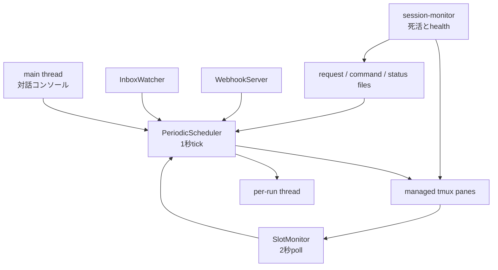
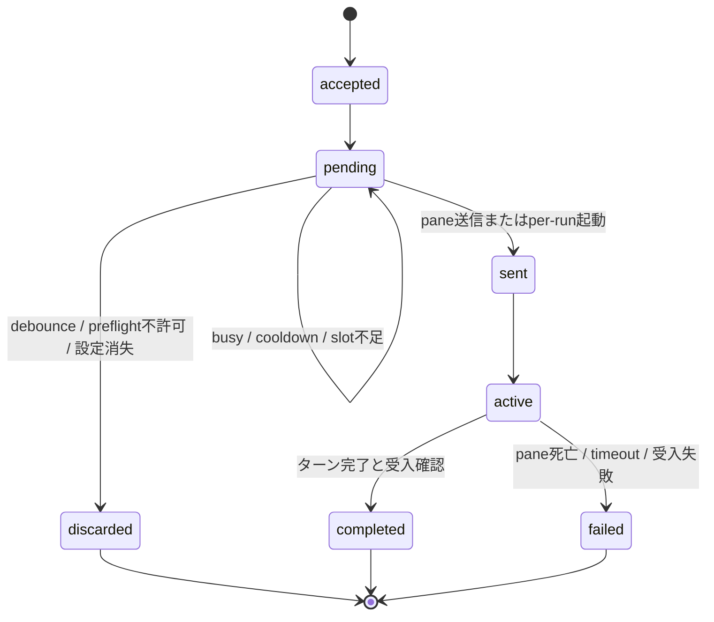
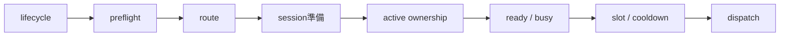
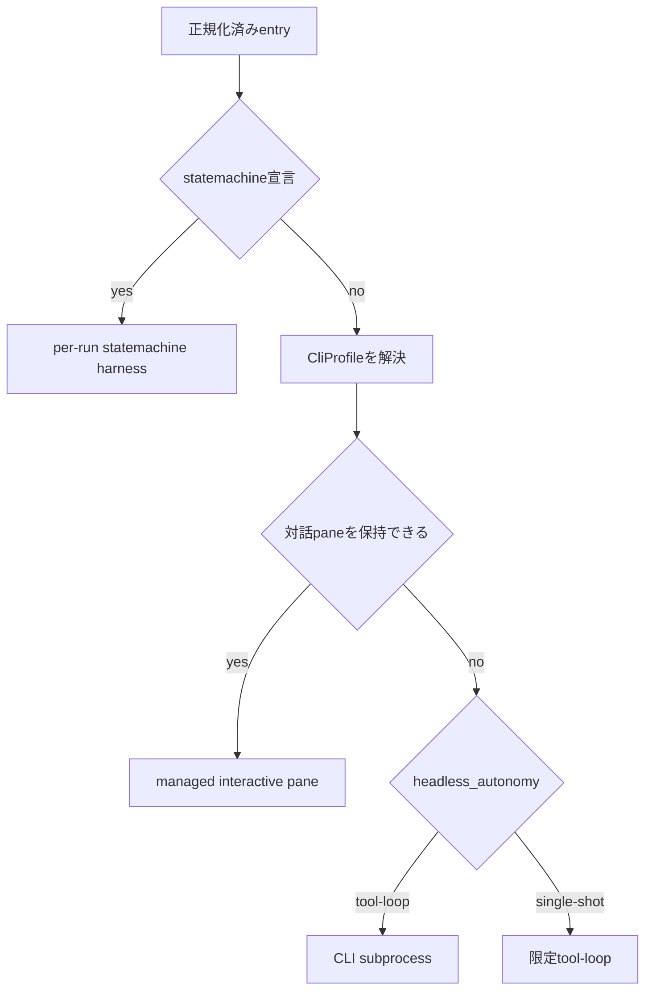
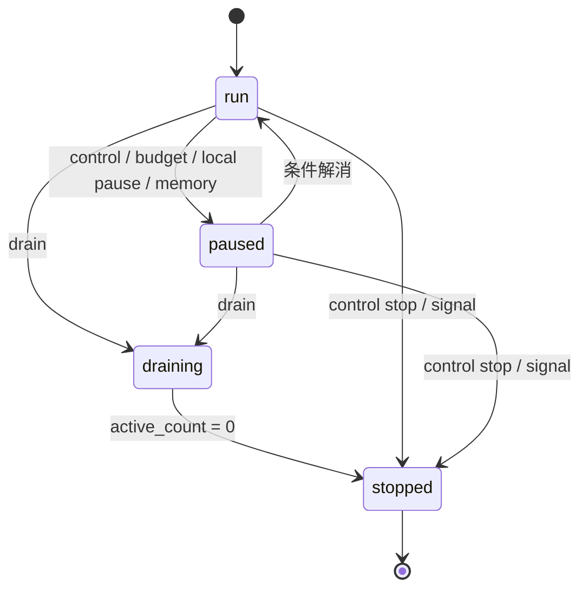

# agent-loop 設計書

> 最終更新：2026-08-29
>
> 対象実装：`tools/agent-loop/`
>
> 外部契約と設定項目：[agent-loop 仕様書](../specs/agent-loop-spec.md)
>
> 実装資料：[`tools/agent-loop/DESIGN.md`](../../tools/agent-loop/DESIGN.md)
>
> 操作方法：[`tools/agent-loop/README.md`](../../tools/agent-loop/README.md)
>
> 関連設計：[エージェント CLI プラグイン](./agent-cli-plugin-design.md) / [agent-herd](./agent-herd-design.md)

## TL;DR

agent-loop は、定期予定、フック、Webhook、inbox、CLIから届いたrequestをエージェントCLIへ配送する常駐プロセスである。requestの受付、実行枠、セッション、完了検知を一か所で管理し、入力元ごとの送信処理を持たない。

設計の軸は次の三点。

1. daemonが扱う入力を共通dispatch requestへ変換し、`PeriodicScheduler`だけが送信可否を決める。
2. エージェントCLIの実行経路は、対話ペインを保持できるか、per-runで起動するか、限定ツールループが必要かで分ける。tmuxの有無は経路判定に使わない。
3. 配送完了、ターン完了、受入確認を別の状態として扱う。CLI自身の完了通知を優先し、使えない場合だけ画面監視へ戻る。

汎用workflow engineと永続メッセージブローカーは採用しなかった。agent-loopは実行予定と配送を担当し、複雑な状態遷移はstatemachineハーネス、失われて困るイベントの再取得は送信元の冪等なpollingへ任せる。

本書はscheduler、session、hook連携を変更する開発者と、CLI定義を追加する開発者向けである。設定キー、HTTP応答、ファイル形式の全項目は仕様書を参照する。

## 1. 目的と範囲

### 1.1 目標

- daemon管理下の入力を同じ背圧と同時実行制御へ通す
- busy、cooldown、実行枠不足ではrequestを保留し、送信可能になったtickで再試行する
- CLIごとの起動方法と完了検知を定義ファイルから解決する
- 設定不備や一つのhookの故障で、稼働中の別entryを巻き込まない
- 実行結果に、誰がどの方法で完了と受入を確認したかを残す

### 1.2 非目標

- at-least-onceまたはexactly-onceの配送
- 任意のworkflowを定義する実行エンジン
- エージェントCLI本体の改造
- daemon再起動をまたぐRalphの途中再開
- verifierや限定ツールのOSレベル隔離
- external paneの起動、停止、実行枠管理

### 1.3 不変条件

1. schedule、hook、Webhook、inbox、daemon宛ての`send`は`PeriodicScheduler`のdispatch gateを通す。
2. managed requestは`SlotMonitor`のactive ownershipを一件だけ持つ。同時実行制御が有効な経路は、送信前にslotも取得する。
3. 設定とCLI定義の組合せ違反は実行前に検出する。reload失敗時は現行設定を維持する。
4. 完了通知と画面監視が同時に成立しても、最初にactive recordを取得した経路だけが完了処理を行う。

デーモン内の対話コンソールにある`send`は管理操作としてペインへ直接送る。通常のdispatch queueとsemaphoreを通らない例外なので、自動処理や外部連携には使わない。

## 2. プロセス構成

### 2.1 実行単位



一つのdaemonは一つの起動ディレクトリを担当する。同じディレクトリで生きているdaemonが見つかれば、二本目は起動しない。tmux外から起動した場合は専用sessionを作り、その中で自分を再実行する。

主なスレッドは次のとおり。

| 実行単位 | 担当 |
|---|---|
| main thread | stdinの管理コマンド、起動と終了 |
| `periodic-scheduler` | request受付、予定発火、lifecycle、dispatch |
| `slot-monitor` | native turn event、画面監視、失敗分類、slot解放 |
| `session-monitor` | 死亡paneの再起動、memoryとRSSの監視、状態投影 |
| `inbox-watcher` | inboxファイルの走査とrequest化 |
| WebhookのHTTP thread | 受信、hook呼び出し、route別dequeへの投入 |
| `headless-<id>` | per-runのsubprocessまたは限定ツールループ |

### 2.2 コンポーネント

| コンポーネント | 責務 | 持たない責務 |
|---|---|---|
| `PeriodicScheduler` | entryの予定、pending queue、lifecycle、dispatch、execution記録 | CLI画面の完了判定 |
| `SessionManager` | managed paneの生成、送信、再起動、cleanup、状態投影 | requestの優先順位 |
| `GlobalSemaphore` | 複数daemonをまたぐ実行枠とcooldown | ターン完了の判断 |
| `SlotMonitor` | active turnの所有、完了と失敗の検知、slot解放 | 新しいrequestの受付 |
| `CliProfile` | 起動argv、ready、busy、error、turn completionの定義 | entryの予定 |
| `WebhookServer` | HTTP受信、共有secret、hook起動 | provider固有のpayload解釈 |
| `InboxWatcher` | inboxファイルをrequestへ変換 | tmuxへの直接送信 |
| `agentcore.harness` | headless tool-loop、受入判定、statemachine実行 | 定期予定とsession管理 |

### 2.3 設定の適用

設定ファイルは起動時に読み、entryを副作用なしで正規化してからschedulerへ渡す。entry IDを省略した場合は、位置と名前から決定的に作る。reloadをまたいで同じentryと判定し、`next_run_at`やoneshotのprocess-local状態を引き継ぐためである。

CLIとmodelは実行時に解決する。管理面が明示した選択、entry、共通設定、CLI定義の既定値を使い、対話経路では新しい設定をsession境界で適用する。既存paneの起動指紋と新しいargv、cwd、profileが違う場合、実行を捨てず現行paneで続け、`restart_required`を状態へ出す。

設定ファイルの探索順と上書き規則は[仕様書の設定節](../specs/agent-loop-spec.md#2-設定)に定める。

## 3. 配送設計

### 3.1 共通request

すべての入力は次の内部形式へ変換する。

```text
DispatchRequest
  id           request単位の識別子
  source       schedule / hook / webhook / inbox / send / ralph
  entry_id     実行設定の参照先
  prompt       送信する本文
  cwd          作業ディレクトリ
  priority     high / normal / low
  created_at   受付時刻
  dedupe_key   entry_idとpromptのhash
  ack          入力元へ返す確定処理
  meta         execution、session、waitなどの内部情報
```

この形式は内部契約であり、設定ファイルや外部APIには公開しない。公開面を増やさず、入力元ごとの差を`source`、`ack`、`meta`へ閉じ込める。

### 3.2 入力と受付確定点

入力元によって永続性が違う。`pending`へ入ったあとの共通動作だけを揃え、受付前の保証まで同じとはみなさない。

| 入力 | requestになる場所 | 受付の確定 | daemon停止時 |
|---|---|---|---|
| schedule | schedulerの期限判定 | process内の`pending` | 次回起動後に予定から再生成 |
| pull hook | `check()`の戻り値 | process内の`pending`。`ack()`は実送信後 | hook側の未既読状態から再取得できる |
| Webhook | route別bounded deque | HTTP 202 | dequeと`pending`は失われる |
| inbox | `InboxWatcher` | 元ファイルを保持したまま`pending` | 次回のwatchで再受付。実送信後に`.processed/`へ移す |
| CLI `send` | `send-requests/`のJSON | daemonがatomic claimし、`pending`へ入れた時点 | 受付前のファイルは残る。受付後は失われることがある |

Webhook hookが`None`を返すか例外になった場合はHTTP 200を返す。500で送信元の自動retryを誘発すると、同じhook例外が短時間に繰り返されるためである。取りこぼせないイベントはpull hookを併用し、外部IDで冪等に再取得する。

### 3.3 requestの状態



`dispatch_completed`は送信が終わった時点の記録で、実行完了を意味しない。実行完了は`execution_terminal`と`send-responses/<request-id>.json`で追う。

短時間に同じentryと本文が来た場合は、3秒のdebounceで成功扱いとして捨てる。同じentryのscheduleはpendingに一件だけ残す。oneshot実行中の重複も一件だけ`overlap_pending`へ保持する。

queueはhighを先頭群へ置き、normalとlowは受付順で後ろへ積む。deferしたrequestは優先群の先頭へ戻し、そのtickを終える。空回りは防げるが、送れない先頭requestが後続を待たせるhead-of-line blockingは残る。

### 3.4 schedulerのtick

`PeriodicScheduler`は一秒ごとに次の順で処理する。

1. agent-controlとnode budgetを読み、状態を投影する。
2. 検証済みのreloadを適用し、pause、resume、cancel、drainのcommandを取り込む。
3. lifecycleを`stop > drain > control pause > budget > local pause > run`の順で判定する。
4. `run`ならCLI send、Webhook deque、期限到来のscheduleとpull hookを`pending`へ移す。
5. oneshotの事前起動を行い、pendingの先頭からdispatchを試す。
6. queue depth、active count、healthを`loop-state/<pid>.json`へ書く。

pause中は新しい予定を発火せずpendingも送らない。drain中は開始済みRalphのchildだけを処理する。

### 3.5 dispatch gate

requestは次の判定を順に通る。



preflightは15秒で打ち切る。例外とtimeoutはfail-openで送信を続ける。`send --force`はpreflightとvisual readyだけを迂回し、既存のactive ownership、slot、cleanup失敗は迂回しない。

session準備、ready、slotのいずれかが一時的に満たせない場合は`defer`とし、requestをpendingへ戻す。構造違反、存在しないentry、解決不能なexecution metadataは`discard`または`failed`で閉じる。

## 4. 実行経路

### 4.1 経路の選択



`session: per-run`を明示したentryと、対話面を持たないCLIはper-runへ送る。`statemachine`宣言も必ずper-runである。tmuxは対話CLIかどうかの判定に使わず、headlessのログを見せるためにも使える。

### 4.2 対話pane

`SessionManager`はentryごとにmanaged paneを持ち、`set-buffer`、`paste-buffer`、Enterの順で本文を送る。CLI固有の`ready_pattern`、`busy_pattern`、`idle_quiet_sec`は`CliProfile`が解決する。

既定のpersistent policyではpaneを残し、会話履歴を次回へ持ち越す。`fresh_context`はCLI定義のclear commandを本文より先に送る。`slash`は一件ずつ独立送信し、途中で失敗した場合は本文を送らない。

### 4.3 per-run

`headless_autonomy: tool-loop`のCLIはsubprocessを一度起動し、終了コードで完了を判定する。`single-shot`のCLIには`agentcore.harness.toolloop`が次の操作だけを供給する。

- 作業ディレクトリ内のファイルを読む、書く
- argv配列で許可された実行ファイルを起動する
- 最終結果を返す

shellの起動、作業ディレクトリ外への書き込み、symlink経由の逸脱は拒否する。詳細な引数と上限は[仕様書の限定ツール契約](../specs/agent-loop-spec.md#34-限定ツール契約と受入条件)に置く。

per-runは`ensure_session`、paneのready判定、`SlotMonitor`を通らない。`headless:<root-id>`という合成slotを取得し、worker threadが終了時に解放する。進行記録はheadless runのJSONLへ書き、設定されていればtmux paneまたはwindowでtailする。

### 4.4 statemachine

`statemachine` entryの解釈は`agentcore.loopentry`、実行は`agentcore.harness.statemachine`を正本とする。agent-loop、agent-herd、dashboardが同じworkflow pathと`input`を使う。

workflowが宣言するparameterとentryの`input`は実行前に照合する。`prompt`はworkflowの`input`一項目へ渡す簡略記法に限る。`input.input`と`prompt`が競合する設定は読み込みで拒否する。

statemachineは自分の`check`で遷移を確定するため、entryの`acceptance`、Ralph、oneshot、clean session、external target、slashとは併用しない。決定的検査が再投入上限に達した場合は終了コード3と`escalate: true`を返し、上位の実行段へ判断を渡す。

### 4.5 session policy

| policy | paneとslotの扱い |
|---|---|
| persistent | paneを保持し、turnごとにslotを取得して解放 |
| oneshot | 実行前にpaneを用意し、完了後に破棄。重複発火は一件へまとめる |
| clean session | N回成功したあとpaneを建て直す |
| Ralph | 同じpaneとslot leaseを反復全体で保持し、最大回数で終了 |
| sandbox | detached git worktreeを作り、終了後にmanaged paneを片付ける |
| external | 既存tmux paneへ送る。agent-loopは生成、停止、slot取得をしない |
| per-run | paneを持たず、実行ごとにsubprocessまたはharnessを起動 |

## 5. 完了と受入

### 5.1 三つの境界

| 境界 | 意味 | 主な記録 |
|---|---|---|
| 受付 | requestをpendingへ保持した | `request_accepted` |
| 配送 | CLIへ本文を渡した | `dispatch_sent`、hook `ack()`、inboxの`.processed/`移動 |
| 実行 | ターン完了と受入処理を終えた | `execution_terminal`、`send-response` |

Webhookの202と`dispatch_completed`は実行完了を表さない。外部呼び出し側が完了を待つ場合は`send --wait`または`run`の`RESULT`契約を使う。

### 5.2 ターン完了

対話paneでは、CLI定義が`interactive.turn_completion`を申告していればnative eventを先に見る。agent-loopが起動したpaneだけにprivateなhook設定を注入し、eventはinstance、pane、dispatch、generation、tokenを照合してから受理する。

native eventが使えない場合は画面を監視する。CLIごとにbusyからreadyへの復帰、readyの消失と再出現、一定時間の画面静止を使い分ける。native eventと画面監視が競合しても、`SlotMonitor`のactive recordを先に取得した側だけがcallbackする。

per-runはsubprocessの終了で完了を知る。external paneは画面監視だけを使い、native hookを注入しない。

### 5.3 失敗分類とfreeze

ターン末尾の画面はCLI定義の`errors[]`で分類する。`quota`、`auth`、`env`は失敗、`transient`は完了として上位の再投入判断へ返す。quotaはnode budgetの観測へ記帳する。

busy中に画面hashが変わらない時間が上限を超えた場合はfreezeとしてpaneを再起動する。未設定時はCLI定義のtimeout、定義にも無ければ共通値を使う。`0`を明示した場合だけ無効になる。slotの総保持時間を制限する`slot_timeout_seconds`とは別の判定である。

### 5.4 受入条件

`acceptance`は自然文の配列である。機械層は、バッククォート内のプロジェクト相対パスについて次を照合する。

1. 実行後に存在する。
2. 実行前後の指紋が違う。
3. git管理下では、statusの前後差もtouched一覧へ加える。

対話paneはdispatch直前に指紋とgit snapshotを取り、ターン完了時に`agentcore.harness.toolloop.acceptance_outcome`で照合する。headlessも同じ実装を使う。条件が欠けるかファイルが変わっていなければ`acceptance_failed`になる。

パスを含まない条件は、headlessで`acceptance_judge`を有効にした場合だけ読み取り専用の検証エージェントへ渡す。CLI定義に`verify` variantがあれば作業者と分ける。判定役の起動失敗、timeout、JSON不正、基準欠落はすべて不合格とする。対話paneではjudgeを起動できず、起動時に警告して機械層だけを使う。

`verifiedBy`は`machine`、`judge`、`machine+judge`、空文字のいずれかである。受入条件が無い実行と、パスを抽出できずjudgeも使わない実行は`verified: false`のまま完了できる。これは検証済みのdoneとして扱わない。

現実装には一つ例外がある。対話paneで指紋取得または照合処理そのものが例外になった場合、ログを残して検証なしの実行完了へ進む。通常の証拠不足はfailだが、検証器の故障はfail-openである。`acceptance_checked`が残らないので監査時に識別できるものの、仕様書のfail条件とは一致していない。修正されるまでは、この経路を強い完了保証に使わない。

## 6. 外部入力

### 6.1 pull hook

予定時刻になるとentryの各`check(config)`を独立に呼ぶ。文字列またはdictが返ればhookごとにrequestを一件作り、`None`ならそのhookは無風とする。複数hookの本文は連結しない。配送後の`ack()`もhookごとに対応させるためである。

`check()`は30秒で待機を打ち切る。Python threadは強制終了できないため、完了またはreloadまで同じhookを隔離し、threadを増やさない。hookのmoduleはmtimeで再読込する。

### 6.2 Webhook

コアが扱うのはHTTP、body上限、route、共有secret、bounded dequeだけである。イベント種別、provider固有の署名、payloadの解釈は`handle(ctx)`を持つhookへ置く。

routeはentry名から作り、requestごとに現在のentryを引き直す。reload前のroute tableを保持しない。hookが返したdictをentryのprompt templateへ注入し、未定義のplaceholderは文字列のまま残す。

route別dequeは上限を超えると最古のイベントを捨てて警告する。HTTP threadはtmux、session、semaphoreへ触れず、enqueue後すぐに202を返す。

### 6.3 inbox

inboxメッセージはファイルで受け、送信元、件名、本文、返信コマンドをpromptへ変換する。`reply_to`には返信元のmessage IDを入れ、返信先は`from`から解決する。

同じファイルがpendingまたは送信中なら再投入しない。tmuxへ送信できた時点で`.processed/`へ移し、送信前の失敗では元ファイルを残す。inboxのschemaと旧`~/.kiro/`配置は[仕様書](../specs/agent-loop-spec.md#33-inbox-メッセージ)に置く。

## 7. lifecycleと回復

### 7.1 状態



`pause`は新しいdispatchを止めるが、daemonとpaneは残す。local pauseだけは`resume`で解除できる。control、budget、memoryによるpauseは、それぞれの条件が解消するまで残る。

`drain`は新規受付を止め、開始済みRalphのchildを除くpending、Webhook deque、oneshotのoverlapを捨てる。drain開始時に同じworkspaceの未受付`send-request`も取り除く。active executionがなくなればdaemonを終了する。

`cancel`はmanaged paneとexecutionを止め、pending chainとslotを片付ける。external paneは所有していないため停止を拒否する。

### 7.2 reload

reloadは新しいentry、external pane、environment handoffを先に検証し、次のscheduler tickで一括交換する。検証に失敗した場合は現行entryとpaneを維持する。

同じIDのentryは予定時刻とoneshot状態を引き継ぐ。削除されたentryのschedule requestとWebhook queueは落とす。名前変更でroute keyが変わったWebhook queueは新しいkeyへ移す。sessionの生成と破棄は`SessionManager.sync_entries`が行う。

### 7.3 障害処理

| 事象 | 処理 |
|---|---|
| hookの例外、戻り値不正 | その発火をskipし、ほかのentryを続ける |
| hookのtimeout | そのhookを隔離し、reloadまたは完了まで再起動しない |
| Webhook bind失敗 | HTTPだけ無効にし、daemonは続ける |
| preflight例外、timeout | fail-openで送信する |
| managed pane死亡 | session-monitorが再起動する |
| pane freeze | active turnを失敗にし、paneを再起動する |
| stale slot | 起動時にPIDと時刻を検査して掃除する |
| semaphoreのfile I/O失敗 | 実行許可へ倒す。可用性を選ぶため二重実行の余地がある |
| headless process失敗 | executionをfailedにし、slotを解放する |
| 不正なreload | 現行設定を維持する |
| daemon crash | process内pending、Webhook queue、Ralph途中状態を失う |

### 7.4 終了

signalまたは対話コンソールの終了では、Webhook、InboxWatcher、scheduler、SlotMonitor、SessionManagerの順に止める。SessionManagerはmanaged paneとstate fileを片付ける。external paneには触らない。

`drain`は実行中の完了を待つ。通常のsignal終了はactive executionを永続化せず、次回起動で再開しない。

## 8. 状態ファイル

process内の正規化済みentry、`pending`、`_executions`、`_sessions`が実行時の正本である。ファイルは外部受付、複数daemonの実行枠、操作、観測に使う。

```text
~/.agents/
├── agent-loop.yaml
├── slots/
├── send-requests/
├── send-responses/
├── loop-commands/<pid>/
├── loop-control/
├── loop-adaptive/
├── loop-hooks/<instance-id>/
├── loop-state/<pid>.json
└── runs/headless/

~/.kiro/
└── agents/<agent-name>/inbox/
```

`~/.kiro/agents/`は旧kiro-loopとの稼働互換のために残した配置である。移設する場合は、受信daemonとinbox送信側を同じ停止点で切り替える必要がある。

各ファイルの形式と保持期間は[仕様書のファイル一覧](../specs/agent-loop-spec.md#付録-ファイルとディレクトリ)を参照する。ただし同付録のslotパスは旧記述で、現行実装は`~/.agents/slots/`を使う。

## 9. 実装上の境界

### 9.1 fragment合成

`agent_loop/__init__.py`は、`_head`から`cli`までのfragmentを依存順に一つの共有`globals()`へ`exec`して合成する。各fragmentは通常のPython submoduleとして独立importする前提を持たない。

fragmentの並び替え、分離、名前変更では、共有名前空間へ現れる順序とテストのpatch先が変わる。外から使う機能はCLIか明示した共有契約を入口にする。

### 9.2 agentcoreとの境界

次の処理はagent-loop内へ複製しない。

| 処理 | 正本 |
|---|---|
| CLI定義とargv、error分類 | `agentcore.agentcli` |
| single-shotの限定ツールループと受入判定 | `agentcore.harness.toolloop` |
| statemachine実行 | `agentcore.harness.statemachine` |
| entryの`statemachine`と`input`解釈 | `agentcore.loopentry` |

`toolloop.py`と`statemachine.py`は委譲層で、共有関数をagent-loopのglobalsへ張り直さない。張り直すとテストのpatchが成功したように見えて実体に届かないため、呼び出し側はmodule経由で参照する。

### 9.3 変更時の検査

- 新しい入力経路は`make_dispatch_request`から`_accept_request`へ合流させる
- requestを永続化する場合は、受付、配送、実行のどこを確定点にするか決める
- 新しいsession policyはslot leaseの取得者と解放者を一つにする
- CLI完了通知を追加する場合は、token、generation、pane ownershipを検査する
- entry項目を追加する場合は、起動時validation、reload時の引継ぎ、設定例、仕様書を同時に更新する
- 受入判定を変更する場合は`agentcore.harness`側から直し、interactiveとheadlessの両方を検査する
- dashboardのstatemachine起動条件を変える場合は`agentcore.loopentry`との一致を確認する

## 10. 現在の制約

- 配送はat-most-onceで、Webhookとprocess内pendingはdaemon再起動で失われる
- 対話paneでは`acceptance_judge`が動かず、ファイル証拠の機械層だけになる
- 対話paneの証拠取得処理が例外になった場合はfail-openになる
- Ralphはdaemon再起動後に再開せず、dirty sandboxを自動削除しない
- external paneはGlobalSemaphoreの対象外で、agent-loopから停止できない
- adaptive intervalは送信結果に基づくheuristicだけを使い、hookから次回時刻を指定できない
- `low` priorityは独立した実行群を持たず、normalと同じ受付列に並ぶ

## 付録 A. ADR

### ADR-001：配送判定をPeriodicSchedulerへ集約する

状態：採用

判断：daemon管理下の入力を共通dispatch requestへ変換し、lifecycle、preflight、session、ready、slotの判定を`PeriodicScheduler`だけで行う。

文脈：入力元が個別にtmuxとsemaphoreへ触ると、busy時の消失、二重slot、完了監視の抜けが経路ごとに発生する。

見送った案：入力元ごとに送信処理を強化する案と、全体を汎用workflow engineへ作り替える案。

代償：schedulerが配送の要所になる。先頭requestのdeferで一tickを終えるため、head-of-line blockingも起こりうる。

見直し条件：一つのpending列が実運用でentry間の飢餓を起こし、entry別queueでも同じ所有規則を保てる場合。

確信度：高

### ADR-002：配送保証をat-most-onceに留める

状態：採用

判断：schedulerのpendingとWebhook queueはprocess内に置き、daemon crash後の自動再送を行わない。永続性が必要な入力はpull hookまたはinboxで再取得する。

文脈：agent-loopのpromptは副作用を持ちうる。receiptと冪等keyを持たないまま自動再送すると、重複実行を確定できない。

見送った案：全入力を永続queueへ保存して起動時に再送する案と、外部brokerを必須にする案。

代償：Webhookの202後やCLI sendのprocess内受付後にdaemonが落ちるとrequestを失う。送信元が必要な保証を選ぶ必要がある。

見直し条件：全実行に外部冪等keyと完了receiptを必須化できる場合。

確信度：高

### ADR-003：provider固有処理をhookへ置く

状態：採用

判断：pullは`check()`と`ack()`、pushは`handle(ctx)`をhook契約とし、GitLabやGitHubのevent種別、署名、payload解釈をコアへ入れない。

文脈：providerごとにheader、署名方式、payloadが違う。コアへ分岐を足すとHTTP受信と業務判定が同じ変更単位になる。

見送った案：provider別receiverをコアに持つ案と、push hookが完成promptを返す案。

代償：hook作者が署名検証を実装する。pushではpayloadの解釈とprompt templateが別ファイルになる。

見直し条件：複数hookで同じ署名処理の不整合が繰り返され、共有provider libraryが必要になった場合。

確信度：高

### ADR-004：CLIの能力とsession policyで実行経路を選ぶ

状態：採用

判断：対話面を持つCLIはmanaged pane、headless tool-loopはsubprocess、single-shotは限定ツールハーネス、statemachineは専用ハーネスへ送る。

文脈：対話CLIが自分で持つ探索と編集のloopを、single-shot CLIは持たない。同じ一回送信として扱うと、後者はファイルを触らず終了する。

見送った案：すべてのCLIを対話paneへ入れる案と、既存の対話運用をすべてper-runへ移す案。

代償：実行経路と完了検知が複数になる。組合せ違反をentry validationで止め、受入判定は共有実装へ寄せる必要がある。

見直し条件：CLI定義が共通のtool protocolと完了receiptを提供し、対話とheadlessの差をadapterだけで吸収できる場合。

確信度：高

### ADR-005：ターン完了と受入確認を分離する

状態：採用

判断：native turn eventまたは画面監視でターン終了を検知したあと、受入条件の証拠を別に照合してexecutionを確定する。

文脈：paneがreadyへ戻ったことは、CLIが入力待ちになった事実しか表さない。成果物が作られたか、今回変更されたかは別の検査が要る。

見送った案：ready復帰だけで成功とする案、作業したモデルの自己申告を採用する案、全実行で検証エージェントを必須にする案。

代償：interactiveでは報告本文を安定して取得できずjudgeが使えない。ファイル指紋を取れない例外時のfail-openも残っている。

見直し条件：対話paneが構造化`RESULT`を返し、報告本文とreceiptを安定して取得できる場合。

確信度：中

## 付録 B. 採用しない設計

| 案 | 採用しない理由 |
|---|---|
| 入力元のthreadがtmuxへ直接送る | session ownershipとslot管理が入力経路ごとに分裂する |
| Webhook hookの例外をHTTP 500にする | 送信元の自動retryが同じ失敗を短時間に繰り返す |
| 複数pull hookの本文を一つに連結する | `ack()`の対象を個別に確定できない |
| LLMに次回intervalを決めさせる | 負荷削減のための判断自体がAPI負荷と費用を生む |
| free textからstatemachineとinputを推測する | 文言変更で別workflowを起動しても実行前に検知できない |
| external paneをcancel時に停止する | agent-loopが起動していないprocessを所有したことになる |
