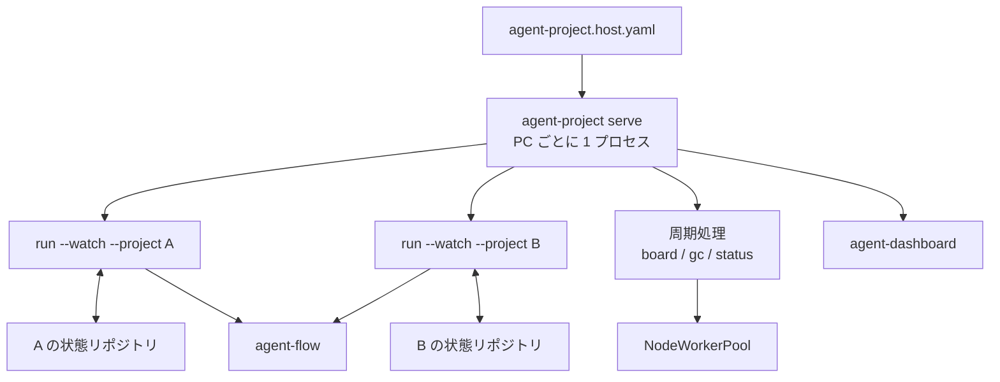
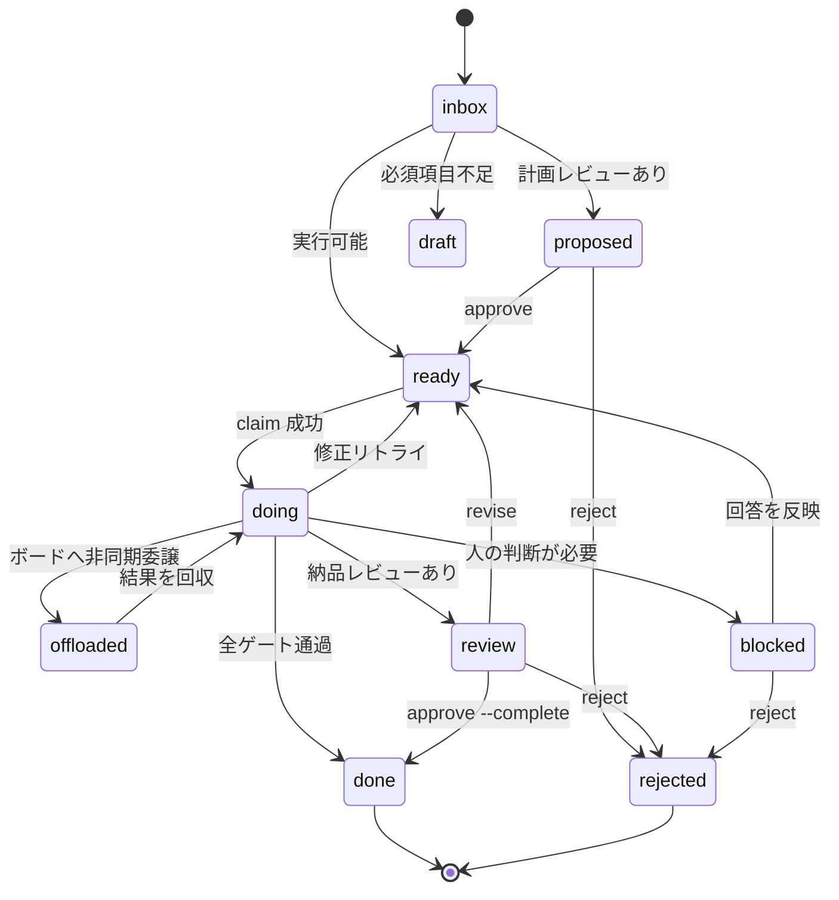
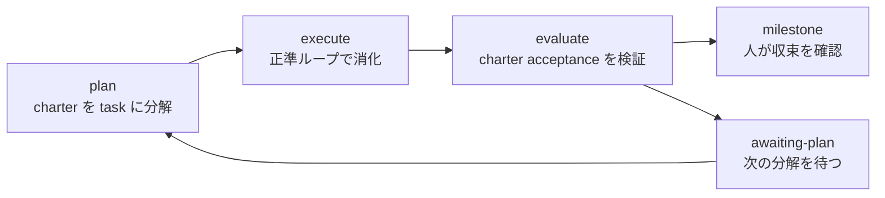

# agent-project 設計書

> 最終更新：2026-08-29
>
> 対象実装：`tools/agent-project/`
>
> 外部契約と設定項目：[agent-project 仕様書](../specs/agent-project-spec.md)
>
> 操作方法：[`README.md`](../../tools/agent-project/README.md) / [`GUIDE.md`](../../tools/agent-project/GUIDE.md)
>
> 関連設計：[agent-flow](./agent-flow-design.md) / [codd-gate](./codd-gate-design.md)

## TL;DR

agent-project は、生成済みバックログを無人で消化する制御層である。タスクを選び、agent-flow に実行を頼み、検証結果を確かめて状態を更新する。常駐プロセスは PC ごとに 1 本だけ動き、各プロジェクトのループを子プロセスとして監督する。

設計の軸は三つある。

1. `done` の根拠は、対象 revision と検証計画に一致する receipt の PASS とする。人が検証を省略する `force-complete` は例外として記録し、通常完了と区別する。
2. タスク、判断、納品記録は状態専用の git リポジトリにファイルとして置く。複数 PC の実行権は fast-forward push を CAS として調停する。
3. agent-project は実行エンジンを持たない。分解、並列実行、成果物の commit と push、成果環境での検証は agent-flow に委譲する。

中央のタスク DB は採用しなかった。状態ディレクトリを clone すれば再開できる性質と、常時稼働サーバを置かない運用を優先したためである。

本書は、常駐体や状態遷移を変更する開発者、agent-flow・agent-dashboard との連携を実装する開発者、複数 PC 運用を設計する人を対象とする。設定キー、ファイル形式、CLI の全項目は仕様書を参照する。

## 1. 目的と範囲

### 1.1 目標

- 生成済みバックログを、空になるか予算に達するまで無人で消化する
- 完了の根拠を receipt、revision、実行証跡から追えるようにする
- 同じ状態リポジトリを複数 PC で共有しても、実行結果を二重に確定しない
- 日次停止や一時的なネットワーク断のあとに、残った状態から再開する
- 人に返すのは、方針、受入、例外処理など機械で確定できない判断に限る

### 1.2 非目標

- 人の ToDo を管理する汎用タスク管理
- タスク内の作業分解やワーカーの並列実行
- 秒単位のリアルタイム処理
- 複数プロジェクトを束ねた UI
- verifier のサンドボックスや許可コマンドの管理
- GitHub、GitLab 以外のフォージへの書き込み
- イベント台帳、ノード間の予算合算、charter の自動再分解
- タイトル類似度によるタスク同一性の判定

### 1.3 不変条件

1. 機械処理は、検算済み receipt の PASS なしに `done` を作らない。`force-complete` は理由とともに別経路で記録する。
2. すべての実行ループに停止条件を置く。`--watch` の待機中はエージェントを起動しない。
3. 人が確定した policy、承認、却下は、生成された提案や設定の既定値より優先する。
4. 状態変更と調停は決定的な処理に閉じ、判断を要する処理は planner、agent-flow、verifier に渡す。

## 2. システム構成

### 2.1 プロセス構成



`agent-project serve` はホスト設定を読み、宣言されたプロジェクトごとに `run --watch --project <name>` を起動する。プロジェクトループが落ちた場合は指数バックオフで再起動し、短時間に停止を繰り返す子だけを隔離する。計画停止は障害回数に含めない。

周期処理は親プロセスの scheduler が持つ。各 tick は single-flight で、ある tick の例外はほかの tick を止めない。周期を超えうる処理は tick 内で実行せず、`NodeWorkerPool` に渡す。プールは PC 全体の同時実行数を制限し、別プロセスで動く one-shot 実行も状態ファイルから数える。

`agent-project worker` は別系統の常駐体ではない。プロジェクトを宣言しない `serve` として動き、委譲ボードの仕事だけを引き受ける。

### 2.2 設定の境界

設定は、PC に属するものとプロジェクトで共有するものに分ける。

| 設定 | 置き場所 | 主な内容 |
|---|---|---|
| ホスト宣言 | `~/.agents/agent-project.host.yaml` | `node_id`、担当プロジェクト、ローカル clone、稼働時間、PC 全体の同時実行数、入札能力 |
| プロジェクト設定 | 状態リポジトリの `agent-project.yaml` | 対象リポジトリ、実行方針、検証、予算、レビュー方式 |

解決順は `CLI > ホスト内のプロジェクト上書き > ホスト既定値 > プロジェクト設定 > 組み込み既定値` とする。実行中は解決済みの `Config` だけを参照し、各コンポーネントが設定ファイルを読み直すことはしない。

ホスト設定のトップレベルにある未知項目は警告に留める。一台の古い設定が常駐体全体を止めないためである。一方、状態リポジトリを成果物リポジトリの内側へ置くなど、責務境界を壊す設定は起動時に拒否する。

### 2.3 コンポーネント境界

| コンポーネント | 責務 | 持たない責務 |
|---|---|---|
| resident | 子プロセス監督、周期処理、PC 全体の実行枠、停止処理、ホスト状態の公開 | タスクの選択、タスク結果の確定 |
| project loop | 取り込み、優先順位、claim、実行依頼、検証、状態遷移 | タスク内部の分解と実装 |
| state / stategit | 状態ファイルの読み書き、git 同期、競合時の投影更新 | 実行権の意味付け |
| coordination | controller、割当、分散 claim、fencing | 成果物の作成 |
| agent-flow adapter | Execution Envelope と検証計画の受け渡し、run の監視 | agent-flow の内部状態の直接変更 |
| verifier | receipt の検算、回帰テスト、保護パス、進捗の判定 | 自然文基準のローカル判定 |
| needs / decisions | 人への依頼の投影、回答の取り込み、判断履歴 | UI 固有の状態 |
| charter / planner | charter の分解、達成度評価、milestone | backlog の無断再生成 |
| dashboard | 状態の表示、コマンドファイルの投入 | 状態ファイルの直接更新、フォージへの書き込み |

## 3. 状態設計

### 3.1 正本と投影

同じ情報を複数のファイルへ書く場合、どちらを正本とするかを固定する。

| 情報 | 正本 | 投影または補助状態 |
|---|---|---|
| タスクの内容と状態 | `backlog/<id>.md` | `needs/<id>.md`、dashboard 表示 |
| 完了したタスク | `archive/<id>.md` | `DELIVERY.md` |
| 人の判断 | `decisions/<id>.md` | `needs/` の解消状態 |
| ホスト内の実行中 claim | `claims/<id>.lock` | なし。ほかの PC へ同期しない |
| 複数 PC の実行権 | origin 上の task と fencing token | ローカル task、controller lease |
| agent-flow の実行 | agent-flow の run 状態 | task の `flow_run_id`、`flow-archive/` |
| 常駐体の生存 | 実行中プロセス | `status.json`、`status/<node>.json` |
| charter の収束 | `project.json` と milestone | dashboard 表示 |

`decisions/<id>.md` は追記型とする。過去の決定を書き換えず、新しい判断を追加する。繰り返し使える判断は learn として記録し、条件を満たすものだけを `rules.md` や長期記憶へ昇格する。誤適用が続く learn は無効化できる。

### 3.2 タスク状態



タスク ID はファイル名であり、`backlog/<id>.md` の改名では変更しない。`ready` から `doing` へ進める操作だけが実行権を取得する。非同期委譲では依頼元が論理 claim を保持したまま `offloaded` へ移し、結果を回収してから通常の検証へ戻す。

`needs/<id>.md` は task の状態から作る投影である。`proposed`、`blocked`、`review` のうち、人の操作を待つものを見せる。各パスで task と needs を相互に照合し、すでに `decisions/` に回答がある依頼を作り直さない。

状態、コマンド、各ファイルの必須項目は[仕様書](../specs/agent-project-spec.md)に定める。本書の図は遷移の責務を示すもので、CLI 契約の代わりではない。

### 3.3 状態リポジトリ

一つのプロジェクトは、一つの状態ディレクトリと一つの project loop に対応する。状態ディレクトリ自体を専用 git リポジトリとして clone し、その root で commit、fetch、push する。

```text
<state-root>/
├── agent-project.yaml
├── backlog/
├── needs/
├── decisions/
├── archive/
├── claims/          # ホスト内だけで使用
├── status/
├── coordination/
├── flow-archive/    # agent-flow 状態から作る派生物
├── DELIVERY.md
├── policy.md
├── rules.md
└── project.json
```

`claims/` と `flow-archive/` は同期しない。前者はその PC のプロセスにしか意味がなく、後者は agent-flow の状態から再作成できるためである。完全な配置と同期規則は[仕様書の状態リポジトリ節](../specs/agent-project-spec.md#37-状態リポジトリのレイアウトと同期)を参照する。

管理用 clone を root 配下へ隠す方式は使わない。過去の `.state-git` 方式では、通常の書き込みと管理 clone の除外規則がずれ、追跡済みだが commit されない状態が残った。現在は状態 root の git だけを同期路とする。

## 4. 正準ループ

### 4.1 起動と停止要求

`serve` と `run --watch` は、状態同期や子プロセス起動より先に SIGTERM と SIGINT のハンドラを設定する。起動バナーは、以後の停止要求を graceful shutdown へ変換できる観測点である。

`serve` の停止順は次のとおり。

1. scheduler に新しい tick を始めさせない。
2. project loop に新しい claim を止めさせる。
3. 実行中の子へ猶予を与え、残った子を終了する。
4. ボードへ `away` を通知する。
5. 状態リポジトリを最後に同期する。

### 4.2 一回のパス

`run_loop` は次の順序で一回のパスを処理する。

| 段階 | 処理 | 主な出力 |
|---|---|---|
| S7 | 残り予算、コスト、実行枠を確認 | 実行可否、停止理由 |
| S0 | needs、command、inbox、外部結果を取り込む | 更新済み task、decision |
| S1 | policy と依存関係を適用し、候補を選んで claim する | `doing` task、claim |
| S2 | agent-flow をローカル起動するか、ボードへ委譲する | run ID または offload ID |
| S3 | receipt、回帰、保護パス、進捗を検査する | gate 結果 |
| S4 | `done`、`review`、再試行、`blocked` のいずれかへ確定する | task と archive |
| S5 | learn、裁定結果、needs を更新する | decision、rule 候補 |
| S6 | 必要な follow-up task を作る | 新しい backlog |

パスの前後で状態リポジトリを同期する。複数 PC 調停が有効なら、controller の取得または更新もここで行う。各段階は同じパス内で無制限にやり直さず、再試行は次のパスへ送る。

### 4.3 選択と claim

候補は policy、優先順位、依存関係、レポート専用モードを適用して絞る。選択と実行権の取得は分け、claim に失敗した候補は実行しない。

単一 PC でも `claims/<id>.lock` を `O_CREAT | O_EXCL` で作り、同じホストの二重起動を防ぐ。claim の延長はファイル本文を書き直さず mtime を更新する。更新前に owner、PID、task ID が同じことを確かめ、別プロセスの claim を延命しない。

### 4.4 agent-flow との境界

agent-project が agent-flow へ渡すものは次のとおり。

- task ID、対象リポジトリ、開始 revision、書き込み先
- スコープ、保護パス、候補権限を凍結した Execution Envelope
- 自然文の受入基準と既知の固定コマンドを正規化した `verification_plan`
- plan digest、契約版、予算と停止条件

agent-flow は成果 revision、実行状態、検証 receipt を返す。両者は別プロセスとして動き、agent-project から `agent_flow` パッケージを import しない。digest の計算、receipt の形式、revision の照合は共有ライブラリ `agentcore.verifycontract` を使う。

agent-flow の run が中断した場合、計画と開始点が変わっていなければ `resume-run` で完了済みノードを残して再開する。target が進んだ、統合に失敗した、計画を変える必要がある場合は、古い run を再開せず `revise` で新しい run を作る。

### 4.5 検証ゲート

利用者は自然文の受入基準を書き、確認方法が決まっている場合だけ固定コマンドを添える。agent-project はそれを検証計画へ変換し、agent-flow が成果環境で実行する。

返された receipt は次の順に検算する。

1. receipt の契約版と plan digest が一致する。
2. 検証した revision が成果 revision と一致する。
3. 書き込み workspace の場合、検証時の target が現在の target に含まれ、成果 revision が target へ統合済みである。
4. 固定コマンドがすべて終了コード 0 である。
5. 自然文の各基準に verdict と証拠がある。

receipt を採用したあとも、次のゲートを順に通す。

1. プロジェクト共通の `regression_cmd`
2. protected path の変更検査
3. 差分または進捗が存在することの検査
4. review policy と納品方式の適用

receipt が欠ける、digest が違う、dry-run や stub の結果しかない場合、固定コマンドだけは agent-project の local runner で一度実行できる。local runner は自然文基準を判定せず `inconclusive` とする。

### 4.6 検証後の確定

| 結果 | 状態更新 |
|---|---|
| 有効な PASS かつ全ゲート通過 | `done`。納品レビューが必要なら先に `review` |
| 修正可能な FAIL | 内容修正の再試行。上限後は `blocked` |
| 検証材料がない | 再試行で消費せず `review` または `blocked` |
| `inconclusive` または環境要因 | 外部検証へ委譲。決着しなければ `blocked` |
| flaky と判定 | 自動再試行を止めて隔離し、人へ返す |

`force-complete` はこの表の外にある管理操作である。理由を必須とし、検証も自動統合も行わない。archive、`DELIVERY.md`、decision に `FORCED` を残すため、通常の `done` と監査時に区別できる。

### 4.7 待機と停止

one-shot の `run` は、バックログ消化、予算、コスト上限、throttle、インフラ障害、`--once`、レポート専用などの理由で終了する。停止理由は run log と status に残す。

`run --watch` は、実行できる仕事がなくてもプロセスを残す。待機中はファイル変更、command、外部結果、次の許可時刻だけを監視し、エージェントや verifier を起動しない。

## 5. 人との往復

### 5.1 needs を作る条件

人へ依頼する前に、次の順で自動解決を試す。

1. 条件が一致する learn を決定的に適用する。
2. adjudication により、人の価値判断が本当に必要かを判定する。
3. 解決できない場合だけ `needs/<id>.md` を作る。

人は CLI または dashboard から回答する。dashboard の操作は command ファイルを投入するだけで、task や decision を直接書き換えない。project loop が同じコマンド処理を通して状態を確定する。

### 5.2 実行前レビュー

計画レビューが有効なタスクは `proposed` で入る。この時点で Execution Envelope を作り、対象リポジトリ、変更範囲、受入基準、検証計画、候補権限、外部実行の制約、再計画条件を記録する。

`approve` は Envelope を承認版として再構築してから task を `ready` にする。先に `ready` へ移すと、実行開始と Envelope 作成が競合し、承認した内容と実行契約がずれるためである。

### 5.3 delete、reject、force-complete

三つの操作は意味が異なる。

| 操作 | 意味 | 再提案 | 記録 |
|---|---|---|---|
| `delete` | 下書きや不要なファイルを物理削除する | planner が再作成できる | 原則として残さない |
| `reject` | この提案を採らないと正式に決める | tombstone により同一題の再作成を抑止 | archive、decision、tombstone |
| `force-complete` | 検証なしで完了扱いにする | 対象外 | `FORCED` と理由を archive、delivery、decision に残す |

### 5.4 納品レビューとフォージ

MR または PR は自動作成しない。人が `mr-create` を実行した場合だけ、フォージのトークンを持つ resident が作成する。worker や dashboard に書き込みトークンを配らない。

フォージ上の state は参考情報であり、統合済みかどうかの正本ではない。完了判定は、検証済み revision が target の祖先になっているかで行う。フォージへ到達できない場合は、未マージや却下と推測せず決着を保留する。

却下時に作業ブランチを削除する場合は、`rejected/<task-id>` タグへ退避して push できたことを確かめる。作業結果の参照を失う削除は行わない。

## 6. charter からのプロジェクト運転

状態 root に `charter.md` があるプロジェクトは、次のサイクルを持つ。



plan は CLI または dashboard から明示された場合だけ実行する。backlog が空になった、charter が変わった、acceptance が未達だった、という理由だけでは再分解しない。人が削除または整理した task を次のパスが復活させないためである。

planner には charter、`rules.md`、対象リポジトリの repo map、現行 task、tombstone を渡す。出力には why、作業概要、受入基準、規模を必須とし、欠落があれば一度だけ補完を求める。補完後も不足する task は捨てず、`draft` または `proposed` として人へ見せる。

人が編集した task には `edited: human` を付け、再分解で上書きしない。生成時の `planned_title` を残すため、人が改題したあとに元の題が新規 task として復活することも防げる。`reject` された task は正規化タイトルの完全一致で再提案を止める。言い換えや粒度変更をスコアで同一視する処理は持たず、planner に既存 task と却下理由を見せて判断させる。

charter の acceptance も task と同じ plan / receipt 契約で検証する。PASS は milestone の候補を作る条件であり、プロジェクトの終了は人が確認する。サイクル数、費用、停滞回数には上限を設ける。

## 7. 複数 PC の調停

### 7.1 有効化条件

coordination は、状態リポジトリに origin があり、別ノードの新しい status が観測できた場合だけ有効にする。単一 PC では remote CAS や controller 取得を通らない。

### 7.2 controller と割当

controller は `coordination/controller.json` のリースを持ち、全体の割当を進める。取得と更新は、remote HEAD から一時 tree を作り、commit を fast-forward push できたかで確定する。

controller は、未割当の `ready` task を生存ノードへ配る。負荷は `ready + doing` の件数で比較し、最小のノードを選ぶ。同数の場合の順序を固定し、どの controller が計算しても同じ割当になるようにする。

### 7.3 分散 claim と fencing

分散 claim は remote 上の task を `ready` から `doing` へ移し、`owner`、`token`、`generation` を書く。この三つ組が実行権の fencing token になる。ローカル claim は同じ PC の二重起動を防ぎ、分散 claim は PC 間の二重確定を防ぐ。

結果を確定する直前に remote を読み、fencing token を照合する。

| 判定 | 条件 | 処理 |
|---|---|---|
| `ok` | owner、token、generation がすべて一致 | 結果を採用して settle を試す |
| `lost` | 別 owner または別 generation に確定済み | ローカル結果を採用せず remote へ合わせる |
| `unknown` | remote に到達できず判定不能 | 採用も破棄もせず隔離し、一度再確認して人へ返す |

リース失効は CAS を試してよい条件にすぎず、実行権の移転そのものではない。新しい owner が CAS に成功して初めて権利が移る。

### 7.4 非同期委譲

ボードへ実装を委譲するときは、依頼元が project task の claim を保持し、task を `offloaded` にする。受託ノードの結果を回収したあと、依頼元が receipt と fencing を検査して settle する。

検証だけを外部ノードへ頼む場合は、成果物を変更しないため project task の claim を渡さない。外部 receipt も、内蔵 verifier と同じ契約版、digest、revision、証拠の検算を通す。run が成功終端でも receipt がなければ PASS とみなさない。

プロジェクトを持たない worker PC は、PC ごとに一つの node-direct bus から仕事を受ける。プロジェクトを持つ PC では project bus がすでに受け口になるため、node-direct の自動取り込みを重ねない。

### 7.5 停止と node_id

予定停止では新しい claim を止め、実行中の仕事を drain し、ボードへ `away` を通知してから終了する。突然停止した場合は controller と claim のリース失効後に別ノードが CAS を試す。

`node_id` の解決順は、ホスト設定、環境変数、hostname とする。どの経路でも一度だけ正規化する。agent-flow や agent-amigos に明示された既存 ID は黙って書き換えず、doctor が差異を報告する。切り替えは claim、bid、status が残っていない静止点で行う。手順は[node-id cutover ガイド](../guides/node-id-cutover.md)に定める。

## 8. 失敗と回復

| 失敗 | 検知 | 回復 |
|---|---|---|
| project loop の異常終了 | 親が子の終了コードを観測 | 指数バックオフで再起動。反復時はその子だけ隔離 |
| project loop のハング | supervisor の heartbeat 監視 | 子を停止して再起動 |
| resident のハング | self-watchdog | 起動系に再起動を任せる |
| agent-flow の lease 失効 | run 状態を `alive / expired / terminal / unknown` に分類 | 瞬間的な失効を待ち、計画不変なら resume |
| 状態 push の競合 | fast-forward push の失敗 | remote を読み直し、変更関数を再適用 |
| settle 中のネットワーク断 | fencing が `unknown` | 結果を保持して再確認し、決着しなければ人へ返す |
| receipt 不正または欠落 | digest、revision、証拠の検算 | 固定コマンドだけ一度再実行。残りは外部検証または人へ返す |
| 回帰失敗 | `regression_cmd` の非 0 | 内容修正の再試行。上限後は人へ返す |
| planner 出力不足 | 必須節の構造検査 | 一度だけ補完を依頼し、残れば draft として保存 |
| フォージ到達不能 | API エラー、認証エラー | merge や reject を推測せず保留 |

状態更新の途中でローカル commit だけが残った場合、次のパスは remote と archive を読み、すでに確定した事実を消さずに不足する投影を作り直す。archive に納品記録があるのに backlog が実行中のままなら、archive を巻き戻さず settle の残りを再実行する。

## 9. 実装上の境界

### 9.1 モジュール配置

`agent_project/resident/` は通常の Python パッケージで、scheduler、supervisor、worker、status、gc を個別に import できる。

それ以外の本体は、`agent_project/__init__.py` が fragment を決められた順に共有名前空間へ `exec` して合成する。fragment 同士を通常のサブモジュールとして import する前提は置けない。外部から使う機能は CLI または明示した契約を入口とする。

この構成を変更するまでは、fragment の並び替え、削除、名前変更を単独のリファクタリングとして扱わない。共有名前空間に現れる順序と、CLI からの到達性を構造テストで確認する。

### 9.2 変更時に守る検査

- 設定キーは、既定値、`Config`、実際の読み手まで到達することを確認する
- resident の tick や旧 daemon loop を削るときは、そこからしか呼ばれない処理を列挙する
- verification plan と receipt の変更は、agent-project と agent-flow で共有する契約実装から始める
- 状態ファイルを追加するときは、正本か投影か、git 同期の対象か、競合時にどちらを採るかを決める
- dashboard の操作を追加するときは、既存 CLI と同じ command 処理へ合流させる
- フォージへの書き込みを追加するときは resident に閉じ、worker と dashboard へ token を渡さない

## 付録 A. ADR

### ADR-001：完了判定を検算済み receipt に限定する

状態：採用

判断：task と charter の完了候補は、plan digest、成果 revision、verdict、証拠を検算できる receipt の PASS から作る。`force-complete` は監査可能な例外として別に扱う。

文脈：実行したエージェントの自己申告や、別環境で偶然通ったコマンドでは、どの成果を何で確かめたかを再現できない。

見送った案：LLM の合否文を採用する案、人に毎回検証コマンドを書かせる案、自然文から固定コマンドを一度だけ生成する案。

代償：自然文基準の検証には verifier の費用がかかる。verifier の副作用禁止はサンドボックスで強制せず、receipt の証拠を事後検査するため、隔離が必要な用途には適さない。

見直し条件：副作用を許容できない環境を正式サポートする場合、または決定的 verifier で自然文基準を十分に扱える場合。

確信度：高

### ADR-002：状態 root を専用 git リポジトリにする

状態：採用

判断：task、needs、decision、archive を状態 root 直下に置き、root 自身の git で同期する。

文脈：運用対象は、常時起動しない複数の PC である。状態一式を clone、退避、監査できることを優先する。

見送った案：中央 DB、成果物リポジトリ内の状態 worktree、root 配下の `.state-git` 管理 clone。

代償：同期のたびに git のネットワーク往復が発生する。追跡対象の変更は全 PC に影響するため、除外規則の移行には静止点が必要になる。

見直し条件：git の競合率や状態量が、通常運用で許容できない水準になった場合。

確信度：高

### ADR-003：PC ごとに一つの resident が project loop を監督する

状態：採用

判断：`serve` を PC 唯一の常駐体とし、各プロジェクトの `run --watch` を子プロセスにする。

文脈：ツールごとに daemon を持つ構成では、設定、生存監視、更新、停止手順が重複した。一つのプロセスへ全プロジェクトを詰めると、障害の影響範囲が PC 全体になる。

見送った案：agent-project、agent-flow、agent-amigos が別々に常駐する構成と、全処理を一プロセスで動かす構成。

代償：親の scheduler と supervisor が PC 全体の要所になる。長時間処理を tick から分離し、self-watchdog と外部の起動系が必要になる。

見直し条件：project loop のプロセス分離コストが支配的になるか、OS の service manager だけで同等の監督を簡潔に実現できる場合。

確信度：高

### ADR-004：git の fast-forward push を分散 CAS に使う

状態：採用

判断：controller、割当、分散 claim、settle は remote HEAD から作った commit の fast-forward push で確定し、owner、token、generation を fencing token にする。

文脈：常時稼働の調停サーバを置かず、全 PC が停止する時間帯を許容する必要がある。

見送った案：中央ロックサービス、mtime と hostname だけを使うリース、最後に push したノードを勝者とみなす方式。

代償：調停ごとに remote 往復があり、回線断では `unknown` が生じる。`unknown` を自動採用も自動破棄もできないため、人へ返る場合がある。

見直し条件：競合と回線断による隔離が日常的に発生する場合、または低運用コストの共有 CAS サービスを標準で利用できる場合。

確信度：中

### ADR-005：実行を agent-flow へプロセス境界で委譲する

状態：採用

判断：agent-project は task、workspace、Execution Envelope、検証計画を決める。agent-flow は作業分解、並列実行、commit、push、成果環境の検証を担当する。連携は版付き plan / receipt 契約で行う。

文脈：バックログ制御と実行グラフを同じ層に置くと、優先順位や人との往復の変更がワーカー実装へ波及する。

見送った案：agent-project に実行エンジンを再実装する案と、agent-project を状態を持たない agent-flow ラッパにする案。

代償：別 venv、別バージョンをまたぐ契約管理が必要になる。run の失踪、再開、target の進行を明示的に扱わなければならない。

見直し条件：両ツールを独立配布する必要がなくなり、境界を保つ費用が実装重複を上回る場合。

確信度：高

## 付録 B. 採用しない設計

| 案 | 採用しない理由 |
|---|---|
| すべての出来事を一つのイベント台帳へ書く | task、decision、archive と事実が重複し、復旧時の正本が増える |
| backlog が空なら charter を自動再分解する | 人が削除または整理した task を無断で復活させる |
| 類似度スコアで task の再提案を止める | 粒度変更や語順の違いを誤って同一視した場合に、必要な task が黙って消える |
| フォージの MR state だけで完了を決める | 別経路の merge、回線断、branch 削除を正しく扱えない |
| worker または dashboard が MR を作る | 書き込み token の配布範囲が広がり、表示層が状態変更の主体になる |
| verifier の許可コマンド列挙を agent-project が持つ | 実行環境の隔離まで責務が広がる。必要な場合は別の sandbox 層で扱う |
