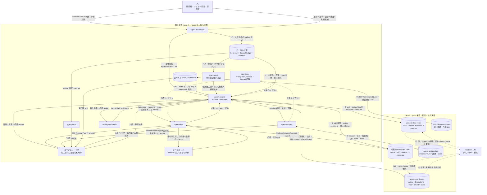

# agent-tools コンセプト正典 — チームで分担し、有限な資源で作業を止めず、人の判断を最少で最良に使う

> 作成 2026-07-27 ／ 改訂 2026-08-08（柱 3「資源効率」を追加）
> 対象: `tools/agent-project` / `agent-flow` / `agent-amigos` / `agent-board` / `agent-dashboard` /
> `agent-loop` / `agent-audit` / `agent-tools`（agentcore）/ `codd-gate` / `schemas/`
> 位置づけ: 各モジュール設計書（[索引](./README.md)）の**上位文書**。個々の設計判断の正典は
> 各設計書にあり、本書はそれらが「何のための判断か」を固定して、以後の設計がぶれないための
> 判定基準を与える。本書と各設計書が矛盾したら、どちらかが間違っているので、直すまで作業を止める。

---

## 1. 一文で

agent-tools は、**エージェント利用のクレジットと実行環境が個人単位に分散したチーム**が、
実作業をメンバー間で最適に分担し、有限なエージェント資源（クラウドの利用枠とローカルの
計算力）を仕事に見合う最小の消費で使い切り、人の判断を最少の回数・最高の質で使いながら、
各ノードの経験をプロジェクトの強制可能なルールへ育て、**品質の責任を特定の個人に
負わせずに**成果を出し続けるための道具立てである。

## 2. 前提にする現実

このファミリーの設計は、次の 7 つの現実を「解決すべき制約」ではなく「与件」として受け入れる。
ここを変えようとする機能（中央サーバ、組織契約前提、常時稼働ノード前提）はファミリーの外。

1. **利用枠は実質的に個人ごと。** 個人契約ではもちろん、組織契約があっても管理者には各人の
   残量・偏りを調査し再配分する手間が残る。クラウド API に資格情報や成果物を集約する方式も、
   ガバナンス上採れない組織がある。「誰の環境と利用枠で実行するか」は設計の外に置けない。
2. **常時稼働のサーバは無い。** あるのはメンバー各自の PC で、それぞれ違う時刻に夜間停止する。
3. **人の時間が最も高価で、注意力は有限。** 人への 1 回の差し戻しは読む・考える・書くで数分〜
   数十分掛かり、同種の確認を繰り返すと人は読まなくなる。
4. **レビューを一人に負わせると、形骸化するか、その人が潰れる。** 承認者の注意力を品質の
   最後の砦にする体制は、注意力が切れた日に壊れる。
5. **共有しただけでは使われず、経験はノードに閉じる。** スキルやフレームワークを配布できても、
   実際に選ばれ、守られ、改善されるかは人やエージェント次第である。また、各ノードに入った
   指摘・失敗・成功は、そのままでは別ノードの次の実行に届かない。
6. **クラウドエージェントは有限な資源で、制約は日々変わる。** 利用枠は使えば減り、
   レート制限・残量・使えるモデル・プラン条件は予告なく変わる。一方ローカル LLM は
   追加費用なしで常時使えるが、遅く、能力に限りがある。どちらか一方では足りない。
7. **安いモデルほど手が掛かる。** 低コストモデルやローカル LLM はプロンプトとハーネスの
   調整に敏感で、この調整を人手に残すと「モデル代の節約を人の時間で払う」ことになる。

### 2.1 解く課題

| ID | 課題 | 本書で採る解き方 | 解決の判定 |
|---|---|---|---|
| P1 | 個人契約でも組織契約でも、利用枠の残量確認と割当が人手になる | 各 CLI ノードが自分の予算・能力・在席を宣言し、仕事を入札・claim して分担する | 管理者が各アカウントを巡回せず、予算内のノードへ仕事が流れ、枯渇時に必ず止まる |
| P2 | クラウド API 集約は資格情報・データ境界・監査上採用しにくい | 実行と資格情報は個人 CLI に残し、git 上では秘密を除いた契約・成果・証跡だけを交換する | 中央実行サービスや共有 API キーなしに協調できる |
| P3 | スキルやフレームワークを共有しても、実際に使うかは任意になる | 有効な知見をプロジェクトの `rules.md` と機械ゲートへ昇格し、全タスクへ常時注入する | 適用対象の実行にルールの版と適用結果が残り、未適用を検出できる |
| P4 | 共有物が使われても、効果測定と継続改善が偶然に依存する | 適用・検証・差し戻しを証跡化し、効果が再現した知見だけを昇格、悪化したものを停止・改訂する | hit だけでなく PASS / fail / rollback を追跡し、昇格と退役を再現できる |
| P5 | ノードごとの指摘・成功・環境知識がローカルに死蔵される | run ブリーフと決定記録へ捕捉し、タスク内 → プロジェクト内 → 長期記憶の順に蒸留する | 発生元・根拠・適用範囲を保った知見が別ノードの後続実行に届く |
| P6 | 分担すると品質責任や判断待ちが特定個人へ集中する | 機械検証、三段自動解決、公式 MR/PR の決着を正とする | 人の在席や見落としによらず done の意味が一定になる |
| P7 | 全部を最上位クラウドモデルへ流すと利用枠が枯渇し、作業も財布も持たない | 仕事を性質で格付けし、ローカル LLM を含む最小で足るモデルへ振り分け、prompt・ツール開示・文脈を削る | 同じ成果に使うクラウドトークンが減り、上位モデルが判断の要る仕事へ温存される |
| P8 | レート制限・残量枯渇・モデル廃止のたびに人が設定を直し、直るまで作業が止まる | ノードが制約を観測し、降格・委譲・待機の順で自動で受ける。品質ゲートは迂回しない | 制約変動時に人が設定を触らず作業が流れ続け、done の意味は変わらない |
| P9 | 低コストモデル向けのプロンプト・ハーネス調整が人手に落ちる | 台帳の実測（使用量×検証結果）を根拠に、調整候補の生成と昇格を学習ループへ載せる | モデルの追加・降格でプロンプト調整の人手が増えず、調整の効果が実測で追える |

P1〜P2 は**分散実行の問題**、P3〜P5 は**知識を実効性のあるルールへ変える問題**、P6 は
**人介在と品質の問題**、P7〜P9 は**有限資源の効率の問題**である。単にファイルを同期する
だけでは P3〜P5 は解決したことにしないし、モデルを安く替えるだけでは P7〜P9 は解決した
ことにしない——節約は品質実測とセットで初めて成立する。

## 3. 似たツールとの差別化

| 系統 | 例 | 得意 | 範囲外になっていること |
|---|---|---|---|
| 単独利用のエージェント | エージェント CLI 単体、autonomous coding agent | 1 人 × 1 セッションの自律実行 | チームでの分担・検収の体制。クレジットも成果も個人に閉じる |
| マルチエージェント編成フレームワーク | CrewAI、LangGraph、Microsoft Agent Framework、Agno | 1 プロセス内の役割設計・グラフ制御・状態管理。エージェントアプリの「作り方」 | 実行と資格情報が API キーを持つ単一ランタイム（自前ホストか各社のクラウド）へ集約される前提。個人クレジットのままの分担、枯渇時の降格、人の判断コストの最適化、成果の機械検証と MR/PR での決着は設計対象でなく、done はエージェントの最終応答（自己申告）で決まる |
| SaaS 型エージェント基盤 | クラウドのエージェント実行サービス | チームでの共同利用 | 実行資源とクレジットの中央集約が前提。組織契約が無いと始まらない |
| CI / ジョブ自動化 | パイプライン、cron | 決まった処理の反復 | 人の判断は「手動承認」という例外扱いで、判断の質やコストは設計対象でない |
| LLM ルータ / ゲートウェイ | LiteLLM、OpenRouter 等 | リクエスト単位のモデル切替・費用集計 | 選定の根拠が価格表と汎用ベンチで、この仕事・このチームでの検証結果と結びつかない。枯渇時に作業を続ける主体でもない |

agent-tools はこの表の空白、すなわち**チーム利用**・**人介在の最適化**・**資源効率**を
同時に一級の設計対象にする。この 3 つが差別化軸であり、次節の三本柱である。
どれにも効かない機能は、他のツールがもっと上手にやる——ここには足さない。

なお編成フレームワーク群（CrewAI 等）は競合ではなく**レイヤが違う**。あちらは
「エージェントをどう作るか」の道具で、agent-tools から見れば 1 ノード内で動く実行体の
作り方の 1 つにすぎない——そこで作ったアプリは、エージェント CLI やローカル LLM と同じ
契約プロファイル（prompt を受け、成果・使用量を返し、codd-gate / verify を通る）で
ノードに載せられる。こちらが引き受けるのは「チームの有限資源と人の注意力で、
その実行体たちを止めずに回す体制」であり、向こうの機能を作り込むことは範囲外のまま。

## 4. 三本柱

### 柱 1: チーム利用 — 個人クレジットのまま、実作業を最適に分担する

クレジットと実行資源（PC）は個人のものという現実を崩さず、**仕事の方を動かす**。
実行資源を中央に集めるのではなく、仕事を公示し、余力のあるメンバーのノードが宣言と入札で
引き受ける。git を共有路にするのはこのためで、中央に要るのは転送だけ、
調整と判定は各ノードが同じファイル集合から決定的に導く。

これを支える既存の仕組み: 板（agent-board）の公示・入札・落札、ノード能力宣言
（`nodes/<id>.json`・host.yaml）、claim / lease / fencing による二重実行の防止、
夜間停止に耐える controller リースと away プロトコル、そして**二層予算**
（[`node-budget`](../../schemas/node-budget.schema.json)）——クレジットの持ち主が自分で宣言した
上限を、そのノード上の全ワークロードが守る。分担が最適になるとは、
「手が空いていて、クレジットに余裕があり、そのリポジトリを担当すると宣言した人のノード」に
仕事が流れることであり、誰かの財布を黙って燃やすことではない。

### 柱 2: 人介在の最適化 — コストと品質のバランスを保ち、責任を個人に押し付けない

人をゼロにしない（agent-dashboard 設計の非目標に明記済み）。その代わり、
人の介入は**回数を減らし、1 回あたりの質を上げる**。

- **機械で決められることを人に聞かない。** done は機械検証（verify の終了コード 0、
  または受入基準×証跡）でだけ確定し、人へ送る前に三段の自動解決
  （過去の決定の再利用 → 裁定ゲート → needs）を通す。
- **聞くときは材料を揃える。** 人検収には「差分 + 基準 + 証跡」を揃え、AI が下ごしらえ
  （診断・推薦・差し戻し文面案）まで済ませ、確定だけを人のボタンに残す。
- **判断は記録し、再利用する。** 人の判断は `decisions/` に残り、効いたものは `rules.md` へ、
  さらに長期記憶へ昇格する。同じ判断を人に二度させない。

そして**品質の責任を個人に負わせない**。人の承認は「この方向でよいか」という価値判断であって、
品質保証の代替ではない——品質は機械検証と証跡が担い、承認者が細部を見落としても done の意味は
壊れない。検収の正はフォージの MR/PR、つまりチームの公式レビューフローで、決着は決定的な状態
（マージ / クローズ / changes-requested）から導く。誰が・どの PC の前で承認したかに品質が
依存せず、差し戻しの理由は policy / rules へ昇格して次からは機械が防ぐ。
レビューは個人を消耗させる関門ではなく、チームに蓄積する体制になる。

### 柱 3: 資源効率 — 有限なエージェント資源で、作業を止めない

クラウドの利用枠とローカル LLM は性格の違う有限資源である。前者は能力が高いが使えば減り、
制約が日々変わる。後者は減らないが遅く、能力に限りがある。柱 3 はこの両方を**一つの
資源プール**として扱い、仕事に足る最小の消費で使い切る。柱 1 がノード**間**で仕事を
動かすのに対し、柱 3 はノード**内**で仕事とモデルの釣り合いを取る——合わせて
「チーム全体の有限資源を使い切る」が完成する。

- **適所適材。** 仕事を性質（計画・実装・レビュー・定型抽出・裁定）で格付けし、最小で
  足るモデルへ流す。クラウド上位モデルは、人の判断に近い仕事へ温存する。格付けの根拠は
  台帳の実測（agent-audit の使用量×検証結果）であり、印象や汎用ベンチで決め打ちしない。
- **トークンは個人の財布から出る費用。** prompt の束ね方、ツール開示の絞り込み、文脈の
  要約・圧縮で入出力トークンを削る。削減は品質実測とセットで進め、節約のために検証や
  証跡を薄くしない。
- **枯渇・制約は停止ではなく降格で受ける。** レート制限・残量枯渇・モデル廃止を観測したら、
  人の設定変更を待たず、より安いモデルへの降格 → 他ノードへの委譲（柱 1）→ 待機の順で
  作業を続ける。品質は機械検証（柱 2・C5）が成果物で判定するから、安いモデルへ降格しても
  done の意味は壊れない——ここが三本柱が互いを支える接続点である。
- **チューニングの手間も人介在。** 低コストモデルの prompt・ハーネス調整を人手に残すと、
  節約した分を人の時間で払う（柱 2 への違反と同型）。調整候補の生成・試行・昇格は
  学習ループへ載せ、人は方針（品質の下限・費用の上限）だけを決める。

### 三本柱を回す学習ループ

知識共有は独立した柱にはしない。柱 1 で複数ノードから経験を集め、柱 2 で検証済みの
判断だけを人の注意力を浪費せず再利用し、柱 3 の格付け・チューニングをその実測で更新する、
**三本柱を接続する循環**として扱う。これにより
既存の責務境界（実行は agent-flow、制御と学習は agent-project、契約は agentcore）を壊さない。

1. **捕捉** — 実行ノードは入力ルール版、使用した skill、使用したモデルと消費量、結果、
   検証証跡、指摘を run 単位で残す。
2. **共有** — 秘密・ローカルパス・生の会話を除き、タスクに属するブリーフと `decisions/` を
   状態リポジトリへ送る。git は転送路であり、中央で推論しない。
3. **蒸留** — 類似する learn / avoid をプロジェクトスコープの候補へ一般化し、根拠への参照、
   適用範囲、失効条件を付ける。単発の成功を即座に恒久ルールにはしない。モデル×仕事種別の
   格付けと prompt・ハーネスの調整候補も、この経路で台帳の実測から導く（柱 3）。
4. **強制** — 再現した候補を `rules.md` へ昇格して全タスクに注入し、決定的に検査できるものは
   codd-gate / verify へ落とす。スキルは手段、プロジェクトルールは「使う条件」を決める。
5. **評価・改訂** — 適用後の検証結果と差し戻しを新たな観測として戻し、改善しないルールは
   保留・退役する。自動昇格と同様、自動改訂にも回数・予算・停止条件を置く。

## 5. ブロック構成と課題への対応

下図は論理的な「知識パイプライン」ではなく、**実在するツール、各メンバーのローカル資源、
人、GitLab / git、エージェント CLI の配置とデータフロー**を示す。Node B 以降も Node A と同じ
構成を持ち、GitLab 上のファイル契約を介して非同期に協調する。矢印のラベルは、その境界を越える
主なデータである。資格情報と CLI のセッションはノードから出ない。

### 5.1 境界を越えるデータ

| # | 境界とデータ | 正本 / 書き手 | コンセプトを具体化する点 | 主に解く課題 |
|---|---|---|---|---|
| ① | agent-project ↔ state repo: task、status、run brief、`decisions/`、`rules.md`、knowledge observation | task ごとの所有者と agent-project。git は転送のみ | ノードの知見を共有し、検証済み learn を全ノードへ効くプロジェクトルールにする（C1・C8） | P3・P4・P5 |
| ②・⑦ | agent-project / agentcore ↔ board repo: node 能力、期限付き予算要約、公示、bid、award、claim / lease | 宣言・bid は各ノード、award は同じ入力から決定的に導出 | CLI と財布を中央へ移さず、余力のある個人環境へ**仕事を移動**する（C1・C2・C7） | P1・P2 |
| ③ | agent-flow ↔ 成果物 repo: clone、source、patch、commit、branch | source / commit は成果物 repo、作業中 patch は担当ノード | 実行はローカル CLI、成果はチームの公式 repo へ分離する。資格情報や prompt は push しない | P2・P6 |
| ④ | agent-project ↔ MR/PR: diff、review comment、CI evidence、merge / close / changes-requested | 公式決着は GitLab、agent-project は読む | 人のボタンを品質保証にせず、機械証跡と公式状態から done を導く（C4〜C6） | P4・P6 |
| ⑤ | ローカル skills ↔ skill repo: SKILL.md、version、lineage、評価、改善 PR | skill repo が配布版、各ノードはローカル試用・改善 | 「配った」で終わらず、①の適用版と outcome に接続して使用・改善を測れるようにする（C8） | P3・P4・P5 |
| ⑥ | state repo → 他ノード: project rules、decision、brief、候補と証跡参照 | state repo 内のプロジェクト状態 | Node A の判断を Node B の prompt へ常時注入し、個人の頭に閉じない（C1・C8） | P3・P5 |
| ⑧ | agent-amigos ↔ mission bus: mission、role、turn、前手番の成果、claim / lease | mission の各手番担当。bus は転送のみ | 複数 CLI の往復作業も中央実行サービスなしに分担し、前手番の成果を次の prompt の材料へする（C1・C2） | P1・P2・P6 |

### 5.2 ツール内部の prompt とファイルの組み立て

図の Node A 内が、共有物を「実際に使わせる」境界である。agent-project は charter、task spec、
`rules.md`、関連する decision / learn、repo 文脈、受入基準を実行要求へ束ねる。agent-flow と
agent-amigos はその要求を役割・手番・依存成果に応じた **prompt** にし、ローカル skill / framework
を加えてエージェント CLI を起動する。CLI から返る patch や文章を自己申告の成功とは扱わず、
codd-gate / verify が **ファイル、受入基準、証跡**を検査する。その outcome と使用した rule / skill の
版を run brief と decision へ戻すことで、⑤の「配布」と①の「学習」が閉じる。
agent-audit はこの run 証跡と CLI 自身のセッションログを横断集計し、モデル格付け・トークン
削減・prompt 調整の実測根拠を供給する（柱 3）。どのモデルで実行した成果物も同じ
codd-gate / verify を通るため、安いモデルへの振り分けが done の意味を変えることはない。

agent-dashboard はこの流れの第二の制御器ではない。人から charter、ルール、判断、予算方針を受け、
agent-project が読む操作契約を投函するだけである。逆方向には、MR/PR の差分、基準、証跡、板の
分担理由、各ノードが公開した利用枠要約を一つの判断材料として返す。これが「人への介入回数を
減らし、1 回の質を上げる」を具体化する。

### 5.3 外部資源との境界と、置かないもの

- **エージェント CLI**: prompt、skill、ローカルファイルを受け、応答・patch・利用量を返す。
  CLI の認証情報、個人/組織契約のセッション、生の履歴はローカルに留める。ローカル LLM
  （ollama など）も同じ契約プロファイルで扱う——違いは「枠が減らない代わりに遅く能力が
  限られる」ことだけで、成果物の検証経路は変わらない。
- **GitLab / git**: project state、board 契約、source、MR/PR、skill 版を保管・転送するが、担当選定、
  prompt の生成、知識の自動蒸留は行わない。中央は転送だけ、という C2 の具体形である。
- **人**: 新種の価値判断、charter、予算方針、競合ルールの裁定を担う。機械で検査できる品質や
  アカウントごとの日常的な残量巡回は担わない。

したがって図には、共有 API キー、クラウド上の共通エージェント実行基盤、中央スケジューラ、
中央の知識推論サービスを置かない。監査可能性は GitLab 上の契約、commit、decision、証跡で確保し、
実行と秘密は各ノードに残す。

## 6. ぶれないための原則

新機能・設計変更は、以下の 10 原則との整合を確認してから進める。番号は以後の設計書・PR から
`C1` のように参照する。各原則の末尾は、既存設計での実例（この原則が既に守られている場所）。

- **C1. クレジットと実行資源は個人のもの、成果と判断はチームのもの。**
  実行は各個人のノードで行い、消費は持ち主が宣言した予算の内側に収める。成果物・決定記録・
  learn は共有リポジトリに置き、個人の頭やローカルにだけ残さない。
  ＊実例: node-budget の二層予算、`decisions/` の append-only 記録、板へ配る宣言は
  「他ノードが読んで意味を持つもの」だけ（ローカルパスは配らない）。

- **C2. 中央は転送だけ。調整はしない。**
  中央（git リモート・板）は保管と転送を担い、担当決めも状態判定も各ノードが同じ入力から
  決定的に導く。中央が落ちても壊れず、組織契約のサーバを前提にしない。
  ＊実例: agent-amigos の hub 撤去、agent-flow のバス、板の claim ＋ `(ts, who)` タイブレーク。

- **C3. 機械で決められることを人に聞かない。**
  人への送出は最後の手段。決定的なゲート・過去の決定の再利用・エージェントの裁定を先に試み、
  新種の判断だけを人に届ける。
  ＊実例: agent-project の三段自動解決、verify の fast path、needs の投影と掃除。

- **C4. 人に出すときは材料を揃えて、1 回で決めさせる。**
  判断待ちには根拠（差分・基準・証跡・停滞時間）を添え、AI の下ごしらえは下書きまで、
  確定は人のボタンだけに残す。「読むために別の場所を漁る」判断待ちを作らない。
  ＊実例: 検収カードの「差分 + 基準 + 証跡」、dashboard の Viewer アシスタント 4 モード、
  停滞の可視化と既定選択。

- **C5. 人の承認を品質保証に使わない。**
  done を確定できるのは機械検証の PASS だけで、人の承認・エージェントの自己申告・設定の
  どれもこれを迂回できない。人の見落としが品質事故に直結する設計は、この原則への違反。
  ＊実例: agent-project の不変条件 1、証跡の無い pass を機械的に fail へ落とすフェイルクローズ、
  codd-gate の受け入れ前ゲート。

- **C6. 判断と決着を、特定の個人・PC・在席に依存させない。**
  誰の前にあるボタンかで可否が変わる操作、特定ノードでしか読めない状態、承認者が休むと
  止まる流れを作らない。決着は状態から決定的に導く。
  ＊実例: 板の中止は「誰が書いても終端」（`cancelled_by` に記録だけ残す）、フォージ決着の
  決定的シグナル限定、フォージ不達時は決着しない（unknown の隔離）。

- **C7. 書き手は 1 つ、判断根拠は 1 か所、そして必ず止まる。**
  同じ状態に書き手を 2 つ置かない。同じ判定を 2 実装しない（応答性のための写しは正典と
  突き合わせるテストで縛る）。すべてのループは予算・上限・停滞検知で有限回で止まる——
  クレジットは個人の財布だから、止まらない自動化は柱 1 への違反でもある。
  ＊実例: dashboard の「読むのはファイル、書くのは契約の投函だけ」、`engine/status.json` 1 枚の
  発見、`agentcore.board.eligible` の 1 実装、agent-project のタスク実行ループを止めるトリガー 7 種。

- **C8. 共有は配布で終えず、適用・検証・蒸留まで閉じる。**
  skill や知見を置いただけで採用済みにしない。どの版をどのタスクへ適用し、何の検証に通り、
  どの根拠からルールへ昇格したかを追跡する。反証されたルールには停止・退役の道を用意する。
  ＊実例: run ブリーフから decisions への捕捉、learn の hit 閾値による `rules.md` 昇格、
  `rules.md` の全タスク常時注入（現状は provenance・反証・退役を今後補完する）。

- **C9. 仕事に足る最小のモデルを使い、格付けは実測で決める。**
  すべての仕事を最上位クラウドモデルへ流さない。仕事の性質ごとに要求能力を定め、
  ローカル LLM を含む最小で足るモデルへ振り分け、上位モデルは人の判断に近い仕事へ温存する。
  格付け・昇格・降格の根拠は台帳の実測（使用量×検証結果）であり、印象・汎用ベンチ・
  一度の成功で固定しない。
  ＊実例: agents/ の契約プロファイル（read 系・JSON 系の分担）、agent-ollama 適用拡大の
  「実測を見てから次段へ」の段階導入、agent-audit の決定的 usage 集計。

- **C10. 枯渇・制約変動は停止ではなく降格で受け、品質ゲートは降格しない。**
  レート制限・残量枯渇・モデル廃止は各ノードが観測し、より安いモデルへの降格 → 他ノードへの
  委譲 → 待機の順で自動で受ける。人の設定変更を復旧の前提にしない。ただし、どのモデルで
  作った成果物も同じ機械検証（C5）を通る——節約のために verify・受入基準・証跡を薄くする
  ことは、どの理由でも認めない。
  ＊実例: 実行プロファイルの予算残率による段降格（`quota-fallback`）と候補列末尾のローカル
  退避、node-budget の `on_exhausted: pause|stop|degrade`、quota / auth の決定的トリアージ
  （リトライで枠を焼き切らない）。レート制限のリセット待ち再開は未実装で、計画で補完する。

## 7. モジュール別の設計方針

各モジュールが担う柱と、そのモジュールで守るべき方針。詳細な判断は各正典設計書へ。

| モジュール | 担う柱 | 設計方針（そのモジュールが守ること） | 正典 |
|---|---|---|---|
| agent-project | 柱 2 と学習ループの中核 | 人介在の門番。done は機械検証のみ（C5）、人へは三段を通してから（C3）、判断は decisions → rules → ltm へ昇格し、適用結果を再評価する（C8） | [agent-project-design.md](./agent-project-design.md) |
| agent-flow | 柱 1 × 柱 3 | 分担の実行体。通信はバス上のファイルだけ（C2）、claim で二重実行なし、駆動は常駐体へ預けて自分は常駐しない（C7）。仕事の格付けに応じた契約プロファイルでモデルを振り分ける（C9） | [agent-flow-design.md](./agent-flow-design.md) |
| agent-amigos | 柱 1 × 柱 2 | 往復の要る仕事のチーム化。中央は転送だけ（C2）、予算はエージェント実質実行時間の二層（C1）、役割分担は人が先に決める | [agent-amigos-design.md](./agent-amigos-design.md) |
| agent-board | 柱 1 の中核 | 分担の市場。「誰のクレジットで実行するか」を宣言と入札で決める。実行プロセスを持たず契約だけ（C2）、配る宣言は他ノードに意味のあるものだけ（C1） | [tools/agent-board/README.md](../../tools/agent-board/README.md) |
| agent-dashboard | 柱 2 の中核 | 人介在の操作面。読むのはファイル・書くのは契約の投函だけ（C7）、AI は下書きまで（C4）、人の 1 回の介入の質を上げる。完全自動運転は目標にしない | [agent-dashboard-design.md](./agent-dashboard-design.md) |
| agent-loop | 柱 2 の土台 × 柱 3 | 人がプロンプトを投げ続けなくても回る定期駆動。介入回数の削減はここから始まる（C3）。定期プロンプトごとにエージェントとモデルを選べ、ツールループを内蔵しない小型構成へも受入条件つきで流せる（C9）。done の根拠は受入条件の機械検証で、検証できない実行は「検証なし」として記録する（C5） | [tools/agent-loop/DESIGN.md](../../tools/agent-loop/DESIGN.md) |
| agent-audit | 柱 3 の測定土台 × 学習ループ | 実測の正本。収集・集計は決定的で、読み手に徹し書き手を増やさない（C7）。モデル格付け・トークン削減・prompt 調整の根拠（C9）と、知見蒸留の入力（C8）を供給する | [agent-audit-design.md](./agent-audit-design.md) |
| agentcore（agent-tools） | 両柱の土台 | 契約の 1 実装（C7）。transport / protocol / vocab / claim を 3 エンジンで共有し、「同じ仕様・別実装」のずれを潰す | [tools/agent-tools/README.md](../../tools/agent-tools/README.md) |
| codd-gate | 柱 2 × 学習ループ | 文書・コード・テストの一貫性を機械ゲートで守り、人のレビューから機械で拾える部分を引き取る。決定的に表せるプロジェクトルールの強制先になる（C5・C8） | [codd-gate-design.md](./codd-gate-design.md) |
| schemas/ | 柱 1 の言語 | チームの共通語彙。ツール間・ノード間の結合はデータ契約のみで、互いのコードを import しない（C2・C7） | [schemas/README.md](../../schemas/README.md) |

## 8. このリポジトリでの強制

本書は読み物ではなくゲートである。対象パス（冒頭の「対象」）への機能追加・設計変更では
次を守る。エージェント作業では `.github/instructions/agent-tools.instructions.md` が
この節を課す。

1. **着手前に本書を読む。** そして「この変更はどの柱・どの原則に効くか」を一言で言えること。
   言えない機能は着手しない。
2. **成果物に明記する。** 設計書なら「背景と課題」に、設計書を伴わない変更なら PR 説明に、
   効く柱・原則を 1 行で書く（例: `柱2 / C4 — 検収カードに証跡の要約を追加`）。
3. **原則と衝突したら、黙って迂回しない。** 取れる道は 2 つだけ——(a) 設計を変えて原則に
   合わせる、(b) 本書の改訂を同じ PR で提案し、人の承認を得る。原則の例外を実装の中に
   埋め込むことは、どの理由でも認めない。
4. **レビューはこのチェックリストを通す**（人のレビューも agent-reviewer もここを見る。
   すべて yes で通る）:
   - [ ] 人の承認が無くても・承認者が細部を見落としても、品質が壊れない設計か（C5）
   - [ ] 人に聞く前に、機械的な解決・過去の決定の再利用・材料の下ごしらえを試みているか（C3・C4）
   - [ ] 決着・操作の可否が、特定の個人・PC・在席に依存しないか（C6）
   - [ ] クレジットの消費は持ち主の宣言した予算の内側で、処理は必ず止まるか（C1・C7）
   - [ ] 状態の書き手・判断の根拠を増やしていないか。写しを置いたなら正典と突き合わせる
     テストがあるか（C7）
   - [ ] 他人のノードへ配ってよい情報だけを配っているか（ローカルパス・秘密は配らない）（C1）
   - [ ] 共有する知見・skill は、適用・検証・昇格根拠・停止または退役まで追跡できるか（C8）
   - [ ] 仕事は足る最小のモデルへ流れ、消費と品質を実測で追えるか。枯渇・制約変動で作業が
     止まらず、品質ゲートが迂回されないか（C9・C10）
5. **チェックリスト自体の正典はこの節。** インストラクションや各設計書へ複製せず、
   参照で指す（複製すると 2 実装になり、片方だけ育つ——C7 をチェックリスト自身にも適用する）。
