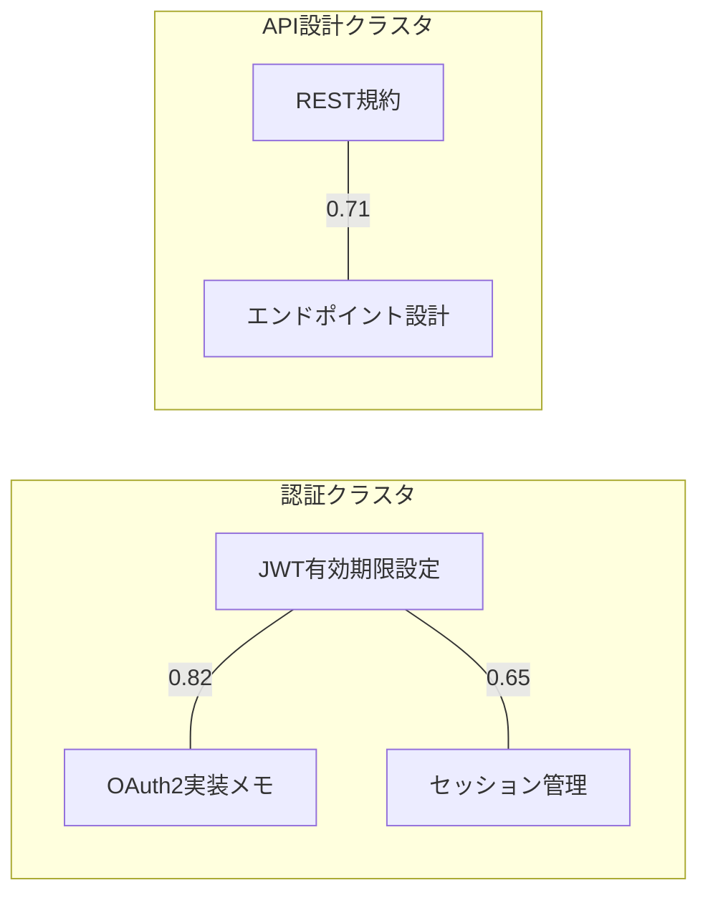

# ltm-use v4 — 記憶クラスタリング・類似記憶推薦 設計書

> **ステータス**: Draft  
> **作成日**: 2026-03-08  
> **前提**: ltm-use v3.0.0（Python 標準ライブラリのみ・Markdown ファイルベース）

---

## 1. 課題と目標

### 1.1 現在の問題

| 問題 | 具体例 | 影響 |
|------|--------|------|
| **類似記憶の重複蓄積** | 「JWT有効期限を15分に設定」と「JWTトークンの期限は15分」が別々に保存される | ディスク浪費・recall 時のノイズ増加 |
| **recall がキーワード完全一致依存** | 「認証トークン」で検索しても「JWT」の記憶がヒットしない | 記憶があるのに見つからない |
| **cleanup が時間ベースのみ** | 価値が低くても新しい記憶は残り、有用でも古い記憶が消える | 記憶の品質劣化 |
| **タグの手動付与が面倒** | save 時に `--tags` を省略すると検索性が低下 | タグなし記憶の蓄積 |

### 1.2 目標

1. **save 時**: 既存記憶との類似度を計算し、閾値超過で警告（重複防止）
2. **recall 時**: キーワード一致 + 意味的類似度のハイブリッドランキング
3. **cleanup 自動化**: 評価スコア・類似度を加味した賢い削除判定
4. **auto-tagging**: 保存テキストからキーワードを自動抽出してタグ付与

### 1.3 制約

- **外部ライブラリ禁止**: Python 標準ライブラリのみ（numpy, scikit-learn, etc. は使えない）
- **エンベディング API 不使用**: ネットワーク依存なし
- **既存フォーマット互換**: memory-format.md のフロントマター構造を壊さない
- **インデックスベース**: 記憶が数百件になっても O(index) で動作すること

---

## 2. アーキテクチャ

### 2.1 全体構成

```
scripts/
├── memory_utils.py          # 既存（共通ユーティリティ）
├── similarity.py            # 【新規】類似度エンジン（TF-IDF + トークナイザ）
├── auto_tagger.py           # 【新規】自動タグ抽出
├── save_memory.py           # 【変更】save 時に類似チェック + auto-tag
├── recall_memory.py         # 【変更】ハイブリッドランキング
├── cleanup_memory.py        # 【変更】類似度ベースの重複検出を追加
├── build_index.py           # 【変更】TF-IDF コーパスの構築を追加
└── ...
```

### 2.2 新規ファイル: `.memory-corpus.json`

インデックス（`.memory-index.json`）と同じ `MEMORY_DIR` に配置。
TF-IDF 計算に必要な語彙統計を保持する。

```json
{
  "version": 1,
  "built_at": "2026-03-08T12:00:00",
  "total_docs": 42,
  "df": {
    "jwt": 5,
    "認証": 8,
    "設計": 12,
    "fastapi": 2
  },
  "doc_vectors": {
    "mem-20260301-001": {
      "jwt": 0.42,
      "認証": 0.31,
      "トークン": 0.28,
      "有効期限": 0.35
    },
    "mem-20260302-001": {
      "api": 0.38,
      "設計": 0.25,
      "エンドポイント": 0.40
    }
  }
}
```

---

## 3. 類似度エンジン（`similarity.py`）

### 3.1 トークナイゼーション

外部ライブラリ不使用のため、以下のハイブリッド方式を採用する。

```python
import re
import unicodedata
from collections import Counter

# ストップワード（日英混合、最小限）
STOP_WORDS_JA = {"の", "は", "が", "で", "に", "を", "と", "た", "する", "ある", "いる",
                  "この", "その", "から", "まで", "れる", "れた", "して", "した", "こと",
                  "など", "ため", "よう", "さん", "これ", "それ", "あり", "なる", "もの"}
STOP_WORDS_EN = {"the", "a", "an", "is", "are", "was", "were", "be", "been",
                  "have", "has", "had", "do", "does", "did", "will", "would",
                  "can", "could", "may", "might", "shall", "should",
                  "in", "on", "at", "to", "for", "of", "with", "by", "from",
                  "and", "or", "but", "not", "this", "that", "it", "as"}
STOP_WORDS = STOP_WORDS_JA | STOP_WORDS_EN


def tokenize(text: str) -> list[str]:
    """日英混合テキストをトークンに分割する。

    戦略:
    1. ASCII 部分: 空白・記号で分割 → 小文字化
    2. 日本語部分: 2-gram（文字バイグラム）で分割
       - 形態素解析なしでも実用的な精度を得るため
       - 例: "認証トークン" → ["認証", "証ト", "トー", "ーク", "クン"]
       - 漢字連続は単語境界として扱い、2文字以上の漢字列も1トークンにする
    3. ストップワードを除去
    4. 1文字トークンを除去
    """
    text = text.lower()
    tokens = []

    # ASCII ワード抽出
    ascii_words = re.findall(r'[a-z][a-z0-9_-]*[a-z0-9]|[a-z]', text)
    tokens.extend(w for w in ascii_words if len(w) >= 2)

    # 日本語部分の抽出（CJK Unified Ideographs + Katakana + Hiragana）
    ja_segments = re.findall(r'[\u3040-\u309F\u30A0-\u30FF\u4E00-\u9FFF\u3400-\u4DBF]+', text)
    for seg in ja_segments:
        # 漢字の連続をまず単語として扱う
        kanji_words = re.findall(r'[\u4E00-\u9FFF\u3400-\u4DBF]{2,}', seg)
        tokens.extend(kanji_words)
        # 全体で文字バイグラムも生成（カタカナ語やひらがな混じりのカバー）
        if len(seg) >= 2:
            for i in range(len(seg) - 1):
                bigram = seg[i:i+2]
                tokens.append(bigram)

    # ストップワード除去
    tokens = [t for t in tokens if t not in STOP_WORDS and len(t) >= 2]
    return tokens
```

### 3.2 TF-IDF 計算

```python
import math
from collections import Counter


def compute_tf(tokens: list[str]) -> dict[str, float]:
    """Term Frequency（対数スケーリング）"""
    counts = Counter(tokens)
    if not counts:
        return {}
    return {term: 1 + math.log(count) for term, count in counts.items()}


def compute_idf(df: dict[str, int], total_docs: int) -> dict[str, float]:
    """Inverse Document Frequency"""
    return {
        term: math.log((total_docs + 1) / (freq + 1)) + 1
        for term, freq in df.items()
    }


def compute_tfidf_vector(tokens: list[str], idf: dict[str, float]) -> dict[str, float]:
    """TF-IDF ベクトル（スパース辞書表現）"""
    tf = compute_tf(tokens)
    vector = {}
    for term, tf_val in tf.items():
        idf_val = idf.get(term, math.log(1000) + 1)  # 未知語は高IDF
        vector[term] = tf_val * idf_val
    # L2 正規化
    norm = math.sqrt(sum(v * v for v in vector.values()))
    if norm > 0:
        vector = {k: v / norm for k, v in vector.items()}
    return vector


def cosine_similarity(vec_a: dict[str, float], vec_b: dict[str, float]) -> float:
    """スパースベクトル同士のコサイン類似度（0.0〜1.0）"""
    # 両ベクトルが L2 正規化済みなら内積 = コサイン類似度
    common_keys = set(vec_a.keys()) & set(vec_b.keys())
    if not common_keys:
        return 0.0
    return sum(vec_a[k] * vec_b[k] for k in common_keys)
```

### 3.3 コーパス管理

```python
def build_corpus(memory_dir: str) -> dict:
    """全記憶からコーパス（df + doc_vectors）を構築する"""
    index = memory_utils.load_index(memory_dir)
    entries = index.get("entries", [])

    df: dict[str, int] = {}          # document frequency
    doc_tokens: dict[str, list] = {} # mem_id → tokens

    for entry in entries:
        if entry.get("status") == "deprecated":
            continue
        mem_id = entry.get("id", "")
        # title + summary + tags からトークンを生成（body は読まない → 高速）
        text = " ".join([
            entry.get("title", ""),
            entry.get("summary", ""),
            " ".join(entry.get("tags", [])),
        ])
        tokens = tokenize(text)
        doc_tokens[mem_id] = tokens
        seen = set()
        for t in tokens:
            if t not in seen:
                df[t] = df.get(t, 0) + 1
                seen.add(t)

    total_docs = len(doc_tokens)
    idf = compute_idf(df, total_docs)

    doc_vectors = {}
    for mem_id, tokens in doc_tokens.items():
        doc_vectors[mem_id] = compute_tfidf_vector(tokens, idf)

    corpus = {
        "version": 1,
        "built_at": datetime.datetime.now().isoformat(timespec="seconds"),
        "total_docs": total_docs,
        "df": df,
        "doc_vectors": doc_vectors,
    }
    # ファイル保存
    path = os.path.join(memory_dir, ".memory-corpus.json")
    with open(path, "w", encoding="utf-8") as f:
        json.dump(corpus, f, ensure_ascii=False, indent=2)
    return corpus
```

### 3.4 性能見積もり

| 記憶数 | コーパス構築 | 1件の類似検索 | コーパスファイルサイズ |
|--------|-------------|--------------|---------------------|
| 50件 | < 0.1秒 | < 0.01秒 | ~20KB |
| 200件 | < 0.3秒 | < 0.05秒 | ~80KB |
| 1000件 | < 1.5秒 | < 0.2秒 | ~400KB |

> インデックスのみ使用（body 読み込みなし）のため、記憶数が増えても高速。

---

## 4. 機能設計

### 4.1 save 時の類似記憶チェック

#### フロー

```
save_memory.py --title "..." --summary "..."
  │
  ├─ [1] 新規記憶をトークナイズ → TF-IDF ベクトル化
  │
  ├─ [2] コーパス内の全 doc_vectors とコサイン類似度を計算
  │
  ├─ [3] 類似度 >= 0.65 の記憶があれば警告表示
  │      ┌─────────────────────────────────────────┐
  │      │ ⚠ 類似する記憶が見つかりました:          │
  │      │                                         │
  │      │ [1] JWT有効期限の設定 (類似度: 0.82)      │
  │      │     mem-20260301-001                     │
  │      │     Summary: JWTトークンを15分に設定...    │
  │      │                                         │
  │      │ → 既存記憶を更新しますか？                 │
  │      │   (s=保存 / u=既存を更新 / m=マージ / q=中止)│
  │      └─────────────────────────────────────────┘
  │
  ├─ [4a] s → 新規保存（重複承知の上で）
  ├─ [4b] u → 既存記憶を --update で上書き
  ├─ [4c] m → 既存の body に追記（マージ保存）
  └─ [4d] q → 保存中止
```

#### CLI インターフェース

```bash
# 類似チェック付き保存（デフォルト）
python save_memory.py --title "..." --summary "..."

# 類似チェックをスキップ（自動保存・スクリプト呼び出し時）
python save_memory.py --title "..." --summary "..." --no-dedup

# 類似度閾値の変更（デフォルト: 0.65）
python save_memory.py --title "..." --summary "..." --dedup-threshold 0.8
```

#### 非インタラクティブモード（エージェント呼び出し時）

エージェントが `save_memory.py` を呼ぶ際は stdin が使えないため、
`--no-dedup` または `--dedup-report` オプションを使用する。

```bash
# 類似記憶があっても保存し、類似一覧を stdout に出力
python save_memory.py --title "..." --summary "..." --dedup-report
```

出力例:
```
✅ 保存しました: memories/auth/jwt-refresh-token.md (mem-20260308-001)

⚠ 類似する既存記憶:
  [0.82] mem-20260301-001 "JWT有効期限の設定"
  [0.68] mem-20260215-003 "認証トークンのリフレッシュ戦略"
```

→ エージェントはこの出力を見て、必要なら `--update` で既存記憶を統合する。

### 4.2 recall のハイブリッドランキング

#### 現行（v3）のスコア計算

```
score = keyword_in_title * 10 + keyword_in_summary * 6 + keyword_in_tags * 4
        + keyword_in_body * 1（最大5回）
```

#### v4 のハイブリッドスコア

```
hybrid_score = α * keyword_score + β * tfidf_similarity + γ * meta_boost

where:
  α = 0.5   # キーワード一致（完全一致の重要性を保持）
  β = 0.35  # TF-IDF コサイン類似度（意味的拡張）
  γ = 0.15  # メタデータブースト（鮮度・評価）
```

**`keyword_score`**: 現行の `_score_index_entry()` をそのまま使用（正規化して 0〜1）

**`tfidf_similarity`**: クエリの TF-IDF ベクトルと各記憶のコサイン類似度（0〜1）

**`meta_boost`**: 以下の合計を正規化（0〜1）
```python
meta_boost = (
    min(access_count * 0.05, 0.3)           # よく参照される記憶を優遇
    + min(user_rating * 0.1, 0.3)           # 高評価を優遇
    + (0.2 if days_since(updated) < 30 else
       0.1 if days_since(updated) < 90 else 0)  # 鮮度
    + (0.2 if status == "active" else 0)    # アクティブ
)
```

#### 実装変更箇所

```python
# recall_memory.py の search_with_index() を拡張

def search_with_index_v4(memory_dir, keywords, status_filter, limit, category=None):
    """v4 ハイブリッド検索"""
    index = memory_utils.load_index(memory_dir)
    corpus = load_corpus(memory_dir)

    # クエリをベクトル化
    query_tokens = tokenize(" ".join(keywords))
    idf = compute_idf(corpus["df"], corpus["total_docs"])
    query_vector = compute_tfidf_vector(query_tokens, idf)

    candidates = []
    for entry in index.get("entries", []):
        if status_filter and entry.get("status") != status_filter:
            continue

        # キーワードスコア（既存ロジック: 正規化）
        kw_score = _score_index_entry(entry, keywords)
        kw_max = len(keywords) * 20  # 理論最大値
        kw_norm = kw_score / kw_max if kw_max > 0 else 0

        # TF-IDF 類似度
        mem_id = entry.get("id", "")
        doc_vec = corpus.get("doc_vectors", {}).get(mem_id, {})
        sim = cosine_similarity(query_vector, doc_vec)

        # メタデータブースト
        meta = compute_meta_boost(entry)

        # ハイブリッドスコア
        hybrid = 0.5 * kw_norm + 0.35 * sim + 0.15 * meta

        if hybrid > 0.05:  # 最低閾値
            candidates.append((hybrid, entry))

    candidates.sort(key=lambda x: x[0], reverse=True)
    # 以降は既存のフルファイル読み込みフェーズ（上位候補のみ）
    ...
```

#### 期待される改善

| クエリ | v3 の結果 | v4 の結果 |
|--------|----------|----------|
| 「認証 トークン」 | 「認証」「トークン」を含む記憶のみ | 「JWT」「OAuth」「セッション管理」もヒット |
| 「API 設計」 | title/summary に完全一致した記憶 | 「エンドポイント設計」「REST 規約」も上位に |
| 「デプロイ 失敗」 | 「デプロイ」「失敗」の両方を含む記憶 | 「CI/CD エラー」「ロールバック手順」も候補に |

### 4.3 自動タグ付与（`auto_tagger.py`）

#### アルゴリズム

```python
def suggest_tags(title: str, summary: str, content: str,
                 existing_tags: list[str], corpus: dict,
                 max_tags: int = 5) -> list[str]:
    """保存テキストから自動タグを推薦する。

    戦略:
    1. TF-IDF ベクトルの上位 N 語を候補とする
    2. 既存コーパスで df が高すぎる一般語は除外（IDF が低い）
    3. カテゴリ名に近い語は優先
    4. 既存タグとの重複は除外
    5. 英語・日本語混合に対応（漢字2文字以上の語は優先）
    """
    text = f"{title} {summary} {content}"
    tokens = tokenize(text)
    tf = compute_tf(tokens)
    idf = compute_idf(corpus.get("df", {}), corpus.get("total_docs", 1))

    scored = []
    for term, tf_val in tf.items():
        idf_val = idf.get(term, math.log(1000) + 1)
        tfidf = tf_val * idf_val
        # 2文字の日本語バイグラムよりも、漢字語やASCIIワードを優先
        if len(term) >= 3 or re.match(r'[\u4E00-\u9FFF]{2,}', term):
            tfidf *= 1.2
        scored.append((tfidf, term))

    scored.sort(reverse=True)
    suggestions = []
    for _, term in scored:
        if term not in existing_tags and term not in suggestions:
            suggestions.append(term)
        if len(suggestions) >= max_tags:
            break
    return suggestions
```

#### save フローへの統合

```bash
# 自動タグ付き保存（デフォルトで有効）
python save_memory.py --title "JWT有効期限" --summary "..."
# → tags: [jwt, 有効期限, 認証, トークン]  ← 自動推薦

# 手動タグを指定した場合は自動タグと統合
python save_memory.py --title "..." --tags jwt,auth --summary "..."
# → tags: [jwt, auth, 有効期限, トークン]  ← 手動 + 自動補完

# 自動タグを無効化
python save_memory.py --title "..." --no-auto-tags
```

### 4.4 智的クリーンアップ（cleanup v2）

#### 現行の削除基準（v3）

```
1. access_count == 0 かつ 作成から 30日以上
2. status == archived かつ 更新から 60日以上
3. status == deprecated
```

#### v4 の追加基準

```
4. 他の記憶と類似度 >= 0.85 かつ自身の share_score が劣位
   → 「重複記憶」として削除候補（低スコアの方を提示）

5. quality_score（新指標）が閾値未満
   quality_score = share_score * 0.6 + freshness * 0.2 + uniqueness * 0.2
   where:
     freshness = max(0, 1 - days_since(updated) / 365)
     uniqueness = 1 - max_similarity_to_other_memories
```

#### CLI 拡張

```bash
# 重複検出を含むクリーンアップ
python cleanup_memory.py --dry-run

# 出力例:
# 削除対象: 8件
#
# [1] JWT有効期限の設定（更新版）
#     理由: 重複記憶（mem-20260305-002 と類似度 0.91、相手の share_score が上位）
#
# [2] 古いデプロイ手順
#     理由: 未参照 かつ 45日経過
#
# [3] 認証メモ
#     理由: quality_score=12 が基準(20)未満

# 重複検出のみ（時間ベース削除はしない）
python cleanup_memory.py --duplicates-only --dry-run

# 自動クリーンアップ（config.json の auto_cleanup: true 時に build_index で自動実行）
python build_index.py --auto-cleanup
```

---

## 5. フロントマター拡張

### 5.1 新規フィールド

既存フォーマットに以下を追加（全てオプショナル、後方互換）。

```yaml
---
# ... 既存フィールドはそのまま ...
auto_tags: [jwt, 認証, トークン]    # 自動生成タグ（手動 tags とは別管理）
cluster_id: ""                     # クラスタID（将来のクラスタリング機能用）
---
```

### 5.2 config.json 拡張

```json
{
  "shared_remote": "...",
  "shared_branch": "main",
  "auto_promote_threshold": 85,
  "semi_auto_promote_threshold": 70,
  "cleanup_inactive_days": 30,
  "cleanup_archived_days": 60,

  "dedup_threshold": 0.65,
  "auto_tags_enabled": true,
  "auto_tags_max": 5,
  "auto_cleanup_enabled": false,
  "quality_score_threshold": 20,
  "recall_hybrid_weights": {
    "keyword": 0.5,
    "tfidf": 0.35,
    "meta": 0.15
  }
}
```

---

## 6. コーパスのライフサイクル

```
[save]  → コーパスに新規記憶のベクトルを追加（増分更新）
[rate]  → 変更なし（メタデータのみ）
[recall] → 変更なし（読み取りのみ）
[cleanup/delete] → コーパスから削除されたIDのベクトルを除去
[build_index --force] → コーパスも完全再構築

自動再構築:
  build_index の増分更新時にコーパスも同期する。
  コーパスの entries 数とインデックスの entries 数に不整合があれば自動再構築。
```

---

## 7. 実装計画

### Phase 1: 基盤（類似度エンジン + コーパス）

| ファイル | 変更内容 |
|---------|---------|
| `scripts/similarity.py` | **新規**: `tokenize()`, `compute_tf()`, `compute_idf()`, `compute_tfidf_vector()`, `cosine_similarity()`, `build_corpus()`, `load_corpus()`, `update_corpus_entry()`, `remove_corpus_entry()` |
| `scripts/build_index.py` | **変更**: `--force` 時にコーパスも再構築。`--stats` にコーパス統計を追加。 |
| `scripts/memory_utils.py` | **変更**: `CORPUS_FILENAME = ".memory-corpus.json"` 定数追加 |

### Phase 2: save 類似チェック + auto-tag

| ファイル | 変更内容 |
|---------|---------|
| `scripts/auto_tagger.py` | **新規**: `suggest_tags()` |
| `scripts/save_memory.py` | **変更**: save フローに類似チェック（`--no-dedup`, `--dedup-report`, `--dedup-threshold`）と自動タグ（`--no-auto-tags`）を追加 |

### Phase 3: recall ハイブリッドランキング

| ファイル | 変更内容 |
|---------|---------|
| `scripts/recall_memory.py` | **変更**: `search_with_index()` をハイブリッド版に置換。重み設定は config.json から読み込み。フォールバック（コーパス未構築時）は v3 ロジック。 |

### Phase 4: cleanup 智的化

| ファイル | 変更内容 |
|---------|---------|
| `scripts/cleanup_memory.py` | **変更**: 重複検出ロジック追加（`--duplicates-only`）。quality_score 計算。`--auto-cleanup` はbuild_index 経由で呼び出し。 |

### Phase 5: SKILL.md 更新

| ファイル | 変更内容 |
|---------|---------|
| `SKILL.md` | version を `4.0.0` に、操作説明に新オプションを追記 |
| `references/memory-format.md` | `auto_tags`, `cluster_id` フィールドの追加 |

---

## 8. テスト戦略

### 8.1 ユニットテスト（`tests/test_similarity.py`）

```python
def test_tokenize_japanese():
    tokens = tokenize("JWTトークンの有効期限を15分に設定")
    assert "jwt" in tokens
    assert "有効" in tokens or "有効期限" in tokens

def test_cosine_similarity_identical():
    vec = {"jwt": 0.5, "auth": 0.5}
    assert cosine_similarity(vec, vec) == pytest.approx(1.0)

def test_cosine_similarity_orthogonal():
    vec_a = {"jwt": 1.0}
    vec_b = {"deploy": 1.0}
    assert cosine_similarity(vec_a, vec_b) == 0.0

def test_dedup_detection():
    """「JWT有効期限15分」と「JWTトークン期限15分」は高類似度"""
    # ... build corpus with one memory, check similarity > 0.6

def test_auto_tags():
    tags = suggest_tags("JWT認証", "JWTアクセストークンを15分に設定", "", [], corpus)
    assert "jwt" in tags
```

### 8.2 統合テスト

1. 記憶を10件保存 → コーパスが正しく構築されること
2. 類似記憶を保存 → 警告が表示されること
3. recall でキーワード不一致だが意味的に近い記憶がヒットすること
4. cleanup で重複記憶が検出されること
5. コーパス未構築状態で recall → v3 フォールバックが動作すること

---

## 9. 将来拡張（v5 以降の検討事項）

### 9.1 クラスタリング可視化

コーパスの TF-IDF ベクトルを使って記憶をクラスタリングし、Mermaid グラフで可視化する。

```bash
python build_index.py --cluster --output cluster-map.md
```

出力:


実装は k-means（標準ライブラリで実装可能）またはグラフクラスタリング（連結成分分解）。

### 9.2 記憶マージ提案

類似度の高い複数記憶を自動的にマージ候補として提案する。

```bash
python cleanup_memory.py --suggest-merge
# → merge candidates:
#   [0.91] mem-20260301-001 + mem-20260305-002 → "JWT認証設定の統合メモ"
```

### 9.3 外部エンベディング連携（オプト・イン）

将来的に `sentence-transformers` や OpenAI Embeddings API が利用可能な環境では、
TF-IDF の代わりにエンベディングベクトルを使用するオプションを提供する。

```json
// config.json
{
  "similarity_engine": "tfidf",       // "tfidf" | "embeddings"
  "embeddings_model": "all-MiniLM-L6-v2",
  "embeddings_api": ""                // 空 = ローカル, URL = API
}
```

---

## 10. 移行ガイド

### v3 → v4 アップグレード手順

1. スクリプトファイルを更新（`similarity.py`, `auto_tagger.py` を追加）
2. `python build_index.py --force` を実行（コーパスの初回構築）
3. 既存記憶には `auto_tags`, `cluster_id` が未設定 → 省略されていても正常動作
4. `config.json` に新オプションは自動でデフォルト値が適用される

### 後方互換性

- コーパスファイルが存在しない場合、recall は v3 のキーワード検索にフォールバック
- `auto_tags` フィールドが存在しない記憶は手動 `tags` のみで動作
- 新オプション（`--no-dedup`, `--dedup-report` 等）は全てオプショナル
