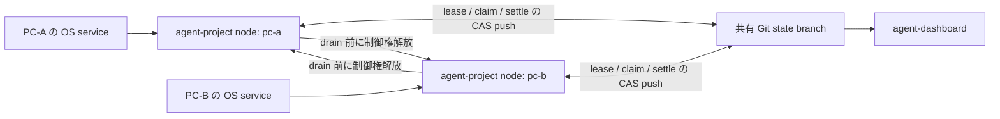

# agent-project 複数ノード daemon 分担実行 設計・改修計画

## 1. 目的

同じプロジェクトの状態リポジトリを複数 PC で共有し、各 PC で `agent-project run --watch`
を常駐させてタスクを分担する。次を前提とする。

- 常時稼働する PC はない。
- 各 PC はそれぞれ異なる時刻に夜間停止する。
- 全 PC が同時に停止する時間帯があってよい。
- 復帰後は、最初に起動した適格ノードが自動的に制御を再開する。
- 自動起動の成否をログインシェルや環境変数へ依存させない。
- done の根拠は従来どおり task verify / charter acceptance とする。

本設計は
[`2026-07-21-agent-dashboard-production-hardening-plan.md`](./2026-07-21-agent-dashboard-production-hardening-plan.md)
の「案 6 / Phase 2.5」を置き換える。既に実装済みの静的 `node` 割当と
`status/<node>.json` は残し、分散制御・停止耐性を完成させる。

## 2. 非目標

- 外部ジョブサーバ、DB、Redis、常時稼働 coordinator は導入しない。
- agent-project 自身は PC の電源を切らない。起動・停止時刻の実行は systemd / launchd /
  Windows Task Scheduler が担う。
- 未完了タスクを無条件で別ノードが奪う work stealing は導入しない。
- Git 不通時に安全性を下げて処理を継続する fallback は作らない。

## 3. 現状と不足

実装済み:

- `--node` / `AGENT_PROJECT_NODE` と task `- node:` の静的割当。
- `default_node` による未割当タスクの集約。
- `status/<node>.json` のノード別生存信号。
- 共有ファイルシステム上の `claims/<id>.lock`。

不足:

1. `claims/` は state-git 同期対象外なので、別 clone 間の排他にならない。
2. 全 daemon が charter plan/evaluate、commands、inbox、feedback、triage を処理するため、
   制御面が多重実行される。
3. `DELIVERY.md` と `run-log.jsonl` は同一ファイルへの追記で、別 clone の同時更新を失い得る。
4. node 名を環境変数で渡す運用は、OS 自動起動時に設定が欠落しやすい。
5. 予定停止前の drain、制御権引継ぎ、古い worker 結果を拒否する fencing がない。

## 4. アプローチ比較

| アプローチ | 実装コスト | リスク | 保守性 | 停止耐性 | 推奨度 |
|---|---:|---:|---:|---:|---:|
| A. Git CAS 制御権 + controller 割当 | 中 | 低 | 高 | 高 | ★★★ |
| B. 全 node による動的 work stealing | 高 | 中 | 中 | 高 | ★★☆ |
| C. 外部ジョブサーバ | 高 | 高 | 低 | 低 | ★☆☆ |

案 A を採用する。Git remote を唯一の共有依存とし、制御権・task claim・task settle を
remote HEAD 基準の compare-and-swap transaction にする。controller は固定せず、稼働中かつ
draining でない node 間で自動的に引き継ぐ。



各 node は controller と worker の両能力を持つが、同時に controller lease を持てるのは 1 node
だけとする。OS service は profile を引数で明示し、Git state branch が node 間の唯一の調停点になる。

## 5. 設定モデル

### 5.1 設定の分離

設定優先順位を次に固定する。

```text
CLI 引数 > ローカル profile > 共有 project 設定 > 既定値
```

共有 project 設定には executor、planner、予算、charter、policy 等を置く。PC 固有値は
共有リポジトリへ書かず、ローカル profile だけに置く。

```yaml
# ~/.agents/agent-project/profiles/project-a.yaml
schema_version: 1
project: project-a
node: pc-a
root: /home/user/projects/project-a-state
project_config: /home/user/projects/project-a-state/agent-project.yaml

availability:
  timezone: Asia/Tokyo
  daily_stop: "23:00"
  drain_before_sec: 1800
  shutdown_grace_sec: 300
  clock_skew_tolerance_sec: 30
```

- `node`、`root`、`project_config`、`availability` は local-only とし、共有設定からは読まない。
- 新しい profile モードは `AGENT_PROJECT_*` を一切参照しない。
- 既存環境変数は legacy モードだけで 1 リリース警告付き互換とし、移行完了後に削除する。
- profile は名前または絶対パスで指定できる。OS サービスでは絶対パスを推奨する。

### 5.2 lifecycle CLI

```bash
agent-project run --watch --profile /home/user/.agents/agent-project/profiles/project-a.yaml
agent-project start --profile project-a
agent-project stop --profile project-a --drain --deadline 300
agent-project restart --profile project-a
agent-project doctor --profile project-a
```

`start` が生成する子プロセスにも profile をそのまま渡す。profile が見つからない、node が空、
同一 project で同名 node が生存中、共有設定と state remote/branch が一致しない場合は起動を拒否する。

OS 自動起動は profile を明示した `run --watch` を直接実行する。サービス manager 配下で
detached `start` は使わない。停止側は可能なら `stop --drain` を先に呼び、その後 OS shutdown へ進む。

## 6. 分散状態

```text
coordination/controller.json    controller lease
status/<node>.json              node heartbeat / availability / draining
backlog/<id>.md                 assignment / claim / run / result state
archive/<id>.md                 完了成果の正本
run-log/<node>/<run-id>.json    node 別の immutable run log
DELIVERY.md                     archive から再生成する派生 view
```

### 6.1 controller lease

`coordination/controller.json`:

```json
{
  "schema_version": 1,
  "project": "project-a",
  "owner": "pc-a",
  "token": "12:9e431...",
  "epoch": 12,
  "acquired_at": "2026-07-22T20:00:00+09:00",
  "heartbeat_at": "2026-07-22T20:00:30+09:00",
  "lease_until": "2026-07-22T20:02:30+09:00"
}
```

- heartbeat 既定 30 秒、lease 既定 120 秒。
- 取得・更新・解放は state branch への fast-forward CAS push だけで行う。
- CAS に負けた node は即座に worker へ降格し、control-plane 書き込みを中止する。
- lease 更新不能時も worker へ降格する。ローカル状態を正として merge し直さない。
- 全 node 停止中は controller 不在でよい。復帰後、最初に CAS 成功した適格 node が再開する。
- wall clock は現実の機器差を持つため `clock_skew_tolerance_sec` を残し、peer heartbeat との差が
  許容値を超えたら `doctor` と status で警告する。

### 6.2 node status

`status/<node>.json` に次を追加する。

```json
{
  "node": "pc-a",
  "state": "active",
  "heartbeat_at": "2026-07-22T20:00:30+09:00",
  "available_until": "2026-07-22T22:30:00+09:00",
  "controller_epoch": 12,
  "running_tasks": ["T42"],
  "profile": "project-a"
}
```

`state` は `active` / `draining` / `offline`。`available_until` は daily stop から
drain window を引いた時刻で、controller の割当判断に使う。

## 7. Git CAS transaction

既存 `DirectStateGit` の plumbing を再利用し、remote state branch 上の一部パスを更新する
`state_transaction(cfg, mutate)` を追加する。

1. remote branch を fetch する。
2. remote tip の tree を一時 index へ読む。
3. `mutate` が remote tree 上の事前条件を検証して対象パスだけ変更する。
4. remote tip を親に commit を作る。
5. fast-forward push する。
6. reject なら fetch し直して有界回数 retry する。
7. push 成功後にだけ local worktree へ materialize する。

transaction 対象は controller lease、backlog task state、project state とする。これらは既存の
「機械状態は local 優先」merge から除外し、CAS 失敗後に local 版を押し戻さない。

Git remote が不通なら fail-close:

- 新しい controller lease を取らない。
- 新しい task claim を取らない。
- 実行済み結果はローカル保留し、復旧後に claim token を再検証して settle する。

## 8. controller の責務

controller だけが次を行う。

- charter plan / evaluate / milestone 更新。
- commands / inbox / feedback 取り込み。
- triage、verify 合成、spec 展開、intake。
- 未割当 task の node 割当。
- node 応答途絶と予定 drain の処理。
- `project.json` 等の project-level 状態更新。

worker は state sync、割当済み task の claim/act/verify/settle だけを行う。controller lease を
持たない node が control-plane の処理へ入ろうとした場合は処理せず journal に残す。

## 9. task 割当と fencing

### 9.1 自動割当

controller は `active` かつ `available_until` までの余裕がある node を候補にし、
`ready + doing` の割当数が最少の node を選ぶ。同数なら node 名で決定する。

- `node_source: manual` は自動変更しない。
- `node_source: auto` の ready task は、割当先が draining/offline なら再割当できる。
- doing task は自動で別 node へ移さない。
- 適格 node が無ければ task は未割当 ready のまま待機し、busy loop を起こさない。

### 9.2 claim

task に次を保存する。

```yaml
- node: pc-a
- node_source: auto
- claim_owner: pc-a
- claim_token: 4:4c4aa7...
- claim_generation: 4
- claimed_at: 2026-07-22T20:01:00+09:00
- flow_run: ap-T42-r3
```

worker は remote tree 上で `status=ready`、`node=self`、claim 未取得を確認し、CAS transaction で
`doing` にする。push 成功後にだけ act を開始する。既存 `claims/<id>.lock` は同一 PC 内の
多重起動防止として残す。

### 9.3 settle

verify 後の review/done/blocked 遷移も CAS transaction にする。remote task の
`claim_owner` と `claim_token` が実行開始時の値と一致しない結果は stale として確定しない。
これにより、停止・再割当後に旧 PC が復帰しても古い結果で done を上書きできない。

## 10. 夜間停止

### 10.1 予定停止

`daily_stop - drain_before_sec` に達した node は自分で draining に入る。

1. `status/<node>.json` を `draining` にする。
2. controller なら lease を明示解放する。
3. 新しい task claim を止める。
4. `node_source:auto` の未着手 task を controller が他 node へ再割当できるようにする。
5. 実行中 task は `shutdown_grace_sec` の範囲で完了を待つ。
6. 完了しなければ child flow を停止し、run ID を保持したまま retries を増やさず ready へ戻す。
7. token を進め、停止直前の遅延結果を stale にする。

同じ node が翌日起動しても、別 node が先に起動しても同じ手順で再開できる。agent-flow の
既存 run metadata / task branch が残っていれば続きから再利用する。

### 10.2 突然停止

heartbeat と controller/task lease が期限切れになっても、doing task は自動実行し直さない。
controller が `blocked` と needs を生成し、dashboard から次を選ぶ。

- 元 node の復帰を待つ。
- run ID を保持して別 node へ再割当する。
- 現在の成果を破棄して新しい attempt として再実行する。

回収時は `claim_generation` を増やすため、旧 attempt の結果は必ず拒否される。

## 11. 派生・集約ファイル

- `archive/<id>.md` を完了成果の正本とする。
- `DELIVERY.md` は archive を走査して決定的順序で atomic 再生成する。
- `run-log.jsonl` は廃止し、`run-log/<node>/<run-id>.json` の immutable ファイルへ分割する。
- `journal.md` は既存 union merge を継続する。
- `status.json` は単一 node 互換 view とし、複数 node UI は `status/*.json` を正とする。

## 12. doctor と可観測性

profile mode の `doctor` は次を検査する。

- profile が存在し schema が正しい。
- node が空でない。
- 同一 project に同名の生存 node がない。
- local clone の remote URL / branch が共有 project 設定と一致する。
- state branch が fetch/push 可能。
- controller lease の owner / epoch / 残り時間が読める。
- node heartbeat の時計差が許容範囲内。
- daily stop、drain、grace の順序が妥当。
- transactional path に未反映の local dirty state がない。
- profile mode で環境変数由来の値が混入していない。

dashboard は node ごとに `稼働中` / `停止準備中` / `停止中` / `応答なし` と、controller、
available-until、実行中 task を表示する。突然停止 task には回収・再割当操作を出す。

## 13. 実装計画

### Phase 1: ローカル profile と lifecycle

対象:

- `agent_project/configfile.py`
- `agent_project/config.py`
- `agent_project/cli.py`
- `agent_project/state.py`
- `agent_project/instances.py`
- `agent_project/doctor.py`

作業:

1. profile loader と local-only key 検証を追加する。
2. `--profile` を `run/start/stop/restart/doctor/instances` に追加する。
3. `start` の子プロセスへ profile をそのまま渡す。
4. availability と drain 判定を追加する。
5. profile mode では `AGENT_PROJECT_*` を参照しない。
6. systemd / launchd / Task Scheduler の profile 明示例を文書化する。

完了条件:

```bash
env -i HOME="$HOME" PATH="$PATH" agent-project doctor --profile /abs/project-a.yaml
```

が成功し、同じ profile で `run --watch` を自動起動できる。

### Phase 2: CAS transaction と controller lease

対象:

- `agent_project/stategit.py`
- 新規 `agent_project/coordination.py`
- `agent_project/loop.py`
- `agent_project/project.py`

作業:

1. remote-tip 基準の `state_transaction` を既存 plumbing 上に実装する。
2. controller acquire/renew/release を実装する。
3. 非 controller を worker loop へ分岐する。
4. control-plane 処理の入口で token を検証する。
5. drain と lease loss で即 worker 降格する。

完了条件:

- bare Git remote と 2 clone が同時取得して controller は常に 1 node。
- controller kill 後、lease 期限内には二重 controller が出ず、期限後に別 node が引き継ぐ。
- 全 node 停止後、最初の復帰 node が自動取得する。

### Phase 3: task claim / settle fencing

対象:

- `agent_project/batch.py`
- `agent_project/loop.py`
- `agent_project/model.py`
- `agent_project/commands.py`
- `agent_project/needs.py`
- `agent_project/prioritize.py`

作業:

1. claim generation/token を task へ追加する。
2. ready→doing と settle を state transaction 化する。
3. push 成功前の act 開始を禁止する。
4. stale token の result を拒否する。
5. controller allocator と manual assignment 保護を実装する。

完了条件:

- 2 worker が同じ task を競争しても act 呼び出しは 1 回。
- 再割当後に旧 worker が返した PASS result は done にならない。
- 異なる task は別 node で並行実行できる。

### Phase 4: 夜間 drain と復帰

対象:

- `agent_project/loop.py`
- `agent_project/instances.py`
- `agent_project/flow.py`
- `agent_project/commands.py`

作業:

1. daily stop 前の自動 drain を実装する。
2. `stop --drain --deadline` を実装する。
3. graceful stop 時に run ID を保持して ready へ戻す。
4. abrupt loss は blocked/needs へ送り、自動奪取しない。
5. 同一/別 node での resume を既存 flow run 再利用へ接続する。

完了条件:

- 予定停止で新規 claim が開始されない。
- 猶予超過 task は retries を増やさず再開可能。
- abrupt loss 後の旧結果が fencing で拒否される。

### Phase 5: 集約・dashboard・診断

対象:

- `agent_project/config.py`
- `agent_project/batch.py`
- `agent_project/doctor.py`
- `tools/agent-dashboard/src/features/agent-project/main/project.js`
- `tools/agent-dashboard/src/features/agent-project/main/actions.js`
- `tools/agent-dashboard/src/renderer/sections/overview.js`
- `tools/agent-dashboard/src/renderer/sections/backlog.js`

作業:

1. DELIVERY を archive から再生成する。
2. run-log を node/run 単位へ分割する。
3. controller、draining、available-until、orphan task を dashboard に表示する。
4. 回収・再割当 command を claim generation 更新へ接続する。
5. profile / Git / clock / duplicate node の doctor を完成させる。

完了条件:

- 2 node が同時完了しても DELIVERY と run-log に欠損がない。
- dashboard から停止 node の task を安全に再割当できる。
- `doctor --strict --profile ...` が誤構成を fail として返す。

### Phase 6: 実機 canary と legacy 廃止

1. 2 台、異なる daily stop で 1 プロジェクトを 1 週間 canary 運用する。
2. controller handoff、全台停止復帰、予定 drain、突然停止を各 1 回実施する。
3. 二重 act、stale done、状態欠損が 0 件であることを確認する。
4. profile mode を既定にする。
5. `AGENT_PROJECT_NODE` / `AGENT_PROJECT_REGISTRY` 等の agent-project 固有環境変数を削除する。

## 14. テスト戦略

最小の unit test に加え、標準ライブラリの `tempfile` と bare Git remote を使う統合テストを置く。

必須シナリオ:

1. 2 clone の controller 同時取得。
2. controller graceful release と即時 handoff。
3. controller kill と lease timeout handoff。
4. 全 clone 停止後の再起動。
5. 同一 task の同時 claim。
6. Git 不通時に act が始まらない。
7. claim 後の node 停止と stale result 拒否。
8. daily drain 中の割当停止。
9. resume run の retries 据え置き。
10. 異なる task の同時 settle と DELIVERY 再生成。
11. 環境変数を空にした profile 起動。
12. duplicate node / clock skew / remote 不一致の doctor。

最後に 2 台の実 PC で、停止時刻を 30 分ずらした E2E を実施する。自動テストだけで
ファームウェア shutdown、WSL 終了、ネットワーク切断の差を代替しない。

## 15. ロールアウトと後方互換

1. 既存 single-node プロジェクトは legacy mode のまま動く。
2. 1 プロジェクトだけ profile mode + single node へ移し、機能差がないことを確認する。
3. 2 node を追加し、manual assignment だけで canary する。
4. controller 自動割当を有効化する。
5. 全 project を profile mode へ移行する。
6. legacy 環境変数経路を削除する。

multi-node mode は `coordination: git-cas` を共有 project 設定へ明示した場合だけ有効にする。
設定不足時に暗黙で分散動作へ入らない。

## 16. 受入条件

- 2 台以上の PC で同じ project を監視し、異なる task を並行処理できる。
- 同じ task の act は network race を含めて高々 1 attempt だけ開始する。
- controller は常に高々 1 node。
- controller の予定停止・突然停止・全台停止から自動復帰できる。
- 予定停止 task は run ID を保持して同一または別 node で再開できる。
- 再割当後の古い結果は done/review/blocked のいずれも上書きできない。
- profile mode は agent-project 固有環境変数なしで自動起動できる。
- Git 不通時は新規制御・新規 task 実行を開始しない。
- 同時完了でも archive、DELIVERY、run-log、decisions に欠損がない。
- `doctor --strict` が node/profile/clock/remote/lease の誤構成を検出する。

## 17. 既存スキル・機構との関係

- `agent-project`: charter/backlog/verify/needs の既存状態機械を維持する。
- `agent-flow`: task 内部の実行・run resume を再利用する。分散制御の正本にはしない。
- state-git: fetch/push、commit-tree、CAS plumbing を再利用する。
- OS service manager: 自動起動と電源停止時刻を担当する。agent-project 内に scheduler を作らない。

## Decision Record

| 項目 | 内容 |
|------|------|
| 決定日 | 2026-07-22 |
| 決定者 | ユーザー |
| 採用案 | Git CAS 制御権 + controller 自動引継ぎ + ローカル profile + controller による task 割当 |
| 却下案 | 全 node の動的 work stealing（同期遅延と競合処理が複雑）、外部ジョブサーバ（常時稼働依存を増やす）、固定 controller（夜間停止中に制御面が停止） |
| 主な理由 | 常時稼働 PC と環境変数へ依存せず、既存 Git/state-git/node 実装を再利用して二重実行を防げるため |
| トレードオフ | Git remote が利用不能な間は新規制御・新規 task 実行を止める。lease に通常の時刻同期を必要とする |
| 再評価条件 | Git CAS の競合が実測でボトルネックになる、1 project あたりの常時 node 数が 10 台を超える、または外部 HA queue を既に運用する状況になったとき |
