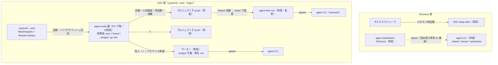
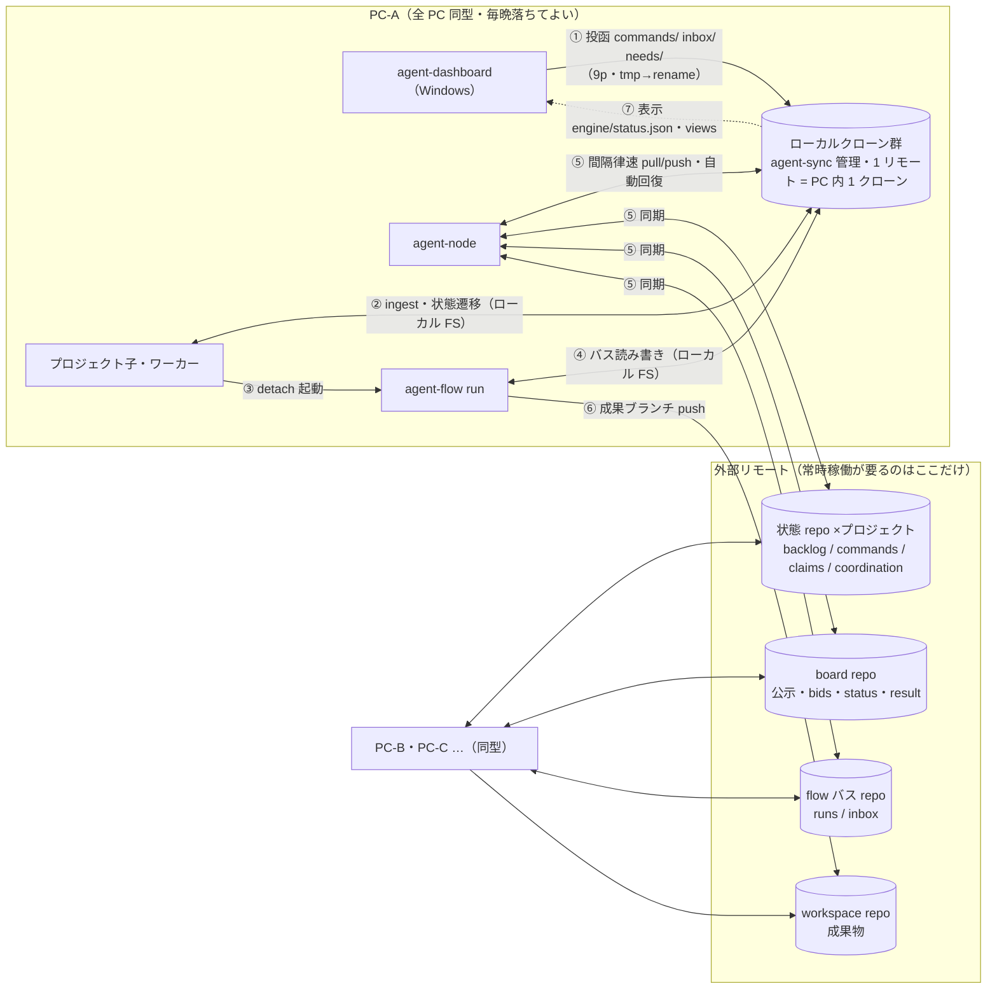
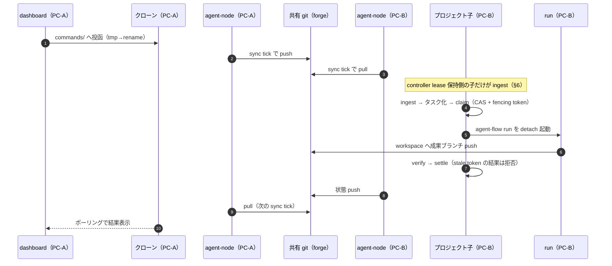

# 常駐一本化設計案 — 1 PC = 1 ノードデーモン、エンジンはライフサイクル実行体に

- 日付: 2026-07-24
- 状態: **提案・改訂 3**（改訂 1 = B 案採用。改訂 2 = 4 ツールのコード照合レビュー。
  改訂 3 = 前提の確定と第 2 次レビュー — §0。初版 A 案との比較は §10）
- 動機: 構成・設定バリエーションの爆発と git 転送実装の重複がバグの温床になっている（§1）。
  エンジン常駐を必須と割り切り、**常駐プロセスを「1 PC = agent-node 1 本」に集約**する。
- 関連: [`2026-07-23-delegation-board-distributed-bidding-design.md`](./2026-07-23-delegation-board-distributed-bidding-design.md)、
  [`2026-07-22-agent-project-multi-node-daemon-design.md`](./2026-07-22-agent-project-multi-node-daemon-design.md)（coordination / controller lease — §6 で必須化）、
  [`schemas/board.schema.json`](../../schemas/board.schema.json)、
  [`schemas/delegation.schema.json`](../../schemas/delegation.schema.json)

## 0. 前提と改訂履歴

### 0.1 設計前提（改訂 3 で確定）

1. **後方互換は不要**。全 PC・全ツールは一斉更新できる。データ契約の変更も、
   実行中の委譲・ミッションが無い**静止点での一斉切替**なら可。互換ラッパ・
   deprecation 期間・新旧共存は作らない。
2. **構成のバリエーションを排除する**。同じ結果を得る経路は常に 1 つ。
   「オプションで残す」「将来のために契約だけ置く」は原則しない —
   未実装の契約・使われない加速装置はコードとスキーマから消す。
3. **堅牢・エラー耐性・自己回復・保守性を優先する**。回復は自動が既定
   （手動操作は最後の逃げ道）。実装の重複は温存しない（「同じ仕様・別実装」の禁止）。

### 0.2 改訂履歴

- **改訂 1（B 案）**: 常駐単位を「PC × プロジェクト」→「PC」へ。agent-sync を P0 に前置。
- **改訂 2（コード照合）**: P0 からクローン共有を分離、agent-node は新規スーパーバイザと
  位置づけ（serve --all は現存しない）、dashboard 原則の精密化（読み取り専用 git と
  AI 補助スポーンは存置・`requests/` 撤回）、remote submit 廃止には板 result の
  ペイロード拡張が前提条件、スケジューラ実行規約と lease ベース回収の明文化、
  git-file-sync の扱い、controller lease（07-22 設計）の統合、実測値の更新
  （転送 5 実装・flow テスト 528 件・tick 化の下地は厚い）。
- **改訂 3（本改訂・第 2 次レビュー）**: 前提 0.1 の確定により以下を変更。
  1. **状態共有の 3 モード並存を解消**（§1.1 の残っていた行）: direct 方式一本に統一し、
     管理クローン（.state-git）方式と非 git モードを廃止（§3.1）。
  2. **claim/lease の「同一仕様・別実装」×3 を共通ライブラリへ**: 転送だけでなく
     入札・請求・lease 更新・決定的タイブレークも 1 実装にする（§3.1）。
     canceled/cancelled は翻訳マップで吸収するのをやめ、**語彙そのものを `cancelled` に
     全ツール統一**して翻訳と二重 endswith を消す（§4）。
  3. **加速装置の全廃**: amigos hub / HubBus・dashboard localhost socket・forge webhook は
     v1 から削除（コードごと）。配信はポーリング一本。未実装の speculation 契約も
     スキーマから外し、実装時に additive で戻す（§3.4、§4）。
  4. **移行の簡素化**: 互換ラッパ・deprecation 警告・バス単位ロックの温存（旧 daemon との
     相互排他用）を全廃。ロックはノードロック 1 個。フェーズを 6 → 4 に圧縮（§8）。
  5. **自己回復の設計を追加**: 親のハングは systemd watchdog（sd_notify）、子のハングは
     心拍鮮度で検知して再起動、クラッシュループは指数バックオフ + 隔離(quarantine)、
     修復(🩺)は自動実行が既定で `commands/heal` は強制実行の逃げ道に格下げ、
     **gc tick**（バス・板・古いクローン・tmp worktree の残骸回収）を周期表に一級で追加（§3.2）。
  6. **設定より規約**: tick 周期・stale 閾値等はコード定数にし yaml キーにしない。
     stale lock 閾値は 30s/300s 混在 → 30s に統一（唯一の書き手前提では長寿ロックは常に残骸）。
     プロジェクト登録は `agent-node.yaml` を単一ソースにし、instances レジストリと
     dashboard 側のプロジェクトルート列挙設定を廃止 — dashboard は `engine/status.json`
     からプロジェクトを発見する（§3.2、§3.5）。
  7. **実装一本化の最終形を明記**: agent-sync / agent-node は exec 断片合成をやめた
     通常の Python パッケージで書き、3 エンジンも最終的に単一パッケージ `agents` へ
     統合する（§3.6）。
  8. **契約可変化に伴う規律**: 契約変更は「静止点で全 PC 一斉」のみ可、とルール化（§9 C9）。

## 1. 動機 — 何がバグの温床か

### 1.1 構成の直積

同じ結果を得る経路が複数あり、その直積が構成空間になっている。本設計の完了条件は
**全行が 1 に潰れる**こと:

| 軸 | 現在のバリエーション | 本設計後 |
|---|---|---|
| act の実行モード | `location: auto / local / daemon / remote / board` × `act_async` | claim を取った PC が単発 run（＋board 委譲） |
| 状態の共有 | state_git 管理クローン / direct モード / 非 git（同期なし） | **direct 方式のみ**（remote 無しはローカル縮退・同一コード） |
| 状態を push する主体 | agent-project の state_git / dashboard の commitPush / git-file-sync — 最大 3 者 | **ノードデーモンのみ** |
| flow の実行形態 | 単発 run / ローカル daemon / GitBus 分散 daemon / hub | 単発 run のみ（監督は node の tick） |
| amigos の実行形態 | serve 常駐 / hub long-poll | node の tick + ワーカー |
| board のクローン | 4 ツールが各自別クローン | PC 内 1 クローン（agent-sync 管理） |
| claim/lease 実装 | flow / amigos / board 参加 ×3 の「同一仕様・別実装」 | **共通ライブラリ 1 実装** |
| dashboard → 本体の経路 | ファイルドロップ / CLI 直接実行 / git push | ファイルドロップのみ |

### 1.2 転送実装の重複

直近で直した 4 件のバグ（cancelled の綴り不一致・板 result の cancelled 成功扱い・
dashboard 投函が push されない・板クローンの rebase 残骸）の根因は、プロセス配置ではなく
**git 転送コードが 5 実装ある**ことだった: GitBus（agent-flow）・StateGit / DirectStateGit
（agent-project）・BoardRepo（agent-project）・BoardMirror（agent-amigos）・`git.js`
（dashboard）。加えて汎用ツール git-file-sync が第 6 の書き手になりうる。GitBus だけが
電源断・ロック残骸・オブジェクト破損への回復を持ち、他は独立に書かれた劣化コピーで、
同じ穴を別々に踏む（BoardMirror の `_recover` は自ら「GitBus と同じ技法・**別実装**」と
名乗っている）。語彙ズレ（canceled/cancelled）も claim の 3 重実装も「同じ責務の複数実装」
という同根の症状である。

なお「間隔律速 pull」は GitBus の機能ではなく、呼び出し側（flow daemon ループの
`next_*` タイマ・`state_sync` のクロック）が持っている。統一時はこの律速も
転送層へ移す（§3.1）。

したがって本設計は 2 段で攻める: **(P0) 転送と claim を 1 実装に統一**し、
**(P1〜) 常駐を 1 本に統一**する。

## 2. 新原則（6 行）

1. **転送は 1 実装**: git の clone / 間隔律速 pull / rebase・ロック残骸回復 / 破損時再クローン /
   push リトライを共通ライブラリ **agent-sync**（Python）に集約し、Python 3 ツールは
   これだけを使う。dashboard の `git.js` は置換ではなく**廃止**（P2）。
2. **プロトコルも 1 実装**: claim・入札・lease 更新・(ts, who) 決定的タイブレーク・
   終端語彙（`done / failed / cancelled`）は agent-sync 内の共通モジュール 1 つに置き、
   flow / amigos / board 参加の 3 実装を畳む。
3. **常駐は 1 PC に 1 本**: プロジェクトを使う各 PC で **agent-node**（新規スーパーバイザ）を
   常駐させる。flow / amigos の daemon 起動は廃止する。
4. **git の書き込み側同期はノードデーモンだけ**: 状態リポジトリ・flow バス・board・
   全ミラーの pull/push はノードデーモンが一手に担う。dashboard は git の書き込みを
   一切しない（読み取り専用 git — 受入 diff 表示 — は当面許し、views 化で漸減）。
5. **設定より規約**: 周期・閾値・パスはコード定数。yaml に置くのは環境依存で
   変えざるを得ない値（node_id・リポジトリ URL・ロール宣言・予算）だけ。
   「同じ結果を得る別経路」を設定で作れないようにする。
6. **回復は自動が既定**: ロック残骸・中断 rebase・破損クローン・孤児 run・クラッシュした
   子・肥大化したバスは、人が押さなくても周期処理が回収する。手動操作（`commands/heal`）は
   「今すぐやれ」の逃げ道であって、押さないと直らないものを作らない。

### 2.1 プロセス構成 — 起動・監視の関係（1 PC の内部）

**可用性の単位は「PC 群 + forge」であって単一 PC ではない**。全 PC は同型で、
毎晩落ちてよい（availability / drain で宣言的に落ちる）。常時稼働が要る外部要素は
git リモート（forge / bare repo）だけで、PC 同士は直接通信しない — 補完はすべて
「共有 git 上の lease・claim・再入札」で成立する（§2.3、§6）。



| プロセス | 場所 | 起動主体 | 寿命 | 死活担保 | git 書き込み |
|---|---|---|---|---|---|
| systemd --user | WSL | OS（linger） | 常駐 | OS | — |
| **agent-node 親** | WSL | systemd | 常駐 | WatchdogSec（ハング）+ Restart=always（クラッシュ） | **調整系リポジトリ（状態・バス・板・ミラー）の唯一の pull/push 役** |
| プロジェクト子 ×N | WSL | 親 | 常駐 | 親の心拍監視 + クラッシュループ隔離 | しない（ローカル FS の読み書きのみ） |
| ワーカー | WSL | 親 | 単発 | 親 + セマフォ | しない |
| agent-flow run | WSL | 子が detach 起動 | 単発（長命） | lease ベース回収（orphan adopt） | バスへはローカル FS のみ。**workspace への成果ブランチ push だけは行う**（下記注） |
| agent CLI | WSL | run / ワーカー | 単発 | 呼び出し元 | しない |
| agent-dashboard | Windows | ユーザー | 常駐 | ユーザー | しない（9p で投函・読み取り専用 git のみ） |
| AI 補助 CLI | Windows→WSL | dashboard | 単発 | dashboard | しない |
| WSL keep-alive | Windows | タスクスケジューラ | 常駐 | タスクスケジューラ | — |

> 注: 原則 4「git の書き込み側同期はノードデーモンだけ」の対象は**調整系**リポジトリ
> （状態 repo・flow バス・board・ミラー）。workspace リポジトリへの成果ブランチ push は
> 「成果物の納品」そのものであり、従来どおり run（executor）が行う。ここを node 経由に
> すると run の成果物が node の同期周期に律速されるため、例外として明示する。

### 2.2 データフロー — 複数 PC + 外部リモート

PC 間を渡るデータは**すべて git リモート経由**。PC 内はローカル FS のみ、
Windows↔WSL は 9p のファイル読み書きのみ（プロセス間 IPC・socket・直接通信は無い）。



### 2.3 代表シーケンス — 投函から成果まで、PC 補完込み

PC-A で投函し、controller lease を持つ PC-B が実行する例:



**補完の各ケース**（どの矢印が誰に移るか）:

- **PC-B が夜間停止中**: 手順 3 以降を PC-A（または他の生存 PC）の子がそのまま担う。
  controller lease は生存 PC が CAS で取得する。
- **PC-B が実行中に突然死**: claim lease 失効 → 生存 PC が回収して再実行。fencing token に
  より、後日復帰した PC-B の古い結果は settle で拒否される。board 公示なら再入札。
- **全 PC 停止**: 投函は各 PC のローカルクローンに滞留（消えない）。最初に復帰した PC の
  ノードが push・ingest を再開する。
- **forge 停止**: 各 PC はローカルクローンで自 PC の作業を継続。新規の claim・lease 取得は
  fail-close（07-22 設計）。復帰後に同期が追いつき、調整はファイルから決定的に再導出される。

## 3. コンポーネント再定義

### 3.1 agent-sync = 共通転送層 + 共通プロトコル層（新規・P0）

GitBus の実証済みの護りを唯一の実装として切り出す。取り込む護りの一覧
（現 `gitbus.py` の該当箇所）:

- clone（sparse cone のパラメタ化 / `blob:none` フィルタ + フォールバック / 空リポジトリ
  フォールバック / 初回 clone の指数バックオフ）
- stale lock 掃除・ロックエラー検知 + リトライ・中断 rebase の abort。閾値は
  **30s の単一定数**（30s/300s の混在を解消。常駐一本化後は各クローンの書き手が
  ノードデーモン 1 プロセスだけなので、それより長寿のロックは常にクラッシュ残骸）
- **電源断オブジェクト破損への多層防御**: `core.fsync=all` の durable-write 設定・
  `fsck --connectivity-only` による再利用時プローブ・破損検知 → バスファイル退避
  （salvage）→ 再クローン → 復元。**再クローンは世代ディレクトリ + 原子的差し替え**で行う
  （クローン共有後は 1 つの破損イベントが全利用者に見えるため、参照は世代ハンドル経由に
  して途中の読み手を壊さない）
- `pull --rebase` → 再 push の指数バックオフ（force push 禁止）・管理クローンガード
- **間隔律速**: 呼び出し側に散っている fetch/pull の間隔クロックを転送層へ移す。
  「**ネットワーク失敗時は間隔クロックを進めない**」という現 StateGit の不変条件を
  仕様として明記して引き継ぐ
- ミラーのレジストリ: 「この PC が必要とするリモート」（状態repo・板・バス・workspace
  ミラー）を宣言的に持つ。同一リモートのクローン共有（PC 内 1 クローン化）は
  **agent-node 稼働後（P1）に解禁** — ノードデーモンが唯一の git 書き手になれば
  プロセス内ロックだけで共有が成立し、プロセス間排他を作らずに済む

**共通プロトコルモジュール（改訂 3 で追加）**: 転送と同格の P0 対象として、
現在 3 箇所にある「同じ仕様・別実装」を 1 実装へ:

- **claim/lease**: 名前空間付き claim・`(ts, who)` 決定的タイブレーク・lease 書込/延長
  （半減期で更新）・失効判定。flow のタスク claim・amigos のロール claim・board 入札の
  3 実装を置換する（板契約の「同じ仕様・別実装」は外部ノードに対する規律であって、
  同一リポジトリ内のコード共有を禁じる理由にはならない）
- **終端語彙**: `done / failed / cancelled` を全ツール共通の定数にし、flow / agent-project の
  `canceled`（米式）を**書き換える**。`_FLOW_TO_BOARD_STATUS` の翻訳マップと
  `endswith(("canceled","cancelled"))` の二重判定を削除する（§1.2 のバグの根治）
- **心拍/鮮度**: `heartbeat + fresh_after_sec` の書き出し・生死判定（status ファイル各種と
  nodes/<pc>.json が同じ流儀を別々に実装している）

agent-project / agent-flow / agent-amigos の転送コード（StateGit・GitBus 転送部・
BoardRepo・BoardMirror）はこれへ置換する。留意点:

- GitBus は `Bus` のサブクラスとして残し、転送メソッドだけ agent-sync 委譲にする。
  flow 固有なのは sparse 既定（`runs`/`inbox`）と `remove_run` のみで、パラメタ化で足りる。
- **状態共有は direct 方式一本に統一**する（改訂 3）。管理クローン（`.state-git`）方式と
  非 git（同期なし）モードは廃止。状態ルートは常に git リポジトリとし（未初期化なら
  agent-node が init）、remote 未設定はローカルのみの縮退として**同一コード経路**で動く。
  direct 方式の「作業木に触れない CAS export・manifest 3-way・パス所有権による決定的
  コンフリクト裁定・journal の union merge」は転送ではなくポリシーであり、agent-sync の
  上に残す（coordination の CAS もこれを使う）。これで `stategit.py` 1,170 行の
  およそ半分（管理クローン系）が消える。

### 3.2 agent-node = ノードデーモン（常駐・PC で唯一）

**新規のスーパーバイザ**（現存する serve --all は無い。最も近い既存物は agent-project の
`ensure_flow_daemon` + `reap_orphan_flow` と flow daemon 自身の子監視で、その一般化）。
**ノード層（親）**と**プロジェクト層（子プロセス）**に分ける:

- **ノード層（親プロセス）** — 「PC」という概念に属する仕事だけを持つ:
  - agent-sync のスケジューラ（全ミラーの pull/push を周期表で駆動）
  - **board 請負 tick**: node 名義（`node_id = <pc>`）で入札。`nodes/<pc>.json` の能力宣言
    （契約に定義済み・現状どのツールも未実装）をここで初めて実装する。落札した公示は
    workspace.url → プロジェクトの対応表で該当する子へ割り振る。二重入札は構造的に起きない
  - **amigos 参加 tick**: node 名義でロール claim・heartbeat・away。**手番実行は tick 内で
    走らせない**（下記の実行規約）
  - **gc tick**（改訂 3 で一級化）: 終端 run のバス残骸・flow-archive の上限超過分・
    終端した `delegations/<id>/`・参照されない古いクローン世代・tmp worktree を
    定期回収する。ディスクは無限に増えない、を設計保証にする（board 設計の gc を
    ノードの責務として実装する）
  - `nodes/<pc>.json`（能力宣言）と `engine/status.json`（心拍・同期健康・直近エラーの
    リングバッファ）の書き出し
  - 子プロセスの起動・死活監視・再起動。**ハングは子の心拍鮮度で検知**して kill →
    再起動（クラッシュ検知だけでは不足）。**クラッシュループは指数バックオフ +
    隔離(quarantine)**: 短時間に連続死する子は再起動を止めて status.json に隔離マークを
    出し、他プロジェクトへの巻き添えを防ぐ
  - ロックは**ノードロック 1 個**（バス単位ロックの温存は不要 — 旧 daemon は
    コマンドごと消え、一斉更新が前提のため共存しない）
- **プロジェクト層（子プロセス・登録プロジェクトごと）** — 現行 `run_loop` から
  git 同期呼び出しを抜いたもの:
  ```
  ingest（commands/ inbox/ needs/）※ controller lease 保持時のみ（§6）
  → plan / act（claims で分担。act は常に agent-flow run の単発 detach 起動）
  → flow tick（自PCの run の監督: orphan 検知→auto-heal・終端の reap・cancel 伝搬）
  → board 依頼 tick（post / result 回収）
  → 心拍・status 書き出し
  ```
  1 プロジェクトの暴走・クラッシュは子プロセスに閉じ、親が再起動する。

**プロジェクトの登録は `agent-node.yaml` が単一ソース**（改訂 3）。instances レジストリ
（動的プロセス登録簿）は廃止する — 1 常駐前提では「何が動いているべきか」は宣言で決まり、
レジストリの stale エントリ掃除という自己管理仕事ごと消せる。dashboard も同じ宣言を
`engine/status.json` 経由で読む（§3.5）。

tick は単一ループ直列ではなく**周期表で駆動**する。周期は**コード定数**とし、
yaml で変えられるのは `pace`（act の律速。予算に直結するため）だけにする:

| tick | 周期（定数） | ブロック性 | 備考 |
|---|---|---|---|
| amigos 参加（claim・心拍・away） | 5s | 短命必須 | 手番実行はワーカーへ投入するだけ |
| board（入札・依頼） | 30s | 短命必須 | 現 GitBus ポーリングと同等 |
| 状態 repo / ミラー sync | 60s | git 待ちあり | dashboard の投函もここで必ず載る |
| gc | 10min | git 待ちあり | バス・板・クローン世代・tmp の回収 |
| プロジェクトループ | pace（設定可） | 長命（子プロセス側） | act の律速は従来どおり |
| amigos 手番・落札 run 実行 | （tick でなくワーカー） | 長命 | ノード全体セマフォで律速（C5） |

**スケジューラの実行規約**:

- 各 tick はワーカースレッドで実行し、種類ごとに single-flight（前回が走行中なら skip）。
- git を伴う tick はステップ毎タイムアウトを持ち、git はサブプロセスなので kill で確実に
  打ち切れる。例外は tick 内に隔離しループを殺さない。
- **周期を超えうる仕事（amigos の手番・act・落札 run）を tick 内で実行してはならない**。
  tick は「請求・心拍・キュー投入」だけを行い、実行はワーカー（サブプロセス）へ移す。
  現 serve は手番実行を cycle() 内で直列に走らせており、そのまま持ち込むとノード層が
  分単位で止まる。
- 親の再起動時は子プロセス・実行中 run を巻き込まない。**プロセス再 attach は行わず**、
  flow が実証済みの lease ベース回収（`_adopt_orphan_runs` — run-id で resume、lease 内は
  触らない）に委ねる。
- **親自身のハングは systemd watchdog で回収する**（改訂 3）: `Type=notify` +
  `WatchdogSec` を設定し、スケジューラの心拍で `sd_notify(WATCHDOG=1)` を打つ。
  スケジューラ本体のデッドロック・GC 停止も systemd が再起動まで面倒を見る。
  クラッシュは `Restart=always` が拾う。この 2 つで「ノードデーモンが黙って死んでいる /
  固まっている」状態は systemd が必ず解消する。
- 現行実装の**自殺型停止経路は作り直す**: availability モニタの `os.kill(自PID, SIGTERM)`、
  flow daemon の self-update `execv`、モジュールグローバルの `_DRAIN_REQUESTED` は、
  いずれも「親 → 子への指示」に置き換える。

- **`location` 概念は廃止**。`daemon` / `remote` / `act_async` は設定キーごと消え、実行は
  常に「claim を取った PC が `agent-flow run` を単発起動」。PC 間の分担は
  (a) coordination（git-cas + claims + availability）と (b) board、の 2 軸だけになる。
- flow daemon が持っていた auto-heal・max_runs 律速・inbox 受理は、自 PC の run に
  限って子ループが行う（primitives は既に独立関数 + 単体テスト済みなので移植は薄い）。
- `manage_flow_daemon` は廃止（管理対象の daemon 自体が無くなる）。

### 3.3 agent-flow = run ライフサイクルの実行体（常駐なし）

- **残す**: `run` / `resume` / `cancel` / `result` の CLI、バス上の run レイアウト、
  タスク claim プロトコル（実装は共通ライブラリへ）、run 内のノード分散（GitBus 契約）、
  gitlab executor。
- **廃止（互換ラッパなし・一括削除）**: `daemon` サブコマンドと裸起動既定
  （サブコマンド無し `agent-flow` = daemon 起動。amigos の既定 serve・project の既定
  run --watch も同様に、裸起動は案内表示へ変える）。`submit` と remote daemon への委譲。
- 「他 PC への単発依頼」の等価機能は board post（workload=flow）。**remote submit と一緒に
  消える result 読み戻し IPC**（`read_reject_guidance` / `read_brief_discoveries` — gitlab
  executor の reject→retry が依存）は、板の `result.json` に `result_notes` /
  `discoveries` / `reject_guidance` を載せて置換する（契約変更は静止点一斉 — §9 C9）。
- 終端語彙は `cancelled` へ統一（run 状態・`_FLOW_TERMINAL`・task.schema を含む。§3.1）。

### 3.4 agent-amigos = ミッションライフサイクルの実行体（常駐なし）

- **残す**: ミッション/ロール/メッセージのバス契約、claim・away プロトコル（実装は
  共通ライブラリへ）、納品棚。
- **廃止**: `serve` 常駐。参加ロジックはほぼ移植不要 — `NodeDaemon.cycle()` が既に
  無状態の単発 tick（テスト 40 箇所が cycle() 直接駆動・常駐ループ run() を使うテストは 0）。
  ただし**手番実行（turn_once）は cycle から切り離してワーカーへ**移す（§3.2 実行規約）。
- serve にあって cycle に無い 2 つの常駐挙動の行き先: **offboard（SIGTERM → away 宣言 +
  最終 push）**はノード層の graceful 停止（§6）へ、**適応バックオフ**は周期表の周期へ吸収。
- **hub / HubBus はコードごと削除**（改訂 3。hub.py 292 行 + hubbus.py 156 行 + 設定キー）。
  現状もクライアントは long-poll を使っておらず（wait= 未指定の実質インターバル
  ポーリング）、既定経路に依存はない。「転送加速のオプション契約」としても残さない —
  配信はポーリング一本とし、実運用でレイテンシが問題になったら forge webhook を
  「1 サイクル起こすだけの通知」として 1 段だけ足す（long-poll 系は復活させない）。

### 3.5 agent-dashboard = ファイル操作フロントエンド（Windows）

- **廃止**:
  - `base/main/git.js` の**書き込み経路**: pull / commitPush（28 呼び出し箇所の
    `gitPushAfterWrite` / `gitPushBusOp` ごと）/ heal 実行 / `gitAutoPush` 設定。
    読み取り専用機能（`diffRange` の受入 diff 画面・`diagnostics` 表示）は読み取り専用
    モジュールへ分離して存続（将来は views 化 — C7 — で置換可）。
  - `dashboard:start` の CLI 実行（唯一残っていた本体 CLI 経路）。
  - flow daemon ロックのプローブと `flow.js` 内のロック鍵導出の手写し複製
    （`daemonLockPath` / `daemonStatus` / `stopDaemon`）・`flowLockDir` 設定 UI。
  - **プロジェクトルートの列挙設定**（改訂 3）: プロジェクト一覧は `engine/status.json`
    から発見する。dashboard の設定は「WSL ディストロ / エンジンベースパス 1 個 +
    表示設定」だけに縮む。エンジン設定との二重管理が消える。
  - **localhost socket 加速装置**（改訂 3）: 構想ごと削除。真実はファイル、経路も
    ファイルの 1 本だけ。対話の応答性は AI 補助スポーンの存置（下記）で足りている。
  - `/mnt/c` 側クローンの経路サポート（クローンは WSL ext4 のみ — §5）。
- **存置**: AI 補助の CLI スポーン（`agent:charter` / `agent:doctor` / `agent:taskAssist` /
  `agent:openChat`）。本体の状態を変えない読み取り専用ヘルパで、現行の同期スピナー UX が
  成立している。gitlab-review-viewer 起動・cowork / kiro-loop / participation の tmux
  スポーンも本体制御ではないため対象外。
- **読み**: ノードデーモンが鮮度を保証するローカルクローンのファイルだけを読む
  （既存の refreshSec ポーリング。inotify に依存しない）。
- **書き**: 既存契約ファイルのみ — commands/ inbox/ needs/ reviews/ assignments/。
  受理確認は既存の `commands/processed/` レシート。
- 同期の健康・エンジン稼働は `engine/status.json` の表示に一本化。🩺 ボタンは
  「自動回復の状況表示 + `commands/heal`（今すぐ強制同期・修復）の投函」になる。

### 3.6 パッケージ構成 — 実装も一本化する（改訂 3）

3 エンジンはいずれも `__init__.py` が全 .py を exec で単一名前空間に合成する断片合成
パッケージで、モジュール境界も相互 import の仕組みも無い。agent-sync を「共有ライブラリ」に
する時点でこの構造は破綻する（パス操作か vendoring が要る）。よって:

- **agent-sync / agent-node は最初から通常の Python パッケージ**（本物の import・
  循環なし・単体で pip install 可能な形）として書く。
- 3 エンジンは P1 で tick 関数を切り出す際に exec 合成を段階的に解消し、**最終的に
  単一パッケージ `agents`（CLI 1 本: `agents node` / `agents run` / `agents post` …）へ
  統合する**（P3）。語彙・claim・転送・status 流儀を既に共有している 3 ツールを
  別パッケージに保つ理由は、互換性が不要になった時点で消えている。テストも
  「巨大単一ファイル × 3」から機能別に再編する。

## 4. ファイル契約の追加・変更

契約は「静止点で全 PC 一斉」であれば変更可（前提 0.1）。ただし変更は最小限に保つ:

| パス | 方向 | 内容 |
|---|---|---|
| `.agents/engine/status.json` | ノードデーモン → dashboard | **新規契約**。心拍（node・pid・ts）・tick 周期表の実績・同期健康（ahead/behind/エラー）・**直近エラーのリングバッファ**・プロジェクト一覧と子プロセス状態（隔離マーク含む）・実行中 run 一覧。**書き手はノードデーモンのみ**。dashboard のプロジェクト発見もこれ（§3.5） |
| `commands/heal` | dashboard → エンジン | 「今すぐ強制同期・修復」の投函。**自動回復が既定**（agent-sync がロック・rebase・破損を随時回収し、gc tick が残骸を回収する）で、これは前倒し実行の逃げ道。受理は `commands/processed/` レシート |
| `nodes/<pc>.json`（board） | ノードデーモン → 板 | 既存契約の未実装部分をノード層が実装（能力宣言・観測用） |
| 板の `result.json` | 請負ノード → 板 | `result_notes` / `discoveries` / `reject_guidance` を追加し、remote submit の result 読み戻しと等価にする（§3.3） |
| 板の speculation / `results/<who>.json` | — | **スキーマから削除**（改訂 3）。未実装の契約は現実を記述していない。投機を実装する時に additive で戻す |
| 終端語彙 | 全契約 | `done / failed / cancelled` に統一（task.schema の `canceled` を含めて書き換え。翻訳マップ廃止 — §3.1） |
| `commands/{pause,resume,stop}` | 既存 | 不変（stop したエンジンの再開だけは OS サービス管轄 — §5） |

commands / inbox / needs / reviews / assignments / board / delegation の**レイアウトと
所有権分割は不変**（dashboard は投函ファイルのみ・エンジンは状態ファイルのみ。
Windows↔WSL 間で flock が使えない前提 — 9p — と整合し、排他はすべて
「所有権分割 + tmp→rename」で成立させる）。

board の入札者は「ノード」になるため、`node_id` は PC 名そのもの（`pc-a`）で足りる。
現行実装の「落札→自分の flow inbox へ投函」は「落札→担当プロジェクトの子ループへ
割り振り→単発 run 起動」に変わるが、板の上のファイル（bids / status / result）の形は不変。

## 5. Windows / WSL 配置

- **クローンは WSL ext4 に置く**。dashboard は `\\wsl.localhost\<distro>\...` 経由で
  読み書きする（9p の rename は原子的・flock は不可 → §4 の規約でカバー）。
  `/mnt/c` 側にクローンを置く構成は廃止する（inotify・perms・速度の三重苦）。
- **常駐化は PC あたり systemd user unit 1 個**（`agent-node.service`）。
  `Type=notify` + `WatchdogSec`（ハング回収）+ `Restart=always`（クラッシュ回収）+
  `loginctl enable-linger`（ログインセッション非依存）。プロジェクトの増減で unit は
  増えない（`agent-node.yaml` で子が追従する）。
- **WSL VM の自動停止対策**は keep-alive（タスクスケジューラでログオン時に
  `wsl.exe -d <distro> --exec sleep infinity` 等、または `.wslconfig` の `vmIdleTimeout`
  延長）。**検証事項**: dashboard の `\\wsl.localhost` ポーリング自体がディストロを
  起動し続ける（= keep-alive を兼ねる）可能性があり、linger + `Restart=always` と
  合わせると C2 は部分的に自己回復する。install.py 組込みと doctor 検知は
  検証結果に関わらず必須。
- dashboard の「起動」ボタンは廃止し、status.json が古いときに「このPCのエンジンが
  停止しています（起動コマンド: ...）」の案内表示に置き換える。**dashboard から
  死んだエンジンを起こす手段は無くなる**が、watchdog + Restart=always + linger で
  「エンジンが死んだまま」は OS が解消する前提に立つ（C1）。

## 6. マルチ PC・メンテナンス停止

- 分担は既存機構を**必須化**する: `coordination: git-cas`（CAS 遷移 + fencing）＋ claims ＋
  `availability`（daily_stop / drain）。**設定キーとしての `coordination:` は削除**し、
  remote がある状態 repo では常時有効・remote 無しではローカル単独、の 2 状態だけにする
  （opt-in 分岐の温存はしない — 前提 0.1）。
- **制御面は controller lease で 1 ノードに絞る**（07-22 設計の踏襲）: charter
  plan/evaluate・commands/inbox 取り込み・triage・未割当タスクの配分は lease 保持
  ノードの子だけが行う。worker 側は claim/act/settle のみ。
- **graceful 停止**はノード層が一括で行う: 全子の claims 解放 → controller lease の
  明示解放 → amigos away 宣言（現 offboard の移設）→ board の実行中 status へ `away`
  書き込み → 未 push 分の最終 sync_push。PC 単位の常駐なので、メンテ時のフックが
  1 箇所で済む。
- **突然死**: 他 PC がタスク claim の lease 失効で回収。board は再入札（二重実行は
  結果整合で吸収 — board 設計 §7/§8 のまま）。自 PC の中断 run は再起動後の flow tick が
  orphan 検知 → resume-run（lease ベース回収なので、再起動直後に生きている run を
  誤って回収しない）。
- **全 PC 停止**: dashboard の投函はローカルクローンに滞留し、復帰したノードデーモンが
  sync_push で押し出す（サイレント消失なし）。
- **時計**: lease・claim・鮮度判定は壁時計に依存する。NTP 同期を前提とし、
  `clock_skew_tolerance_sec`（07-22 設計）の peer 比較検知を engine/status.json と
  doctor に載せる。

## 7. 廃止一覧（簡素化の実収支）

| 廃止 | 行き先 |
|---|---|
| 転送実装 5 種（GitBus 転送部・StateGit 下回り・BoardRepo・BoardMirror・dashboard git.js 書き込み経路） | **agent-sync 1 実装**（git.js のみ置換でなく廃止） |
| claim/lease 実装 3 種（flow タスク claim・amigos ロール claim・board 入札） | **agent-sync 共通プロトコルモジュール 1 実装** |
| `canceled`（米式）と翻訳マップ・二重 endswith | 全ツール `cancelled` へ語彙統一 |
| 状態共有 3 モード（管理クローン / direct / 非 git） | **direct 一本**（remote 無しはローカル縮退・同一コード） |
| git-file-sync の状態 repo / 板への使用 | **禁止**（doctor で検知）。汎用フォルダ同期用途はスコープ外として存続 |
| agent-flow `daemon`・裸起動既定・`submit` / remote 委譲（`location: daemon/remote`・`act_async`・result 読み戻し IPC） | agent-node の tick ＋ board post（板 result のペイロード拡張 — §3.3） |
| agent-amigos `serve` / **hub・HubBus（コードごと）** | agent-node のノード層 tick + ワーカー。配信はポーリング一本 |
| 未実装の speculation / `results/<who>.json` 契約 | スキーマから削除（実装時に additive で復活） |
| dashboard `git.js` 書き込み経路・`gitAutoPush`・自動 pull・🩺 実行・`dashboard:start`・ロック鍵複製・**localhost socket 構想・プロジェクトルート列挙設定・/mnt/c 経路** | agent-sync + `engine/status.json` + `commands/heal` + OS サービス |
| `manage_flow_daemon`・flow/amigos の board 設定キー・`flowLockDir`・`coordination:` opt-in キー・周期/閾値系の設定キー | `agent-node.yaml` / `agent-project.yaml` の 2 ファイル + コード定数（§2 原則 5） |
| **instances レジストリ**（動的プロセス登録簿と stale エントリ掃除） | `agent-node.yaml` 宣言 + `engine/status.json` |
| board クローン 4 種（project/flow/amigos/dashboard 各自） | agent-sync 管理の PC 内 1 クローン（P1 で） |
| systemd unit × プロジェクト数（A 案） | `agent-node.service` 1 個（notify + watchdog + Restart=always） |
| exec 断片合成パッケージ × 3 | 通常パッケージ（agent-sync / agent-node）→ 最終的に単一パッケージ `agents`（§3.6） |

## 8. 移行フェーズ（互換なし・4 段）

互換ラッパ・deprecation 期間は置かない。各フェーズ内は「全ツール一斉・テストも同時に
書き換え」で進め、フェーズ末に全テスト緑を回復してから次へ進む。

| フェーズ | 内容 | 撤退線 |
|---|---|---|
| **P0** | **agent-sync 抽出**（転送 + claim/lease + 終端語彙 + 心拍。通常パッケージとして新規作成）。BoardRepo → BoardMirror → GitBus 転送部 → StateGit 下回りの順に置換。語彙 `cancelled` 統一と翻訳マップ削除・speculation 契約の削除・stale 閾値 30s 統一もここで（契約変更は静止点で一斉）。クローン配置は現状維持 | **P0 だけで止めても現状構成の堅牢化として成立する**（転送 5 実装 → 1・claim 3 実装 → 1・語彙バグの根治） |
| P1 | **agent-node 実装**（スーパーバイザ + 周期表 + watchdog + gc tick + `nodes/<pc>.json` + `engine/status.json` + クローン共有解禁）。flow daemon / amigos serve のループ本体を tick 関数へ抽出し、**daemon / serve / submit / location / act_async / hub / instances レジストリ / manage_flow_daemon を同フェーズで削除**。状態共有 direct 一本化。node_id を PC 名へ（静止点切替: node_id 由来クローンパスの移動と、板 `status/<who>.json`・amigos `status/<node>--<role>.json` の名義を含む。切替前チェックは doctor に実装） | flow は primitives が独立関数テスト済み・amigos は cycle() が既に tick でテスト 40 箇所が tick 駆動 — 実常駐が要るテストは flow 6 件のみ。最大の書き換え面は agent-project のテスト |
| P2 | **dashboard 縮退**: git.js 書き込み経路・`dashboard:start`・ロックプローブ・プロジェクトルート設定を削除し、status 表示 + `commands/heal` へ置換。diffRange / diagnostics は読み取り専用モジュールへ分離 | — |
| P3 | **単一パッケージ `agents` へ統合**（§3.6）・テストの機能別再編・ドキュメント全面改訂・**実機 canary**: 2 台・停止時刻をずらした 1 週間運用で、ノード引継ぎ・全台停止復帰・drain・突然死・watchdog 発火・クラッシュループ隔離を各 1 回以上通す（自動テストは WSL 終了・電源断・9p の差を代替しない） | パッケージ統合は P2 までの成果と独立に延期可能 |

## 9. 懸念（重要度順）

- **C1: ローカルエンジン停止中は「指示が他 PC へ届かない」+ コールドスタート不能**。
  現行は dashboard 自身が commitPush で投函を共有リモートへ届けられ、`dashboard:start` で
  エンジンを起こせた。新設計ではどちらも無い。緩和: watchdog + `Restart=always` + linger で
  「死んだまま・固まったまま」を OS が必ず解消する（§5）ため、停止窓は
  「クラッシュ〜再起動の数秒」に縮む。status.json による明示表示。**「dashboard に git を
  させない」と決めた瞬間に、どの案でも払う対価** — 受け入れ済みとする。
- **C2: WSL VM の自動停止**。keep-alive 必須は変わらないが、dashboard の UNC ポーリングが
  ディストロ起動を兼ねる可能性（§5 検証事項）と linger + watchdog の組で、部分的に
  自己回復する見込み。install.py 組込みと doctor 検知は必須のまま。
- **C3: 1 プロセスへの責務集中**。緩和は §3.2 の実行規約（single-flight + タイムアウト +
  例外隔離 + 長時間作業のワーカー分離）と、親自身への watchdog・子のハング検知・
  クラッシュループ隔離で対処。プロジェクト層は子プロセスで隔離済み。
- **C4: 長時間 run の監督の再実装リスク**。auto-heal・orphan 回収・max_runs は実証済み
  ロジックで primitives は独立関数 + 単体テスト済み — 移植面は小さい。親再起動との合成は
  lease ベース回収一本化で新規状態機械を最小化。残るリスクは cancel 受理 → orphan 回収の
  順序など現ループが暗黙に持つ順序制約の移し漏れ。P1 で daemon テストを tick テストへ
  そのまま移せる形で抽出するのが安全。
- **C5: マルチプロジェクトの資源競合**。ノード層に PC 全体の `max_concurrent` を置き、
  act 起動・amigos 手番・落札 run をノード層のセマフォで律速する。act は detach 起動の
  ため、計数はプロセス手持ちでなく status/run ファイルから導出する。
- **C6: 一括切替のリスク**（改訂 3 で入替 — 互換を捨てた対価）。P1 は「旧常駐の削除・
  状態モード統一・node_id 切替・クローン共有」を一つのフェーズで抱える。段階的
  ロールバックはできない。緩和: (a) P0 が独立に価値を出す撤退線、(b) P1 内部を
  「全テスト緑を保つコミット列」で刻む、(c) 実機 canary（P3）前に 1 PC + ローカル板で
  全機能を通す、(d) 状態 repo・板は git なので**データのロールバックは常に可能**
  （プロセスを旧リビジョンに戻せば動く、を P1 完了まで保つ）。
- **C7: 9p 越しの読み性能**。bus の run ディレクトリや flow-archive は数百ファイルになり、
  UNC 越しの走査は遅い。緩和: エンジンが正規化ビュー（views/*.json）を少数ファイルに
  materialize し、dashboard はそれだけ読む。gc tick がバスを刈ること自体も走査量を抑える。
  views は dashboard に残した読み取り専用 git（diffRange）の置換先でもある。
- **C8: board 必須化**。「他 PC への単発依頼」は board 経由のみになるため、最小構成でも
  board リポジトリが 1 つ要る（1 PC 構成ではローカル dir 板で可）。セットアップは
  install.py に畳む。result 読み戻しの等価性は板 result のペイロード拡張が前提（§3.3）。
- **C9: 契約変更の規律**。互換不要は「無秩序に変えてよい」ではない。契約変更
  （語彙統一・result ペイロード・speculation 削除）は**静止点で全 PC 一斉**のみ可、
  スキーマと実装を同コミットで更新、を規律とする。node_id 切替も同じ静止点に載せる
  （板と amigos の自分名義ファイル・node_id 由来クローンパスを跨ぐため）。
- **C10: 移行コスト**。最大の書き換え面は agent-project の単一 12k 行テストファイルと
  ドキュメント。tick 化の下地は厚い（flow: 実デーモン必須テスト 6 件・amigos: 0 件）。
  P0 撤退線は維持。
- **C11: exec 合成の解体と単一パッケージ化**。§3.6 のとおり agent-sync / agent-node は
  新規通常パッケージで書き、既存側は P1 の tick 抽出時に段階的に import 境界を入れる。
  统合（P3）は独立に延期できる。

## 10. 初版（A 案: PC × プロジェクト常駐）との比較

| 観点 | A 案（PC × プロジェクト常駐・単一ループ） | ★B 案（ノードデーモン + 周期表） |
|---|---|---|
| systemd / keep-alive | プロジェクト数ぶん | PC あたり 1 個 |
| amigos 応答性 | 単一 pace に律速（緩和策が場当たり） | tick 別周期で構造的に解決 |
| node と project のズレ | `node_id = <pc>-<project>` 規約 + 二重入札 lint が必要 | 構造的に消滅（入札者 = PC） |
| 障害隔離 | プロセス = プロジェクトで自然に隔離 | スーパーバイザ + 子プロセス + 隔離(quarantine)で同等以上 |
| メンテ停止フック | プロジェクト数ぶん | ノード層で一括 |
| 転送・claim の重複 | 触れず（別課題のまま） | P0 で各 1 実装に統一 |
| 実装の複雑さ | ループ 1 本で単純 | スケジューラ + 監視の分だけ増える（watchdog で底上げ） |

B 案の追加コストは「スーパーバイザと周期表」だが、これは flow daemon が既に持っていた
poll ループ + 子（orchestrator）監視の一般化であり、新奇な機構ではない。

## 11. 非目標

- インターネット越しの分散・認可機構の追加はしない（従来どおりオンプレ + git 認証）。
- dashboard の機能削減はしない（起動ボタンと 🩺 の実行主体が変わるだけで、
  できることは維持する。AI 補助・受入 diff・外部ビューア起動は現行のまま）。
- 投機実行（speculation）は実装しない（契約からも一旦外す — §4。必要になったら
  additive で戻す）。
- git-file-sync・agent-loop 等、状態 repo / 板に触らない汎用ツールには手を入れない
  （状態 repo・板への使用禁止の doctor 検知のみ — §7）。
- 性能チューニング（周期の短縮・webhook 追加）は v1 ではしない。実運用の計測で
  問題になった箇所にだけ、1 段ずつ足す。
