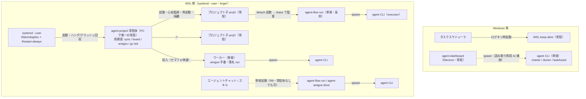
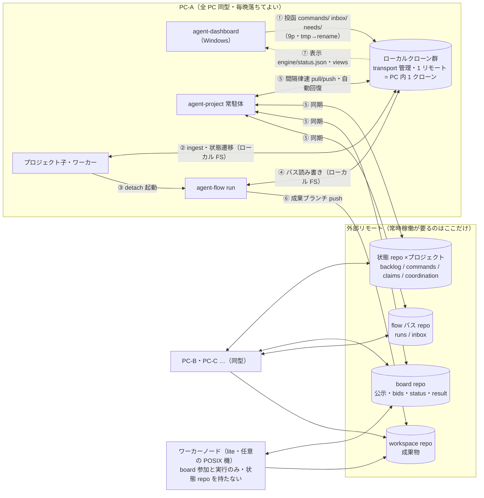

# 常駐一本化設計 — 1 PC = 1 常駐体、エンジンはライフサイクル実行体に

- 日付: 2026-07-24
- 状態: **提案・改訂 6**（改訂 5 の内容に、(a) 内部部品の隠蔽と agent-project への
  ブートストラップ集約、(b) flow / amigos の単体実行（スキル呼び出し）の堅持、を
  反映。改訂履歴は付録 A）
- 関連: [`2026-07-23-delegation-board-distributed-bidding-design.md`](./2026-07-23-delegation-board-distributed-bidding-design.md)（板の契約）、
  [`2026-07-22-agent-project-multi-node-daemon-design.md`](./2026-07-22-agent-project-multi-node-daemon-design.md)（coordination / controller lease）、
  [`schemas/board.schema.json`](../../schemas/board.schema.json)、
  [`schemas/delegation.schema.json`](../../schemas/delegation.schema.json)

**この文書の読み方**: 「実現したいこと（§1）」から出発し、方針（§2）→ 全体像（§3）→
部品の詳細（§4）→ ファイル契約（§5）→ 障害と回復（§6）→ 配置（§7）→ 移行計画（§8）→
リスク（§9）の順に、抽象から具体へ段階的に掘り下げる。全体を掴むだけなら §1〜§3 で足りる。
見慣れない言葉が出たら §3.1 の用語集を見る。

---

## 1. 実現したいこと（要件）

### 1.1 背景 — 何に困っているか

直近で 4 件のバグ（cancelled の綴り不一致・板の結果の取り違え・dashboard の投函が
届かない・板クローンの rebase 残骸）を直した。根因はどれも**同じ仕事をするコードが
複数箇所に別々に書かれていること**だった:

- git の転送（clone・pull・push・壊れたときの復旧）が **5 箇所**にある
  （agent-flow の GitBus・agent-project の StateGit と BoardRepo・agent-amigos の
  BoardMirror・dashboard の git.js）。一番良くできた GitBus だけが電源断やロック残骸
  から回復でき、残りは劣化コピーで同じ穴を別々に踏む。
- 「早い者勝ちで仕事を取る」仕組み（claim）が **3 箇所**にある（flow のタスク・
  amigos のロール・板の入札）。仕様は同じ、実装は別。
- 完了状態の言葉が揃っていない（`canceled` と `cancelled`）。翻訳コードで
  吸収しており、そこがバグになった。

さらに、同じ結果を得る**経路のバリエーション**が構成空間を爆発させている:

| 軸 | 現在のバリエーション | 本設計後 |
|---|---|---|
| タスク実行の場所 | `location: auto / local / daemon / remote / board` × `act_async` | claim を取った PC が単発実行（+板への委譲） |
| 状態の共有方法 | 管理クローン / direct / 非 git の 3 モード | **direct 一本**（remote 無しも同一コード） |
| 状態を push する主体 | エンジン / dashboard / git-file-sync の最大 3 者 | **常駐体のみ** |
| flow の動かし方 | 単発 / ローカル常駐 / 分散常駐 / hub | 単発のみ（監督は常駐体の周期処理） |
| amigos の動かし方 | serve 常駐 / hub long-poll | 常駐体の周期処理 + ワーカー（単発駆動は残す — R9） |
| 板のクローン | 4 ツールが各自別クローン | PC 内 1 クローン |
| claim の実装 | 3 実装 | 共通ライブラリ 1 実装 |
| dashboard → 本体の経路 | ファイル投函 / CLI 直接実行 / git push | ファイル投函のみ |

### 1.2 要件

| # | 要件 | 満たされたと言える条件 |
|---|---|---|
| **R1** | **重複実装の根絶**: git 転送・claim/lease・完了語彙は 1 実装にする | 転送 5 実装 → 1、claim 3 実装 → 1、語彙の翻訳コード 0 |
| **R2** | **構成の一本化**: 同じ結果を得る経路は常に 1 つ。設定より規約 | §1.1 の表の全行が「1」になる。周期・閾値は設定キーでなくコード定数 |
| **R3** | **常駐の一本化**: 1 PC につきデーモン 1 本だけ | OS サービスは PC あたり 1 個。flow / amigos / project の常駐コマンドは消える |
| **R4** | **複数 PC の補完で可用性を出す**: どの PC も毎晩落ちてよく、突然死してもよい。常時稼働が要るのは共有 git（forge）だけ | §3.4 の補完 4 ケース（夜間停止・突然死・全停止・forge 停止）がすべて自動で成立する |
| **R5** | **自己回復**: 故障は人が押さなくても直る。手動操作は「今すぐやれ」の前倒しだけ | §6 の障害一覧で「人の出番」が空欄か表示確認のみ |
| **R6** | **計算リソースだけの参加**（ワーカー）: プロジェクトを持たない PC が余った計算力を最小手順で挿せる | clone + `install.sh` + `agent-project worker init` で入札開始。依存 3 つ（python / git / agent CLI）。Windows/WSL 前提なし |
| **R7** | **dashboard の使い勝手は落とさない** | できることは現状維持（起動ボタンと 🩺 の実行主体が変わるだけ） |
| **R8** | **保守性**: 読めるコード構造・単体テストできる部品 | exec 断片合成をやめ通常のパッケージへ。周期処理（tick）は関数単位でテスト可能 |
| **R9** | **flow / amigos の単体実行を堅持**（改訂 6）: 両エンジンは Claude の dynamic workflows / agent teams を模したもので、エージェントチャットからスキル経由で単発起動できることが存在理由の一部。常駐一本化でこれを壊さない | 常駐体なし・ネットワークなしで `agent-flow run`（ローカルバス）と `agent-amigos drive` が完結し、スキルからの呼び出し形（CLI 名・引数）が変わらない |
| **R10** | **内部部品の隠蔽**（改訂 6）: 利用者の接点は agent-project（運用・ブートストラップ）と dashboard（GUI）と flow/amigos の単発 CLI（スキル用）だけ。常駐デーモンや転送層は独立した製品名を持たない | インストール・起動・利用者向け文書・dashboard 表示に「node」「sync」等の内部名が現れない。導入は従来どおり `install.sh`、運用は `agent-project` 系コマンド |

### 1.3 前提（制約）

- **後方互換は不要**。全 PC・全ツールは一斉更新できる。データ契約の変更も、実行中の
  仕事が無い**静止点**での一斉切替なら可。互換ラッパ・移行期間・新旧共存は作らない。
  ※例外が 1 つ: **スキルからの呼び出し形（R9）は互換を守る**。
- **オンプレ + git 認証**のみ。インターネット越しの分散・新しい認可機構は作らない。
- フルノード（プロジェクトを主宰する PC）は現行どおり Windows + WSL 運用。
  ワーカーノードは任意の POSIX 環境（Linux サーバ・Mac も可）。

---

## 2. 基本方針（7 原則）

要件を満たすための決め事。以降の全セクションはこの 7 行の具体化である。

1. **転送は 1 実装**（R1）: git の clone / 間隔をあけた pull / ロック残骸・rebase 復旧 /
   破損時再クローン / push リトライを共通の内部ライブラリ（`transport` — §4.1）に集約する。
2. **プロトコルも 1 実装**（R1）: claim・入札・lease・完了語彙（`done / failed /
   cancelled` に統一）も内部ライブラリ（`protocol`）1 つに置く。
3. **常駐は 1 PC に 1 本**（R3）: 各 PC で常駐するのは **agent-project の常駐体
   （resident — §4.2）** 1 本だけ。flow / amigos の常駐は廃止する。
   「常駐」とは OS サービスとして生き続けるプロセスのこと — 呼び出し元の寿命に
   束縛されるフォアグラウンド駆動は「単発実行」であり、廃止対象ではない（R9）。
4. **git の書き込み側同期は常駐体だけ**（R2, R4）: 状態リポジトリ・バス・板・
   ミラーの pull/push は常駐体が一手に担う。dashboard は git に書かない。
   ※例外は 1 つだけ — 成果物を workspace リポジトリへ push するのは実行体（run）の
   仕事（§3.2 の注）。
5. **設定より規約**（R2）: 周期・閾値・パスはコード定数。yaml に置くのは環境ごとに
   変えざるを得ない値（node_id・リポジトリ URL・ロール・予算）だけ。
6. **回復は自動が既定**（R5）: ロック残骸・破損クローン・孤児 run・死んだ子プロセス・
   肥大化したディスクは、周期処理が勝手に回収する。「押さないと直らないボタン」を
   作らない。
7. **入口を絞る**（R10）: インストール・起動・運用の入口は `agent-project`、GUI は
   dashboard、スキルからの単発実行は `agent-flow` / `agent-amigos`。この 4 つ以外の
   名前（常駐体・転送層などの内部部品）は利用者向けの語彙に出さない。

---

## 3. 全体像

### 3.1 用語集

| 用語 | 意味 |
|---|---|
| **forge** | オンプレの git ホスティング（Gitea / GitLab CE / ssh の bare repo）。本設計で唯一の常時稼働要素 |
| **状態 repo** | プロジェクトごとの共有 git リポジトリ。backlog・指示（commands/）・claim・調整情報が入る |
| **板（board）** | 依頼の公示・入札・成果を載せる専用 git リポジトリ。PC 横断で「誰がこの仕事を引き受けるか」を決める層 |
| **flow バス** | agent-flow の実行単位（run）の状態を置く git リポジトリまたはディレクトリ |
| **workspace repo** | 成果物（コード）そのものが入るリポジトリ |
| **ノード** | 群に参加する 1 台の PC（板契約上の概念。名義は `node_id` = PC 名）。※契約の語彙としての「ノード」は残る — 隠すのは製品名だけ（R10） |
| **フルノード** | プロジェクトを主宰する PC。dashboard・状態 repo を持つ |
| **ワーカーノード（lite）** | 計算リソースだけを提供する PC。板経由の仕事だけを受ける（§4.3） |
| **常駐体（resident）** | agent-project の一部として各 PC で唯一常駐するデーモン（旧称 agent-node）。利用者からは `agent-project` のサブコマンドと systemd unit `agent-project.service` としてしか見えない |
| **transport / protocol** | git 転送と claim/lease/語彙/心拍を 1 実装にした内部モジュール（旧称 agent-sync を分割・改称）。独立配布せず CLI も持たない |
| **単発実行（スタンドアロン）** | 呼び出し元（スキル・チャット・人）の寿命に束縛されて動き、終わったら消える実行。常駐（OS サービス）と対をなす。`agent-flow run`・`agent-amigos drive` がこれ |
| **tick** | 周期的に呼ばれる 1 回分の処理（状態を持たない関数）。常駐 = tick を周期表で回すこと |
| **claim / lease** | 早い者勝ちで仕事を取る宣言と、その有効期限。期限内に心拍を打たないと他ノードが回収できる |
| **CAS / fencing** | git の fast-forward push を使った「先に書けた者が勝つ」更新と、古い実行者の結果を拒否する世代トークン |
| **controller** | プロジェクトの制御面（指示の取り込み・計画・割当）を担う 1 ノード。lease の取り合いで自動的に決まる |
| **9p / UNC** | Windows から `\\wsl.localhost\...` で WSL のファイルを読み書きする仕組み。rename は原子的・flock は不可 |
| **静止点** | 実行中の委譲・ミッションが無い状態。契約変更・node_id 変更はここでだけ行う |

### 3.2 プロセス構成 — 1 PC の中で何が動くか

**可用性の単位は「PC 群 + forge」であって単一 PC ではない**。全 PC は同型で、毎晩
落ちてよい。PC 同士は直接通信せず、補完はすべて「共有 git 上の lease・claim・再入札」で
成立する（§3.4）。



| プロセス | 場所 | 起動主体 | 寿命 | 死活担保 | git 書き込み |
|---|---|---|---|---|---|
| systemd --user | WSL | OS（linger） | 常駐 | OS | — |
| **agent-project 常駐体** | WSL | systemd | 常駐 | WatchdogSec（ハング）+ Restart=always（クラッシュ） | **調整系リポジトリ（状態・バス・板・ミラー）の唯一の pull/push 役** |
| プロジェクト子 ×N | WSL | 常駐体 | 常駐 | 親の心拍監視 + クラッシュループ隔離 | しない（ローカル FS の読み書きのみ） |
| ワーカー | WSL | 常駐体 | 単発 | 親 + セマフォ | しない |
| agent-flow run | WSL | 子が detach 起動 / **スキルが直接起動**（R9） | 単発（長命） | lease ベース回収（orphan adopt）/ 呼び出し元 | バスへはローカル FS のみ。**workspace への成果 push だけは行う**（下記注） |
| agent-amigos drive | WSL | スキル / 人 | 単発（フォアグラウンド） | 呼び出し元 | しない |
| agent CLI | WSL | run / ワーカー | 単発 | 呼び出し元 | しない |
| agent-dashboard | Windows | ユーザー | 常駐 | ユーザー | しない（9p で投函・読み取り専用 git のみ） |
| AI 補助 CLI | Windows→WSL | dashboard | 単発 | dashboard | しない |
| WSL keep-alive | Windows | タスクスケジューラ | 常駐 | タスクスケジューラ | — |

> 注 1: 原則 4「git の書き込み側同期は常駐体だけ」の対象は**調整系**リポジトリ
> （状態 repo・flow バス・板・ミラー）。workspace リポジトリへの成果ブランチ push は
> 「成果物の納品」そのものであり、従来どおり run（executor）が行う。
>
> 注 2: スキル起動の単発実行（R9）と常駐体は**併走してよい**。同じバス・プロジェクトを
> 触っても claim/lease が排他するので二重実行にならず、単発実行が呼び出し元ごと死んで
> 残した孤児 run は、そのバスを管理する常駐体の flow tick が lease 失効後に回収する
> （単発側から見ると「常駐体が居る PC では監督がタダで付く」）。

### 3.3 データフロー — 複数 PC と外部の間で何が流れるか

PC 間を渡るデータは**すべて git リモート経由**。PC 内はローカル FS のみ、
Windows↔WSL は 9p のファイル読み書きのみ（プロセス間 IPC・socket・直接通信は無い）。



### 3.4 動きの例 — 投函から成果まで、PC 補完込み

PC-A で投函し、controller lease を持つ PC-B が実行する例:


**補完の各ケース**（どの矢印が誰に移るか）:

- **PC-B が夜間停止中**: 手順 3 以降を PC-A（または他の生存 PC）の子がそのまま担う。
  controller lease は生存 PC が CAS で取得する。
- **PC-B が実行中に突然死**: claim lease 失効 → 生存 PC が回収して再実行。fencing token に
  より、後日復帰した PC-B の古い結果は settle で拒否される。板の公示なら再入札。
- **全 PC 停止**: 投函は各 PC のローカルクローンに滞留（消えない）。最初に復帰した PC の
  常駐体が push・ingest を再開する。
- **forge 停止**: 各 PC はローカルクローンで自 PC の作業を継続。新規の claim・lease 取得は
  fail-close（安全側で止める）。復帰後に同期が追いつき、調整はファイルから決定的に
  再導出される。
- ワーカーノードは板経由の仕事だけを増強する（状態 repo の claim 分担には参加しない）。

---

## 4. 部品の詳細

### 4.1 transport / protocol — 共通転送層とプロトコル層（内部モジュール・旧称 agent-sync）

R1 の実体。GitBus の実証済みの護りを唯一の実装として切り出す。
**独立プロダクトではない**: 配布しない・CLI を持たない・利用者向け文書に登場しない
（R10）。「sync」「node」のような汎用名の独立パッケージを作る代わりに、
`agent-project` パッケージ内部の役割名モジュール（`transport` = git 転送、
`protocol` = claim/lease/語彙/心拍）とする。

**transport（転送層）が持つもの**:

- clone（sparse 指定のパラメタ化 / `blob:none` フィルタ + フォールバック / 空リポジトリ
  フォールバック / 初回 clone の指数バックオフ）
- stale lock 掃除・ロックエラー検知 + リトライ・中断 rebase の abort。閾値は
  **30 秒の単一定数**（現状 30s/300s 混在を解消。書き手が常駐体 1 プロセスだけになる
  ため、それより長寿のロックは常にクラッシュ残骸）
- **電源断・破損への多層防御**: `core.fsync=all` の durable-write 設定・再利用時の
  `fsck` プローブ・破損検知 → バスファイル退避 → 再クローン → 復元。再クローンは
  **世代ディレクトリ + 原子的差し替え**で行い、クローンを共有する他の利用者を壊さない
- `pull --rebase` → 再 push の指数バックオフ（force push 禁止）・ユーザの full checkout を
  誤って sparse 化しない管理クローンガード
- **間隔律速**: fetch/pull の間隔管理を転送層に内蔵する。**ネットワーク失敗時は間隔
  クロックを進めない**（失敗で刻むと remote の指示の取り込みが遅れる）
- ミラーのレジストリ: この PC が必要とするリモート（状態 repo・板・バス・workspace
  ミラー）を宣言的に持ち、**同一リモートは PC 内 1 クローン**に共有する（常駐体の稼働後に
  解禁 — 複数常駐が残る段階で共有するとプロセス間排他という新しい故障面が増えるため）

**protocol（プロトコル層）が持つもの**:

- **claim/lease**: 名前空間付き claim・`(ts, who)` の決定的な勝者決定・lease の
  書込/延長（残り半分で更新）・失効判定。flow のタスク claim・amigos のロール claim・
  板の入札の 3 実装を置換する
- **完了語彙**: `done / failed / cancelled` を共通定数にし、`canceled`（米式）は
  コードから消す。翻訳マップと二重判定を削除（§1.1 のバグの根治）
- **心拍/鮮度**: `heartbeat + fresh_after_sec` の書き出しと生死判定の共通実装

**既存コードとの関係**: GitBus は Bus のサブクラスとして残し転送だけ委譲（flow 固有部は
sparse 既定と run 削除のみでパラメタ化で足りる）。状態共有は **direct 方式一本に統一**
（作業木に触れない CAS export・パス所有権によるコンフリクト裁定・journal の union merge
はポリシーとして transport の上に残す）。状態ルートは常に git リポジトリとし
（未初期化なら常駐体が init）、remote 未設定はローカルのみの縮退として同一コードで動く。
BoardRepo / BoardMirror のクローンパスは node_id 由来なので、node_id 統一（§8）の際に
クローンの移動も手順に含める。

### 4.2 常駐体（resident）— agent-project が各 PC で唯一常駐させるデーモン（旧称 agent-node）

R3 の実体。**新規のスーパーバイザ**（現存の最も近い既存物は flow daemon の
poll ループ + 子監視で、その一般化）。親（ノード層）と子（プロジェクト層）に分ける。

**利用者接点は agent-project に集約する（R10）**。常駐体は独立した名前・コマンドを
持たず、次の入口からしか見えない:

- インストールは**従来どおり `install.sh`**（新しい install サブコマンドは作らない）。
  install.sh を拡張して systemd unit `agent-project.service`（notify + watchdog +
  Restart=always + linger）・WSL keep-alive・doctor 検査までを一括セットアップする
- `agent-project serve` — 常駐体のエントリポイント（通常は systemd が呼ぶ。手で
  フォアグラウンド起動してもよい）
- `agent-project status` / `agent-project doctor` — 状態表示と診断
- `agent-project worker init` / `agent-project worker` — ワーカーノード用（§4.3）
- PC 側の設定ファイルは **`~/.agents/agent-project.host.yaml`**（この PC の宣言:
  node_id・projects 一覧・tags・repos・予算。旧構想の agent-node.yaml を改称）。
  プロジェクト側の設定は従来どおり各状態ルートの `agent-project.yaml`

**ノード層（親プロセス）— 「PC」に属する仕事だけを持つ**:

- transport のスケジューラ（全ミラーの pull/push を周期表で駆動）
- **板の請負 tick**: node 名義で入札し、能力宣言 `nodes/<pc>.json`（契約に定義済み・
  現状未実装）をここで初めて実装する。**落札した仕事はロール共通のノード直轄ワーカーで
  実行する** — プロジェクト子へは渡さない。板の請負はプロジェクトに属さない仕事であり、
  子は自プロジェクトの backlog 専任。この一本化により「ワーカーノード = プロジェクト
  0 個のフルノード」が成立する（§4.3）
- **amigos 参加 tick**: node 名義でロール claim・心拍・away。手番の実行は tick 内で
  走らせない（下の実行規約）
- **gc tick**: 終端 run のバス残骸・アーカイブの上限超過分・終端した公示・参照されない
  クローン世代・tmp worktree を定期回収する。**ディスクは無限に増えない**を設計保証にする
- `nodes/<pc>.json`（能力宣言）と `engine/status.json`（心拍・同期健康・直近エラーの
  リングバッファ・子プロセス状態）の書き出し
- 子プロセスの起動・監視・再起動。**ハングは子の心拍鮮度で検知**して kill → 再起動。
  **短時間に連続死する子は再起動を止めて隔離**し（quarantine）、status に明示する
- ロックは**ノードロック 1 個**（一斉更新が前提なので旧デーモンとの共存対策は不要）

**プロジェクト層（子プロセス・登録プロジェクトごと）** — 現行のプロジェクトループから
git 同期を抜いたもの:

```
ingest（commands/ inbox/ needs/）※ controller lease 保持時のみ
→ plan / act（claim で分担。act は常に agent-flow run の単発 detach 起動）
→ flow tick（自 PC の run の監督: 孤児検知 → 自動復旧・終端の回収・cancel 伝搬）
→ 板への依頼 tick（post / 結果回収 — 依頼側はプロジェクトの仕事）
→ 心拍・status 書き出し
```

1 プロジェクトの暴走・クラッシュは子プロセスに閉じ、親が再起動する。
**プロジェクトの登録は `agent-project.host.yaml` が単一ソース**。動的なプロセス登録簿
（instances レジストリ）は廃止する。

**周期表** — 周期はコード定数。yaml で変えられるのは `pace`（act の律速。予算に直結）だけ:

| tick | 周期（定数） | ブロック性 | 備考 |
|---|---|---|---|
| amigos 参加（claim・心拍・away） | 5s | 短命必須 | 手番はワーカーへ投入するだけ |
| 板（入札・依頼） | 30s | 短命必須 | 現行のポーリングと同等 |
| 状態 repo / ミラー sync | 60s | git 待ちあり | dashboard の投函もここで必ず載る |
| gc | 10min | git 待ちあり | バス・板・クローン世代・tmp の回収 |
| プロジェクトループ | pace（設定可） | 長命（子プロセス側） | act の律速は従来どおり |
| amigos 手番・落札 run | （tick でなくワーカー） | 長命 | ノード全体のセマフォで律速 |

**実行規約**（1 プロセス集中の弱点への対策）:

- 各 tick はワーカースレッドで実行し、種類ごとに single-flight（前回が走行中なら skip）。
- git を伴う tick はステップ毎タイムアウト。git はサブプロセスなので kill で確実に
  打ち切れる。例外は tick 内に隔離しループを殺さない。
- **周期を超えうる仕事（amigos の手番・act・落札 run）を tick 内で実行しない**。tick は
  「請求・心拍・キュー投入」だけを行い、実行はワーカーへ移す。
- 親の再起動時は子・実行中 run を巻き込まない。プロセスの再 attach はせず、実証済みの
  **lease ベース回収**（run-id で resume、lease 内は触らない）に委ねる。
- 親自身のハングは **systemd watchdog**（`Type=notify` + `WatchdogSec` + 心拍通知）が
  回収する。クラッシュは `Restart=always`。この 2 つで「常駐体が黙って止まっている」
  状態は OS が必ず解消する。
- 現行実装の自殺型停止経路（自プロセスへの SIGTERM・self-update の execv・グローバルな
  drain フラグ）は「親 → 子への指示」に作り直す。

**制御面の一意性**: プロジェクトの制御面（charter の計画/評価・commands/inbox の
取り込み・triage・タスクの割当）は **controller lease を持つ 1 ノードの子だけ**が行う
（07-22 設計の踏襲）。他ノードの子は claim/act/settle のみ。coordination は設定キーごと
廃止し、「remote あり = 常時有効 / remote なし = ローカル単独」の 2 状態だけにする。

**graceful 停止**はノード層が一括で行う: 全子の claim 解放 → controller lease 解放 →
amigos away 宣言 → 板の実行中 status へ away 書き込み → 最終 push。

### 4.3 ワーカーノード（lite）— 計算リソース提供プロファイル

R6 の実体。「プロジェクトは主宰しないが、余っている計算力と agent CLI の座席を群に
挿したい」PC のための参加形態。**別プログラムではなく、同一パッケージのプロファイル** —
`agent-project.host.yaml` の `projects:` が空なら、常駐体はワーカーノードとして動く。
ロール分岐は「プロジェクト子を起動しない・coordination に触らない」の 2 点だけに保つ
（フォークを作ると R1 で消したはずの重複実装が再演される — §9 C12）。

- **動くもの**: 板 tick（能力宣言・心拍・入札）、transport（板クローン + workspace
  ミラー + ローカルバス）、ノード直轄ワーカー（落札した flow run / amigos 手番の実行）、
  gc、graceful 停止（away 宣言）。
- **動かないもの**: プロジェクト子、controller lease / coordination（状態 repo を
  持たない）、dashboard 連携。
- **導入は最小手順**: clone + `install.sh` + `agent-project worker init`。
  init は対話で node_id（既定 = ホスト名）・板 URL・tags / agent_cli・repos 許可リスト・
  `max_concurrent` を聞いて yaml を生成。systemd 化（install.sh のオプション）もできるが
  **必須ではない** — `agent-project worker` でフォアグラウンド起動し Ctrl-C
  （= away 宣言）でよい。
- **堅牢性要件の非対称**: watchdog・Restart=always はフルノードの必須要件、ワーカーでは
  推奨止まり。**ワーカーの死は lease 失効 → 再入札が吸収する設計上の正常事象**
  （毎晩落ちる PC と同じ扱い）なので、自己回復インフラの整備を参加条件にしない。
  これが導入コストを下げる本体。
- **信頼境界**: ワーカーは自分の `repos` 許可リストに載る仕事にしか入札しない
  （既存契約）。認可は forge の git 認証のみ。

| | フルノード | ワーカーノード（lite） |
|---|---|---|
| プロファイル | `agent-project.host.yaml`（projects あり） | 同（projects 空） |
| 常駐 | 常駐体（watchdog 必須） | 常駐体（フォアグラウンド可） |
| 状態 repo / coordination | あり・controller lease に参加 | なし |
| 板 | 依頼側（子）+ 請負側（ノード） | 請負側のみ |
| amigos | 参加 + ミッション主宰 | 参加（手番実行）のみ |
| dashboard | あり（Windows） | なし |
| 必要な外部 | forge 全般 | 板 repo + workspace repo のみ |
| OS | Windows + WSL（現行運用） | 任意の POSIX |

### 4.4 agent-flow — run ライフサイクルの実行体（常駐なし・単発 CLI は堅持）

- **残す**: `run` / `resume` / `cancel` / `result` の CLI、バス上の run レイアウト、
  run 内のノード分散、gitlab executor。claim の実装は共通ライブラリへ。
- **単体実行は一級で維持する（R9）**: agent-flow は Claude dynamic workflows を模した
  エンジンであり、エージェントチャットからスキル経由で `agent-flow run` を単発起動する
  使い方が存在理由の一部。この経路は**常駐体なし・ネットワークなしで完結する**
  （ローカル dir バス・同期なし・監督は呼び出し元）。CLI 名・引数のスキル互換を守る。
  常駐体が居る PC で共有バスに載せた場合は、claim/lease の排他で安全に併走し、
  呼び出し元が死んで残った孤児 run は常駐体の flow tick が回収する（§3.2 注 2）。
- **廃止（互換ラッパなし・一括削除）**: `daemon` サブコマンドと裸起動の既定
  （サブコマンド無しで daemon が立つ現仕様は案内表示へ — 黙って意味を変えない）、
  `submit` と remote daemon への委譲。
- 「他 PC への単発依頼」の等価機能は板への公示（workload=flow）。**submit と一緒に
  消える結果読み戻し（reject 時のガイダンス・発見事項）**は、板の `result.json` に
  `result_notes` / `discoveries` / `reject_guidance` を載せて置換する。これが揃うまで
  submit の削除は完了扱いにしない。
- 完了語彙は `cancelled` へ統一（run 状態・task スキーマ含む）。

### 4.5 agent-amigos — ミッションライフサイクルの実行体（常駐なし・単発駆動を新設）

- **残す**: ミッション/ロール/メッセージのバス契約、claim・away プロトコル（実装は
  共通ライブラリへ）、納品棚、`post` / `join` / `build-team` 等の CLI。
- **単体実行は一級で維持する（R9）**: agent-amigos は Claude agent teams を模した
  エンジンであり、スキルからチーム実行を単発で回せることを堅持する。常駐 `serve` の
  廃止と引き換えに、**フォアグラウンド駆動 `agent-amigos drive`** を単発モードとして
  設ける: cycle() をその場で回し、ミッション終端（または `--cycles` 上限）で戻る。
  呼び出し元の寿命に束縛され、板・他 PC には触らない（ローカルミッション）。
  実体は現 `serve --cycles` の骨格そのもので、常駐化（デーモン化・ロック・
  シグナル常駐）だけを取り除いたもの。
- **廃止**: `serve` 常駐。参加ロジックはほぼ移植不要 — `cycle()` が既に無状態の単発
  tick（テスト 40 箇所が tick 駆動・常駐ループを使うテストは 0）。ただし常駐体側では
  手番実行を cycle から切り離してワーカーへ移す（そのままでは 5s tick を分単位で塞ぐ。
  `drive` は逆にインライン実行でよい — 呼び出し元が待っているのだから）。
- serve だけが持っていた 2 つの挙動の行き先: offboard（SIGTERM → away + 最終 push）は
  ノード層の graceful 停止と `drive` の終了処理へ、アイドル時の適応バックオフは
  周期表の周期へ吸収。
- **hub / HubBus はコードごと削除**（約 450 行）。現状もクライアントは long-poll を
  使っておらず、既定経路に依存は無い。配信はポーリング一本とし、レイテンシが実運用で
  問題になったら forge の webhook（1 サイクル起こすだけの通知）を 1 段だけ足す。

### 4.6 agent-dashboard — ファイル操作フロントエンド（Windows）

R7 の実体。できることは維持し、**「本体の状態を変える経路」だけを外す**。

- **廃止**: git.js の書き込み経路（pull / commitPush 28 呼び出し箇所 / 🩺 の修復実行 /
  `gitAutoPush`）、本体 CLI 起動（`dashboard:start` — 唯一残っていた経路）、flow daemon
  ロックのプローブとロック鍵導出の手写し複製、プロジェクトルートの列挙設定
  （プロジェクトは `engine/status.json` から発見する — 設定は「WSL ディストロ /
  ベースパス 1 個 + 表示設定」だけに縮む）、localhost socket 構想、`/mnt/c` 経路。
- **存置**: 読み取り専用の AI 補助スポーン（charter / doctor / taskAssist / チャット —
  本体の状態を変えず、現行の同期スピナー UX が成立している）、受入 diff 表示
  （読み取り専用 git として分離。将来は views 化で置換可）、外部ビューア起動。
- **読み**: 常駐体が鮮度を保証するローカルクローンのファイルだけ（既存のポーリング。
  inotify 不要）。**書き**: 契約ファイルのみ（commands/ inbox/ needs/ reviews/
  assignments/）。受理確認は既存の `commands/processed/` レシート。
- 🩺 ボタンは「自動回復の状況表示 + `commands/heal`（今すぐ強制同期）の投函」になる。
  エンジン停止時の案内表示が示す起動コマンドも `agent-project serve`（R10 — 内部名は
  出さない）。

### 4.7 パッケージ構成 — 実装も一本化し、名前は agent-project に集約する

R8・R10 の実体。3 エンジンは現在 exec 断片合成（モジュール境界なし・相互 import 不能）で、
共有ライブラリを挿すにはこの構造が障害になる。

- **transport / protocol / resident は最初から通常の Python モジュール**として書く
  （独立パッケージにはしない — R10）。
- 3 エンジンは tick 切り出しの際に exec 合成を解消し、**最終的に単一の配布パッケージ
  `agent-project` へ統合する**。インストール手順は従来どおり `install.sh` の 1 本
  （内部で何を pip install するかは実装詳細で、利用者手順には出さない）。
  CLI エントリポイントは 3 つ: `agent-project`（運用・ブートストラップ）、
  `agent-flow`・`agent-amigos`（スキルからの単発実行用 — R9 のため名前ごと維持）。
  旧改訂の「`agents` CLI 1 本」案は取り下げる — スキル互換（R9）と入口の分かり
  やすさ（R10）は、コマンド名を変えないことで満たすのが最も安い。
  テストも巨大単一ファイル × 3 から機能別に再編する。

---

## 5. ファイル契約の追加・変更

契約は「静止点で全ノード一斉」であれば変更可（§1.3）。変更は最小限に保つ:

| パス | 方向 | 内容 |
|---|---|---|
| `.agents/engine/status.json` | 常駐体 → dashboard | **新規**。心拍・tick 実績・同期健康（ahead/behind/エラー）・直近エラーのリングバッファ・プロジェクト一覧と子プロセス状態（隔離マーク含む）・実行中 run 一覧。書き手は常駐体のみ。dashboard のプロジェクト発見もこれ |
| `commands/heal` | dashboard → エンジン | 「今すぐ強制同期・修復」。**自動回復が既定**で、これは前倒しの逃げ道。受理は `commands/processed/` レシート |
| `nodes/<pc>.json`（板） | 常駐体 → 板 | 既存契約の未実装部分を実装（能力宣言・観測用）。**契約バージョンを追加** — 公示の要求と不一致のノードは入札しない（§9 C13） |
| 板の `result.json` | 請負ノード → 板 | `result_notes` / `discoveries` / `reject_guidance` を追加し、remote submit の結果読み戻しと等価にする |
| 板の speculation / `results/<who>.json` | — | **スキーマから削除**。未実装の契約は現実を記述していない。投機を実装する時に additive で戻す |
| 完了語彙 | 全契約 | `done / failed / cancelled` に統一（task スキーマの `canceled` を含めて書き換え。翻訳マップ廃止） |
| `commands/{pause,resume,stop}` | 既存 | 不変（stop したエンジンの再開だけは OS サービス管轄） |

commands / inbox / needs / reviews / assignments / 板 / 委譲封筒の**レイアウトと
書き込み所有権の分割は不変**（dashboard は投函ファイルのみ・エンジンは状態ファイルのみ。
9p で flock が使えない前提と整合し、排他は「所有権分割 + tmp→rename」で成立させる）。

---

## 6. 障害と回復 — 何が起きたら、誰が、どう直すか

R5（自己回復）の総覧。**「人の出番」列が表示確認だけになっていること**がこの設計の
受入基準である。

| 事象 | 検知 | 自動回復 | 人の出番 |
|---|---|---|---|
| 常駐体のクラッシュ | systemd | `Restart=always` で再起動。子と run は巻き込まず lease 回収で継続 | なし |
| 常駐体のハング | systemd watchdog（心拍途絶） | kill → 再起動 | なし |
| プロジェクト子のクラッシュ | 親（プロセス監視） | 親が再起動 | なし |
| プロジェクト子のハング | 親（心拍鮮度） | kill → 再起動 | なし |
| 子が連続クラッシュ（設定破損等） | 親（頻度） | 指数バックオフ → **隔離**（他プロジェクトを守る） | status の隔離表示を見て原因修正 |
| 実行中 run の孤児化（親再起動・PC 突然死・スキル呼び出し元の死） | lease 失効 | flow tick が検知して resume（lease 内は触らない = 生きている run を誤回収しない） | なし |
| git ロック残骸・中断 rebase | transport（操作時） | 30s 超のロック掃除・rebase abort | なし |
| クローン破損（電源断） | transport（fsck プローブ・エラーマーカー） | バスファイル退避 → 世代ディレクトリで再クローン → 復元 | なし |
| push 競合 | git | pull --rebase → 再 push（指数バックオフ・force 禁止） | なし |
| リモート不通 | transport | ローカル継続 + 再試行。新規 claim/lease は fail-close。間隔クロックは進めない | status の behind 表示 |
| PC の計画停止（毎晩） | availability 宣言 | drain → claim/lease 解放 → away 宣言 → 最終 push。生存 PC が補完 | なし |
| PC の突然死 | 他 PC から見た lease 失効 | claim 回収・板は再入札。復帰後の古い結果は fencing で拒否 | なし |
| 全 PC 停止 | — | 投函はローカル滞留。最初の復帰ノードが push・ingest 再開 | なし |
| forge 停止 | fetch/push 失敗 | ローカル継続、復帰後に同期。調整はファイルから決定的に再導出 | forge の復旧のみ |
| WSL VM 停止 | dashboard から status 鮮度 | keep-alive + linger + Restart で再起動（UNC アクセスが起動を兼ねる可能性は要検証 — §7） | 案内表示から起動コマンド実行（keep-alive 死亡時のみ） |
| ディスク肥大 | — | gc tick が残骸を定期回収 | なし |
| 時計ずれ | doctor / status（peer 比較） | — （lease は許容幅で吸収） | NTP 設定の修正 |
| 更新漏れの古いノード | 契約バージョン照合 | **入札しない**（誤動作でなく不参加に倒す） | `pipx upgrade` 実行 |

---

## 7. Windows / WSL 配置（フルノード）

- **クローンは WSL ext4 に置く**。dashboard は `\\wsl.localhost\...` 経由で読み書きする
  （9p の rename は原子的・flock は不可 → §5 の規約でカバー）。`/mnt/c` に置く構成は
  廃止する（inotify・権限・速度の三重苦）。
- **常駐は PC あたり systemd user unit 1 個**（`agent-project.service`）。`Type=notify` +
  `WatchdogSec` + `Restart=always` + `loginctl enable-linger`。セットアップは
  従来どおり `install.sh` が一括で行う（unit・keep-alive・doctor — R10）。
  プロジェクトの増減で unit は増えない。
- **WSL VM の自動停止対策**として keep-alive（タスクスケジューラでログオン時に
  `wsl.exe -d <distro> --exec sleep infinity` 等、または `.wslconfig` の `vmIdleTimeout`
  延長）。**要検証**: dashboard の UNC ポーリング自体がディストロを起動し続けるなら、
  keep-alive は保険に格下げできる。`install.sh` への組込みと doctor 検知は
  検証結果に関わらず必須。
- dashboard の「起動」ボタンは廃止し、status が古いときに「このPCのエンジンが停止して
  います（起動コマンド: `agent-project serve`）」の案内表示に置き換える。dashboard から
  死んだエンジンを起こす手段は無くなるが、watchdog + Restart + linger で「死んだまま」は
  OS が解消する前提に立つ（§9 C1）。
- 本節の要件はフルノードのもの。ワーカーノード（§4.3）は Windows / WSL を前提とせず、
  systemd 化も任意。

---

## 8. 移行計画（互換なし・4 段）

互換ラッパ・移行期間は置かない（例外: スキル呼び出しの CLI 互換 — R9 — は常に保つ）。
各フェーズ内は「全ツール一斉・テストも同時に書き換え」で進め、フェーズ末に全テスト緑を
回復してから次へ進む。契約変更（語彙統一・result ペイロード・speculation 削除・node_id
統一）は**静止点で全ノード一斉**に行う。

| フェーズ | 内容 | 撤退線・備考 |
|---|---|---|
| **P0** | **transport / protocol 抽出**（git 転送 + claim/lease + 完了語彙 + 心拍。通常モジュールとして新規作成）。BoardRepo → BoardMirror → GitBus 転送部 → StateGit 下回りの順に置換。語彙 `cancelled` 統一・speculation 契約の削除・stale 閾値 30s 統一もここで。クローン配置は現状維持 | **P0 だけで止めても現状構成の堅牢化として成立**（転送 5→1・claim 3→1・語彙バグ根治） |
| **P1** | **常駐体の実装**（スーパーバイザ + 周期表 + watchdog + gc + `nodes/<pc>.json` + `engine/status.json` + クローン共有解禁 + `agent-project serve/status` + `install.sh` の unit/keep-alive セットアップ拡張）。flow daemon / amigos serve のループ本体を tick 関数へ抽出し、**daemon / serve / submit / location / act_async / hub / instances レジストリ / manage_flow_daemon を同フェーズで削除**。amigos に単発駆動 `drive` を新設（R9）。状態共有 direct 一本化。node_id を PC 名へ（静止点切替: node_id 由来クローンパスの移動と、板・amigos 両バスの自分名義ファイルを含む。切替前チェックは doctor に実装）。**ワーカープロファイル + `agent-project worker init` もこのフェーズの成果物** | tick 化の下地は厚い: flow の primitives は独立関数テスト済み・amigos は cycle() が既に tick（実常駐が要るテストは flow 6 件のみ）。単発実行（R9）の非退行テストをこのフェーズの受入に含める |
| **P2** | **dashboard 縮退**: git.js 書き込み経路・`dashboard:start`・ロックプローブ・ルート列挙設定を削除し、status 表示 + `commands/heal` へ置換。diff 表示は読み取り専用モジュールへ分離。表示・案内から内部名を消す（R10） | — |
| **P3** | **単一配布パッケージ `agent-project` へ統合**（CLI は agent-project / agent-flow / agent-amigos の 3 本を維持）・テストの機能別再編・ドキュメント改訂・**実機 canary**: 2 台 + ワーカー 1 台・停止時刻をずらした 1 週間運用で、引継ぎ・全台停止復帰・drain・突然死・watchdog 発火・隔離・スキル起動の併走を各 1 回以上通す | パッケージ統合は P2 までの成果と独立に延期可能 |

---

## 9. リスクと対価（重要度順）

- **C1: エンジン停止中は指示が他 PC へ届かず、dashboard から起こせない**。現行は
  dashboard 自身が push でき、start ボタンで起動もできた。新設計ではどちらも無い。
  緩和: watchdog + Restart + linger で停止窓を「クラッシュ〜再起動の数秒」に縮める・
  status の明示表示。「dashboard に git をさせない」と決めた時点で払う対価として
  受け入れる。
- **C2: WSL VM の自動停止**。keep-alive が死ぬと C1 が全機能で同時に起きる。
  `install.sh` 組込み + doctor 検知は必須。UNC ポーリングの起動効果（§7）が
  検証できれば部分的に自己回復する。
- **C3: 1 プロセスへの責務集中**。緩和は §4.2 の実行規約（single-flight・タイムアウト・
  例外隔離・長時間作業のワーカー分離）+ watchdog + 子の心拍監視 + 隔離。
- **C4: run 監督の移植リスク**。auto-heal・孤児回収・max_runs は実証済みで移植面は
  小さいが、cancel 受理 → 孤児回収の順序など現ループが暗黙に持つ順序制約の移し漏れが
  怖い。daemon テストを tick テストへそのまま移せる形で抽出する。
- **C5: マルチプロジェクトの資源競合**。ノード層の `max_concurrent` セマフォで
  act・手番・落札 run を律速。計数はプロセス手持ちでなく status/run ファイルから導出。
  スキル起動の単発実行はセマフォの外（呼び出し元の判断）だが、同じ agent CLI の
  座席を消費する点は status に表示する。
- **C6: 一括切替のリスク**（互換を捨てた対価）。P1 が「旧常駐削除・状態モード統一・
  node_id 切替・クローン共有」を一度に抱え、段階ロールバックできない。緩和:
  (a) P0 単独で価値が出る撤退線、(b) P1 内部を全テスト緑のコミット列で刻む、
  (c) canary 前に 1 PC + ローカル板で全機能を通す、(d) 状態も板も git なので
  **データのロールバックは常に可能**（プロセスを旧リビジョンに戻せば動く、を
  P1 完了まで保つ）。
- **C7: 9p 越しの読み性能**。バスの走査は UNC 越しでは遅い。緩和: エンジンが
  views/*.json を少数ファイルに正規化して dashboard はそれだけ読む。gc がバスを
  刈ること自体も走査量を抑える。
- **C8: 板の必須化**。他 PC への単発依頼が板経由のみになるため、最小構成でも板
  リポジトリが 1 つ要る（1 PC 構成ではローカル dir 板で可）。セットアップは
  `install.sh` に畳む。結果読み戻しの等価性は板 result のペイロード拡張が
  前提（§4.4）。
- **C9: 契約変更の規律**。互換不要は「無秩序に変えてよい」ではない。契約変更は
  静止点で全ノード一斉・スキーマと実装は同コミット、をルールにする。
- **C10: 移行コスト**。最大の書き換え面は agent-project の単一 12k 行テストファイルと
  ドキュメント。P0 撤退線は維持。
- **C11: exec 合成の解体**。transport / protocol / resident は新規通常モジュールで書き、
  既存側は tick 抽出時に段階的に import 境界を入れる。統合（P3）は独立に延期できる。
- **C12: lite のフォーク化リスク**。派生プログラムを別コードベースにすると重複実装の
  再演になる。ワーカーは同一パッケージのプロファイルで、ロール分岐は 2 点のみ。
  板の請負実行をロール共通のノード直轄ワーカーに一本化したこと（§4.2）が構造的な
  裏付けになる。
- **C13: フリートの更新**。ワーカー機が増えるほど「静止点で全ノード一斉」の調整コストが
  上がり、更新漏れノードの誤動作リスクが生まれる。緩和: 契約バージョンをノード宣言と
  入札に載せ、不一致は**入札しない**（誤動作でなく不参加に倒す）。更新は
  「git pull + `install.sh`」の 1 手順に保ち、板の status で旧バージョンノードを可視化する。
- **C14: 単発実行と常駐体の併走**（改訂 6）。スキル起動の単発と常駐体が同じバス・
  プロジェクトを触るケースは、claim/lease の排他で二重実行にならないこと・単発の
  孤児 run を常駐体が回収すること、を保証条件として明記し P1 のテスト対象にする。
  隠蔽（R10）の副作用として、トラブル時のログ・プロセス名に内部名（resident 等）が
  出る点は doctor の表示で対応付けを示す。

---

## 10. 廃止一覧（簡素化の実収支）

| 廃止 | 行き先 |
|---|---|
| 転送実装 5 種 | transport 1 実装（git.js のみ置換でなく廃止） |
| claim/lease 実装 3 種 | protocol 1 実装 |
| `canceled`（米式）と翻訳マップ | 全ツール `cancelled` へ統一 |
| 状態共有 3 モード | direct 一本（remote 無しはローカル縮退） |
| git-file-sync の状態 repo / 板への使用 | 禁止（doctor で検知）。汎用用途は存続 |
| flow `daemon`・裸起動既定・`submit` / remote 委譲・`act_async` | 常駐体の tick + 板への公示（result ペイロード拡張込み）。**単発 `run` は堅持（R9）** |
| amigos `serve` 常駐 / hub・HubBus（コードごと） | 常駐体の tick + ワーカー。**単発駆動は `drive` として存続（R9）** |
| 未実装の speculation 契約 | スキーマから削除（実装時に additive で復活） |
| dashboard の git 書き込み・`gitAutoPush`・🩺 実行・`dashboard:start`・ロック鍵複製・localhost socket 構想・ルート列挙設定・`/mnt/c` 経路 | transport + `engine/status.json` + `commands/heal` + OS サービス |
| `manage_flow_daemon`・`coordination:` キー・周期/閾値系の設定キー | コード定数 + `agent-project.host.yaml` / `agent-project.yaml` の 2 ファイル |
| instances レジストリ | `agent-project.host.yaml` 宣言 + `engine/status.json` |
| 板クローン 4 種 | transport 管理の PC 内 1 クローン |
| 板落札 → プロジェクト子への割り振り対応表 | ロール共通のノード直轄ワーカー実行 |
| systemd unit × プロジェクト数 | `agent-project.service` 1 個 |
| exec 断片合成パッケージ × 3 | 通常モジュール → 最終的に単一配布パッケージ `agent-project` |
| **独立プロダクト名としての agent-node / agent-sync**（改訂 6） | agent-project 内部モジュール（resident / transport / protocol）。利用者向け語彙から「node」「sync」を消す |

---

## 11. 非目標

- インターネット越しの分散・認可機構の追加はしない（オンプレ + git 認証のみ）。
- dashboard の機能削減はしない（実行主体が変わるだけ — R7）。
- **flow / amigos の単発 CLI の廃止・改名はしない**（スキル呼び出し互換 — R9）。
- 投機実行（speculation）は実装しない（契約からも一旦外す）。
- git-file-sync・agent-loop 等、状態 repo / 板に触らない汎用ツールには手を入れない。
- 性能チューニング（周期の短縮・webhook 追加）は v1 ではしない。計測で問題になった
  箇所にだけ 1 段ずつ足す。
- 配布・インストール経路は「リポジトリ + `install.sh`」の 1 本だけ（ワーカーも同じ。
  systemd 化はそのオプション）。pipx・コンテナ等の配布バリエーション・ワーカー向けの
  課金/評価機構は作らない。

---

## 付録 A. 改訂履歴（要約）

- **改訂 1**: A 案（PC × プロジェクト常駐）→ B 案（PC 単位ノードデーモン + 周期表）へ。
  共通転送層を最初のフェーズに前置。
- **改訂 2**: 4 ツールのコード照合。serve --all が現存しない事実の訂正・P0 の範囲縮小・
  dashboard 原則の精密化（AI 補助と diff 表示は存置）・result 読み戻しの等価性条件・
  実行規約と lease 回収の明文化・実測値の更新。
- **改訂 3**: 前提確定（互換不要・バリエーション排除・自己回復優先）。状態共有の
  一本化・claim 共通化・語彙統一・加速装置の全廃・watchdog / 隔離 / gc の追加・
  設定より規約・単一パッケージ方針。
- **改訂 4**: ワーカーノード（lite）をプロファイルとして追加。板落札の実行経路を
  ロール共通に一本化。堅牢性要件の非対称・契約バージョン fail-safe。
- **改訂 5**: 要件先頭・段階的詳細化への再構成。用語集・障害と回復の総覧表を新設。
- **改訂 6**: (a) 内部部品の隠蔽 — agent-node / agent-sync を独立名から
  agent-project 内部モジュール（resident / transport / protocol）へ改称し、
  インストール・起動を `agent-project` に集約（R10）。(b) flow / amigos の単体実行
  （スキル呼び出し）を要件 R9 として明文化し、amigos に単発駆動 `drive` を新設。
  単発と常駐の併走保証を C14 として追加。

## 付録 B. 初版 A 案との比較

| 観点 | A 案（PC × プロジェクト常駐・単一ループ） | ★B 案（常駐体 + 周期表） |
|---|---|---|
| systemd / keep-alive | プロジェクト数ぶん | PC あたり 1 個 |
| amigos 応答性 | 単一 pace に律速 | tick 別周期で構造的に解決 |
| node と project のズレ | `<pc>-<project>` 規約 + 二重入札対策が必要 | 構造的に消滅（入札者 = PC） |
| 障害隔離 | プロセス = プロジェクトで自然に隔離 | スーパーバイザ + 子プロセス + 隔離で同等以上 |
| メンテ停止フック | プロジェクト数ぶん | ノード層で一括 |
| 転送・claim の重複 | 触れず | 各 1 実装に統一 |
| 実装の複雑さ | ループ 1 本で単純 | スケジューラ + 監視の分だけ増える（watchdog で底上げ） |
