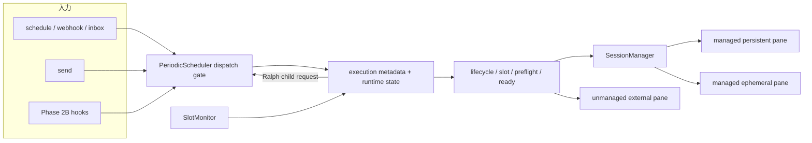
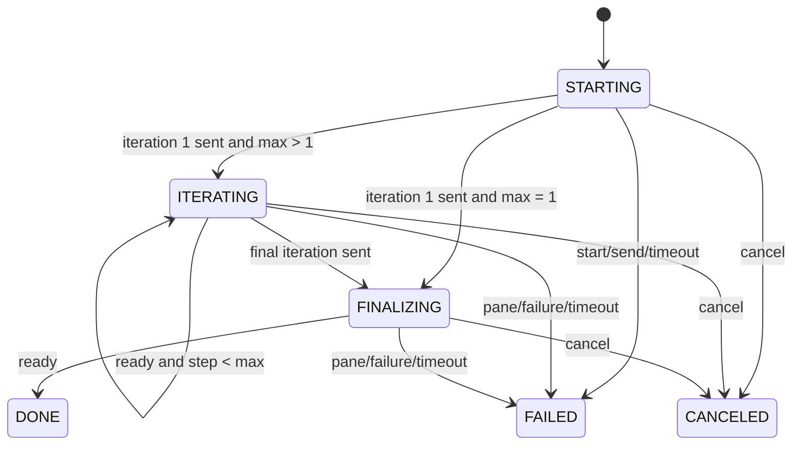
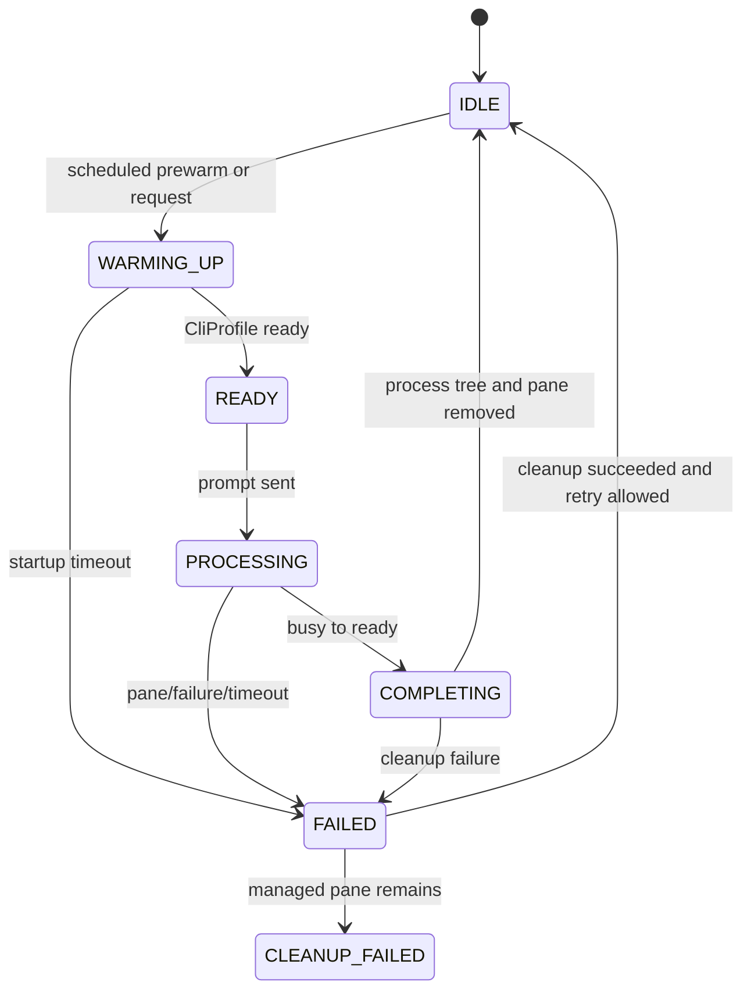

# agent-loop Phase 2 詳細設計

> 決定日: 2026-08-08  
> 対象: `tools/agent-loop/`  
> 前提: `docs/plans/2026-08-08-agent-loop-phased-enhancement-design.md`  
> 状態: 詳細設計済み・実装済み

## 1. 目的

Phase 1で確立したScheduler dispatch gate、request ID、SlotMonitor、CliProfile、lifecycleを維持しながら、実行形態、外部イベント取得、配布運用を拡張する。agent-loopは引き続き「複数種類の対話型エージェントCLIをtmux上で安全に駆動するデーモン」であり、汎用workflow engineにはしない。

Phase 2は依存関係に沿って次の3群へ分ける。

| 区分 | 目的 | 機能 |
|---|---|---|
| Phase 2A — Execution Core | paneの使い方と1要求の実行範囲を拡張 | Ralph、oneshot、session cleanup、`send --model/--sandbox/--force`、external pane |
| Phase 2B — Integrations | coreをprovider非依存のままイベント源を追加 | event fallback、GitLab hook、file watch hook |
| Phase 2C — Distribution | 実行環境の明示とzipapp更新 | environment handoff、self update |

Phase 2Aを先に完了させる。2Bは既存event hook契約だけを利用し、2Cは実行中daemonやsource checkoutを変更しない。

## 2. 不変条件と非目標

### 2.1 不変条件

- schedule、webhook、inbox、CLI send、Ralph継続要求は必ず`PeriodicScheduler`を通る。
- CLI固有のargv、model flag、ready / busy / failure判定、clear / save / exit commandはagent定義と`CliProfile`へ置く。
- `agent_cli`未指定時のkiro-cli互換経路を維持する。
- 新機能はopt-inとし、既存YAMLと既存`send`の既定動作を変えない。
- managed pane以外へprocess kill、restart、freeze recovery、session cleanupを適用しない。
- stateは`~/.agents/`配下へatomic writeし、DB、daemon socket、新規外部依存を追加しない。
- prompt本文、token値、環境変数値をlogとstateへ保存しない。

### 2.2 非目標

- 任意条件分岐を持つworkflow DSL
- daemon再起動後のRalph途中再開
- external pane内processの所有権取得
- sandbox変更の自動commit、merge、push
- GitLab以外のprovider共通SDK
- source checkout、pip、OS packageの自己更新
- update packageの署名基盤

## 3. アプローチ決定

| 案 | 実装コスト | リスク | 保守性 | 拡張性 | 学習コスト | 推奨度 |
|---|---:|---:|---:|---:|---:|---:|
| A. 既存requestへ実行metadataを追加し、Schedulerが状態を持つ | 中 | 低 | 高 | 中 | 低 | ★★★ |
| B. 機能ごとにadapter class階層を作る | 高 | 中 | 中 | 高 | 高 | ★★☆ |
| C. 独立workflow engineを追加する | 高 | 高 | 低 | 高 | 高 | ★☆☆ |

案Aを採用する。Phase 2初版では新しい抽象基底classやplugin registryを作らない。既存dict requestへ内部metadataを追加し、I/O責務が独立するsandboxとupdateだけを別fragmentへ分ける。

## 4. 全体アーキテクチャ



責務境界は次のとおりとする。

| 場所 | 追加責務 | 追加しない責務 |
|---|---|---|
| `scheduler.py` | 実行状態、Ralph継続、oneshot overlap、cleanup予約、force判定 | GitLab API、git worktree詳細、update取得 |
| `session.py` | launch spec、pane所有種別、一時paneの破棄 | iteration判断、hook event選択 |
| `semaphore.py` | chain中のslot保持、pane完了通知 | Ralph prompt生成 |
| `sendcmd.py` | CLI option検証、request metadata生成、結果表示 | daemon内状態遷移 |
| `sandbox.py` | worktreeとregistryの作成・安全なcleanup | prompt配送 |
| `update.py` | zipapp判定、候補取得・検証・置換 | daemon restart |
| `hooks/*.py` | provider/file固有取得とack state | Scheduler lifecycle |

## 5. 共通内部契約

### 5.1 Dispatch request metadata

既存requestの`meta`へ`execution`を追加する。外部公開schemaにはしない。

```json
{
  "id": "request-id",
  "source": "send",
  "entry_id": "entry-id",
  "prompt": "...",
  "meta": {
    "execution": {
      "kind": "normal",
      "root_id": "request-id",
      "step": 1,
      "max_steps": 1,
      "session_policy": "persistent",
      "session_key": "entry-id",
      "target_kind": "managed",
      "target": null,
      "model": null,
      "sandbox_id": null,
      "force_ready": false,
      "skip_preflight": false
    }
  }
}
```

許容値は固定する。

| field | 値 |
|---|---|
| `kind` | `normal` / `ralph` |
| `session_policy` | `persistent` / `oneshot` / `sandbox` / `external` |
| `target_kind` | `managed` / `external` |
| `root_id` | 通常はrequest ID、Ralph childでは最初のrequest ID |
| `step` | 1始まり。通常要求は常に1 |
| `max_steps` | Ralphのwork iteration数。通常要求は1 |

metadata欠落時はPhase 1互換の`normal + persistent + managed`へ正規化する。不明値は黙ってfallbackせずrequestを失敗させる。

### 5.2 Process-local runtime state

Schedulerは次の2つのdictを持つ。

```text
executions[root_id]
  state, entry_id, pane_id, step, max_steps, slot_lease,
  started_at, session_policy, overlap_pending, cleanup_pending

sessions[session_key]
  pane_id, ownership, generation, effective_model,
  launch_fingerprint, success_count, sandbox_id
```

- request queueは既存file/memory経路を使用する。
- activeなRalphとpane generationはprocess-localとし、daemon restart後に再開しない。
- transactional reload時、active executionは開始時の設定snapshotで完了させる。新規root requestだけが新設定を使う。
- `active_count`はchild prompt数ではなくroot execution数を数える。
- `active_count`は全root executionを数える。managed paneは全gateとslot取得後、external paneは全gateとtarget解決後、いずれも最初のprompt送信直前に1増やす。初回send失敗を含むterminal cleanup試行終了後に1減らす。ackは初回send成功後なので、managedの順序は`slot取得 → active_count加算 → send → ack`、externalは`target解決 → active_count加算 → send → ack`となる。
- `send-responses/<root-id>.json`はrootだけを追跡する。追加fieldは後方互換とする。

```json
{
  "request_id": "root-id",
  "status": "processing",
  "pane_id": "%12",
  "step": 2,
  "max_steps": 5,
  "sandbox_path": null,
  "reason": null,
  "updated_at": 1786150000.0
}
```

`reason`は固定codeだけを保存し、CLI出力本文は保存しない。

### 5.3 Launch specとpane所有権

`SessionManager`のpane起動入力を、既存引数へoptionalなlaunch specを足す形で拡張する。

```text
launch_spec:
  argv: list[str]
  env: dict[str, str]
  cwd: str
  profile_name: str
  effective_model: str | null
  ownership: managed-persistent | managed-ephemeral
```

- dictは起動時にcopyし、実行中にglobal `CliProfile`を変更しない。
- `argv`はlistのまま`shlex.join`し、modelやpathをshell文字列連結しない。
- `launch_fingerprint`はprofile名、argv、cwdのSHA-256とする。環境変数値はhashにもstateにも含めない。
- external paneはSessionManagerへ登録しない。
- SlotMonitorのtracking recordはoptionalな`CliProfile`を保持し、未指定時だけdaemon既定profileを使う。これによりexternal paneの`agent_cli`がdaemon既定と異なっても、そのpane固有のready / busy / failure判定を使う。

### 5.4 Slot lease

Ralphとcleanupは複数のpane操作を1 executionとして扱うため、最初のdispatchで取得したslotをterminal状態まで保持する。

1. 最初のrequestが`root_id`をlease IDとしてslotを取得する。
2. 中間promptを監視するときはSlotMonitorを`hold_slot=true`で登録する。
3. busy→ready後、monitor trackingだけを外し、同じpaneとlease IDを持つchild requestをpending先頭へ入れる。
4. child requestは同じleaseを確認し、slotを再取得しない。
5. DONE / FAILED / CANCELED / timeoutで一度だけslotを解放する。

既存通常requestは`hold_slot=false`のままとする。callback例外時はexecutionをFAILEDへ移し、slot、monitor、active stateを`finally`で解放する。

### 5.5 設定validation

Phase 2 fieldは`validate_entries()`で副作用なしに正規化する。

| 条件 | 結果 |
|---|---|
| `mode: ralph`で`max_iterations`なし、1未満、100超 | entry不正 |
| `oneshot`がbool以外 | entry不正 |
| `clean_session`が正整数以外 | entry不正 |
| `mode: ralph` + `oneshot: true` | 初版ではentry不正 |
| `oneshot: true` + `clean_session` | 冗長なためentry不正 |
| external target + `oneshot` / `clean_session` | ownership違反のためentry不正 |
| `--max-iterations`だけを指定 | CLI usage error |
| `--force` + `--ralph` | 初版ではCLI usage error |
| `--sandbox` + external pane | CLI usage error |

`--sandbox + --ralph + --model`はmanaged ephemeral paneとして保証する。

Phase 2の`--ralph`、`--sandbox`、`--force`、`--model`は同じworkspaceのdaemon稼働を必須とする。daemon不在時にCLI process内へScheduler相当を複製しない。plain `send`だけはPhase 1どおりstandalone sessionへfallbackする。

## 6. Phase 2A — Execution Core

### 6.1 Ralph

#### 設定とCLI

```yaml
prompts:
  - id: nightly-refactor
    name: Nightly refactor
    mode: ralph
    max_iterations: 5
    prompt: "対象を調査し、改善を実装してください"
    interval_minutes: 1440
```

```text
agent-loop send --ralph --max-iterations 5 --wait "対象を改善してください"
```

- `max_iterations`はwork promptの送信回数を表し、範囲は1〜100とする。
- iteration 1〜Nで合計N回だけ送信する。別枠のN+1回目finalizeは作らない。
- iteration Nのpromptへ「最終反復であり、未完了事項と成果要約を返す」指示を付ける。
- N=1ではoriginal promptと最終反復指示を1回のpromptへ結合する。
- continuation templateは初版では内蔵し、設定可能なprompt DSLを追加しない。

送信文は次の形式とする。

```text
[agent-loop ralph iteration 1/5]
<original prompt>

[agent-loop ralph iteration 2/5]
前回の結果を検証し、未完了の作業を続けてください。完了している場合は成果を再確認してください。

[agent-loop ralph iteration 5/5]
最終反復です。未完了事項を可能な範囲で完了し、成果・検証結果・残課題を要約してください。
```

#### 状態遷移



#### 配送規則

1. root requestだけにdebounce、event hook、preflightを適用する。
2. 最初の送信成功時にevent hook / inbox ackを確定する。loop全体の完了までは遅延しない。
3. SlotMonitorが同じpaneの完了を検知したら、次stepを`source=ralph`のchild requestとしてpending先頭へ入れる。
4. childはlifecycle stop、pane生存、lease所有を再確認する。draining中でも開始済みrootのchildだけは継続する。preflightとdebounceは再実行しない。
5. `failure_pattern`、pane死亡、response timeout、send失敗でrootをFAILEDにする。
6. `send --wait`はrootのDONE / FAILEDだけで終了する。中間readyを成功として返さない。

drain開始前にactiveだったRalphはterminalまで継続する。まだ最初のpromptを送っていないrootは破棄する。cancelはroot ID、entry、paneのいずれでもchain全体を停止する。daemon crash後は再開せず、`send --wait`はstate heartbeat消失を`daemon_lost`としてexit 1にする。

### 6.2 Oneshot

#### 設定

```yaml
prompts:
  - id: isolated-review
    name: Isolated review
    oneshot: true
    prompt: "現在の差分をレビューしてください"
    interval_minutes: 60
```

新しいwarm-up設定は追加しない。scheduled entryは既存`startup_timeout`秒前からpaneを起動でき、webhook / inbox / sendは受付後にon-demandで起動する。

warm-upだけではslotを取得しない。scheduler tickで`now >= next_run_at - startup_timeout`になった時点から起動を1回試し、発火時刻にまだreadyでなければrequestをdeferする。起動失敗時は発火時刻まで次tickで再試行し、発火後は通常のpending retryへ移る。

#### 状態とoverlap

pane lifecycleと次回要求の保留を分ける。



- `overlap_pending`はstateではなくentry runtimeのbooleanとする。
- PROCESSING / COMPLETING中の同一entry発火は1件だけcoalesceする。本文は最初の保留要求を保持し、後続は`oneshot_overlap_coalesced`として成功扱いで破棄する。
- cleanup完了後にpendingがあれば、新しいpane generationを作って1件実行する。
- `sync_entries()`はoneshot paneをdaemon起動時に一括作成しない。
- pane keyはentry ID、generationは起動ごとに増加させ、古いmonitor callbackが新paneを解放しないよう`pane_id + generation`を照合する。
- busy→ready後のCOMPLETINGではslotを保持し、managed process cleanupが終わってから解放する。

cleanupは既存managed process tree cleanupを使う。prompt送信前のstartup失敗は同じrequestをrequeueし、cleanup成功後にIDLEから再試行する。送信済みまたは送信成否不明のrootは重複防止のためFAILEDで確定し、再送しない。保持済みoverlapはcleanup成功後に別rootとして実行する。managed paneが残った場合はCLEANUP_FAILEDとしてcleanupだけを次tickで再試行し、新generationを起動しない。

### 6.3 Session cleanup

#### CLI契約の拡張

`agents/<name>.json`の`interactive`へ次をoptional追加する。

```json
{
  "interactive": {
    "save_command": "/save",
    "clear_command": "/clear",
    "exit_command": "/quit"
  }
}
```

- 未定義または空文字は「その操作をサポートしない」を表す。
- coreはCLI名からcommandを推測しない。
- `CliProfile`は値を公開するだけで、cleanup時機を判断しない。

#### 実行契約

```yaml
prompts:
  - id: long-running-worker
    clean_session: 10
    prompt: "キューを1件処理してください"
    interval_minutes: 10
```

- `clean_session: N`は同じpane generationでN件のroot executionがDONEになった後、次の業務request前にcleanupする。
- send成功ではなくSlotMonitor完了時に`success_count`を増やす。
- FAILED / CANCELEDは数えない。
- counterはprocess-localであり、daemonまたはpane再起動時に0へ戻る。
- N件目の完了後はslotを保持したままcleanupし、同じpaneへの新規要求をdeferする。

対話CLIでは、定義されているcommandだけを`save → clear → exit`の順に送り、各command後にreadyまたはpane終了を既存startup timeout内で待つ。commandが未定義でも停止せず次へ進む。最後は必ずmanaged process cleanupでpaneを破棄し、次回requestが新paneを作る。

`no_interactive`相当のsession launchではcommandを送らず、直ちにprocess cleanupする。command timeoutや送信失敗はwarningとし、元のroot executionはDONEのまま、cleanup結果だけをhealthへ記録する。

最終managed process cleanupが失敗した場合も元rootはDONEを維持するが、sessionを`cleanup_failed`にしてregistryとpane IDを保持する。slotはcleanup試行終了時に解放し、次tickでcleanupだけを再試行する。pane死亡を確認するまで新pane generationと次requestを開始しない。

### 6.4 `send --model MODEL`

- modelは既存agent定義の`{model}`または`model_flag`を使ってargvへ組み込む。
- model文字列はargvの1要素として渡し、shell展開しない。
- request metadataへ`model`を保存するが、promptやcredentialは保存しない。
- 新規paneでは指定modelからlaunch specを作る。
- 既存paneでは`effective_model`が同じ場合だけ再利用する。
- 既存paneのmodelが不明または異なる場合は`model_mismatch`で明示失敗する。実行中CLIへmodel変更commandを送らない。
- `send --model`を既存entry名へ送る場合も、そのentryのeffective modelと一致しなければ失敗する。

### 6.5 `send --sandbox`

#### 作成

1. CLIが`git -C <cwd> rev-parse --show-toplevel`でrepository rootを解決し、requestへcanonical rootを記録する。
2. repositoryでなければ送信前にusage errorとする。
3. daemonがlifecycleとpreflight通過後にrootを再検証し、`~/.agents/sandboxes/<sandbox-id>/worktree`を作成先とする。
4. daemonが`git worktree add --detach <path> HEAD`をshellなしで実行する。
5. registryをatomic writeしてから、sandbox専用managed ephemeral paneをそのcwdで起動する。

source worktreeがdirtyでもHEADからsandboxを作れるが、未commit変更は含まれない旨を表示する。自動stash、copy、commitはしない。

```json
{
  "version": 1,
  "id": "sandbox-id",
  "repo_root": "/repo",
  "path": "/home/user/.agents/sandboxes/id/worktree",
  "request_id": "root-id",
  "owner_pid": 1234,
  "status": "active",
  "created_at": 1786150000.0,
  "last_used_at": 1786150000.0
}
```

#### cleanup

- `--wait`のterminal後、paneを止めてから`git status --porcelain`でworktreeがcleanか確認する。
- cleanなら`git worktree remove <path>`を実行し、成功後にregistry directoryを削除する。
- dirty、git判定不能、remove失敗なら削除せずpathを表示する。`--force`でworktreeを削除する機能は作らない。
- 非waitは受付時にpathを表示し、自動cleanupしない。
- wait有無にかかわらずterminal後にsandbox用paneは停止する。非waitで保持するのはworktreeとregistryだけである。
- terminal時に`owner_pid`をnull、`last_used_at`を現在時刻へ更新する。非wait保持は`retained_nonwait`、wait時のdirty保持は`retained_dirty`、pane停止またはworktree判定失敗は`cleanup_failed`とする。
- daemon起動時、24時間以上更新がなくowner PIDが死亡し、cleanなsandboxだけをcleanup候補として処理する。dirty sandboxはwarningだけにする。
- repository root、`~/.agents/` root、未解決pathを再帰削除対象にしない。

### 6.6 `send --force`

`--force`が迂回できるのは次だけとする。

- `CliProfile.is_ready()`によるvisual ready判定
- requestのpreflight

次は迂回しない。

- agent-control stop / pause、node budget、local pause、drain
- `max_concurrent`とslot lease
- 同じpaneを追跡しているactive SlotMonitor。managed / externalを問わない
- pane存在確認とtmux send error
- external paneのtarget解決

したがって、UIがbusy表示でもagent-loopがactive executionを所有していないpaneへは送れるが、managed / externalを問わずagent-loopが追跡中のpaneへ割り込まない。この境界によりcompletion callbackの上書きとslot漏れを防ぐ。

### 6.7 External pane

#### 設定

```yaml
external_panes:
  - name: existing-reviewer
    tmux_target: review:0.1
    agent_cli: codex

prompts:
  - id: external-review
    target: existing-reviewer
    prompt: "現在の差分をレビューしてください"
    interval_minutes: 60
```

- `name`は一意かつ必須、`tmux_target`はtmux target文字列、`agent_cli`はoptionalで未指定時はdaemon既定profileを使う。
- 設定load時にagent定義を検証するが、tmux targetの生存はdispatch時に解決する。
- pane IDはtmux再作成で変わるため永続保存せず、毎回`display-message`で解決する。

external paneへ適用するもの:

- lifecycle、preflight、debounce、ready判定、send error
- SlotMonitorによる完了観測と`send --wait`状態更新。ただしsemaphore slotは取得しない。

適用しないもの:

- pane起動・再起動、process cleanup、freeze / RSS recovery
- session cleanup、oneshot、sandbox、model切替
- managed pane registryと`cancel`による停止

target死亡時はrequestをpendingへ保持してwarningを出す。drain時は未開始requestとして破棄する。external paneのactive観測中にpaneが死亡した場合はrequestをFAILEDにする。

## 7. Phase 2B — Integrations

### 7.1 共通hook原則

- Schedulerのhook契約はPhase 1の`check(hook_config) -> None | str | dict`と配送成功後`ack()`を維持する。
- provider固有stateは`~/.agents/hooks/<entry-hash>/`へ置く。`entry-hash`はSHA-256(entry ID)の先頭16桁とする。
- `check()`は候補を選ぶだけで配送済みにしない。ack対象をprocess内に1件保持し、`ack()`でstateをatomic確定する。配送対象を持たない初回baseline保存だけはこの原則の例外とする。
- 同じentryのhookはackまたは失敗確定まで並行実行しない。
- hook module cacheは`(resolved_path, entry_id)`をkeyとし、同じhook fileを複数entryが使ってもpending ackを共有しない。
- hook timeout、API error、走査上限超過は`None`を返して他entryを止めない。
- token値、payload全文、file本文をlog/stateへ保存しない。

### 7.2 Event fallback

```yaml
event_hook: ~/.agents/hooks/gitlab-issue-hook.py
event_hook_config:
  replay_events: true
  replay_cooldown_minutes: 60
  fallback_after_minutes: 180
  fallback_prompt: "更新はありません。open issueを1件点検してください。"
```

選択順序は固定する。

1. **new event**: 前回snapshotより新規または`updated_at`が変化した対象。`updated_at`の古い順で1件。
2. **replay**: `replay_events=true`の場合、未replayまたはcooldown経過済みのopen対象を`updated_at`の古い順で1件。
3. **fallback**: 最後の実eventから`fallback_after_minutes`経過した場合だけ固定`fallback_prompt`。
4. いずれも該当しなければ`None`。

```json
{
  "version": 1,
  "seen": {"issue:123": "2026-08-08T00:00:00Z"},
  "replayed_at": {"issue:123": 1786150000.0},
  "last_event_at": 1786150000.0,
  "last_fallback_at": 1786150000.0
}
```

new/replayのstate更新とfallback時刻はack時だけ確定する。daemon crash後に同じ候補が再選択される可能性は許容し、hook deliveryはat-least-once寄りとする。

初回checkでは取得結果をbaselineとして保存し、`last_event_at`をcheck時刻へ初期化して配送しない。したがって初回起動直後に既存対象全件やfallbackを送らない。

### 7.3 GitLab hook

Issue/MR hookは共通の小さなGitLab client helperを同梱hook間で共有し、Schedulerへprovider知識を追加しない。

接続先の解決順:

1. 対象cwdの`git remote get-url origin`からhostとproject pathを解決する。
2. workspaceの`.agents/connections.yaml`で同hostの`gitlab`接続を探す。
3. `~/.agents/connections.yaml`で同hostの接続を探す。
4. 見つからなければremoteのHTTPS hostと既定`/api/v4`を使う。

connections fileの対象部分は次の固定schemaとする。`host`はportを含めてもよいがschemeとpathを含めない。

```yaml
gitlab:
  - name: internal
    host: gitlab.example.com
    api_url: https://gitlab-api.example.com/api/v4
    public_url: https://gitlab.example.com
    token_env: GITLAB_TOKEN_INTERNAL
```

tokenの解決順:

1. connectionに`token_env`があれば、その環境変数。
2. `GITLAB_TOKEN`。
3. `GL_TOKEN`。

平文token fieldは受理せず、環境変数名だけを設定する。3段階すべて未設定なら認証errorとして配送しない。

SSH remoteは`git@host:group/project.git`、HTTPS remoteはURL parserで解決する。credential入りremote URLからuser infoを捨て、logへ出さない。公開URLがconnectionにある場合、API応答URLは`urllib.parse`でschemeとhostだけを公開URLへ置換し、path/query/fragmentは維持する。

HTTPは標準libraryを使い、connect/read合計15秒、最大body 5 MiB、2xxだけを成功とする。401/403は認証error、429/5xxは一時errorとしてwarningに分類するが、hook内で自動retryしない。次回scheduler tickへ委ねる。

IssueとMRのevent keyは`project_path + kind + iid`、versionは`updated_at`とする。open対象だけをreplay候補にし、promptへ必要fieldだけを整形して渡す。

### 7.4 File watch hook

```yaml
event_hook: ~/.agents/hooks/file-watch-hook.py
event_hook_config:
  watch_dirs: [src, tests]
  patterns: ["**/*.py", "**/*.md"]
  ignore_patterns: ["**/__pycache__/**", "**/.venv/**"]
  max_files: 10000
```

走査規則:

- `watch_dirs`はentry cwd基準で解決し、存在するdirectoryだけを対象とする。
- symlink directoryを辿らない。`.git`は常に除外する。
- relative pathをPOSIX形式へ正規化し、標準library `fnmatch`でinclude後にignoreを適用する。
- snapshotは`path -> {mtime_ns, size}`だけとし、本文とhashを読まない。
- path昇順でadded、changed、deletedを返す。1回のcheckでは全差分を1 promptへまとめる。
- 初回はbaselineを保存して`None`を返す。既存file全件を変更扱いにしない。
- `max_files`超過または走査error時は旧snapshotを維持し、配送しない。
- 差分snapshotは配送成功後の`ack()`でだけ確定する。送信失敗時は次回再検出する。

返却varsは次に限定する。

```json
{
  "added": ["src/new.py"],
  "changed": ["src/main.py"],
  "deleted": ["tests/old_test.py"],
  "change_count": 3
}
```

## 8. Phase 2C — Distribution

### 8.1 Environment handoff

pane起動時、現在暗黙継承している環境を明示化する。

- `HOME`: daemon起動時に解決したuser home。値を変更せずtmuxへ明示する。
- `AGENT_HOME`: `agent_home_dir()`で新旧互換を解決したpath。
- agent定義の`env`: launch specへmergeする。
- request単位の任意env注入は許可しない。

promptへ環境情報を付ける機能はopt-inとする。

```yaml
environment_handoff:
  prompt: true
  skill_home: ~/.agents/skills
  token_env_names: [GITLAB_TOKEN, GITHUB_TOKEN, OPENAI_API_KEY]
```

付加内容は次の固定形式とする。

```text
[ENV]
os=darwin
shell=powershell|wsl|posix
agent_cli=codex
agent_home=/home/user/.agents
skill_home=SET|UNSET
token.GITLAB_TOKEN=SET|UNSET
[/ENV]
```

- `skill_home`はoptionalな既存directoryだけを展開して渡し、未設定・不存在なら`UNSET`とする。
- token名は`[A-Z_][A-Z0-9_]*`だけを受理し、値を渡さない。
- `PATH`、全環境変数一覧、credential値をpromptへ含めない。
- OS判定不能時は`unknown`とし、dispatchを止めない。
- `[ENV]`はroot promptだけへ付け、Ralph childには重複付加しない。

### 8.2 Self update

#### 対象判定

`agent-loop update`は次をすべて満たす場合だけ動作する。

1. 実行fileがregular fileかつ`zipfile.is_zipfile()`である。
2. zipapp内にinstall時生成された`build-info.json`がある。
3. 同じresolved zipappを使うdaemonが稼働しておらず、更新用exclusive lockを取得できる。
4. 実行fileと親directoryが現在userに書込み可能である。

source checkout、symlink、pip/OS package経由では理由を表示して非0終了する。

排他には`~/.agents/update-locks/<executable-hash>.lock`への`fcntl.flock`を使う。`executable-hash`はresolved実行pathのSHA-256先頭16桁とする。zipapp daemonは起動から終了までshared lockを保持し、`update`はtransaction全体でexclusive non-blocking lockを保持する。これにより確認後から置換までのdaemon起動競合も防ぐ。tmuxを前提とするPOSIX / WSLが対象であり、`fcntl`を使えない環境ではupdateを無効にする。

`build-info.json`にはsecretを含めず、次だけを持つ。

```json
{
  "version": 1,
  "commit": "git-sha",
  "remote": "https://example/repository.git",
  "branch": "main",
  "built_at": "2026-08-08T00:00:00Z"
}
```

#### 更新transaction

1. exclusive update lockを取得し、失敗時は稼働daemonありとして非0終了する。
2. `git ls-remote <remote> refs/heads/<branch>`でremote commitを取得する。
3. commitが同じなら何も変更せずexit 0。
4. `mkdtemp`配下へshallow sparse checkoutし、`tools/agent-loop`、`tools/agent-tools/agentcore`、`agents`だけを取得する。
5. 標準library`zipapp`で候補fileを作り、同梱agentcoreとbuild-infoを含める。
6. 候補に対して`--version`、`doctor --json`の副作用なし診断、Python importを実行する。
7. 現行fileと同じdirectoryへ一時fileを置き、modeを引き継いで`os.replace`する。
8. 成功後に新commitを表示する。実行中のupdate process自身は旧codeのままなので、次回起動から新codeになると表示する。

取得、build、検証、同directory一時file作成、`os.replace`のどこかで失敗した場合は一時物を可能な範囲で削除してexit 1とし、現行zipappを変更しない。replace成功後の一時directory削除失敗だけはwarningとする。daemonを自動停止・再起動しない。git transportが信頼境界であり、署名検証が必要になった時点で再設計する。

## 9. Lifecycle、reload、失敗契約

### 9.1 Lifecycle

| 操作 | Ralph | oneshot | sandbox | external pane |
|---|---|---|---|---|
| pause | active chainは継続、次root停止 | active完了、次世代起動停止 | active継続 | active観測継続 |
| resume | 新規root再開 | prewarm再開 | 変更なし | 新規配送再開 |
| cancel | chain全体FAILED/CANCELED、managed pane停止 | generation停止・保留破棄 | pane停止後、安全ならcleanup | 停止拒否。観測だけ解除しrequest失敗 |
| drain | active chain完了を待つ | active cleanupまで待つ、overlap破棄 | active完了を待つ | active観測完了を待つ |
| stop | 既存Phase 1どおり即時終了 | managed cleanup | registry保持 | paneへ触れない |

### 9.2 Reload

- active executionは開始時snapshotで完了する。
- 同じentry IDの`success_count`とoneshot overlapは継承する。
- `mode`、target、session policyが変わったentryは、active完了後から新設定を使う。
- external pane mapは全件validate後にatomic交換する。不正時は旧mapを維持する。
- 削除entryの未開始requestは破棄し、active executionは完了またはcancelまで追跡する。

### 9.3 Failure table

| failure | detection | action | root result |
|---|---|---|---|
| Ralph child send失敗 | tmux rc | chain終了、slot解放 | FAILED |
| Ralph iteration timeout | SlotMonitor | chain終了、managed paneは既存policyで回復 | FAILED |
| oneshot startup timeout | ready timeout | pane cleanup、overlap保持 | FAILED |
| cleanup command timeout | ready/death timeout | warning後process cleanup | 元requestはDONE |
| final process cleanup失敗 | pane生存 | `cleanup_failed`で再試行、次dispatch停止 | clean_sessionはDONE、oneshot/sandboxはFAILED |
| model mismatch | launch metadata | 送信しない | FAILED |
| sandbox dirty | porcelain非空 | worktree保持、path表示 | 実行結果を維持 |
| force + active owned pane | SlotMonitor ownership | defer | 未開始 |
| external target死亡 | tmux解決失敗 | pending保持 | 未開始 |
| GitLab auth/API error | HTTP status | state維持、次tick | 未配送 |
| file走査上限 | file count | snapshot維持 | 未配送 |
| update検証失敗 | subprocess rc | 現行file維持 | update非0 |

terminal cleanupはすべて冪等にする。通常/Ralph persistentは`monitor解除 → slot解放 → active state終了`とする。oneshot、clean session、sandboxはslotとactive stateを保持したまま`monitor解除 → managed pane cleanup試行 → sandbox cleanup試行`を行い、`finally`で`slot解放 → active state終了`とする。paneが残った場合は`cleanup_failed`を保持して後続dispatchを止めるが、slotは占有し続けない。

## 10. State layout

```text
~/.agents/
├── send-requests/                         # Phase 1
├── send-responses/<root-id>.json          # Phase 2 fieldをadditive追加
├── hooks/<entry-hash>/                      # SHA-256(entry-id)の先頭16桁
│   ├── events.json                        # event fallback / GitLab
│   └── file-snapshot.json                 # file watch
└── sandboxes/<sandbox-id>/
    ├── registry.json
    └── worktree/
```

Ralph iteration、oneshot generation、clean_session counterはprocess-localとし、新しい永続stateを作らない。daemon crash後の曖昧な自動再開を避けるためである。

## 11. CLIと設定の受入契約

追加CLI:

```text
agent-loop send [--model MODEL] [--sandbox] [--force]
                [--ralph --max-iterations N] [--wait] PROMPT
agent-loop update
agent-loop --version
```

追加YAML:

```yaml
environment_handoff:
  prompt: false
  skill_home: null
  token_env_names: []

external_panes: []

prompts:
  - mode: normal              # normal | ralph
    max_iterations: null      # ralph時必須
    oneshot: false
    clean_session: null
    target: null              # external_panes.name
```

未知fieldの扱いは既存YAML policyに合わせるが、既知Phase 2 fieldの型・組合せ不正はreload全体を失敗させ、現行設定を維持する。

## 12. Verification strategy

### 12.1 Unit / contract

| 対象 | 必須ケース |
|---|---|
| metadata normalization | 欠落互換、不明値、組合せ不正 |
| launch spec | model argv、env、fingerprint、global profile非変更 |
| Ralph | N=1、N>1、最終prompt、child順序、slot保持、callback例外 |
| oneshot | prewarm、on-demand、generation照合、overlap 1件 |
| clean session | N回成功、失敗非加算、command欠落、timeout |
| sandbox | repo外、dirty source、clean cleanup、dirty保持、stale PID |
| force | ready/preflight迂回、lifecycle/slot/active ownership非迂回 |
| external pane | target再解決、死亡保持、管理系操作拒否 |
| event fallback | new → replay → fallback、cooldown、ack前未確定 |
| GitLab | remote形式、connection順、token state非露出、URL host置換 |
| file watch | baseline、add/change/delete、ignore、symlink、上限、ack |
| environment | allowlist、SET/UNSET、値非露出、Ralph rootだけ |
| update | source拒否、同version、候補失敗、atomic replace |

### 12.2 Integration

1. Ralph N=3が同じpaneと1slotで3回送信し、root `--wait`だけが完了する。
2. Ralph中の別requestが同paneへ割り込まず、別paneは空きslotがあれば動く。
3. oneshot完了後にprocess tree、pane、monitor、slotが残らない。
4. oneshot処理中の3回発火が1件へcoalesceされる。
5. clean_session N件目の後、次requestが新pane generationで動く。
6. sandbox + model + Ralph完了後、cleanならworktreeが消え、dirtyなら残る。
7. external paneへ送信できるがcancel / freeze recoveryがpaneを停止しない。
8. GitLab/file hookが送信失敗時に同じeventを再提示し、成功ack後に進む。
9. update候補検証失敗時、現行zipappのdigestが変わらない。

実agent CLIは必須にせず、tmux、git、HTTPはsubprocess/localhost境界でstubまたはtemporary repositoryを使う。最低1本だけ実tmux E2Eを置き、CLIごとの文字列期待はagent定義contract testへ置く。

### 12.3 Security / destructive checks

- model、tmux target、git pathにshell metacharacterを含めてもargv 1要素のまま扱う。
- token値がlog、state、prompt、exceptionへ出ない。
- sandbox cleanupがregistry外path、dirty path、repo rootを削除しない。
- external pane PIDへsignalを送らない。
- update失敗時に現行binaryを上書きしない。

## 13. 実装順序とPR境界

### Phase 2A

| PR | 内容 | 依存 | 完了条件 |
|---:|---|---|---|
| 2A-1 | metadata、runtime state、launch spec、slot lease | Phase 1 | 既存test無変更で通り、通常dispatchの挙動差なし |
| 2A-2 | Ralph | 2A-1 | N回、terminal cleanup、wait/cancel/drain test |
| 2A-3 | Oneshot | 2A-1 | prewarm、generation、overlap、cleanup test |
| 2A-4 | Session cleanup + agent定義command | 2A-1 | shared schema/golden test、N回cleanup test |
| 2A-5 | `send --model` | 2A-1 | 同model再利用、不一致error、全CliProfile contract |
| 2A-6 | Sandbox | 2A-1 | safe create/cleanup、dirty保持 |
| 2A-7 | Force | 2A-1 | 迂回可能/禁止境界test |
| 2A-8 | External pane | 2A-1 | target解決、管理除外、wait test |

### Phase 2B

| PR | 内容 | 依存 | 完了条件 |
|---:|---|---|---|
| 2B-1 | Event fallback state | Phase 1 hook契約 | priority/cooldown/ack test |
| 2B-2 | GitLab helper + Issue/MR hook | 2B-1 | 接続解決、HTTP failure、secret非露出 |
| 2B-3 | File watch hook | 2B-1 | deterministic diff、上限、ack test |

### Phase 2C

| PR | 内容 | 依存 | 完了条件 |
|---:|---|---|---|
| 2C-1 | Environment handoff | 2A-1 | pane envとprompt redaction test |
| 2C-2 | build-info / version | なし | source/zipapp両経路のversion表示 |
| 2C-3 | Self update | 2C-2 | candidate validationとatomic replace test |

各PRで`tools/agent-loop/README.md`、`agent-loop.yaml.example`、対象testを同期する。shared agent schemaを変える2A-4はagentcore golden testも同じPRに含める。

## 14. リリースゲート

| Gate | 条件 |
|---|---|
| Phase 2A GA | 全機能がopt-in、Phase 1 suite無回帰、slot/pane/worktree leakなし |
| Phase 2B GA | provider停止時もScheduler継続、ack前state非確定、secret非露出 |
| Phase 2C GA | source環境を変更せず、update失敗時に現行zipapp digest維持 |

2A-1の内部seamだけを先にmergeしても利用者向け挙動は変えない。各機能は個別PR単位でrelease可能とし、Phase 2全体の一括mergeを要求しない。

## 15. Observability

追加event:

```text
execution_started
execution_step_started
execution_step_completed
execution_terminal
oneshot_warming
oneshot_overlap_coalesced
session_cleanup_started
session_cleanup_completed
sandbox_created
sandbox_retained
external_target_unavailable
hook_replay_selected
hook_fallback_selected
update_candidate_verified
```

全eventに`request_id/root_id`、`entry_id`、`pane_id`、`step/max_steps`を必要な範囲で付ける。prompt、token値、full argv、file本文は付けない。`loop-state`には`active_executions`の件数とkind別件数だけを追加し、詳細promptを持たせない。

## 16. 残留リスクと再評価条件

- Ralphはpane表示による完了判定に依存する。CLI表示変更時はagent定義更新が必要。
- daemon crashでRalphを再開しないため、長いloopは最初からやり直しになる。
- external paneはagent-loop外の人間入力と競合し得る。`--force`以外はready判定を優先する。
- file watchはmtime/sizeが同じ内容変更を検知できない。実害が確認された場合だけcontent hash optionを追加する。
- GitLab transportはgit remote/connection設定を信頼する。署名済みeventやOAuth更新は別設計とする。
- self updateはgit transportを信頼し、package署名を行わない。配布先が複数組織へ拡大した時点で再評価する。

次の場合は汎用execution abstractionを再検討する。

1. adapterがRalph以外に2種類以上増える。
2. 分岐、並列fan-out、checkpoint再開が必要になる。
3. daemon restart後の実行再開が必須になる。
4. local tmux以外のremote executorを扱う。

## 17. 既存スキルとの関係

- `failure-driven-development`: slot leak、重複送信、dirty worktree削除、update破損のfailure contractに使用する。
- `contract-driven-development`: agent CLI schema、dispatch metadata、hook ackの境界検証に使用する。
- `test-driven-development`: 各PRで正常・境界・失敗の最小testを先行させる。
- `systematic-debugging`: 実tmuxとCLI表示差による失敗だけを再現・原因特定する。
- `observability-designer`: 外部基盤を増やさずrequest IDとstateで診断可能にする。

既存スキルは実装・検証を支援するが、Phase 2のruntime責務自体とは重複しない。

## 18. Decision Record

| 項目 | 内容 |
|---|---|
| 決定日 | 2026-08-08 |
| 決定者 | ユーザー |
| 採用案 | Phase 2を2A Execution Core、2B Integrations、2C Distributionへ分割し、既存requestへmetadataを追加する |
| 却下案 | 13機能の一括実装（変更範囲と失敗半径が大きい）、Ralph等だけへの縮小（画像候補の外部連携・配布要件を満たさない）、汎用workflow engine（現時点では過剰） |
| 主な理由 | マルチエージェントCLI互換とPhase 1 dispatch gateを維持し、機能を独立PRで安全に導入できる |
| トレードオフ | Ralph restart再開、任意workflow、sandbox自動成果取込、update署名は持たない |
| 再評価条件 | adapter増加、checkpoint再開、remote executor、組織横断配布署名が必要になった場合 |
