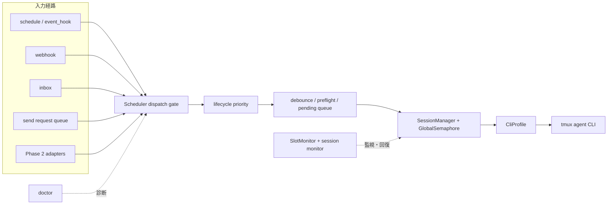
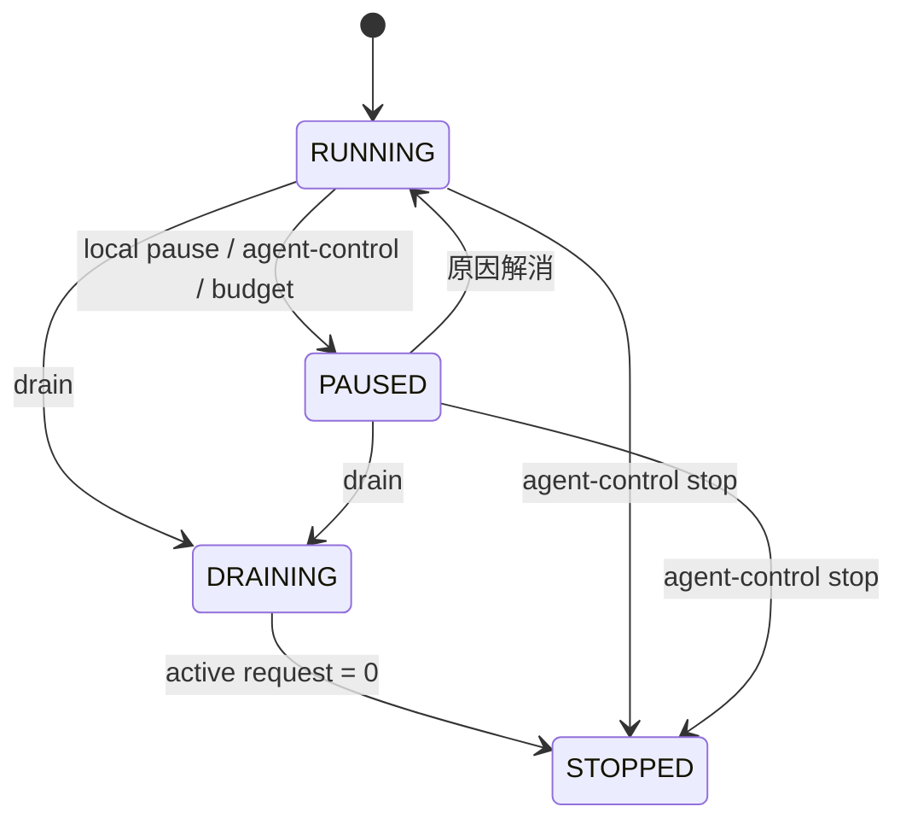
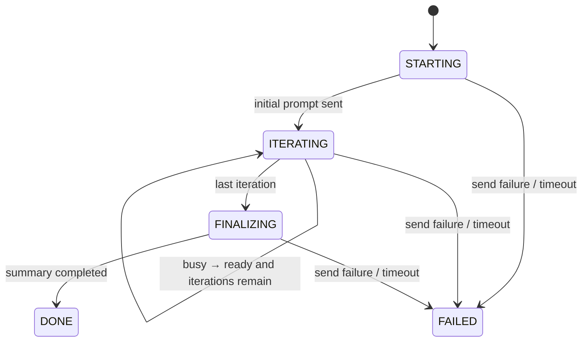

# agent-loop 段階的機能拡張 設計書

> 決定日: 2026-08-08  
> 対象: `tools/agent-loop/`  
> 関連: `docs/designs/agent-loop-design.md`、`tools/agent-loop/DESIGN.md`  
> 状態: 設計承認済み・Phase 1 実装済み（Phase 2 未実装）

## 1. 概要

別forkのkiro-loopで検討された拡張を、現在のagent-loopへそのまま移植するのではなく、既存のマルチエージェントCLI対応と外部契約を保ったまま段階導入する。

- **Phase 1 — Core Reliability**: 配送、実行制御、復旧、診断を強化する。agent-loopの役割は「複数の対話型エージェントCLIへプロンプトを安全に送るデーモン」のまま変えない。
- **Phase 2 — Execution Extensions**: Ralph、oneshot、sandbox等の新しい実行形態を、Phase 1の配送経路を使うadapterまたはsession policyとして追加する。

設計の中心は、既存の`PeriodicScheduler`を唯一のdispatch gateにすることにある。schedule、event hook、webhook、inbox、CLI sendは外部形式を維持したまま、内部では同じ配送判定を通る。

## 2. 背景と現状

現在のagent-loopには次が実装済みである。

- `agents/<name>.json`と`CliProfile`によるkiro-cli / claude / codex等の差し替え
- schedule、event hook、inbound webhook、agent inbox
- tmux session管理、ファイルベースセマフォ、SlotMonitor
- agent-control、node-budget、session commands、グローバル指示注入
- event hookの配送成功後`ack()`

一方、実装経路には次の差がある。

- scheduleとwebhookはSchedulerを通るが、inboxと対話コマンドのsendは別経路で直接送信する。
- `max_concurrent`到達時のpane queueが設計資料に記載されている一方、現在のSchedulerは発火をスキップする。
- CLIの`send`は処理完了を待たないが、出力上は「完了」と表示する。
- `set_entries()`は設定の完全検証とruntime stateの継承を分離しておらず、reloadをtransactionalに行えない。
- dead paneの再起動はあるが、freeze、入力残留、子孫process、memory pressureの回復契約はない。
- webhookは実装済みだが、実HTTPを使うE2Eがagent-loop側にない。

## 3. 目標と不変条件

### 3.1 目標

1. すべての入力経路に同じlifecycle、preflight、slot、ready判定を適用する。
2. busyや同時実行上限を理由に、受付前の要求を消失させない。
3. 自動復旧が重複送信や無関係processの停止を起こさない境界を定義する。
4. 設定不正時に稼働中のdaemonとpaneを維持する。
5. ログと状態ファイルだけで、停止理由と保留理由を診断できるようにする。

### 3.2 不変条件

- エージェントCLI固有の起動argv、ready / busy / failure判定、clear command、skill prefixは`CliProfile`またはagent定義に置く。
- `agent_cli`未指定時のkiro-cli経路を維持する。
- webhook、inbox、agent-control、node-budgetの公開ファイル契約を変更しない。
- 実送信は既存の`SessionManager`と`_send_to_pane()`を使う。
- stateは`~/.agents/`配下へ置き、DB、daemon socket、新規外部依存を追加しない。
- cron entryはadaptive intervalの対象にしない。
- 自動中断を伴うfreeze / RSS recoveryはopt-inとする。
- Phase 2の機能もPhase 1のdispatch gate、lifecycle、slot、CliProfileを迂回しない。

### 3.3 非目標

- エージェントCLI本体の改造
- exactly-onceまたはat-least-onceの永続配送保証
- 汎用ワークフローエンジンの構築
- OpenTelemetry、Prometheus、外部監視SaaSの導入
- kiro-loop旧系統の同時改修

## 4. アプローチ比較

| 案 | 概要 | 実装コスト | リスク | 保守性 | 拡張性 | 学習コスト | 推奨度 |
|---|---|---:|---:|---:|---:|---:|---:|
| A | 既存Schedulerを唯一のdispatch gateにする | 中 | 低 | 高 | 高 | 低 | ★★★ |
| B | 各機能を現在の呼び出し箇所へ個別追加する | 低 | 高 | 低 | 低 | 低 | ★☆☆ |
| C | 汎用workflow/state machineへ再設計する | 高 | 高 | 中 | 高 | 高 | ★☆☆ |

案Aを採用する。新しい実行基盤は作らず、現在の`PeriodicScheduler`、`SessionManager`、`GlobalSemaphore`、`SlotMonitor`、`CliProfile`を拡張する。

## 5. 全体アーキテクチャ



Phase 1では既存のentryごとの長寿命paneを維持する。`max_concurrent`はpane poolの大きさではなく、同時に処理中にできるdispatch数として扱う。上限到達時はrequestをFIFOで保留し、同じentryの定期発火は最大1件へcoalesceする。

## 6. 内部dispatch request

入力元を次の最小共通形式へ正規化する。外部公開スキーマにはしない。

| フィールド | 用途 |
|---|---|
| `id` | 重複排除、ログ相関、`--wait`追跡 |
| `source` | `schedule` / `hook` / `webhook` / `inbox` / `send` / Phase 2 adapter |
| `entry_id` | 設定entryとの対応 |
| `prompt` | 送信本文 |
| `cwd` | 実行directory。未指定はentry既定 |
| `priority` | `high` / `normal` / `low` |
| `created_at` | FIFO順序 |
| `dedupe_key` | `entry_id + prompt`のhash |
| `ack` | event hook配送成功後の通知情報 |

処理順序は固定する。

```text
入力受付
→ lifecycle判定
→ debounce
→ event_hook / preflight
→ session準備
→ slot取得
→ CliProfile ready判定
→ tmux送信
→ ack
→ 完了監視
```

## 7. Phase 1 — Core Reliability

### 7.1 入力経路ごとの保証

| 入力元 | 保留方法 | 処理済みになる時点 |
|---|---|---|
| schedule | entryごとに最大1件をmemory保持 | tmux送信成功 |
| event hook | hook側状態と未ack | tmux送信成功後の`ack()` |
| webhook | 既存bounded deque | Scheduler受付時 |
| inbox | 既存JSON file | tmux送信成功後に`.processed/`へ移動 |
| CLI send | `~/.agents/send-requests/` | Schedulerのdispatch queue受付時 |

CLI sendは一時fileへ書いてから`os.replace`する。highはqueue先頭、normalとlowは末尾へ入れる。同じ`entry_id`と本文の要求が既定3秒以内に再受付された場合は成功扱いで破棄する。本文またはentryが異なる要求は送信する。

daemonが受付した後のprocess crashに対する永続再送はPhase 1の保証外とする。送信済みか不明な要求を自動再送して作業を重複させるより、既存のat-most-once方針を維持する。

### 7.2 `send --wait`

既定の`send`はqueue受付後に終了する。`--wait`だけが対象paneのbusy遷移とready復帰を待つ。

| 結果 | exit code |
|---|---:|
| busy後にreadyへ復帰 | 0 |
| pane/process終了、またはagent定義のoptional `failure_pattern` | 1 |
| `response_timeout`超過 | 2 |

`failure_pattern`未定義のCLIでは、pane/process終了以外を失敗とは推測しない。CLI固有の文字列をagent-loop coreへ追加しない。

### 7.3 Event hookとpreflight

Event hookは後方互換で次を許可する。

```python
check()                 # 既存
check(hook_config)      # 追加
```

戻り値は`None`、完成済みprompt文字列、または次のdictとする。

```python
{
    "prompt": "Issue {issue_iid} を処理してください",
    "cwd": "/workspace/project",
    "vars": {"issue_iid": 123}
}
```

`vars`は既存Webhookと同じ`str.format_map`へ渡す。Mustache、lookup map等の新しいtemplate言語は追加せず、複雑な変換はhook内で行う。`cwd`は存在するdirectoryだけを受理する。

Schedulerの待機上限は30秒とする。Python threadは強制終了せず、timeoutしたhookは隔離し、完了またはreloadまで同じhookを再実行しない。これによりScheduler停止と無制限なthread増加を防ぐ。

Preflightはevent hookの後、session起動前に実行する。

```python
should_dispatch(request, preflight_config) -> bool
```

- `False`: 配送しない。
- 例外または15秒timeout: warningを記録し、fail-openで配送を続行する。
- Phase 2の`--force`だけがpreflightを迂回できる。

### 7.4 Adaptive interval

既存の`docs/designs/agent-loop-design.md`にあるadaptive interval提案を再利用する。未指定entryの挙動を変えないため、`interval_minutes < 1`だけで暗黙有効にはせず、`adaptive.enabled: true`を必須とする。cron entryには適用しない。

```yaml
adaptive:
  enabled: true
  min_interval_seconds: 60
  max_interval_seconds: 1800
  backoff_factor: 1.5
  idle_threshold: 3
  jitter: 0.2
```

- activity: 即座に最小間隔へ戻す。
- idle: `idle_threshold`回連続後に乗算backoffする。
- error: idleとみなさず短時間retryする。
- 状態はentryごとに`~/.agents/loop-adaptive/`へatomic writeする。

### 7.5 Lifecycleと操作command



優先順位は次のとおり。

1. agent-control stop
2. draining
3. agent-control pause
4. node budget
5. local pause
6. run

- `pause`: persistent flagを作り、新規dispatchとpane起動を止める。実行中paneは止めない。
- `resume`: local pauseだけを解除する。agent-controlまたはbudgetによるpauseは迂回しない。
- `cancel ENTRY_OR_PANE`: managed targetだけを解決し、process tree、pane、slot、monitorを停止・解放する。不明targetは非0終了する。
- `drain`: 新規受付を止め、未開始send requestとpending requestを破棄し、実行中paneの完了後にdaemonを終了する。
- `reload`: transactional reloadを要求する。

CLIからdaemonへのcommandはdaemon socketではなく、`~/.agents/loop-commands/<pid>/`へatomic renameするfile mailboxで渡す。pauseだけは再起動後も保持するためworkspace単位の`loop-control`へ保存する。

### 7.6 Transactional reload

1. YAMLを別dictへparseする。
2. 全entryを副作用なしでnormalize、validateする。
3. 次のScheduler tickで一括交換する。
4. 同じ`entry.id`には`next_run_at`、`next_clear_at`、adaptive状態、稼働pane、pending request、webhook queueを継承する。

失敗時は現在の設定を一切変更しない。ID変更は削除と追加として扱う。

### 7.7 自動復旧

新しいmonitor threadは作らず、既存の`SlotMonitor`とsession monitorを拡張する。

- `SlotMonitor`: ready / busy、完了、timeout、busy中の画面hash、freeze。
- session monitor: pane/process生存、pane RSS、free memory、state heartbeat。
- `SessionManager`: 入力残留、process tree cleanup、pane再起動。

```yaml
health:
  check_interval_seconds: 10
  freeze_timeout_seconds: 0  # 0 = disabled
  max_pane_rss_mb: 0         # 0 = disabled
  min_free_memory_mb: 0      # 0 = disabled
  input_recovery: false
```

dead pane/processの既存再起動とstale slot cleanupだけを常時有効にする。

#### Input recovery

次をすべて満たす場合だけ`C-u`で消去し、1回再送する。

1. 送信後も`CliProfile`がready。
2. busyを一度も観測していない。
3. 可視末尾の入力行が送信本文と一致する。
4. 同じrequestで未再送。

busyへの遅延遷移、本文判定不能、再送後もreadyの場合は重複防止を優先して再送しない。

#### Freeze recovery

busy中のpane出力hashが`freeze_timeout_seconds`変化しない場合だけ対象とする。ready paneと`freeze_timeout_seconds <= 0`のentryは対象外。slotとmonitorを解放してからmanaged process treeとpaneを再起動する。

#### Process cleanup

1. managed paneであることを確認する。
2. tmuxからpane PIDを取得する。
3. `ps`から子孫PIDを列挙する。
4. 葉から`SIGTERM`を送る。
5. 猶予後に生存PIDだけ`SIGKILL`する。
6. 最後にtmux paneを削除する。
7. `finally`でslot、monitor、CliProfile状態を解放する。

PID解決に失敗した場合は広いprocess groupへsignalを送らず、managed paneの削除だけに留める。

#### Memory pressure

free memoryが閾値未満ならlocal pauseへ移行し、実行中処理は中断しない。閾値を十分上回る状態を連続2回確認して自動resumeする。RSS超過はready paneだけを再起動し、busy中はwarningに留める。

#### Stale slot cleanup

daemon起動時に既存`slots/.lock`を取得して走査する。

- JSON破損またはPID死亡: 削除。
- PID生存: timeout超過でも保持しwarning。
- cooldown: 期限切れだけ削除。
- 既存slot schemaは読み続け、追加するdaemon開始時刻はoptionalとする。

### 7.8 Doctorと観測

外部observability基盤は追加しない。既存logとstate JSONを拡張する。

全配送logに`request_id`、`source`、`entry_id`、`event`を付ける。prompt本文、token値、環境変数値は記録しない。

主要eventは次とする。

```text
request_accepted
dispatch_deferred
dispatch_started
dispatch_sent
dispatch_completed
dispatch_failed
hook_timeout
pane_restarted
freeze_recovered
local_pause_changed
config_reloaded
```

`loop-state/<pid>.json`には後方互換で`run_state`、`queue_depth`、`active_count`、`health`を追加する。

`doctor --json`はYAML、agent定義、tmux、必要command、config探索先、daemon state、pane/process、slot、send request、directory権限を診断し、`id / severity / evidence / fixable`を返す。

`doctor --fix`が変更できるのはdirectory作成、期限切れ・死亡PIDのslot削除、破損requestの`.invalid/`への隔離だけとする。YAML編集、pane停止、process killは行わない。

## 8. Phase 2 — Execution Extensions

Phase 2は新しいworkflow engineを作らず、次の2種類として追加する。

- **dispatch adapter**: 通常のdispatch requestを生成する。Ralph、hook integration、send sandboxが該当する。
- **session policy**: SessionManagerの起動・再利用・破棄方針を切り替える。oneshot、clean session、external paneが該当する。

### 8.1 Ralph

YAMLの`mode: ralph`または`send --ralph --max-iterations N`で有効化する。最大反復数は必須かつ有限とする。



- 最初のpromptへiteration番号を付ける。
- `CliProfile`のbusy→readyを1 iterationの完了とする。
- 同じpaneへ次のiterationを送る。
- 最終回は成果要約を指示する。
- loop全体でslotを保持し、成功、失敗、timeout、上限到達で必ず解放する。
- daemon restartをまたぐRalph再開はPhase 2初版の保証外とする。

### 8.2 Oneshot

`oneshot: true`のentryは専用paneをwarm-upし、次の状態を持つ。

```text
IDLE → WARMING_UP → READY → PROCESSING → COMPLETING → IDLE
                                  └────→ OVERLAP_WAIT
```

- scheduled fire前にpaneを起動してreadyまで待つ。
- 完了後はprocess treeとpaneを削除する。
- PROCESSING中の次回発火はentryごとに1件だけ保持する。
- slot、lifecycle、preflight、CliProfileはPhase 1をそのまま使う。

### 8.3 Session cleanup

`clean_session: N`はN回の成功配送ごとに、ready状態でsessionを再作成する。

- 対話CLIではagent定義のoptional `save_command`、`clear_command`、`exit_command`を順に使う。
- `no_interactive`では保存・終了commandを送らずprocess cleanupを使う。
- busy中はcleanupせず、完了後まで延期する。
- command未定義時は黙って推測せず、利用可能な手順だけを実行する。

### 8.4 Send extensions

#### `send --model MODEL`

agentcoreの既存agent定義からargvを組み立てる。新規sessionだけに適用し、既存sessionのeffective modelと異なる場合は明示errorとする。実行中processへmodel切替commandを推測して送らない。

#### `send --sandbox`

対象Git repositoryからdetached worktreeを作成し、そのdirectoryで送信する。registryは`~/.agents/sandboxes/`へ置く。

- `--wait`完了後にworktreeとregistryを削除する。
- 非waitでは場所を表示し、次回起動時に24時間超の未使用sandboxをcleanup候補とする。
- dirty worktreeや未解決repositoryを勝手に削除しない。

#### `send --force`

迂回できるのはpane busy判定とpreflightだけとする。次は迂回しない。

- `max_concurrent` slot
- tmux入力失敗
- agent-control stop / pause
- node budget
- local pause / drain

### 8.5 External pane

`external_panes`にnameと`tmux_target`を登録し、entryの`target`から解決する。

外部paneにはagent起動、再起動、session cleanup、freeze recovery、process cleanup、slot管理を適用しない。lifecycle、preflight、ready判定、送信error処理は適用する。pane死亡時はwarningを出してrequestを保持する。

### 8.6 Hook integrations

次はagent-loop coreではなく同梱hookとして実装する。

- Event fallback: 新規event → replay → fallbackの優先順位。replay cooldownと最終event時刻をentry別stateへ保存する。
- GitLab hook: git remote → workspace connection → home connectionの順で接続先を解決し、tokenは環境変数を優先する。公開URLとAPI URLのhost差し替えをhook内に閉じる。
- File watch hook: `watch_dirs`を再帰走査し、`patterns`と`ignore_patterns`を適用する。path、mtime、sizeのsnapshotから追加・変更・削除を返す。

hook stateは`~/.agents/hooks/`へentry別にatomic writeする。provider固有の知識をSchedulerへ追加しない。

### 8.7 Environment handoff

tmux pane作成時に選択agentの`HOME`を明示する。promptへ付加する`[ENV]`はopt-inとし、OS、WSL / PowerShell、skill home、tokenのSET / UNSETだけを渡す。token値、PATH全体、任意環境変数はpromptへ含めない。

### 8.8 Self update

zipappとしてinstallされたagent-loopだけを対象にする。

1. agentcoreのremote versionを確認する。
2. 新しい場合だけ一時pathへ取得する。
3. 起動検証とversion検証を行う。
4. daemonが動いていなければ`os.replace`する。
5. daemon実行中は更新せず、再起動が必要と表示する。

source checkout、system package、pip環境の更新は扱わない。

## 9. State layout

```text
~/.agents/
├── send-requests/
├── loop-commands/<pid>/
├── loop-control/<workspace-hash>.json
├── loop-adaptive/<entry-id>.json
├── loop-state/<pid>.json
├── hooks/
├── slots/
└── sandboxes/                 # Phase 2
```

- 永続pauseだけを`loop-control`へ保存する。
- draining、active request、hook timeout隔離状態はprocess-localとする。
- file更新は一時fileと`os.replace`を使う。
- JSON破損fileは削除せず`.invalid/`へ隔離する。

## 10. Failure policy

| 失敗 | 検知 | 対応 | 許容劣化 |
|---|---|---|---|
| busy / slot上限 | CliProfile / slot | queue保持 | 配送遅延 |
| hook timeout | 30秒 | hook隔離、今回は未配送 | 対象entry停止、他entry継続 |
| preflight timeout | 15秒 | warning、fail-open | policy判定を省略 |
| invalid reload | parse / validation | 旧設定維持 | 新設定未反映 |
| input残留 | ready＋末尾一致 | 1回だけ再送 | 判定不能時は手動対応 |
| freeze | busy＋hash不変 | opt-in再起動 | 実行中作業を中断 |
| memory low | free memory | local pause | 新規配送停止 |
| webhook hook例外 | exception | 200 ignored | event取込を省略、retry storm回避 |
| queue file破損 | JSON error | `.invalid/`へ隔離 | 当該request未配送 |

実装規則は次とする。

- retryはbusy遷移前だけ。送信済みか不明なら重複防止を優先する。
- preflightはfail-open、reloadはfail-closed。
- cleanupはslot、monitor、CliProfile状態の解放まで含めて冪等にする。
- OS情報を取得できない場合は監視項目だけ無効化し、daemonを止めない。
- unmanaged paneや解決不能PIDへ広いkillを行わない。

## 11. Verification strategy

既存の`python -m pytest tools/agent-loop/test`を維持し、各PRに対象機能の正常系、境界値、失敗系を追加する。外部serviceや実agent CLIを必須にせず、tmux commandとCliProfileはstub可能な境界で検証する。

### Phase 1必須テスト

1. atomic rename前後のdaemon停止とsend request受付。
2. priority、FIFO、debounce、entry単位coalesce。
3. hook / preflight timeout中も他entryが動く。
4. hookの0引数 / 1引数、`str` / `dict` / `None`、成功時だけ`ack()`。
5. busy遷移後に入力再送しない。
6. ready paneをfreeze扱いしない。
7. process tree cleanup後にslotとmonitorが残らない。
8. 生存PIDのslotを削除しない。
9. invalid reloadで旧設定、pane、queueを維持する。
10. memory pauseとhysteresis resume。
11. stop、drain、agent-control pause、budget、local pauseの優先順位。
12. Webhookのhealth 200、未知route 404、method 405、secret不一致401、body超過413、enqueue 202、hook無視 / 例外200、busy時再投入。

### Phase 2必須テスト

1. Ralphの成功、失敗、timeout、iteration上限とslot解放。
2. oneshotの全状態遷移とoverlap 1件上限。
3. clean sessionの成功回数、busy延期、command未定義。
4. model一致時の再利用と不一致時error。
5. sandboxの作成、`--wait` cleanup、24時間cleanup判定。
6. forceがslotとlifecycleを迂回しない。
7. external paneへ管理系cleanupを適用しない。
8. hook stateの再起動継続とprovider error。

## 12. 実装順序

各利用者向け機能を1 PRとし、前段の契約を後段が再利用する。各PRで対象test、README、`agent-loop.yaml.example`、関連設計節を同時更新し、最後にまとめて文書だけを同期するPRは作らない。

### Phase 1

| 順序 | PR | 内容 |
|---:|---|---|
| 1 | Baseline verification | 現行挙動の回帰test、Webhook実HTTP E2E、文書不一致修正 |
| 2 | Dispatch request | 共通request、Scheduler gate、inbox / webhook合流 |
| 3 | Durable send queue | atomic request、priority、FIFO |
| 4 | Send wait | `send --wait`、exit code、optional failure pattern |
| 5 | Debounce | 同一entry・本文の短時間重複排除 |
| 6 | Hook hardening | config引数、dict / cwd、timeout、ack |
| 7 | Preflight | fail-open判定とtimeout |
| 8 | Adaptive interval | explicit opt-in、state永続化、jitter |
| 9 | Pause / resume | persistent local pauseとcontrol優先順位 |
| 10 | Cancel | target解決、process tree cleanup、slot解放 |
| 11 | Drain | 新規受付停止、未開始破棄、graceful終了 |
| 12 | Transactional reload | pure validation、runtime state継承 |
| 13 | Stale slot cleanup | 起動時走査と生存PID保護 |
| 14 | Input recovery | `C-u`と1回限定再送 |
| 15 | Freeze recovery | busy hash監視とopt-in再起動 |
| 16 | Health check | dead process、RSS、memory pause / resume |
| 17 | Doctor | JSON findingと安全な`--fix` |

### Phase 2

| 順序 | PR | 内容 |
|---:|---|---|
| 1 | Session policy seam | oneshot / clean session用の最小切替点 |
| 2 | Ralph adapter | iteration state、finalize、slot lifecycle |
| 3 | Oneshot | warm-up、overlap、cleanup |
| 4 | Clean session | success count、agent command |
| 5 | Send model | agent定義argvとmodel不一致error |
| 6 | Send sandbox | detached worktreeとcleanup |
| 7 | Send force | 限定的なbusy / preflight迂回 |
| 8 | External pane | target解決と管理除外 |
| 9 | Event fallback | new event、replay、fallbackの優先順位 |
| 10 | GitLab hook | 接続先解決、state、公開URL変換 |
| 11 | File watch hook | snapshotと追加・変更・削除検知 |
| 12 | Environment handoff | secret非開示の環境情報伝達 |
| 13 | Self update | zipapp限定の検証付きatomic replace |

## 13. 画像候補との対応

| 候補 | Phase | 方針 |
|---|---|---|
| Event hook拡張 / preflight | 1 | Core contractとして実装 |
| Adaptive interval | 1 | 既存提案をexplicit opt-inで実装 |
| Send request queue / wait | 1 | 共通dispatch gateへ統合 |
| Pause / cancel / drain / reload | 1 | local controlとして実装 |
| Freeze / health / input / process / stale slot | 1 | 既存monitorを拡張 |
| Pane queue | 1 | 長寿命paneを維持しdispatch FIFOとして実装 |
| Debounce / doctor / Webhook verification | 1 | 運用信頼性として実装 |
| Event fallback / GitLab / file watch | 2 | provider hookに閉じる |
| Ralph / oneshot / clean session | 2 | adapter / session policyとして実装 |
| Send model / sandbox / force | 2 | 既定sendを変えないopt-in |
| External pane | 2 | 管理対象外paneとして分離 |
| Environment handoff / update | 2 | secret非開示、zipapp限定 |

## 14. 既存スキルとの関係

- `failure-driven-development`: queue消失、重複送信、freeze、memory pressureの失敗モードと回復境界を定義する際に使用した。
- `observability-designer`: 外部監視基盤を増やさず、既存log、state JSON、doctorに必要な観測項目を定義する際に使用した。
- 実装時は`test-driven-development`を各PRの回帰test、`systematic-debugging`を実tmux / CLI固有障害の原因調査に使用できる。

## 15. 残留リスク

- daemonがsend requestをmemory queueへ受付した直後に停止すると、要求が消失し得る。Phase 1は既存のat-most-once方針を維持する。
- pane画面によるready / busy / failure判定はCLI表示変更の影響を受ける。判定はagent定義側で更新する。
- Python hookはtimeout後もthread内で完了まで動く。隔離によりSchedulerは守れるが、hook自体の副作用は停止できない。
- freeze recoveryは長時間無出力の正常処理を中断し得るため、既定無効とする。
- process RSSとfree memoryの取得方法はOS差がある。取得不能時は当該監視だけを無効化する。

## 16. Failure-Driven完了レポート

| 項目 | 内容 |
|---|---|
| 最重要失敗モード | busy、crash、再送判定による要求消失または重複配送 |
| 検知方法 | request ID、queue状態、CliProfile遷移、slot、pane / PID、state heartbeat |
| 回復手段 | 受付前retry、ack、FIFO保留、managed process cleanup、transactional reload |
| 許容劣化 | 対象entryの遅延または停止。他entryとdaemon本体は継続 |
| 異常系テスト観点数 | Phase 1: 12、Phase 2: 8 |
| 残留リスク | at-most-once、CLI表示依存、Python hookの強制停止不可 |

## 17. Decision Record

| 項目 | 内容 |
|---|---|
| 決定日 | 2026-08-08 |
| 決定者 | ユーザー |
| 採用案 | 既存Schedulerを唯一のdispatch gateとする段階拡張 |
| 却下案 | 呼び出し箇所ごとの個別追加（判定重複と不整合が増えるため）、汎用workflow engineへの再設計（責務と実装量が過大なため） |
| 主な理由 | マルチエージェントCLI対応と既存外部契約を維持しながら、配送・制御・復旧を一箇所で強化できる |
| トレードオフ | Phase 1で内部dispatch経路を整理する中規模変更が必要。永続配送保証は追加しない |
| 再評価条件 | exactly-once / at-least-onceが必要になった場合、remote agent配送が必要になった場合、Phase 2 adapterが3種類を超えて共通workflow機能を要求した場合 |
