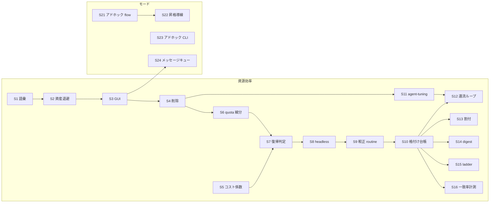

# agent-tools 追加機能計画 — 有限な資源で作業を止めず、能力に入口を足す

> 作成 2026-08-08
> 扱う範囲は 2 つ。**資源効率（F1〜F16）**＝柱 3 の実装計画。**新しい利用モード（M1〜M3）**＝
> 既にある能力へ、重い前提なしで届く入口を足す。
> 効く柱・原則: F 群 = 柱 3 / C9・C10。M 群 = 柱 2 × 柱 3 / C3・C4（人の手数を減らす）・
> C7（入口を足しても書き手は増やさない）。コンセプト正典
> [`agent-tools-concept.md`](../designs/agent-tools-concept.md) の同日改訂（三本柱化・P7〜P9・
> C9/C10 追加）と対をなす。正典 §8.3 の道 (b)「正典の改訂を同じ変更で提案する」に当たる。
> 現状の棚卸しは 2026-08-08 時点のコードで裏取りした。

## 1. 結論

コンセプトに柱 3「資源効率」を追加した。クラウドエージェントの利用枠は有限で制約が日々
変わり、ローカル LLM は減らないが遅い。この 2 つを一つの資源プールとして扱い、仕事に足る
最小のモデルへ振り分け、枯渇時も作業を止めず、その運用（格付け・プロンプト調整）を人手に
残さない。これが柱 3 の中身である。

土台はすでにかなりある。CLI のデータ契約（`agents/*.json`）、予算残率で段を落とす実行
プロファイル、node-budget v2、ollama 実行系、agent-audit の実測台帳。**穴は 4 つ + 1**に絞れる:

1. **レート制限に語彙がない。** 累積残量しか見ておらず、「待てば復活する枠」を表現できない。
2. **品質が選定の入力になっていない。** 段の上げ下げは予算残率だけで決まり、
   「このモデルはこの仕事で通るか」の実測がルーティングに繋がっていない。
3. **支配的な消費原資（探索・読込と依存成果の全文注入）が手つかず。**
4. **測って設定へ還す自動ループが 1 本もない。** すべて「人が台帳を見て宣言を直す」で
   止まっており、これこそユーザー要求の「チューニングの人手」そのものである。
5. **ループ系が二重系統のまま。** `tools/kiro-loop/` と `tools/agent-loop/` が同じ仕様の
   2 実装で、上の 4 つを埋める作業がそのまま二重になる（C7 違反の据え置き分）。

追加機能は 16 件（F1〜F16）、うち本命 6 件（F1・F2・F4・F7・F10・F13）。実行は 20 ステップ
（S1〜S20）に割り、順序は「**畳む** → 止めない → 測る → 還流を閉じる → 削る → 任せる」。
1 ステップ = 1 PR で、途中で止めても壊れない粒度にする。手順と依存は §5、最初の 3 手は §5.7。

**足す案だけでなく、消す案も同じ土俵で採る。** 二重系統を 1 本にすると、以後の変更が
半分で済み、契約の語彙も 1 つになる。本計画では kiro-loop の退役（F13）を本命に置き、
既存の「やらないこと」も単純化に効くものは案へ引き上げた（§6）。

**もう 1 つの穴は、能力があるのに入口がないことである。** agent-flow は単発 run を自己完結で
回せるのに、dashboard からの投入はプロジェクト経由しかない。任意のフォルダでエージェント
CLI を対話起動する経路は cowork に既にあるのに、定期業務の項目に紐づいたものしか叩けない。
agent-loop はメッセージ受信の inbox を持つのに、dashboard の送信口は復旧送信だけ。
どれも「軽い仕事にプロジェクト一式を立てる」か「手で tmux を張る」かを人に強いており、
柱 2（人の手数）と柱 3（軽い仕事に重いパイプラインを通さない）の両方を損ねている。
新モード M1〜M3（§4 後半、ステップ S21〜S24）はこの入口を足す。**新規実装は少なく、
大半は既存経路の一般化**である。

## 2. 背景

コンセプト改訂で加えた与件と課題（正典 §2・§2.1 に転記済み）:

- 現実 6: クラウドエージェントは有限資源で、レート制限・残量・使えるモデルは日々変わる。
  ローカル LLM は減らないが遅く能力に限りがある。どちらか一方では足りない。
- 現実 7: 安いモデルほどプロンプト・ハーネスの調整に手が掛かり、放置すると
  「モデル代の節約を人の時間で払う」ことになる。
- P7: 全部を最上位モデルに流すと枯渇する → 格付けと削減。
- P8: 制約変動のたびに人が設定を直す → 観測して降格・委譲・待機で自動に受ける。
- P9: 低コストモデルの調整が人手 → 実測を根拠に学習ループへ載せる。

チーム分散（柱 1）は変えない。柱 3 はノード内の縦の効率、柱 1 はノード間の横の分担で、
枯渇時の「他ノードへの委譲」で両者は接続する。

## 3. 現状の土台（実装済み。ここには手を入れない）

| テーマ | 実装済みの仕組み | 場所 |
|---|---|---|
| モデル選定 | CLI データ契約 9 定義と 1 実装ローダ。全エンジンに役割別の振り分け口 | `schemas/agent-cli.schema.json`・`agents/*.json`・`agentcore/agentcli.py` |
| 〃 | 予算残率から段（大中小）と候補列を決定的に選ぶ実行プロファイル。ヒステリシス・枠枯れスキップ・`quota-fallback` 降格 | `schemas/agent-profiles.schema.json`・`agent-dashboard .../main/profiles.js` |
| 〃 | ollama 実行系一式（bash ループ・read セット・JSON 契約・文脈実測）。適用拡大は段 0〜3 まで | `agentcore/ollama_*.py`・`agents/ollama{,-json,-read}.json` |
| トークン削減 | 安定プレフィックス化（prompt キャッシュ適合）と差分修復リトライ。いずれもオプトイン | `agentcore/promptcompose.py`・`agent_flow/work.py` |
| 〃 | rtk / caveman 注入（一発適用パッチ。※退役対象。F9・F13） | `tools/kiro-loop/setup-token-reduction.py` |
| 制約適応 | node-budget v2（トークン一次・weight/min/max 配分・`on_exhausted: pause\|stop\|degrade`・CLI 単位の枠） | `schemas/node-budget.schema.json`・dashboard `main/budget.js` |
| 〃 | agent-control による稼働中の CLI / model / degraded の pull 適用 | `schemas/agent-control.schema.json` |
| 〃 | quota / auth / env の決定的トリアージ（リトライで枠を焼き切らない） | `agentcore/agentcli.py` の `classify_error` |
| 測定 | agent-audit: 実行証跡と CLI セッションログの決定的収集・集計・蒸留 | `tools/agent-audit/`・[設計](../designs/agent-audit-design.md) |

## 4. 追加機能

一覧。★=本命、○=次、△=条件付き保留。

| # | 機能 | テーマ | 課題 / 原則 | 優先 | ステップ |
|---|---|---|---|---|---|
| F1 | レート制限の語彙と自動復帰 | 止めない | P8 / C10 | ★ | S6・S7 |
| F2 | 資源制御のヘッドレス化 | 止めない | P8 / C6・C7 | ★ | S8 |
| F3 | 実測較正の拡充（未報告 CLI） | 測る | P7・P9 の前提 | ○ | S9 |
| F4 | 品質×消費の格付け台帳 | 測る | P7 / C9 | ★ | S10 |
| F5 | 失敗時のモデル昇格 ladder | 適所適材 | P7 / C9・C7 | ○ | S15 |
| F6 | ローカル work 経路の完成（edit / patch） | 適所適材 | P7 / C9 | △ | S20 |
| F7 | コンテキスト割付契約 | 削る | P7 / C9 | ★ | S13 |
| F8 | 依存成果のダイジェスト渡し | 削る | P7 | ○ | S14 |
| F9 | 汎用注入契約 agent-tuning | 削る・任せる | P9 / C7・C8 | ○ | S11 |
| F10 | 台帳から設定への還流ループ | 任せる | P9 / C8・C9 | ★ | S12 |
| F11 | チューニング試行の比較基盤 | 任せる | P9 / C8 | ○ | S17 |
| F12 | ToolPolicy（走行中の権限昇格） | 任せる | P9 | △ | S20 |
| F13 | kiro-loop 退役と agent-loop 一本化 | 単純化 | P9 / C7 | ★ | S1〜S4 |
| F14 | 相対コスト係数（通貨なし） | 適所適材 | P7 / C9・C7 | ○ | S5 |
| F15 | LLM 判断の決定化（対象を実測で選ぶ） | 削る・単純化 | P7 / C3・C7 | ○ | S16・S18 |
| F16 | kiro-log-exporter の agent-audit への吸収 | 測る・単純化 | P4 / C7 | ○ | S19 |
| M1 | アドホック flow 実行（プロジェクト非依存） | モード | 柱2×柱3 / C3・C7 | ★ | S21・S22 |
| M2 | フォルダ指定のアドホック CLI セッション | モード | 柱2 / C1・C7 | ★ | S23 |
| M3 | agent-loop へのメッセージキュー投函 | モード | 柱2 / C7 | ○ | S24 |

### F1 ★ レート制限の語彙と自動復帰

いまの契約は累積トークン残量しか知らない。プロバイダの RPM / TPM、リセット時刻、
「待てば復活する枠」を表現する語彙がなく、quota は「失敗として分類する」で終わる。
レート制限に当たった枠は降格したきり、人が戻すまで安い段のままになる。

- やること: `agent-cli.schema.json` の errors に quota の細分（恒久的な残量枯渇 /
  時限のレート制限 / リセット時刻）を足し、node-budget の `computed` へ「復活予定」を
  載せ、実行プロファイルの段判定が「リセット後は元の段へ戻す」を自動で行う。
  降格 → 委譲（柱 1）→ 待機の順は C10 のとおり。
- 判定: レート制限に当たっても人が設定を触らず、リセット後に自動で元の段へ復帰する。
  復帰もヒステリシスを通り、振動しない。
- 規模: 中。スキーマ 2 件と `profiles.js` の段判定、`classify_error` の細分。

### F2 ★ 資源制御のヘッドレス化

実行プロファイルの評価と auto 配分の再計算は、いま dashboard プロセスが開いている間しか
動かない（設計自身が可用性の限界と明記）。夜間や CI からの稼働では、枯渇してもローカル
退避が起きず、C6「在席に依存させない」に反する。

- やること: profiles / budget の定期評価を dashboard から常駐側（agent-project の
  controller）へ移すか、ヘッドレスな評価コマンドを切って agent-loop の routine に載せる。
  どちらでも**書き手は 1 つのまま移す**（dashboard と常駐体が同じ契約を書く構成にしない。
  C7）。推奨は後者（routine 化）。controller へ入れると agent-project が肥大するのと、
  評価は「読んで契約を投函する」だけの仕事で routine の粒に合う。
- 判定: dashboard を閉じたまま、枯渇時の段降格・ローカル退避・復帰が起きる。
- 規模: 中。評価ロジックは純関数で切り出し済みなので、移すのは駆動だけ。

### F3 ○ 実測較正の拡充

トークンを報告しない CLI（kiro-cli、ollama）は `seconds × rate` 推定のままで、kiro-loop の
台帳は seconds しかない。格付け（F4）と還流（F10）は実測が根拠なので、推定の粗さは
そのまま判断の粗さになる。agent-audit の calibrate を定期実行し、レートの較正値を
node-budget の `rates` へ反映する経路を作る。判定: 推定と実測の乖離が台帳で追え、
較正が自動で効く。規模: 小。collect / calibrate は実装済みで、繋ぐだけ。

### F4 ★ 品質×消費の格付け台帳

段の上げ下げは予算残率だけで決まり、品質が入力にない。「read 系はローカルで PASS 率が
落ちない」「裁定はモデル X だと差し戻しが増える」を裏付ける数字がどこにも出ない。
これがないと F6（ローカル work）も F10（還流）も着手条件を判定できない。

- やること: agent-audit に「モデル × 仕事種別（purpose / kind）× verify 結果」の決定的
  集計を足し、格付け表として出力する。**適用は自動にしない**。表はルーティング候補列の
  変更提案（根拠付き）として出し、宣言（`agent-profiles` / `agents[purpose]`）の変更は
  学習ループの昇格経路（decisions → rules）を通す。agent-ollama 拡大設計 §10.2 の非目標
  「ローカル → クラウドの成果物単位の自動品質昇格は作らない」は維持する。作るのは
  **ルーティングの実測根拠**であって、成果物ごとの自動再実行ではない。
- 判定: 「この仕事種別 × このモデルの PASS 率と平均消費」が台帳から一発で出る。
  候補列の変更が印象でなく実測を根拠にできる。
- 規模: 中。audit の集計は決定的レイヤに足すだけ。run 証跡へのモデル記録が
  欠けている箇所があれば埋める（コンセプト学習ループ手順 1 の改訂に対応）。

### F5 ○ 失敗時のモデル昇格 ladder

2026-08-04 検討の案 C。安いモデルで fail したら上位モデルで 1 回だけ再試行する。
無条件で上位に流すより安く、安い段の失敗を「やり直しの無駄」で終わらせない。
回数上限と予算内であること（C7）、昇格の発生は台帳へ残し F4 の格付けに使うこと。
判定: 昇格込みの実効単価が、最初から上位に流すより安い（台帳で示す）。規模: 中。

### F6 △ ローカル work 経路の完成（edit セット / `--patch`）

ollama にファイル編集を任せる経路（拡大設計の段 4・5、opencode 検討の F-1）。
**着手条件を維持する**: 段 0〜3 の節約実績と品質実測を台帳で見てから。これは拡大設計
自身が定めた条件で、F4 が揃うと判定可能になる。先にやらない。規模: 大。

### F7 ★ コンテキスト割付契約

2026-08-04 検討が支配的原資と推定した「探索・読込」への本丸（案 A）。planner が subtask へ
「読むべきファイル・範囲」を割り付け、worker は探索せずそこから読む。planner は依存関係を
決める時点で同じ情報を見ているので、追加の推論コストは小さい。

- やること: task spec に読込割付（パス・範囲・理由）を追加し、agent-flow の worker prompt
  組み立てが割付を優先注入、割付外の探索は「足りないときの追加」に降格する。
  割付の的中率（割付外読込の発生率）を台帳へ残す。
- 判定: 同種タスクの入力トークンが下がり、verify PASS 率が落ちない。両方を台帳で示す。
- 規模: 大。planner・worker 両側と task spec の契約変更。

### F8 ○ 依存成果のダイジェスト渡し

agent-flow の依存成果はいまも全文 inline で後続 prompt に入る（案 E）。ダイジェスト
（要約 + 成果物への参照）を既定にし、全文が要る役割だけ宣言で全文を受ける。
黙った切り捨てをしない（R4: 何を省いたかを prompt に明示する）。判定: 依存の深い
グラフで入力トークンが下がり、PASS 率が落ちない。規模: 中。

### F9 ○ 汎用注入契約 agent-tuning

rtk / caveman の注入は kiro-loop 専用パッチ（`setup-token-reduction.py`）のままで、
ツール名を知っている特化実装が 1 本外に立っている。2026-08-03 提案 §5 の恒久対応
（`injections` / `env` / `profiles` を持つ汎用契約）を新設し、agent-loop はこれを読む。
品質ガード（`external-facing` な出力ではチューニングを外すプロファイル、per-prompt の
切替）もこの契約に含める。F10 が書き換える対象は原則この契約に集める（書き換え先を
1 か所にするため。C7）。

**F13 と組で、移植ではなく退役にする。** 特化パッチを agent-loop へ写すと同じものが 2 本に
なる。kiro-loop ごと退役させ、agent-loop は最初から契約だけを読む。判定: agent-loop 系で
rtk / caveman が契約だけで ON/OFF でき、外向き成果物に文体圧縮が漏れない。規模: 中。

### F10 ★ 台帳から設定への還流ループ

4 テーマでいちばん薄い穴。測って自動で設定へ還すループが 1 本もなく、すべて
「人が台帳を見て宣言を直す」で止まっている。ユーザー要求の「チューニングの人手削減」の
中心はここである。

- やること: agent-audit の実測（F4 の格付け、F3 の較正、F9 の注入効果）から調整候補を
  生成し、既存の学習ループと同じ経路で昇格する: 候補には根拠（台帳への参照）・適用範囲・
  失効条件を付け、再現したものだけが宣言（agent-tuning / agent-profiles / rates）へ
  昇格し、悪化したら退役する。人は方針（品質の下限・費用の上限）だけを決め、
  個々の調整は見ない。自動昇格には回数・予算・停止条件を置く（C7）。
- 判定: モデルの追加・降格・プロンプト調整で人手が発生しない。調整の適用と効果が
  decisions / 台帳で追跡できる（C8）。
- 規模: 大。ただし新規の推論基盤は作らない。audit の蒸留 2 段と学習ループの昇格経路を
  流用し、還流「先」の契約は F9 で 1 か所に揃えてから繋ぐ。

### F11 ○ チューニング試行の比較基盤

F10 の判定材料。同種タスクへ 2 設定（プロファイル / prompt / 注入）を交互適用し、
verify 一発通過率とトークンを台帳で比較する。いまある品質比較は「人が見る」だけで、
before/after を機械的に並べる口がない。判定: 1 つの調整候補について「効いた / 効かない /
悪化」が台帳から決定的に出る。規模: 中。F4 の集計に試行タグを足す形で載る。

### F12 △ ToolPolicy（走行中の単調権限昇格）

ツール開示設計の段 3。ハーネスの動的調整として設計済みだが、静的セット（read / bash /
JSON）で現状は回っており、詰まってから足せばよい。着手条件: read セット運用で
「権限不足による人手介入」が台帳に一定数現れること。規模: 中。

### F13 ★ kiro-loop 退役と agent-loop 一本化

`tools/kiro-loop/`（4231 行の単一ファイル）と `tools/agent-loop/`（16 行のエントリ +
23 モジュールのパッケージ）は同じ仕様の 2 実装で、C7 が禁じている状態そのものである。
改称設計はこれを「旧系統は残置」として暫定的に許容していたが、その前提を本計画で覆す
（[改称設計](../designs/agent-tools-rename-design.md) §3・§6 は退役方針へ改訂済み）。ループ系へ手を入れる限り、F1（レート制限）・F2（ヘッドレス化）・
F9（注入契約）はすべて 2 回ずつ実装するか、片方だけ育てて差を広げるかの二択になる。

現状は agent-loop が上位互換で、機能差は kiro-loop 側の 2 点だけ:

| kiro-loop にしかないもの | 扱い |
|---|---|
| `setup-token-reduction.py`（rtk / caveman の一発適用） | F9 の agent-tuning 契約へ畳んで退役。移植しない |
| `stub/kiro-cli-stub.py` と `test/test_stub.py` | agent-loop の test へ移す（テストの実行手段なので写して構わない） |

テスト総数は agent-loop 33 : kiro-loop 4 で、二重系統の維持コストは既に片側へ寄っている。
両者が `~/.kiro/agents/<name>/inbox/` を**共有**している点も効いていて、メッセージ契約を
片側だけ変えると相互運用バグになる（2026-08-02 監査 D2 が実際に起きた例。解消済み）。
1 本になればこの種の非互換は構造的に起きなくなる。

退役の範囲は実装ディレクトリだけではない。同じ二重が語彙と GUI にも出ている:

- **契約の語彙**: `agent-control` の `tool`、`agent-session-commands` の engine、
  `node-budget` の workload、`agent-instructions` の説明が `kiro-loop / agent-loop` を
  並記している。agent-flow の `_SESSION_COMMANDS_CHAT_ENGINES` も同じ並記を持つ。
  → `agent-loop` へ寄せ、旧値は「読めるが書かない」非推奨として一定期間受ける
  （既存の設定ファイルを壊さないため。契約の削除は最後）。
- **dashboard**: `src/features/kiro-loop/` と `src/renderer/sections/kiro-loop.js`（22.8K）が
  旧名のまま両系統を駆動している（`main/tmux.js` は既に agent-loop を見ている）。
  `sections/routines.js` と役割が重なるので、退役に合わせて定常業務の面へ寄せる。

判定: `tools/kiro-loop/` が消え、ループ系の変更が 1 か所で済む。既存の kiro-loop 設定・
稼働中セッションが移行手順どおりに agent-loop で動く。規模: 中（実装の差分は小さく、
仕事の大半は語彙と GUI の寄せと移行手順）。**F1・F2・F9 より先に着手する**——後にすると
その 3 件を二重に作ることになる。

### F14 ○ 相対コスト係数（通貨なし）

いま「安い / 高い」は候補列の並び順という暗黙知で表現されている。F1 の降格、F5 の昇格、
F10 の還流はどれも「より安いほう」を判断するのに、その基準が 3 か所で別々に暗黙化する。

`agents/<name>.json` に無次元の相対コスト係数（ローカル = 0、下位クラウド = 1、上位 = n）を
1 つ足し、3 者が同じ数を読む。USD 価格表は持たない（§6 のとおり）ので、為替・プラン改定の
追随は発生せず、係数の更新は F10 の還流で実測から行う。判定: 「安いほうへ落とす」の実装が
1 つになり、候補列の並び替えで意味が変わらない。規模: 小。

### F15 ○ LLM 判断の決定化（対象を実測で選ぶ）

2026-08-04 検討の案 G。LLM に聞いている判断のうち、決定的ルールと結論が一致し続けている
ものを、ルールへ置き換える。これは削減案であると同時に**部品を減らす案**で、置き換えた
分だけ prompt もリトライもトリアージも消える（C3 の「機械で決められることを人に聞かない」を
LLM 呼び出しにも適用する形）。

着手は 2 段。段 1 = 一致率の計測（現状は未着手で、これが案 G の前提だった）。
段 2 = 一致率が閾値を超えた判断だけを決定化し、決定化後も一定割合を LLM で抜き取り
照合して退行を検出する。判定: LLM 呼び出し数が減り、対象判断の結論が変わらない。
規模: 段 1 は小、段 2 は対象次第。

### F16 ○ kiro-log-exporter の agent-audit への吸収

`tools/kiro-log-exporter/` は kiro の SQLite を読んで正規化する収集器で、agent-audit は
その探索・パース手順を取り込んだ上位互換として設計されている（agent-audit 設計 §「収集」）。
両方が動き続けると、同じ源泉に収集器が 2 つ、増分状態ファイルが 2 つになる。agent-audit の
collect が実運用に入った時点で退役させ、`.kiro_export_state.json` からの移行手順だけ残す。
判定: kiro セッションの収集器が 1 つになる。規模: 小。着手条件: agent-audit の collect が
kiro 源泉で実運用に入っていること。

---

以下は**新しい利用モード**。足すのは入口であって、実行の仕組みではない。3 つに共通する
設計上の縛りが 2 つある。

- **書き手を増やさない（C7）。** 新モードは既存の公式契約（agent-flow の
  `inbox/<req-id>.json` = submit_request、agent-control、agent-instructions）へ書くだけで、
  独自の状態ファイルを作らない。dashboard の役割は従来どおり「読むのはファイル、
  書くのは契約の投函」。
- **アドホックは done を名乗らない（C5）。** プロジェクトを介さない実行には受入基準も
  verify もないので、その成果を「完了」として扱わない。バックログの状態も書かない。
  成果を正式な仕事にしたいなら、agent-project の経路へ載せ替える（S22 の昇格導線）。
  これを守る限り、モード追加は「done の意味」を薄めない。

### M1 ★ アドホック flow 実行（プロジェクト非依存）

agent-flow の単発 run は自己完結で回る（agent-project を import しない）。にもかかわらず、
dashboard からの投入口は `features/agent-project/main/flow.js` にあり、プロジェクトを選んで
いないと辿り着けない。「ちょっと調べてまとめる」程度の仕事に、charter とバックログと
受入基準を先に用意させているのが現状で、重い前提のぶんトークンも人の手数も余計に掛かる。

- やること: プロジェクト非依存の投入メニューを足す。投入は既存の submit_request 契約を
  そのまま使い（`flow.js` は既に「公式な入力契約だけを使う」と書かれている）、
  プロジェクト依存の部分だけを切り出す。run のバスと成果物の置き場は既定を 1 つ決める。
  結果の閲覧・監視は既存の run 監視画面を流用する。
- やらないこと: アドホック run に verify を要求しない代わりに、done も名乗らせない
  （上記の縛り）。必要になったら S22 の昇格導線でバックログへ載せる。
- 判定: プロジェクトを 1 つも選ばずに run を投入・監視・結果取得でき、その間バックログの
  状態ファイルが一切書き換わらない。
- 規模: 中。実行系は無改造で、切り出しと画面が主。

### M2 ★ フォルダ指定のアドホック CLI セッション

cowork には既に、フォルダ（cwd）を決めて tmux にエージェント CLI を**対話起動**し、
agent-control の定常業務設定で CLI とモデルを解決し、**共通指示（agent-instructions）を
起動プロンプト先頭へ前置**し、実行記録を `~/.agent-dashboard/cowork-history.jsonl` へ
残す経路がある（`features/cowork/main/cowork.js`）。足りないのは 1 点だけで、この経路は
定期業務の項目（loop / statemachine）に紐づいたものしか起動できず、**自由文で始められない**。

- やること: 同じ起動経路を「登録済みフォルダ + 自由文プロンプト」で叩けるようにする。
  CLI / モデルの解決、共通指示の前置、履歴の追記はすべて既存経路を再利用する
  （新しい起動系を作らない）。
- **cwd は自由入力にしない。** 全体設定に登録済みのフォルダと `cowork.roots` から選ばせる。
  任意パスを UI から打てるようにすると、任意コマンドの到達範囲が設定ファイルの外へ広がる
  （session-commands 設計が「到達範囲を端末の設定ファイルへ閉じ込める」と決めている理由と
  同じ。C1）。登録の入口は既存の全体設定を使う。
- 判定: 登録フォルダを選んで自由文を投げると CLI が対話起動し、共通指示が前置され、
  履歴が残り、そのまま `tmux attach` で見続けられる。新しい状態ファイルは増えない。
- 規模: 小〜中。起動系は無改造で、入口と項目に紐づかない実行の扱いが主。

### M3 ○ agent-loop へのメッセージキュー投函

agent-loop はエージェント間メッセージの inbox を持つ（`agent_loop/inbox.py`・`sendcmd.py`・
`agent-send.py`）。一方 dashboard 側の送信は「復旧送信」——稼働中の tmux セッションへ
定期プロンプトを送り直す用途に限られ、busy なら弾かれる。**手が空いたら処理してほしい仕事を
積んでおく**という使い方ができない。

- やること: dashboard から agent-loop の inbox へメッセージをキューする口と、
  キューの中身・処理状況の表示を足す。投函は CLI（`send` 系）へ依頼し、dashboard は
  生の send-keys もファイル直書きもしない（既存 `send.js` の方針を踏襲）。
- 判定: dashboard から積んだメッセージが agent-loop に順に処理され、待ち行列が見える。
  busy は失敗ではなく「待機」として表示される。
- 規模: 小。契約と CLI は既にあり、口と表示だけ。
- 依存: S3（dashboard の面の寄せ）の後にやる。先にやると退役予定の面へ機能を足すことになる。

## 5. 実行計画

### 5.1 進め方

順序の原則は 2026-08-04 検討の結論「先に測る」を踏襲しつつ、その前に「止めない」を置く。
枯渇で作業が止まる状態は測定自体を止めるからである。さらにその前に**畳む**——
二重系統を残したまま Phase 1 に入ると、F1・F2・F9 をループ系で 2 回ずつ実装することになる。

| Phase | 出口条件 |
|---|---|
| 0. 畳む（S1〜S4） | `tools/kiro-loop/` が消え、ループ系の変更が 1 か所で済む |
| 1. 止めない・測る（S5〜S10） | 制約変動で人が設定を触らない。品質×消費の格付けが台帳から出る |
| 2. 還流を閉じる・削る（S11〜S16） | 調整候補が実測根拠付きで自動生成・昇格される。入力トークンの削減が台帳で示せる |
| 3. 任せる・広げる（S17〜S20） | 調整の効果判定が決定的になる。ローカル work の可否が実測で決まる |
| M. 入口を足す（S21〜S24・並行） | プロジェクトを立てずに flow を回せる。登録フォルダ + 自由文で CLI を起動できる。agent-loop に仕事を積める |

**トラック M は Phase 0〜3 と並行に進める。** 触る場所（dashboard の入口）が資源効率の
チェーン（予算・台帳・プロンプト）とほぼ重ならないため、順番待ちの理由がない。唯一の
交差は S24 が S3 の後という点だけ（§5.2 の図）。

**1 ステップ = 1 PR。** 各ステップは単独でマージして意味があり、途中で止めても壊れない
粒度にする。どのステップも次の 3 つを完了条件に含む（以降の表では省略し、ステップ固有の
条件だけ書く）:

1. 該当設計書を同じ PR で更新する（正典 §8.2）。
2. 正典 §8.4 のチェックリストを通す。
3. 変更した挙動に対する自動テストが 1 本以上ある。既存テストを壊さない。

**測定を伴うステップは「効果を数字で示す」まで**が完了条件で、実装のマージでは終わらない。
S10 以降の削減系（S13・S14）は、台帳で入力トークンの減少と PASS 率の非悪化の両方を
示せて初めて done。片方だけなら差し戻す（C5・柱 3 の「節約は品質実測とセット」）。

### 5.2 ステップ依存

S5 は独立で、いつ入れてもよい（早いほど S7・S15 が楽になる）。S13〜S16 は互いに独立で、
S10 の台帳さえあれば並行して進められる。S21・S23 は他のどれにも依存しない——
**今日から着手できるのはこの 2 つと S1・S5 の 4 本**である。

### 5.3 Phase 0 — 畳む（F13）

kiro-loop を「使わせない」→「移す」→「消す」の順に分ける。逆順にすると、消してから
移行できていない利用者が出る。

| # | 目的 | 主な変更対象 | ステップ固有の完了条件 |
|---|---|---|---|
| S1 | 契約の語彙を agent-loop へ寄せる。旧値は読めるが書かない非推奨にする | `schemas/agent-control.schema.json`・`agent-session-commands.schema.json`・`node-budget.schema.json`・`agent-instructions.schema.json`、`agent_flow/session_commands.py` の `_SESSION_COMMANDS_CHAT_ENGINES` | 旧値 `kiro-loop` を含む既存の設定ファイルが警告つきで読める。新規書き込みは `agent-loop` のみ |
| S2 | kiro-loop 固有資産を agent-loop へ移す | `tools/kiro-loop/stub/kiro-cli-stub.py` と `test/test_stub.py` → `tools/agent-loop/` 配下 | agent-loop のテストが 34 本になり全通過。`setup-token-reduction.py` は**移さない**（S11 で契約へ畳む） |
| S3 | dashboard の面を定常業務へ寄せる | `src/features/kiro-loop/` → 名称変更、`src/renderer/sections/kiro-loop.js` を `routines.js` の系へ統合、`test/kiro-loop-{tmux,send}.test.js` を改名 | `npm test` 全通過。GUI の定常業務ページから agent-loop の端末操作が従来どおりできる |
| S4 | 実装を削除する | `tools/kiro-loop/` 削除、`install.py`・各 README・docs の参照掃除、移行手順の追記。**S1〜S3 が残した読取互換もここで落とす**（下記） | `grep -rn kiro-loop`（docs の履歴記述と S1 の非推奨語彙を除く）がゼロ。移行手順に沿って旧設定から agent-loop が起動する |

S1〜S3 は「読めるが書かない」を守るため、旧系統の読取互換をあえて残した。S4 で落とすのは
**旧実装に到達する経路**だけで、**旧いデータを読む互換は残す**——実装を消しても、利用者の
端末に残った設定ファイルは消えないからである。

| 読取互換 | 場所 | S4 での扱い |
|---|---|---|
| 旧デーモンの状態・スロット（`~/.kiro/loop-state`・`~/.kiro/slots`） | `features/routines/main/tmux.js` | 削除済み（旧デーモンはもう起動しない） |
| 復旧送信の `kiro-loop` バイナリへのフォールバック | `features/routines/main/send.js` | 削除済み（同上） |
| 旧ループ設定（`.kiro/kiro-loop.*` とフォルダ直下の `kiro-loop.*`）の発見 | `features/cowork/main/discover.js` の `LOOP_CONFIG_CANDIDATES` | 削除済み |
| 旧 engine 値 `kiro-loop` の正規化と非推奨警告 | `sessionCommands.js` の `canonicalEngine`、`agent_flow` / `agent_loop` の `session_commands.py` | **残す**（端末の `session.json` に旧値が残っている。警告して `agent-loop` として読む） |
| 旧 dashboard 設定キー `kiroLoop` → `routines` の付け替え | `base/main/config.js` の `LEGACY_CONFIG_KEYS` | **残す**（利用者の `config.json` は改称に追従しない） |

残す 2 件は「データを読む互換」であって旧実装への参照ではないので、S4 の完了条件
（`grep -rn kiro-loop` がゼロ）の除外対象（S1 の非推奨語彙）に当たる。

> **S4 は破壊的操作。** ディレクトリ削除の前に、稼働中の kiro-loop デーモンがいないこと、
> 移行手順が S1〜S3 の状態で通ることを確認し、**人の承認を取ってから実行する**。
> ロールバックは revert 1 回で戻せるよう、S4 は削除だけの単独 PR にする。

### 5.4 Phase 1 — 止めない・測る（F14・F1・F2・F3・F4）

| # | 目的 | 主な変更対象 | ステップ固有の完了条件 |
|---|---|---|---|
| S5 | 「安いほう」を 1 つの数にする（F14） | `schemas/agent-cli.schema.json` に無次元の相対コスト係数、`agents/*.json` 9 枚に値、`agentcore/agentcli.py` の読み出し | 既存の候補列の並び順と係数順が一致する（＝現状の暗黙知を壊さない）。`agent-cli-golden.test.js` を更新 |
| S6 | quota を細分し、リセット時刻を取り出す（F1 前半） | `agentcore/agentcli.py` の `classify_error` と `agents/*.json` の `errors[]` | 各 CLI の実際のレート制限メッセージ（サンプルを固定データ化）から「恒久枯渇 / 時限 / リセット時刻」が決定的に分類できる |
| S7 | リセット後に元の段へ戻す（F1 後半） | `node-budget.schema.json` の `computed` へ復活予定、`profiles.js` の `decide`（現状は残率のみ） | 時刻を進める単体テストで、降格 → リセット → 復帰が起き、境界で振動しない（ヒステリシスを通る）。`orchestration-profiles.test.js` を拡張 |
| S8 | dashboard を開かなくても効かせる（F2） | `profiles.apply` / `budget` 再計算を IPC 専用（`orchestration:profilesApply`）からヘッドレス実行できる入口へ、agent-loop の routine から駆動 | Electron を起動していない状態で、枠を枯らすと段降格とローカル退避が起きる。書き手は 1 つのまま（dashboard と routine が同じ契約を二重に書かない） |
| S9 | 推定レートを実測へ寄せる（F3） | `agent-audit calibrate --write` を routine 化、`node-budget` の `rates.per_cli` | 較正の実行と反映が人手なしで回り、推定と実測の乖離が台帳で追える |
| S10 | 品質×消費の格付けを出す（F4） | `agent_audit/usage.py` の `GROUP_KEYS`（現状 `workload / tool / agent_cli / model / ref / node`）へ仕事種別を追加、`stats.py` と verify 結果の結合、格付け表の出力 | 「仕事種別 × モデル」の PASS 率と平均消費が 1 コマンドで出る。固定入力に対する golden テストがある。**適用は自動にしない**（提案として出すだけ） |

### 5.5 Phase 2 — 還流を閉じる・削る（F9・F10・F7・F8・F5・F15）

| # | 目的 | 主な変更対象 | ステップ固有の完了条件 |
|---|---|---|---|
| S11 | 注入の宛先を 1 か所にする（F9） | `schemas/agent-tuning.schema.json` 新設（`injections` / `env` / `profiles`）、agent-loop が読む、`setup-token-reduction.py` 退役 | rtk / caveman が契約だけで ON/OFF でき、`external-facing` プロファイルで外向き成果物に文体圧縮が漏れない |
| S12 | 測って設定へ還す（F10） | agent-audit の蒸留から調整候補を生成、`decisions/` → 宣言（agent-tuning / agent-profiles / rates）への昇格経路 | 候補に根拠・適用範囲・失効条件が付く。再現したものだけ昇格し、悪化したら退役する。昇格に回数・予算・停止条件がある（C7） |
| S13 | 探索・読込を削る（F7） | task spec に読込割付、agent-flow の worker prompt 組み立て（`agent_flow/context.py`）、planner 側 | 同種タスクで入力トークン減少と PASS 率非悪化の**両方**を台帳で示す。割付の的中率も残す |
| S14 | 依存成果の全文注入をやめる（F8） | agent-flow の依存成果の受け渡し | 依存の深いグラフで入力トークン減少と PASS 率非悪化を台帳で示す。何を省いたかが prompt に明示される |
| S15 | 失敗を上位モデルで拾う（F5） | agent-flow / agent-project のリトライ経路、S5 の係数を使う | 昇格込みの実効単価が、最初から上位に流すより安いことを台帳で示す。回数上限と予算内で必ず止まる |
| S16 | 決定化の対象を選ぶ（F15 段 1） | LLM 判断箇所の一致率計測（決定的ルールとの突き合わせ） | 判断ごとの一致率が出る。**この段では何も置き換えない**（対象選定のための計測） |

### 5.6 Phase 3 — 任せる・広げる

| # | 目的 | 着手条件 |
|---|---|---|
| S17 | チューニング試行の比較基盤（F11） | S12 が動いていること（比較したい候補が出てくる） |
| S18 | 一致率の高い判断を決定化（F15 段 2） | S16 の計測で閾値超えの判断が特定できたこと。決定化後も抜き取り照合で退行を検出する |
| S19 | kiro-log-exporter を退役（F16） | agent-audit の collect が kiro 源泉で実運用に入っていること |
| S20 | ローカル work（F6）・ToolPolicy（F12） | F6 = S10 の台帳で段 0〜3 の節約実績と品質が確認できたこと。F12 = read セット運用で権限不足による人手介入が台帳に一定数現れること |

### 5.7 トラック M — 入口を足す（M1・M2・M3）

| # | 目的 | 主な変更対象 | ステップ固有の完了条件 |
|---|---|---|---|
| S21 | プロジェクトを立てずに flow を回す（M1） | `features/agent-project/main/flow.js` の submit_request 経路からプロジェクト依存部を切り出す、投入メニュー、run バスと成果物の既定の置き場 | プロジェクト未選択で run を投入・監視・結果取得できる。実行中バックログの状態ファイルが一切書き換わらない。成果に done 表示を出さない |
| S22 | アドホックの成果を正式な仕事へ載せ替える（M1 後半） | 昇格導線（run の成果 → agent-project の task） | 昇格した仕事は通常の task として受入基準と verify を通る。昇格しない限り done にならない |
| S23 | 登録フォルダ + 自由文で CLI を起動する（M2） | `features/cowork/main/cowork.js` の起動経路を項目非依存で叩けるようにする、フォルダ選択 UI | 共通指示が前置され、agent-control の設定で CLI とモデルが解決され、履歴が `cowork-history.jsonl` に残り、`tmux attach` で追える。**新しい状態ファイル・新しい起動系を作らない**。cwd は登録済みフォルダからの選択のみ |
| S24 | agent-loop に仕事を積む（M3） | S3 で改名した送信系（現 `features/kiro-loop/main/send.js`）へキュー投函、キュー表示 | dashboard から積んだメッセージが順に処理され、待ち行列が見える。busy は失敗でなく待機として出る。投函は CLI 依頼で、生の send-keys もファイル直書きもしない |

S21・S23 は他に依存しない。S24 は S3 の後（退役予定の面へ機能を足さない）。

### 5.8 最初の 3 手

1. **S1**（語彙の非推奨化）。スキーマとテストだけで、実装の削除を伴わない。ここで
   旧設定の互換を先に確保しておくと、S4 の削除が安全になる。
2. **S23**（登録フォルダ + 自由文の CLI 起動）。既存の起動経路の一般化なので小さく、
   効果が毎日出る。他のどのステップにも依存しない。
3. **S2 → S3 → S4**（資産退避 → GUI 寄せ → 削除）。S4 の前に人の承認を取る。

S6 以降は S4 の完了後に着手する。先に手を付けると、ループ系の実装が二重になる。
S5・S21 は空きができ次第どこへ差し込んでもよい。

## 6. やらないこと（再検討済み）

判定基準は 1 つ: **入れると全体が単純になり、以後のメンテナンスが減るか。** 効率や機能で
なく単純さで測る。既存の非目標を全部この基準で見直し、通ったものは §4 へ引き上げた。

引き上げたもの:

| 元の非目標 | 引き上げ先 | 単純になる理由 |
|---|---|---|
| kiro-loop の削除（改称設計 §6 の非目標） | F13 ★ | 同じ仕様の 2 実装が 1 つになる。以後のループ系の変更が半分。契約の語彙も 1 つ |
| 案 G「LLM 判断の heuristic 化」（前提計測なしとして保留） | F15 | 置き換えた分だけ prompt もリトライもトリアージも消える。足す案でなく減らす案 |

据え置くもの。いずれも**入れると部品が増える**ので、基準を通らない:

- **USD 料金表によるコスト最適化。** 為替とプラン改定という外部の変動データを契約に
  持ち込むぶん、維持対象が増える。代わりに通貨を持たない相対係数（F14）を採る——
  「安いほう」の判断が 1 つの数に集まるので、こちらは単純化の側にある。
- **成果物単位の自動品質昇格（ローカルで作って悪ければクラウドで作り直す）。**
  verify のほかに品質判定をもう 1 つ置くことになり、判断根拠が 2 か所になる（C7）。
  品質は verify が成果物で判定する（C5）。F5 の ladder は「失敗の再試行」であって
  品質採点による作り直しではない。
- **中央 LLM ルータ / ゲートウェイの導入。** CLI 実行の横に API 実行という第 2 の経路が
  増える。選定根拠をチームの実測に置く方針（C9）と、中央は転送だけ（C2）にも反する。
- **案 F（メモ化）・案 I（レシピ量産）・案 B-2（段階チェックポイント）・案 J（採点
  ルーティング）。** どれもキャッシュ・コーパス・中間状態・事前採点という新しい層を足す。
  F4 の台帳が「これがないと届かない」と示したら、その時点で個別に起票する。

新モードで特にやらないこと:

- **アドホック実行に done を名乗らせない。** 受入基準も verify もない実行の成果を完了として
  扱わず、バックログの状態も書かない（C5）。正式な仕事にするなら S22 の昇格導線を通す。
  「アドホックにも簡易 verify を付ける」は、判定を 2 か所に増やすので採らない（C7）。
- **cwd の自由入力。** 任意パスを UI から打てるようにすると、任意コマンドの到達範囲が
  設定ファイルの外へ広がる。登録済みフォルダからの選択に限る（C1）。
- **モード専用の実行系・状態ファイル。** M1〜M3 はすべて既存の契約と起動経路へ相乗りする。
  相乗りできない形になったら、それは入口ではなく別のツールなので、そもそも足さない。

## 7. 既存提案との対応

| 既存文書 | 採用 | 保留・却下 |
|---|---|---|
| [2026-08-04 エンジン効率 10 案](./2026-08-04-engine-token-efficiency-proposals.md) | 案 A=F7、案 C=F5、案 E=F8、案 G=F15 | 案 F / I / B-2 / J（層が増える。§6） |
| [2026-08-03 kiro-loop 削減](./2026-08-03-kiro-loop-token-reduction-proposals.md) | §5 恒久対応=F9（特化パッチは移植せず F13 で退役） | — |
| [agent-ollama 拡大設計](../designs/agent-ollama-expansion-design.md) | 段 4・5=F6（条件付き） | 自動品質昇格（非目標維持） |
| [ツール開示設計](../designs/agent-ollama-tool-disclosure-design.md) | 段 3=F12（条件付き） | — |
| [orchestration token budget 設計](./2026-07-19-agent-dashboard-orchestration-token-budget-design.md) | 残課題の headless 化=F2、較正=F3 | — |
| [agent-audit 設計](../designs/agent-audit-design.md) | 集計拡張=F4、蒸留流用=F10・F11、収集の一本化=F16 | — |
| [改称（クローン方針）設計](../designs/agent-tools-rename-design.md) | 非目標「kiro-loop の削除」を撤回=F13（同設計 §3・§6 を改訂済み） | `kiro-cli` の改称（製品名は維持） |
| [cowork feature README](../../tools/agent-dashboard/src/features/cowork/README.md) | 対話起動・共通指示前置・履歴の経路を M2 が再利用 | 新しい起動系（作らない） |
| [session-commands 設計](./2026-07-20-agent-dashboard-session-commands-design.md) | 「到達範囲を端末の設定ファイルへ閉じ込める」を M2 の cwd 制限の根拠に | cwd の自由入力（§6） |
| [agent-flow 設計](../designs/agent-flow-design.md) | 単発 run の自己完結性を M1 が使う（実行系は無改造） | アドホック専用の実行経路 |

## 8. Phase 2 実行記録（2026-08-09）

Phase 2 の実装とローカル配布は完了した。効果測定の出口は実運用サンプル待ちで、
現時点では未達とする（`agent-audit stats --period total --json` の `decisions` は 0 件）。

| Step | 状態 | 実施内容・残件 |
|---|---|---|
| S11 | 実装済み | `agent-tuning.schema.json` と agent-loop の適用境界を追加。外向きプロファイルへの文体圧縮漏れを防止 |
| S12 | 実装済み | audit の蒸留結果を根拠・適用範囲・失効条件付き候補へ変換し、昇格・退役・回数・予算・停止条件を追加 |
| S13 | 配布済み・測定待ち | task の読込割付を flow / project / audit へ伝播し、的中・割付外読込を記録。入力トークン減少と PASS 率非悪化の実測が残る |
| S14 | 配布済み・測定待ち | 依存成果を既定で digest 化し、`dependency_input: full` を opt-in に変更。省略内容と削減文字数を記録。入力トークンと PASS 率の実測が残る |
| S15 | 配布済み・測定待ち | S5 の相対コスト順で一段だけ昇格する bounded retry を flow / project に追加。実効単価の実測が残る |
| S16 | 計測経路実装済み | LLM と決定的ルールの一致比較を非介入で収集・集計。置換は未実施。実運用サンプルの蓄積が残る |

回帰確認は agent-flow 788 件、agent-audit 99 件、agent-loop 257 件、agentcore 256 件、
agent-project 1216 件、agent-dashboard の全テストが成功した。agent-project の sandbox 内で
失敗したロック 3 件と Unix socket 1 件は、同一スコープを sandbox 外で再実行して成功を確認した。
