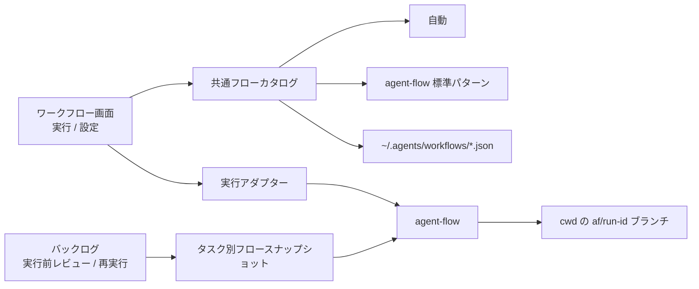

# Agent Dashboard ワークフロー画面再設計

> 対象: `tools/agent-dashboard/`、`tools/agent-flow/`、`tools/agent-project/`
>
> 既存の「クイック実行」を、Git リポジトリへ成果を残すワークフロー実行・編集画面へ置き換える。

## 1. 目的

左メニューの「クイック実行」を「ワークフロー」へ改称し、右ペインを「実行」「設定」の 2 タブに分ける。

- 「実行」では Git 管理された cwd とフローを選び、agent-flow を起動する。
- フローは「自動」「agent-flow 標準パターン」「ユーザーカスタム」から選べる。
- 成果は選択したリポジトリの `af/<run-id>` ブランチへ保存する。
- 「設定」ではノードの配置・接続でカスタムフローを編集し、ユーザー共通ファイルとして保存する。
- 各カスタムノードは実行プロファイルの tier を持ち、実行時に対応する agent CLI / model へ解決する。
- agent-project の実行前レビューと再実行でもフローを選べる。既定は自動とする。

UX はシンプルさと見やすさを優先する。内部バス、投入契約、未検収規則などの技術説明を通常画面へ並べず、必要なエラーと成果の所在だけを操作箇所の近くへ表示する。

## 2. 現状と変更する決定

現行 `adhoc-flow` はプロジェクト非依存の読み取り専用 run で、`workspace: null` を投入し、成果を「終了（未検収）」としてバスへ残す。カスタムプリセットは Dashboard の `config.json` に保存され、ビルダーは表形式でノードを編集する。

2026-08-08 の資源効率計画では、任意 cwd と専用状態ファイルを避ける決定をしていた。今回の要求はその前提を明示的に置き換える。cwd は任意パスを無検証で通すのではなく Git 管理を必須とし、実行は agent-flow の既存 workspace 契約へ載せる。カスタムフローは将来のリポジトリ共有を見越し、config の埋め込みではなく独立 JSON ファイルにする。

## 3. アプローチ比較

| アプローチ | 実装コスト | リスク | 保守性 | 拡張性 | 学習コスト | 推奨度 |
|---|---|---|---|---|---|---|
| A. 既存 `adhoc-flow` を内部再利用して刷新 | 中 | 低 | 高 | 高 | 低 | ★★★ |
| B. 新しい workflow feature を並設 | 高 | 中 | 中 | 高 | 中 | ★★☆ |
| C. 外部グラフエディタ／ワークフロー製品を統合 | 高 | 高 | 低 | 高 | 高 | ★☆☆ |

案 A を採用する。既存の agent-flow 起動、run 読み取り、キャンセル、再実行、グラフ表示を再利用し、表示名、タブ構造、workspace、フロー保存、編集 UI を置き換える。新しい実行系や別の run 読み手は作らない。

## 4. 責務分担



### agent-flow

- 標準パターンの唯一の正典を維持する。
- `patterns --json` でパターン ID・表示名・説明を列挙できるようにする。
- 明示パターンを CLI と inbox 契約の両方から受け、既存 `_strategy_to_graph` でグラフ化する。
- カスタムフローは既存のユーザー定義 `plan` 契約で受ける。
- workspace の clone、commit、push、`af/<run-id>` ブランチ作成は既存実装を使う。

### agent-dashboard

- 内部 feature は既存 `adhoc-flow` を利用し、表示領域を `workflows` とする。
- カタログの集約、カスタムフローの読み書き、cwd 検証、tier 解決、投入をメインプロセスへ集約する。
- run の読み取りは既存 `agent-project/main/flow.js` を再利用する。
- cwd 履歴だけを Dashboard の config に保存する。

### agent-project

- タスクに対応するフロースナップショットを `backlog/<task-id>.flow.json` に保存する。
- ファイル不在を「自動」と解釈する。
- 実行前レビュー／再実行コマンドに同梱されたスナップショットを検証し、agent-project 自身がファイルを書く。
- 実行時は自動、明示パターン、ユーザー定義 plan を agent-flow の既存ローカル／inbox 経路へ渡す。

## 5. 画面設計

### 5.1 左メニューとタブ

- 左メニュー名: `ワークフロー`
- 内部タブ: `実行`、`設定`
- 既存の単一 `quick-flow` タブは廃止する。

### 5.2 実行タブ

上から次の順に置く。

1. cwd の履歴付き入力とフォルダ選択
2. フロー選択
3. 要求テキスト
4. 実行ボタン
5. 実行履歴と選択中 run の詳細

フロー選択は 1 つの select にまとめ、`自動`、`標準パターン`、`カスタム`を optgroup で分ける。通常画面では bus path や投入契約を説明しない。終了時は成果ブランチと commit を主要情報として表示する。

cwd 履歴は重複を除いた MRU 最大 20 件とする。選択値は利用者が入力した表記で表示・保存し、実行環境へ渡す段階で正規化する。

### 5.3 設定タブ

3 ペインで構成する。

- 左: カスタムフロー一覧、作成、削除
- 中央: ノードパレット、キャンバス、接続線
- 右: 選択ノードの `id`、種別、指示、tier

ノードはパレットからドラッグして配置する。出力ポートから入力ポートへのドラッグで接続し、選択した接続を Delete で解除する。接続線は SVG、ノードは HTML 要素、移動は Pointer Events と pointer capture で実装する。新しい UI ライブラリは追加しない。

保存は明示操作とし、未保存状態を短い印で示す。未保存のまま別フローへ移動するときだけ破棄確認を出す。標準パターンと自動は選択専用で編集させない。

### 5.4 アクセシビリティ

- 全操作へ可視の `:focus-visible` を付ける。
- ノード追加、選択、矢印キー移動、依存先の選択、削除をキーボードでも行えるようにする。
- ドラッグでしか作れない状態を作らない。
- エラーは色だけで表さず、対象入力の近くへ短文で表示し `aria-live` で通知する。
- クリック対象は最低 44px 相当を確保する。
- アニメーションは 150〜300ms の色・透明度変化に限り、`prefers-reduced-motion` を尊重する。

## 6. カスタムフロー形式

保存先は当面ユーザー共通の `~/.agents/workflows/<id>.json` とする。将来、リポジトリ内カタログを第 2 の読み取り元として追加できるよう、ファイルは自己完結させる。初期版ではリポジトリ共有の探索・競合解決は実装しない。

```json
{
  "version": 1,
  "id": "review-flow",
  "name": "実装とレビュー",
  "nodes": [
    {
      "id": "implement",
      "kind": "work",
      "goal": "{{request}}",
      "tier": "medium",
      "deps": [],
      "position": { "x": 120, "y": 80 }
    }
  ]
}
```

- `version`、`id`、`name`、1 件以上の `nodes` を必須とする。
- 各ノードは `id`、`kind`、`goal`、`tier`、`deps`、`position` を持つ。
- `id` 重複、未知 kind、未知依存、自己依存、循環、存在しない tier を保存前に拒否する。
- `position` は編集 UI 専用で、agent-flow へ渡す plan からは除く。
- `goal` の `{{request}}` 置換は既存どおり agent-flow の 1 箇所で行う。
- 保存は同一ディレクトリの一時ファイルから rename する。
- 削除は `~/.agents/workflows/.trash/` へタイムスタンプ付きで移動する。

## 7. tier 解決

フローファイルには tier 名だけを保存する。Dashboard は選択時に agent-profiles の同一 tier 内で、宣言順に利用可能な候補を選び、各ノードの `{agent_cli, model}` へ解決する。明示した tier より下へはフォールバックしない。候補が無い場合は実行またはバックログ承認を開始しない。

解決結果は投入 plan またはタスクスナップショットへ固定する。後から profiles やカスタムフローを編集しても、承認済みの実行内容は変わらない。フローファイルの symbolic tier は将来別 PC／リポジトリで共有しても特定モデル名に縛られない。

## 8. cwd と Git 成果

- cwd は Git 管理下で、HEAD commit が存在することを必須とする。
- サブディレクトリが入力された場合は Git top-level と相対 path を解決し、workspace の `url` と `path` に分ける。
- 未 commit の変更は workspace へ含めない。該当時だけ「未commit変更は実行対象外」と短く警告する。
- base は選択時の HEAD とし、成果ブランチは既存規則 `af/<run-id>` を使う。
- 変更が無い run は既存どおりブランチを作らない。

Windows では Git 検証と agent-flow 起動を WSL 側で行う。画面と履歴は入力表記を保ち、実行直前に既存の WSL パス変換を使って `C:\...` を `/mnt/c/...` へ変換する。既に WSL パスなら二重変換しない。

## 9. agent-project 連携

実行前レビューと再実行の操作部へ、実行タブと同じフロー選択を置く。初期値は常に `自動`、既存スナップショットがあればその選択を表示する。

承認／再実行コマンドは次のいずれかを持つ。

- `{mode: "auto"}`
- `{mode: "pattern", id: "fan-out-and-synthesize"}`
- `{mode: "custom", id, digest, plan}`

agent-project はコマンド取り込み時に検証済みスナップショットを `backlog/<task-id>.flow.json` へ原子的に保存する。auto は sidecar を削除する。タスクを archive／trash へ移すときは sidecar も同じ場所へ移す。

フロー変更を伴う再実行は計画変更として扱う。既存 run を既存の detach/cancel 経路で切り離し、新しい run-id で最初から実行する。同一スナップショットで一時失敗しただけなら、既存の失敗ノード再開を維持する。

## 10. エラー処理

- cwd 不正、Git 未初期化、HEAD 不在、Windows→WSL 変換失敗
- フローファイル破損、ID 不正、循環、未知 tier
- tier 内の実行候補枯渇
- agent-flow のパターン列挙／起動失敗
- workspace の clone／commit／push 失敗

エラーは操作箇所の近くへ一文で表示し、必要なら再試行だけを示す。詳細ログは既存 run ログに残し、通常画面へ常時展開しない。不正なフローファイルは一覧から消さず「要修正」と表示して編集・削除できるようにする。

## 11. 既存データの移行

`config.json` の `adhocFlow.presets` が存在する場合、初回読込時にカスタムフローファイルへ移す。全ファイルの保存に成功した後だけ旧配列を空にするため、途中失敗でデータを失わない。

- 明示 agent/model が profiles の候補と一致すれば対応 tier へ変換する。
- agent/model 未指定なら現在の flow tier を使う。
- tier を決められないノードは推測せず「tier の設定が必要」として保存する。
- 旧 run、inbox、ログ、run-id は移行せず、そのまま既存読み手で表示する。

## 12. テスト

最小の回帰確認を責務境界ごとに置く。

1. Dashboard: フローファイルの load/save/trash、厳格検証、tier 解決、cwd MRU、Git/Windows パス変換
2. agent-flow: `patterns --json`、明示パターンの CLI/inbox 同値、workspace branch delivery
3. agent-project: sidecar の保存・auto 削除・archive/trash 追従、フロー変更時の新 run、同一フロー時の resume
4. Renderer: 2 タブ、フロー選択、ノード移動・接続・削除、キーボード代替、インラインエラー
5. 既存 `adhoc-flow` run の表示・キャンセル・再実行に回帰が無いこと

## 13. 実装計画

1. agent-flow に標準パターン列挙と明示パターン契約を追加する。
2. Dashboard メイン側へカスタムフローストア、検証、tier 解決、cwd 検証を追加する。
3. 既存 adhoc 投入を workspace 付きの共通 workflow 投入へ変更し、cwd 履歴を追加する。
4. 左メニューとタブを「ワークフロー／実行／設定」へ変更する。
5. 設定タブのノードキャンバス、接続、インスペクタ、キーボード操作を実装する。
6. agent-project のコマンド、sidecar、agent-flow 呼び出しへフロー選択を通す。
7. 実行前レビュー／再実行 UI に共通フロー選択を追加する。
8. 旧プリセットをファイルへ移行し、ドキュメントと回帰テストを更新する。

各段は既存の feature 分割と契約所有者に沿って進める。新しいフレームワーク、グラフライブラリ、実行デーモンは追加しない。

## 14. 非目標

- 初期版でのリポジトリ共有フロー探索・同期・競合解決
- n8n 互換フォーマットや任意プラグインノード
- カスタム JavaScript ノード、条件式 DSL、サブフロー
- agent-flow とは別の実行エンジン
- 自動保存、共同リアルタイム編集

## Decision Record

| 項目 | 内容 |
|---|---|
| 決定日 | 2026-08-09 |
| 決定者 | チーム |
| 採用案 | 案 A: 既存 `adhoc-flow` を内部再利用してワークフロー画面へ刷新 |
| 却下案 | 案 B（並設は実行・状態読み取り・移行を二重化する）、案 C（依存とパッケージングリスクが増える） |
| 主な理由 | 既存 agent-flow 契約と run 読み手を再利用しつつ、cwd ブランチ成果、ファイル永続化、ノード UI、バックログ選択を最小の責務追加で実現できる |
| トレードオフ | SVG/Pointer Events の基本操作とアクセシビリティを自前で保守する。初期版のカスタムフローはユーザー共通のみ |
| 再評価条件 | リポジトリ単位でフローを共有する需要が具体化した時、またはネスト・条件分岐など現行 plan 契約で表せないノードが必要になった時 |
