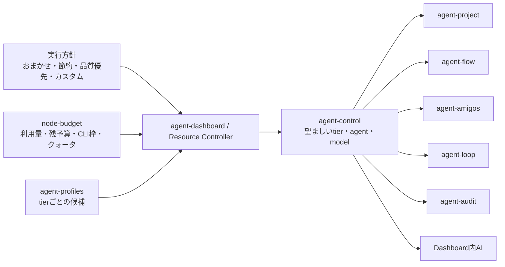

# Agent Dashboard 統一実行方針 UI・agent-tools 共通制御設計

## 背景

全体設定の「実行制御」では、「機能ごとの利用量」と「切り替え条件」が別々の設定として並び、
利用者は全体上限、配分比、最低保証、機能別上限、上限到達時の動作、段ごとの残予算率、
ヒステリシス、最小保持時間など、多数の数値を入力する必要がある。

入力値の目安が分からず、設定項目も多いため、初期値のまま放置されやすい。一方、agent-flow の
カスタムワークフローにはノードごとの tier があり、agent-project、agent-amigos、agent-loop、
agent-audit でも agent/model の解決方法と agent-control の対応範囲が揃っていない。

本設計では、設定画面を「実行方針」へ統合し、通常利用者はプリセットを選ぶだけにする。同時に、
agent-dashboard を管理面、agent-tools ファミリーを適用側とする pull 型の共通実行契約を定める。

## 採用方針

既存の node-budget、agent-profiles、agent-control 契約を維持し、次の責務へ統一する。

- agent-dashboard とヘッドレス Resource Controller は、利用量、残予算、CLI 枠、クォータ、
  選択された実行方針から tier と agent/model を決定する。
- 決定結果は agent-control の `workloads.<workload>` へ投函する。
- 各 agent-tools は agent-profiles を直接読まず、実行直前またはサイクル先頭で agent-control を
  pull して適用する。
- ノード、タスク、実行単位の明示固定は自動選択より優先する。ただし lifecycle と利用上限は
  迂回できない。
- 実際に使った tier、agent、model、選択元を status、result、台帳へ記録し、Dashboard は
  設定から再推測しない。



## 比較したアプローチ

| アプローチ | 実装コスト | リスク | 保守性 | 拡張性 | 学習コスト | 推奨度 |
|---|---|---|---|---|---|---|
| 既存 agent-control を共通の pull 型契約へ拡張 | 中 | 低 | 高 | 高 | 低 | ★★★ |
| Dashboard が各ツールの設定ファイルを直接書き換える | 中 | 高 | 低 | 中 | 中 | ★☆☆ |
| すべての実行を Dashboard プロセス配下へ移す | 高 | 高 | 低 | 低 | 高 | ★☆☆ |

push 型の個別連携は、ツール追加のたびに Dashboard 側の分岐と実行知識が増える。既存の pull 型を
維持すれば、Dashboard が停止しても各ツールは最後の宣言または自身の設定で動作を継続できる。

## 統一実行方針 UI

「機能ごとの利用量を設定」と「切り替え条件」を廃止し、1つの「実行方針」パネルへ統合する。

```text
実行方針

[ おまかせ（推奨）] [ 節約 ] [ 品質優先 ] [ カスタム ]

通常時: medium
利用上限がある場合: 残量に応じて medium → small
上限到達時: 品質を下げて継続

対象: 定常業務 / プロジェクト / ワークフロー / Amigos / 監査 / 画面内AI
固定指定: 3ノード（この方針では変更しません）
現在の試算: project=medium、flow=small、audit=medium

                              [この方針を保存して反映]
```

### プリセット

プリセットは絶対トークン上限を推測しない。上限未設定時は通常 tier を使い、利用者が既に上限を
設定している場合だけ残量比による切り替えを行う。プリセットを適用すると、既存のカスタム値は
上書き対象の要約を確認してから置き換える。

| モード | 上限未設定時 | 上限設定時 | 配分 | 上限到達時 |
|---|---|---|---|---|
| おまかせ | medium | 残量20%以上は medium、20%未満は small | 自動・均等 | smallへ縮退して継続 |
| 節約 | small | 常に small | 自動・均等 | smallのまま。継続不能なら一時停止 |
| 品質優先 | large | 残量20%以上は large、5%以上は medium、5%未満は small | 自動・均等 | smallへ縮退して継続 |
| カスタム | 利用者指定 | 利用者指定 | 利用者指定 | 利用者指定 |

プリセット値は UI に数値入力として表示しない。「通常は medium」「残りが少なくなったら small」の
ように、実際の動作を要約する。プリセットと保存値が一致しない既存設定はカスタムとして表示する。

### カスタムで表示する項目

初期表示は次の4項目に限定する。

1. 通常時に使う tier: small / medium / large
2. 全体利用上限: 任意。0 または空欄は無制限
3. 切り替えるタイミング: 早め / 標準 / ぎりぎり
4. 上限到達時: 品質を下げて継続 / 一時停止 / 停止

「機能ごとに上書き」を開いた場合だけ、機能別の優先度（低・標準・高）、個別上限、上限到達時の
動作を表示する。優先度は内部の配分比へ変換し、生の weight を入力させない。

次の値は実装の安定化パラメータであり、通常の設定項目から外す。

- ヒステリシス: 5%で固定
- 最小保持時間: 15分で固定
- 最低保証トークン
- 生の配分比
- tierごとの残予算率

将来、実測上これらの調整が必要になった場合だけ、開発者向けのテキスト編集または診断口を追加する。

### 保存と反映

- 「保存」「配分を更新」「いますぐ反映」は「この方針を保存して反映」へ統合する。
- 適用前に、各 workload の tier、agent、model、固定指定の除外件数を自動試算する。
- node-budget と agent-profiles は既存の別契約を維持し、同じ操作から冪等に両方へ保存する。
- 片方だけ失敗した場合は成功表示にせず、「一部未反映」と再適用ボタンを表示する。再適用は
  同じ完成状態を再送するため、安全に繰り返せる。
- プリセットから「この設定を元にカスタム」で微調整できる。

## 共通実行契約

### 契約対象

| 観点 | 内容 |
|---|---|
| 提供者 | agent-dashboard / Resource Controller |
| 利用者 | agent-project / agent-flow / agent-amigos / agent-loop / agent-audit / Dashboard内AI |
| 入力 | workload、purpose/role、明示固定、budget状態、tool設定 |
| 出力 | 実効tier、agent_cli、model、選択元、固定状態、理由 |
| 正典 | agent-control。agent-profilesは管理面だけが読む |

### 安全制御と選択制御の分離

安全制御は agent/model の選択より先に評価する。

1. `lifecycle=stop`: graceful に停止する
2. `lifecycle=pause`: 新規実行を控える
3. 利用上限到達: `on_exhausted` に従う
4. 実行可能な場合だけ agent/model を選ぶ

ノードやタスクの固定指定も lifecycle と利用上限を迂回できない。固定指定に対して
`on_exhausted=degrade`を満たせない場合は、指定と異なる agent/model へ黙って変えず一時停止する。

### agent/model の解決順

| 優先度 | 選択元 | source |
|---:|---|---|
| 1 | 実行・ノード・タスク単位の固定 agent/model | `pinned-agent` |
| 2 | 実行・ノード・タスク単位の固定 tierから解決した候補 | `pinned-tier` |
| 3 | agent-control の purpose/role 別指定 | `control-purpose` |
| 4 | agent-control の workload 指定 | `control-workload` |
| 5 | ツール設定 | `tool-config` |
| 6 | 組み込み既定 | `builtin` |

node-budget の soft 状態または `on_exhausted=degrade`では、固定されていない実行にだけ
agent-control の `degraded` を重ねる。固定tierまたは固定agentへは重ねない。

### 明示固定の共通語彙

既存形式を壊さず、各ツールの入力を次の3状態へ正規化する。

| 入力 | 意味 |
|---|---|
| tierもagentも無し、または `tier: auto` | 実行方針を継承 |
| `tier: small`等 | tierを固定し、同じtier内の候補だけから選ぶ |
| `agent: {agent_cli, model}` | agent/modelを完全固定 |

固定tierと固定agentの同時指定は曖昧なため拒否する。既存のagent-flow `node.agent`、
agent-project `verify_agent`は固定agentとして後方互換で解釈する。

### 実効値の記録

status、実行結果、node-budget台帳には、可能な箇所から次を加算的に記録する。

```json
{
  "tier": "medium",
  "agent_cli": "claude",
  "model": "sonnet",
  "selection_source": "control-workload",
  "pinned": false,
  "selection_reason": "preset=auto remaining=0.48"
}
```

status の `effective` には tier、agent_cli、model、source、pinned、反映状態を持たせる。
既存リーダは未知キーを無視できるため、加算的変更とする。

## workload の正典

LLMを実行する次のworkloadを統一対象とする。

| workload | 実体 | 反映タイミング |
|---|---|---|
| routine | agent-loop | 次回セッション起動。稼働中は再起動後 |
| project | agent-project | 次のLLM呼び出し |
| flow | agent-flow | 次のLLM呼び出し |
| amigos | agent-amigos | 次のroleターン |
| audit | agent-audit | 次のLLM呼び出し |
| dashboard | Dashboard内AI | 次の画面内AI呼び出し |

agent-board は処理を持たず、agentcore は共有ライブラリなので選択対象外とする。Dashboard の
`KNOWN_WORKLOADS`、node-budget、agent-control、利用状況表示はこの集合を正典として揃える。
未知workloadは従来どおり無害に無視できる加算的契約を維持する。

## ツール別の移行

### agent-flow

- 自動計画ノードは agent-control の flow tier/agent/model を実行直前に使う。
- カスタムワークフローのノードには `auto / small / medium / large` を表示する。
- 固定tierはDashboardが同じtier内で候補を解決し、tierとagent/modelをplanへ一緒に固定する。
- 固定tierで候補が枯渇した場合、下位tierへ黙って降格せず実行を待機する。
- 手法の `when.tiers` はノードtierを優先し、ノードtierがautoの場合だけ
  `control.workloads.flow.tier`を使う。これにより「smallのagentで動きながらmedium向け手法が
  適用される」不整合を解消する。

### agent-project

- 通常のpurpose解決は既存のagent-control優先を維持する。
- `verify_agent`は固定agentとして維持し、tier指定を追加する場合も共通語彙を使う。
- 固定指定が無いtaskはDashboardのproject実行方針を継承する。

### agent-amigos

- workload既定とrole別指定はagent-controlからpullする。
- ミッション／role側のagent/modelを固定指定として扱う場合は明示的なpinを持たせ、単なる
  role既定と区別する。既存値は互換のためtool設定として扱い、control優先を維持する。
- 固定指定が無いroleはDashboardのamigos実行方針を継承する。

### agent-loop

- agent-loop本体が `workloads.routine.agent_cli / model / degraded` を読む。Dashboard経由の
  起動だけに解決を依存させない。
- 対話CLIは実行中に差し替えられないため、desiredと実効値が違う場合は
  `restart_required: true`をstatusへ記録する。
- Dashboardは「再起動後に反映」と表示し、無断で稼働セッションを再起動しない。
- statusのeffectiveには`agent-loop`ではなく、実際の対話CLIとmodelを記録する。

### agent-audit

- `workloads.audit`を正式なworkloadへ追加する。
- controlの`defaults`、workload、purposeの順を他ツールと揃える。
- `$AGENT_CONTROL_DIR`、degraded、status、workload別budget配分を共通契約どおり解釈する。
- extract / distill / reviewをpurpose別指定として扱う。

### Dashboard内AI

- `workloads.dashboard`を追加し、画面内AIの既存設定はtool設定として下位フォールバックにする。
- 下書き、補完、Doctorなどのpurposeをagent-controlの`agents`で上書きできるようにする。
- 実行量をnode-budgetへ記帳し、利用状況へ含める。

## Resource Controller

既存の `tools/agent-dashboard/scripts/resource-control.js` を判断処理の唯一のヘッドレス入口として
再利用する。新しい実行デーモンは作らない。

- Dashboard起動中は同じ処理を既定5分間隔で呼ぶ。
- agent-loopの`resource-control-hook.py`を使う端末では、Dashboard不在時も同じ入口を呼ぶ。
- どちらも動いていない場合は最後に適用したcontrolが有効なまま残る。
- statusの最終評価時刻が既定間隔の2倍を超えた場合、Dashboardは
  「自動制御が停止しています」と表示し、プリセットが自動追従中であると誤表示しない。

## エラーハンドリング

- 未知tier、tier候補なし、固定tier候補の枯渇は実行前に明示的に失敗または待機させる。
- 固定指定と自動縮退が衝突した場合は固定指定を変えず、上限到達として待機する。
- controlが壊れている場合は最後の正常値を保持するかtool設定へ戻り、別agentへ黙って倒した場合は
  必ずsourceと警告を残す。
- desiredとeffectiveが違う場合はstatusのrevisionと反映状態で可視化する。
- Resource Controllerが停止している場合も各ツールの実行自体は止めず、最後の宣言を使う。

## アクセシビリティとレスポンシブ

- 4モードはラジオグループとして実装し、選択状態を色だけで伝えない。
- 各モードに短い説明と適用結果を併記する。
- カスタムの数値入力には常時表示のlabel、単位、境界値、エラーを付ける。
- 「機能ごとに上書き」はdetailsで段階表示し、キーボードで開閉できる。
- 狭幅ではモードカードと機能別上書きを1列にし、横スクロールを発生させない。
- 保存・反映中は重複操作を防ぎ、部分失敗は操作箇所の近くで`role=alert`として表示する。

## 契約テスト観点

- CT1: auto実行がworkload/purpose別controlを解決し、実効値とsourceをstatusへ記録する。
- CT2: 固定tierが同じtier内だけで候補を選び、下位tierへ降格しない。
- CT3: 固定agentが自動選択より優先される一方、lifecycleとhard budgetを迂回しない。
- CT4: soft/degradedがauto実行へだけ適用され、固定指定へは重ならない。
- CT5: agent-flowの手法判定が固定ノードtierを使い、auto時だけworkload tierへフォールバックする。
- CT6: project、flow、amigos、auditは次の呼び出し／ターンで反映される。
- CT7: routineは稼働中にdesiredとeffectiveが異なる場合、restart_requiredを返す。
- CT8: auditとdashboardが利用状況、配分、上限判定へ含まれる。
- CT9: 既存のnode.agent、verify_agent、tool設定が移行後も同じ意味で動く。
- CT10: 未知workloadと未知キーを既存リーダが無害に無視する。

## 実装計画

1. 共通の解決順、source、pinned、tierの契約をschemaとagentcoreへ追加する。
2. workload集合へaudit/dashboardを追加し、Dashboardの利用量・配分表示を揃える。
3. agent-flowのplanへtierを保持し、ノードtier優先の手法判定へ変更する。
4. agent-projectとagent-amigosの固定指定を共通語彙へ正規化する。
5. agent-loopへagent/model/degradedのpullとrestart_required statusを追加する。
6. agent-auditのcontrol、budget、statusを共通契約へ揃える。
7. Dashboard内AIをdashboard workloadへ接続し、台帳へ記帳する。
8. 実行方針パネル、プリセット、カスタム、試算、単一の保存・反映操作を実装する。
9. Resource Controllerの稼働状態を表示し、Dashboard起動中の定期評価を接続する。
10. ツール別契約テストとDashboard UIテストを実行する。

## 既存スキルとの関係

- `ui-designer`: プリセット選択、段階表示、フォームのアクセシビリティに利用する。
- `contract-driven-development`: agent-controlと各エンジン間の入力、出力、互換性、契約テストを固定する。
- `webapp-testing`: モード切替、カスタム展開、試算、部分失敗、狭幅表示の実画面確認に利用できる。
- `failure-driven-development`: Resource Controller停止、部分保存、固定指定と上限の衝突を実装時に検証する。

## Decision Record

| 項目 | 内容 |
|---|---|
| 決定日 | 2026-08-11 |
| 決定者 | ユーザー |
| 採用案 | 実行方針を4モードへ統合し、既存agent-controlを全agent-tools共通のpull型制御契約へ拡張する |
| 却下案 | Dashboardによる各ツール設定の直接書換、全実行のDashboard配下への移管、数値入力中心の現行UI維持 |
| 主な理由 | 数値設定を不要にしつつカスタム性を残し、Dashboard不在時にも各ツールが自律動作できるため |
| トレードオフ | agent-loopは稼働中セッションへ即時反映できず、複数の既存契約への冪等な保存が必要 |
| 再評価条件 | pull型の反映遅延が実運用上問題になる、プリセットの実測品質が不足する、またはworkloadごとに独立した方針が必要になった場合 |
