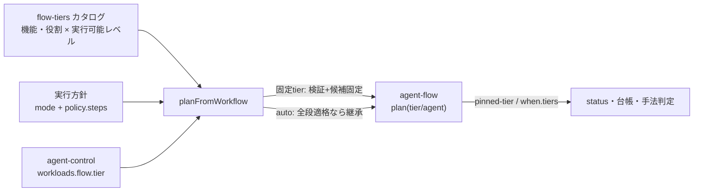

# agent-flow 機能・役割別の実行可能tierと実行方針による自動決定 設計

## 背景

agent-dashboard のワークフロービルダーでは、すべてのノード機能（work / generate / classify /
synthesize / verify / filter / judge / reduce / split / map / extract / retrieve）に対して、
どの実行レベル（tier: basic / small / medium / large）でも選べる。統一実行方針設計
（docs/plans/2026-08-11-agent-dashboard-unified-execution-policy-design.md）は「basic は
短い一手順だけを任せるレベル」と定義したが、その適格性はどこにも宣言されておらず、
work ノードを単純作業（basic）へ固定する、判定（judge）を軽量（small）で走らせる、といった
不整合を設定画面もエンジンも止められなかった。

また、オプションとして振る舞いを拡張する継続動作（classify の route、verify の retry）は
機能の複雑さを一段上げる——route は分類結果がフローの形を決める制御になり、retry は検証の
判定がリトライ予算と再作業を直接駆動する——が、tier の要求には反映されていなかった。

さらに、複数の実行レベルで実行可能な振る舞い（auto tier ノード）の実際のレベルは、実行時の
`workloads.flow.tier` をそのまま継承するだけで、機能ごとの適格範囲を考慮しない。節約方針で
flow 全体が small のとき、auto の judge ノードも small で走ってしまう。

加えて実装ギャップとして、統一実行方針設計の移行項目「agent-flow の plan へ tier を保持」が
未実装だった（`plan_strategy_user` と `_node_entry` が plan の `tier` を落とすため、固定 tier が
`pinned-tier` として status・台帳へ記録されず、手法パックの `when.tiers` ノード tier 優先も
ユーザー定義フローでは効いていなかった）。

## 採用方針

機能・役割ごとの実行可能 tier カタログを**管理面（agent-dashboard）の 1 実装**として宣言し、
plan を組む時点で適用する。エンジンの解決経路は増やさない（既存不変条件:
エンジンは agent-profiles もこのカタログも読まない）。

- カタログ: `tools/agent-dashboard/src/features/orchestration/main/flow-tiers.js`。
  機能（kind）・役割（role）ごとの下限 tier と、オプション（continuation）による下限の
  引き上げを宣言する。
- 固定 tier: plan 生成（`planFromWorkflow`）で適格性を検証し、範囲外は投入前に明示エラー。
- auto tier: 実行方針（おまかせ・節約・品質優先・カスタム）が選びうる段がすべて適格なら
  従来どおり継承（plan へ tier を書かない）。不適格な段を選びうる機能だけ、今の段を適格範囲へ
  丸めて plan へ固定する。
- エンジン: plan の `tier` を保持し（`plan_strategy_user` / `_node_entry`）、継続動作による
  作り直しノードへも固定 tier を引き継ぐ。エンジンは tier を記録（pinned-tier）と手法判定に
  使うだけで、候補の解決はしない。

## 比較したアプローチ

| アプローチ | 実装コスト | リスク | 保守性 | 拡張性 | 推奨度 |
|---|---|---|---|---|---|
| 管理面カタログ + plan 生成時に適用（採用） | 中 | 低 | 高 | 高 | ★★★ |
| エンジンへ適格性カタログを持たせ実行時に強制 | 中 | 中 | 低 | 中 | ★☆☆ |
| control の `agents.<purpose>` へ機能別上書きを常時投函 | 中 | 高 | 低 | 中 | ★☆☆ |

エンジン側強制は「エンジンは選択の知能を持たない」分業（agent-profiles 不変条件）を壊し、
カタログの 2 実装を生む。purpose 別 control 上書きは既存決定（`workloads.<wl>.agents` は
Dashboard の通常 UI から新規作成しない）と衝突し、外部設定を上書きする危険がある。
plan 生成時の適用は、固定 tier の既存契約（「同じ tier 内だけで選ぶ・黙って降格しない」）へ
そのまま乗る。

## 機能・役割ごとの実行可能tier（見直し結果）

宣言は「下限」で持つ（上限は切らない——高性能で単純作業を実行しても品質は落ちず、
高い段が選ばれにくいのは実行方針＝予算側の仕事）。

| 機能（kind） | 実行可能レベル | 理由 |
|---|---|---|
| classify（分類） | 単純作業〜 | 一手順のラベル付け（JSON 契約） |
| filter（選別） | 単純作業〜 | 基準による絞り込み（JSON 契約） |
| extract（抽出） | 単純作業〜 | 根拠付きの項目取り出し（JSON 契約・一手順） |
| map（個別処理） | 単純作業〜 | 分割済みの 1 項目への単一処理 |
| work（作業） | 軽量〜 | 依頼の文脈全体を運んで成果物を作る |
| generate（生成） | 軽量〜 | 同上（候補の生成） |
| verify（検証） | 軽量〜 | 誤判定が後続のリトライ・完了判定を壊す |
| reduce（集約） | 軽量〜 | 分割結果すべてを文脈に載せる |
| retrieve（取得） | 軽量〜 | read 系ツールで根拠を実際に読む |
| synthesize（統合） | 標準〜 | 複数成果の横断比較と統合判断 |
| judge（判定） | 標準〜 | 候補の横断比較と選択 |
| split（分割） | 標準〜 | フローの形を決める＝計画に相当 |
| human（人の確認） | — | tier を持たない（エンジンも plan の human への tier を拒否） |

| 役割（role） | 実行可能レベル | 理由 |
|---|---|---|
| planner | 標準〜 | run 全体の形を決める |
| evaluator | 標準〜 | 継続・完了の判定が run を終端する |
| worker / verify | 軽量〜 | 対応する kind と同じ下限（カタログ内の矛盾防止） |

planner / evaluator は plan を持たない自動計画経路で使われるため、今回の plan 生成時適用の
対象外（カタログへの宣言のみ）。workload 全体の方針が basic を選ばない既存制約
（`POLICY_TIERS` は small/medium/large）と合わせて、実行時に planner が単純作業へ落ちる
経路はない。

## オプションとして拡張する振る舞い（見直し結果）

継続動作（continuation）は機能の複雑さを一段上げるため、下限を引き上げる。

| オプション | 対象機能 | 下限 | 理由 |
|---|---|---|---|
| route（分類後に専門工程を追加） | classify | 軽量〜 | 分類結果がフローの形を決める制御になる。単純作業のラベル付けには任せない |
| retry（未完了なら修正工程を追加して再検証） | verify | 標準〜 | 判定がリトライ予算と再作業を直接駆動する。誤 fail は再作業を焼き、誤 pass はループを終わらせる |

- エディタはオプションを有効にした時点で選択肢を絞り、不適格になった固定レベルは
  「自動」へ戻す（黙って別の固定レベルへ振り替えない）。通知で理由を示す。
- route が実行時に追加する専門工程（work ノード）は tier を持たず方針を継承する
  （work の下限 small は、方針が basic を選ばないことで満たされる）。
- retry が作り直すノード（修正・再検証）は、置き換え元の固定 tier を引き継ぐ
  （固定は迂回されない契約。エンジン `continuation` 側で実装）。

## 複数tierで実行可能な振る舞いの戦略による決定

auto tier ノードの決定規則（`flow-tiers.decideAutoTier`、純関数）:

1. 実行方針が選びうる段（`policy.steps` + `no_cap_tier`）がすべてその機能の適格範囲内なら
   **継承**——plan へ tier を書かず、実行時の agent-control 追従（予算による切替）を保つ。
   work / generate / verify など下限 small の機能は、どのプリセットでもここに入る。
2. 不適格な段を選びうる場合（例: 節約方針 × judge）は、今の段（`workloads.flow.tier`、
   無ければ方針の既定: おまかせ=標準 / 節約=軽量 / 品質優先=高性能 / カスタム=通常時 tier）を
   適格範囲へ丸めて plan へ**固定**する。丸めは範囲外を端へ寄せ、（理論上の）飛び穴は方針の
   性格で方向を決める——節約は下へ、それ以外は上へ。
3. 固定した plan ノードには `selection_reason`（strategy=... inherit=... allowed=...）を残す
   （エンジンは無視する加算的キー。inbox 記録から後追いできる）。

固定された auto ノードは固定 tier ノードと同じ扱いになる——同じ tier 内だけで候補を選び、
枯渇時は黙って降格せず待機する。resubmit は inbox の plan を写すため「同条件の再実行」の
既存意味論を保つ。

標準語彙（basic/small/medium/large）の外の独自 tier 名は適格性の対象外として従来どおり通す
（後方互換）。未知の機能（エンジン側で kind が増えた場合）も制限しない（加算的契約）。

## plan への tier 保持（エンジン側の実装ギャップ解消）

- `plan_strategy_user`: ノードの `tier`（空でない文字列）を保持する。human への tier は
  agent と同様に拒否する。
- `orchestrate._node_entry`: graph のノード entry へ `tier` を運ぶ（work.py が claim 時に
  `node_agent["tier"]` として読み、status の `pinned-tier` と手法判定へ渡す既存経路が
  ユーザー定義フローでも機能するようになる）。
- `continuation`: verify-retry の作り直し（依存の再作業・再検証）、失敗リトライ、evaluator の
  replan 置き換えで、置き換え元の `tier` を引き継ぐ。

## エラーハンドリング

- 固定 tier が適格範囲外: plan 生成で明示エラー
  「ノード「id」（kind）は実行レベル「単純作業」に任せられません（選べる実行レベル: …）」。
  保存済みワークフローの読込は壊さない（検証は投入経路のみ。旧ファイルは一覧に残り、
  投入時に指摘される）。
- profiles / control が無い・壊れている端末: plan 生成は止めず、方針の既定値から決める。
- 丸めた tier に候補が無い: 従来どおり「tier「…」で実行できるエージェントがありません」で
  投入前に失敗する（黙って別 tier へ倒さない）。

## 契約テスト観点

- CT1: カタログは human を除く全ノード機能を覆い、実行可能レベルは標準語彙の連続区間で、
  エディタの機能一覧（NODE_KINDS）とずれない。
- CT2: basic に任せるのは classify / filter / extract / map のみ。
- CT3: route / retry オプションが下限を引き上げ、外すと元の下限へ戻る。
- CT4: 適格範囲外の固定 tier は plan 生成でエラーになる。
- CT5: 方針の全段が適格な auto ノードは tier 無しで継承し、不適格な段を選びうる auto ノードは
  戦略に応じた段へ固定される（節約 × judge → 標準、品質優先 × judge × 今の段 large → 高性能）。
- CT6: `plan_strategy_user` が tier を保持し、human への tier を拒否し、`_node_entry` が
  graph へ運ぶ。
- CT7: 継続動作の作り直しノードが置き換え元の固定 tier を引き継ぐ。
- CT8: 独自 tier 名・未知 kind は制限されない（後方互換・加算的契約）。

## 既存スキルとの関係

- `contract-driven-development`: カタログと plan 契約の適格性検証・後方互換をテストで固定する。
- `failure-driven-development`: profiles/control 欠落時のフェイルオープン、候補枯渇時の
  明示失敗を検証する。

## Decision Record

| 項目 | 内容 |
|---|---|
| 決定日 | 2026-08-12 |
| 決定者 | ユーザー（見直し依頼）/ 実装判断は Claude |
| 採用案 | 機能・役割×実行可能tierのカタログを管理面（flow-tiers.js）へ宣言し、plan生成時に固定tierの検証とauto tierの戦略決定（全段適格なら継承・不適格な段を選びうるなら丸めて固定）を行う。エンジンはplanのtierを保持し、作り直しノードへ引き継ぐ |
| 却下案 | エンジン側での適格性強制（カタログの2実装・分業の破壊）、controlのagents.<purpose>への常時投函（外部設定と衝突） |
| 主な理由 | 既存不変条件（エンジンはprofilesを読まない・固定tierは降格しない）にそのまま乗り、選択の知能を管理面の1実装に保てるため |
| トレードオフ | 丸めて固定されたautoノードは実行中の予算変化に追従しない（固定tierノードと同じ扱い）。planner/evaluatorの下限はカタログ宣言のみで、plan生成時の適用対象外 |
| 再評価条件 | 実行中の予算変化への追従が固定ノードでも必要になった場合、機能別の下限が実運用の品質実測と合わない場合、またはエンジン側kindが増えてカタログとの同期コストが問題になった場合 |
