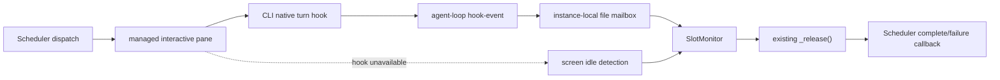

# agent-loop CLI ターン完了hook設計

> 作成日: 2026-08-12  
> 状態: 承認済み  
> 対象: agent-loop が起動・管理するinteractive CLI pane  
> 関連: [`docs/designs/agent-loop-design.md`](../designs/agent-loop-design.md)

## 1. 概要

agent-loopのinteractive実行は、現在tmux paneの表示内容からCLIのbusy/idleを推定してターン完了を検知している。表示文言やTUI構造が変わると誤判定するため、対応CLIでは各CLIのnative lifecycle hookを優先して完了を検知する。

hookはagent-loopが起動したプロセスにだけ注入する。ユーザーのglobal設定、project設定、手動起動したCLI、外部paneは変更しない。native hookが利用できない場合は既存の画面監視へ戻る。

本設計でいう用語を区別する。

- `hooks`: agent-loop YAMLで外部イベントを取得するスクリプト群
- turn-completion hook: CLI自身が発火するターン終了イベント。本機能の内部実装でありYAMLへは公開しない
- hook adapter: CLIごとの注入方法とnative eventの変換処理

## 2. 目的と対象外

### 目的

- interactive CLIのターン完了を画面表示より確実に検知する
- Schedulerをdispatchと完了callbackの唯一の所有者として維持する
- 同じdispatchの完了・失敗callbackを正確に1回だけ発火する
- ユーザーのskills、steering/instructions、MCP、既存hook/notificationを維持する
- hookの欠落、拒否、バージョン差では既存の画面監視へ安全に戻る
- `max_concurrent: 0`でも完了検知を利用できる

### 対象外

- headless実行。subprocessの終了コードを使うためnative hookは不要
- agent-loopが起動していない外部paneや手動CLIへのhook注入
- Cursor。agent-loop専用のsession-local注入方法が確認できないため初期対象外
- Kiro CLI v3。classicとhook/agent形式が異なるため初期対象外
- 新しいDB、daemon間socket、常駐service
- native hookが提供しない失敗理由の推測

## 3. 採用方式

| 方式 | 長所 | 短所 | 判断 |
|---|---|---|---|
| native hookからfile mailboxへ通知 | 既存のfile状態管理とSlotMonitorを再利用できる | 短いpoll遅延がある | 採用 |
| native hookからdaemon socketへ直接通知 | 低遅延 | socket認証、再接続、daemon lifecycleが増える | 不採用 |
| すべてheadless/per-run化 | process終了が明確 | interactive sessionと文脈継続を失う | 不採用 |

新しい通信基盤は作らない。native hookはイベントをファイルへ記録するだけで、SlotMonitorが既存の`_release()`とcallback経路へ合流させる。



## 4. 設定契約

対応を明示するagent定義だけ、`interactive.turn_completion`を追加する。

```json
{
  "interactive": {
    "command": ["claude"],
    "turn_completion": "claude"
  }
}
```

初期の既知値は`kiro`、`claude`、`codex`、`copilot`、`opencode`とする。未指定または未知の値は画面監視だけを使う。任意CLI用の汎用hookテンプレートやYAML設定は追加しない。

legacy Kiro経路はagent定義がない場合も内部的に`kiro` adapterを選択する。ただしKiro v3、解決不能なagent形式、runtime準備失敗では画面監視へ戻る。

## 5. runtime mailbox契約

instanceごとの状態を既存のagent home配下へ作る。

```text
~/.agents/loop-hooks/<instance-id>/
├── active/
│   └── <pane-id>.json
└── events/
    └── <dispatch-id>.json
```

- instance directoryとsubdirectory: `0700`
- active/event file: `0600`
- pane IDとdispatch IDはファイル名へ使用する前に安全な文字へ正規化する
- 書き込みは同一directory内の一時ファイルと`os.replace`/exclusive createで原子的に行う

### active record

prompt送信成功後、SlotMonitorの追跡開始時に作成する。

```json
{
  "version": 1,
  "instance_id": "a1b2c3d4",
  "pane_id": "%7",
  "dispatch_id": "request-uuid",
  "generation": 3,
  "agent_cli": "claude",
  "started_at": "2026-08-12T10:00:00Z",
  "hook_token": "random-per-pane-token",
  "failure_pending": false
}
```

### terminal event

```json
{
  "version": 1,
  "instance_id": "a1b2c3d4",
  "pane_id": "%7",
  "dispatch_id": "request-uuid",
  "generation": 3,
  "status": "complete",
  "adapter": "claude",
  "native_event": "Stop",
  "occurred_at": "2026-08-12T10:00:05Z"
}
```

`status`はterminal eventでは`complete`または`failure`だけとする。Copilot/OpenCodeの非terminal errorはeventを作らず、active recordの`failure_pending`を`true`へ更新する。

### hook-eventの検証

`agent-loop hook-event`は次をすべて満たす場合だけ状態を更新する。

1. `AGENT_LOOP_INSTANCE_ID`に対応するruntimeが存在する
2. `$TMUX_PANE`に対応するactive recordが存在する
3. `AGENT_LOOP_HOOK_TOKEN`がactive recordと一致する
4. adapterがactive recordの`agent_cli`と一致する
5. recordのinstance ID、pane ID、dispatch ID、generationが有効である

不正、古い、形式不明の通知は無視して終了コード`0`を返す。標準出力を出さず、CLIのstop処理を妨げない。

## 6. 状態遷移と一回性

```text
IDLE
  └─ dispatch/send成功 ─> ACTIVE
       ├─ terminal complete ─> COMPLETE
       ├─ terminal failure  ─> FAILURE
       ├─ failure hint      ─> ACTIVE(failure_pending=true)
       ├─ screen idle       ─> COMPLETEまたはFAILURE(failure_pending時)
       └─ pane death/timeout ─> FAILURE
```

SlotMonitorは画面判定より先にmailboxを確認する。有効なterminal eventがあれば、既存の`_release(notify_complete=True)`またはfailure経路へ渡す。その後active/eventを削除する。

native eventと画面監視が競合しても、既存の`_release()`がactive追跡recordを取得できた最初の一方だけcallbackを実行する。後続通知はactive recordがないためno-opになる。native hook自身はsemaphoreを解放しない。

## 7. CLI別adapter

| CLI | session-local注入 | 正常終了 | 失敗処理 | 既存設定の維持 |
|---|---|---|---|---|
| Kiro classic | private `KIRO_HOME` + `--agent` | `stop` | pane death/timeout | whitelist snapshotと明示resources |
| Claude | `--plugin-dir` | `Stop` | `StopFailure` | pluginを加算しmain agentを変更しない |
| Codex | one-off `--config notify=...` | `agent-turn-complete` | pane death/timeout | base configを維持し既存notifyを多重化 |
| Copilot | `--plugin-dir` | `agentStop` | `errorOccurred(recoverable=false)`をhint化 | `COPILOT_HOME`等を変更しない |
| OpenCode | `OPENCODE_CONFIG_DIR` | `session.idle` | `session.error`をhint化 | global/project/custom configのmergeを利用 |

### 7.1 Kiro classic

Kiroのhookはagent設定内にあるため、agent-loop用agentを使う必要がある。一方`KIRO_HOME`はglobal agents、prompts、skills、steering、settings、sessions全体の基準directoryを変更する。そのまま空のprivate homeを使うとユーザー設定が消える。

pane起動前に、実ユーザーhomeから次だけをprivate runtimeへsnapshotする。

```text
agents/
prompts/
skills/
steering/
settings/cli.json
settings/mcp.json
```

sessions、logs、cache、認証情報はコピーしない。snapshotは`0700`/`0600`で保護し、pane cleanup時に削除する。symlinkは、agent操作がユーザーhomeへ書き戻る可能性があるため使わない。

agent設定は次のように作る。

- default agent: snapshotを基にagent-loop agentを生成する
- JSON custom agent: project優先で解決してコピーし、既存設定を保ったまま`stop` hookを追加する
- steering、skills、`AGENTS.md`を明示的な`resources`へ重複なしで追加する
- `includeMcpJson: true`を設定する
- Kiro v3、非JSON/built-inで安全に複製できないagentは画面監視へ戻す

Kiro 2.7以降のdefault resource inheritanceにも依存しない。private `KIRO_HOME`とversion差があっても、必要resourceを明示する。

### 7.2 Claude

hookだけを含む一意名のpluginを`--plugin-dir`で加算する。pluginには`settings.json`の`agent`、skills、MCP、custom agentを含めない。ユーザー・projectのCLAUDE.md、skills、MCP、installed pluginは通常の探索を継続する。

### 7.3 Codex

`CODEX_HOME`は変更しない。`notify`へagent-loopのhidden commandをone-off overrideとして指定するため、AGENTS.md、skills、MCP、user/project configはそのまま利用される。

既存`notify`がある場合は上書きして失わないよう、agent-loop notify multiplexerが次の順で実行する。

1. agent-loop terminal eventを記録する
2. 解決済みの既存notify commandへCodex payloadを渡す

既存notifyは`~/.codex/config.toml`と選択profileからstdlib `tomllib`で解決する。値がstring配列でない、CLI自身が別のnotify overrideを持つなど安全に解決できない場合はCodex adapterを無効化し、画面監視へ戻す。

Codexの`Stop` lifecycle hookは利用しない。非managed hookは信頼確認が必要であり、`--dangerously-bypass-hook-trust`はagent-loop用以外の未承認hookにも影響し得るためである。

### 7.4 Copilot

一意名のhook pluginを`--plugin-dir`で加算する。`COPILOT_HOME`、`--config-dir`、`COPILOT_PLUGIN_DIR_ONLY`は設定しないため、user/projectのinstructions、skills、MCP、installed pluginのambient discoveryを維持する。

`errorOccurred`はターン終了を保証しない。`recoverable=false`だけをfailure hintとして記録し、`agentStop`または画面idleまで解放しない。`recoverable=true`は診断ログだけに使う。

### 7.5 OpenCode

private `OPENCODE_CONFIG_DIR`には一意名のlocal pluginだけを置き、`opencode.json`を作らない。OpenCodeのconfig mergeを利用し、global/projectのconfig、agents、skills、MCPを維持する。

`session.error`はfailure hint、`session.idle`はterminal eventとする。error後にidleになった場合はfailureとして完了する。

## 8. install asset

YAMLの`hooks/`とは別に、CLI lifecycle用assetを配置する。

```text
<install-prefix>/agent-hooks/
├── claude/
│   ├── .claude-plugin/plugin.json
│   └── hooks/hooks.json
├── copilot/
│   ├── plugin.json
│   └── hooks.json
├── opencode/
│   └── plugins/agent-loop.js
└── kiro/
    └── agent-loop.json
```

`install.sh`はassetをコピーするだけとし、各CLIの存在確認、起動、global設定更新を行わない。Codexはagent-loop executable自身をnotify commandとして使うためasset不要。

各managed paneへだけ次を設定する。

- `AGENT_LOOP_INSTANCE_ID`
- `AGENT_LOOP_HOOK_TOKEN`
- `AGENT_LOOP_AGENT_CLI`
- CLI別のprivate runtime/notify chain用環境変数

## 9. 失敗処理とcleanup

| 状況 | 動作 |
|---|---|
| asset欠落、CLIが設定を拒否 | WARNING、doctor finding、画面監視へfallback |
| hook commandがeventを書けない | hookはexit 0、画面監視が完了を検知 |
| token/adapter/generation不一致 | 無視。callbackしない |
| duplicate terminal event | 最初だけ受理 |
| native eventと画面判定の競合 | `_release()`の最初の一方だけcallback |
| cancel、pane停止・再起動 | active/eventを先に削除して既存failure/cleanupへ合流 |
| daemon停止 | 追跡中requestを既存経路で終了後、自instance runtimeを削除 |

初期実装では他instanceの孤児runtimeを全走査しない。instance IDとtokenにより誤使用されず、ファイルも小さい。必要性が確認された場合に`doctor --cleanup`を追加する。

## 10. `slot-release`互換性

hidden command `slot-release`は旧Kiro agentとの互換aliasとして残す。

- 有効なmanaged環境とactive recordがあれば、`kiro` adapterのterminal completeへ変換する
- 有効なactive recordがなければno-op
- semaphoreを直接解放しない

これにより以前のKiro agent設定は新agent-loop管理pane内で動作し、agent-loop外では影響しない。

## 11. テスト方針

実CLIや認証情報はCIで使わず、native eventを発火するfake CLI/fixtureで検証する。

### 共通契約

- token、adapter、dispatch、generation検証
- terminal eventのatomic writeとduplicate無視
- native eventと画面監視の競合時にcallbackが1回
- failure hint後のterminal/idleをfailureへ変換
- cancel、pane death、daemon停止時のcleanup
- `slot-release`のmanaged内変換とmanaged外no-op

### adapterと設定継承

- Kiro snapshotがwhitelistだけを含み、sessions/logs/cache/認証情報を含まない
- Kiro default/custom agentでsteering、skills、MCP、project resourceを維持する
- Claude/Copilot/OpenCodeで既存skills、MCP、instructionsとhookが同時に有効になる
- Codexでagent-loop eventと既存notifyが各1回実行される
- Codex既存notifyを安全に解決できない場合にfallbackする
- 全CLIでuser/project設定ファイルの内容とmtimeが変化しない

### routing

- headless、external pane、手動CLIへhookを注入しない
- `turn_completion`未指定agentは画面監視だけを使う
- `max_concurrent: 0`でもnative completion callbackが動く
- unsupported version/asset欠落時にdispatch自体は失敗しない

リリース前だけ、対応CLIごとに手動smoke testを行う。

## 12. 受入条件

1. managed interactive paneで1ターンにつきcomplete/failure callbackが正確に1回発火する
2. hookはagent-loopが起動したpane内でだけ動作する
3. user/projectの設定ファイルを作成・変更しない
4. 既存skills、steering/instructions、MCP、notificationsを失わない
5. install時にKiroその他のCLIを必要としない
6. hookが使えなくても従来の画面監視で処理を継続する
7. Cursor、Kiro v3、headlessへ未完成の注入を行わない

## 13. rollout

実装と確認は次の順で行う。

1. mailbox、`hook-event`、SlotMonitor連携、旧`slot-release`
2. Kiro classicのprivate runtimeと設定継承
3. ClaudeとCodex adapter
4. CopilotとOpenCode adapter、failure hint
5. doctor、ドキュメント、全adapter smoke test

adapterは`interactive.turn_completion`単位で無効化できる。問題があるCLIだけfieldを外せば画面監視へ戻る。

## 14. Decision Record

### DR-1: SchedulerとSlotMonitorを完了処理の唯一の経路にする

- **決定**: native hookはfile eventだけを作り、semaphore解放やScheduler callbackを直接呼ばない
- **理由**: 既存の一回性、generation検証、oneshot/cleanup処理を再利用できる
- **却下**: hookからsocket/APIでSchedulerを直接操作する方式は、認証とlifecycleを増やす

### DR-2: hook注入はagent-loop管理プロセス内に限定する

- **決定**: CLI引数・環境変数・private runtimeだけで注入し、global/project設定を変更しない
- **理由**: agent-loop外の手動CLIへ副作用を出さないという要件を満たす
- **帰結**: session-local注入が確認できないCursorは対象外

### DR-3: Kiroはwhitelist snapshotでユーザー機能を維持する

- **決定**: private `KIRO_HOME`へ設定/resourceだけをsnapshotし、agentへresourcesとMCP継承を明示する
- **理由**: 空のprivate homeではsteering、skills、MCP等が失われる。symlinkは書き戻しリスクがある
- **却下**: home全体コピー、global agentの一時作成、ユーザーhomeへのsymlink

### DR-4: Codex既存notifyをmultiplexerで維持する

- **決定**: one-off `notify` overrideはagent-loop eventと既存notifyの両方を実行する
- **理由**: `CODEX_HOME`を分離せず設定継承を維持できる一方、単純overrideによる既存通知消失を防げる
- **却下**: hook trust bypass、既存notifyの無条件上書き

### DR-5: 非terminal errorはfailure hintとして扱う

- **決定**: Copilot `errorOccurred(recoverable=false)`とOpenCode `session.error`では即時解放しない
- **理由**: error event単体ではターン終了を保証しない
- **帰結**: 後続terminal eventまたは画面idleでfailureを確定する

## 15. 参照

- [Kiro CLI settings](https://kiro.dev/docs/cli/reference/settings/)
- [Kiro agent configuration](https://kiro.dev/docs/cli/custom-agents/configuration-reference/)
- [Kiro hooks](https://kiro.dev/docs/cli/hooks/)
- [Claude Code plugins](https://code.claude.com/docs/en/plugins)
- [Claude Code hooks](https://code.claude.com/docs/en/hooks)
- [Codex advanced configuration](https://learn.chatgpt.com/docs/config-file/config-advanced)
- [Codex hooks](https://learn.chatgpt.com/docs/hooks)
- [GitHub Copilot plugin directories](https://docs.github.com/en/copilot/how-tos/copilot-sdk/features/plugin-directories)
- [GitHub Copilot hooks](https://docs.github.com/en/copilot/reference/hooks-reference)
- [OpenCode configuration](https://opencode.ai/docs/config/)
- [OpenCode plugins](https://opencode.ai/docs/plugins/)
