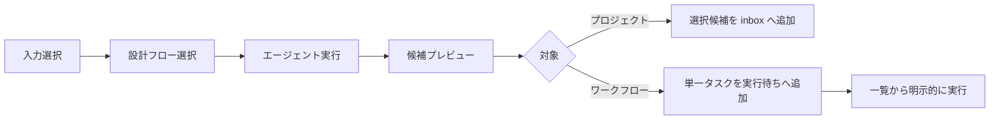

# Agent Dashboard 統一タスク作成ダイアログ設計

## 背景

プロジェクト画面には単一タスクの詳細入力、メモのタスク化、文書のタスク化、バックログ再分解が別々の入口として存在する。ワークフロー画面では設計と実行フォームが同じ画面にあり、タスクの作成と実行開始が分離されていない。

既存の詳細フォームを廃止し、プロジェクトとワークフローを同じ操作モデルへ統一する。タスクは作成時に実行せず、確認後に実行待ちへ追加し、利用者が別途実行を開始する。

## 採用方針

共通4ステップUIと対象別アダプターを採用する。画面構造、操作部品、状態遷移は共通化し、利用できる入力、候補数、保存先、実行開始契約はプロジェクトとワークフローで分ける。

| アプローチ | 実装コスト | リスク | 保守性 | 拡張性 | 学習コスト | UX統一 | 推奨度 |
|---|---:|---:|---:|---:|---:|---:|---:|
| 共通4ステップUI＋対象別アダプター | 中 | 低 | 高 | 高 | 低 | 高 | ★★★ |
| ダイアログを完全共通実装 | 中 | 中 | 中 | 中 | 低 | 高 | ★★☆ |
| 見た目だけ揃えた別実装 | 低 | 中 | 低 | 中 | 中 | 中 | ★☆☆ |

## 共通操作モデル

両ダイアログを次の4ステップに統一する。

1. 入力
2. 設計フロー
3. 候補確認
4. 追加完了

カード選択前に全入力を同時表示しない。戻る操作で入力と選択状態を保持する。主要操作は44px以上とし、選択状態を枠、背景、ラジオ状態、文字で示す。

候補確認には次だけを表示する。

- タスク名
- 目的・作業概要
- 完了条件
- 対象計画バージョン（プロジェクトのみ）
- 警告
- 採用チェック（プロジェクトのみ）

優先度、内部ID、検証コマンド、実行レベルなどの詳細フォームは廃止する。必要な実行情報は設計フローが生成し、確定できない内容は警告として扱う。

## プロジェクトのタスク追加ダイアログ

### 入力

- 自由入力
- マスター憲章（0〜1）
- 計画バージョン（0〜複数）
- メモ（0〜複数）
- ドキュメント（0〜複数）

入力は複数種類を組み合わせられる。既存バックログ、archive、墓標も重複確認材料としてエージェントへ渡す。メモは確定要件とみなさず、不明点や矛盾は警告へ残す。

### 候補と追加

エージェントは複数タスク候補を生成し、計画バージョンごとに分類する。利用者は候補単位で採用、編集、除外できる。採用した候補だけを既存 `inbox/` へ投入し、各タスクへ `charter` を設定する。同じ反映IDの再実行では二重投入しない。

メモ、文書、バックログ再分解、従来の単一タスク追加に分散していたタスク化入口は、このダイアログへ集約する。

## ワークフローのタスク作成ダイアログ

### 入力

- 自由入力
- Markdownドキュメント

プロジェクト憲章、計画バージョン、メモは表示しない。見た目と4ステップの進行はプロジェクトと揃える。

### 候補と実行待ち

エージェント出力は単一タスクへ正規化する。0件または複数件の場合は自動選択せず、警告または再生成へ戻す。確認後はagent-flowを起動せず、実行待ち一覧へ保存する。

実行待ち一覧で利用者が「実行」を押した時点で、既存の `adhocFlowSubmit` 契約へ変換する。開始後は既存の独立したrun詳細画面へ遷移する。実行待ちタスクの削除と、開始済みrunの中止・削除は別の操作として扱う。

## 設計フロー

利用者が選ぶのはエージェント内部方式ではなく作業目的とする。

- 要件を整理する
- 実装計画を作る
- 不足を確認する
- 設計書からタスク化する

各フローは型付き入力を受け取り、候補契約へ変換する。プロジェクトは複数候補、ワークフローは単一候補を返す。

## データフロー

## エラー処理

- ファイル不正、空入力はエージェント実行前に表示する。
- エージェント失敗時も入力と選択状態を保持する。
- 構造化応答が不正なら候補画面へ進めず再実行可能にする。
- 不明な計画バージョンを参照するプロジェクト候補は追加前に拒否する。
- ワークフローの実行待ちは保存に成功した場合だけ一覧へ出す。
- プロジェクト候補の一部だけ失敗した場合は、成功済みと未追加を分けて再試行する。
- 実行待ちと開始済みrunを同じ状態として扱わない。

## テスト方針

- 共通4ステップの状態遷移と戻る操作の入力保持
- 対象別に表示可能な入力が異なること
- プロジェクトは複数候補、ワークフローは単一候補であること
- 候補追加と実行開始が分離されていること
- 計画バージョンへの所属、既存タスクとの重複防止
- 反映IDによる再試行の冪等性
- 分散していたプロジェクトのタスク化入口が新ダイアログへ集約されること
- ワークフロー実行待ちから既存run詳細までの遷移
- 既存プロジェクト実行サイクルとagent-flow runの回帰確認

## Decision Record

| 項目 | 内容 |
|---|---|
| 決定日 | 2026-08-14 |
| 決定者 | チーム |
| 採用案 | 共通4ステップUI＋対象別アダプター |
| 却下案 | 完全共通実装（対象別契約の分岐が共通部へ漏れるため）、見た目だけ揃えた別実装（状態遷移と用語が再びずれるため） |
| 主な理由 | プロジェクトとワークフローの操作を揃えながら、複数候補・型付き入力・保存先の違いを安全に分離できる |
| トレードオフ | 共通UI状態と2つの対象別アダプターを保守する必要がある |
| 再評価条件 | 両対象の入力・候補・保存契約が同一になった場合、または第三のタスク作成対象を追加する場合 |
