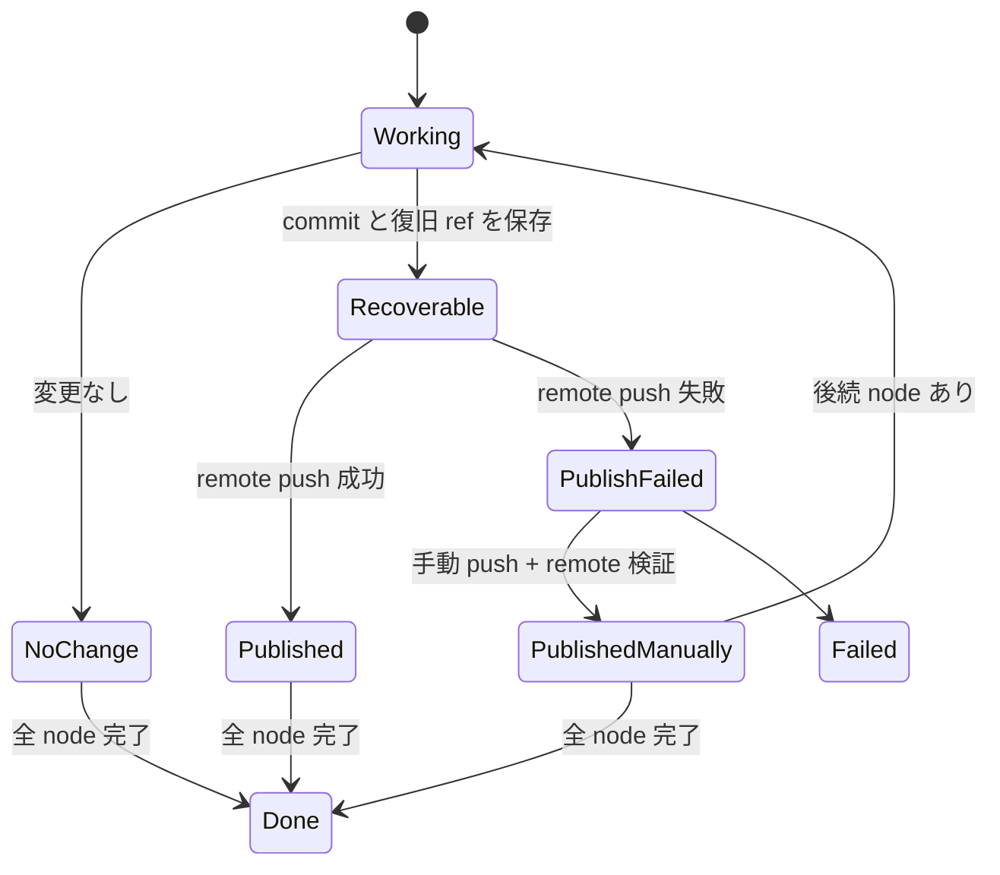

# agent-flow リモート公開保証と緊急復旧

> 対象: `tools/agent-flow/`、`tools/agent-dashboard/`
>
> ワークフロー成果をローカル Git だけで完結させず、リモートへ公開できたことを run の完了条件にする。同時に、公開障害時も成果を失わず、手動 push 後に監査可能な形で run を復旧できるようにする。

## 1. 背景

`af/adhoc-20260814-092654-4851` はローカルには 11 commit の成果が残っていたが、GitHub にはブランチも PR も存在しなかった。Dashboard が workspace の `url` にローカルリポジトリのパスを渡し、agent-flow はその `origin` へ正常に push したため、run は `done` になった。実装上の push 失敗ではなく、保存先と公開先を同じ `url` として扱った契約上の欠陥である。

この状態では Dashboard が `af/<run-id>` を表示しても、それが手元だけにあるのか、共有リモートへ公開済みなのか判別できない。利用者には成功に見える一方、別端末・GitHub・レビュー経路から成果へ到達できない。

## 2. 目的

- Dashboard から開始する書き込み run は、リモートブランチへの push 成功を完了条件にする。
- ローカル作業元と公開先リモートを別の値として agent-flow へ渡す。
- push 失敗時も commit を消さず、手動 push できる復旧 ref を保持する。
- 手動 push 後は、リモート上の commit を検証してから run を強制復旧できるようにする。
- Dashboard は保存場所と公開状態を説明するが、通常時は主要成果より目立たせない。

## 3. アプローチ比較

| アプローチ | 実装コスト | 成果保全 | 責務の明確さ | 運用復旧 | 採否 |
|---|---:|---:|---:|---:|---|
| A. agent-flow が公開状態と復旧 ref を管理 | 中 | 高 | 高 | 高 | 採用 |
| B. push 失敗時の一時 worktree を残す | 低 | 低 | 中 | 低 | 却下 |
| C. Dashboard が agent-flow の後に再 push | 中 | 中 | 低 | 中 | 却下 |

案 A を採用する。一時 worktree は janitor やプロセス終了で消えるため復旧元にできない。Dashboard に push を重複実装すると、CLI・inbox・agent-project など Dashboard を通らない経路と完了条件が分裂する。

## 4. workspace 契約

Dashboard は Git top-level から次を解決して投入する。

```json
{
  "workspace": {
    "url": "git@github.com:example/repository.git",
    "local": "/absolute/path/to/repository",
    "base": "main",
    "target": "",
    "path": "",
    "desc": "workflow"
  }
}
```

- `url`: 成果を公開する canonical remote URL。Dashboard は原則として選択リポジトリの `remote.origin.url` を使う。
- `local`: 高速な worktree 作成と緊急復旧に使うローカル Git top-level。
- `base`: run 開始時の基準ブランチ。
- `branch`: 明示値が無ければ既存規則 `af/<run-id>`。
- remote が無い、または URL を解決できない書き込み run は開始前に拒否する。読み取り専用 run は従来どおり許可する。

remote 名は UI へ保存せず、実行時に URL へ解決する。これにより worker 側の remote 名が `origin` でなくても公開先の意味が変わらない。

## 5. 公開と成果保全

agent-flow は commit 後、remote push より先に次の復旧 ref を `workspace.local` に作成または更新する。

```text
refs/agent-flow/recovery/<run-id>
```

この ref は通常のローカルブランチ一覧には現れず、チェックアウト中のブランチにも影響しない。push の競合解消で rebase した場合は、次の push 前に最新 HEAD へ更新する。

公開処理は次の順序にする。

1. 変更を commit する。
2. ローカル復旧 ref を現在の HEAD へ更新する。
3. `url` から作った workspace の `origin` へ `HEAD:refs/heads/<branch>` を push する。
4. 成功時は delivery に publication 情報を記録し、不要になった復旧 ref を削除する。
5. 失敗時は構造化された publication failure を node result に残し、run を失敗にする。復旧 ref は残す。

node result の `data.publication` は次の契約を持つ。

```json
{
  "state": "failed",
  "url": "git@github.com:example/repository.git",
  "branch": "af/adhoc-...",
  "commit": "0123456789abcdef...",
  "attemptedAt": "2026-08-15T00:00:00Z",
  "error": "authentication failed",
  "recovery": {
    "repository": "/absolute/path/to/repository",
    "ref": "refs/agent-flow/recovery/adhoc-..."
  }
}
```

状態は `published`、`failed`、`not-required` の 3 種類とする。既存 run のように構造化情報が無い場合、読み手は `unknown` として扱い、公開済みと推測しない。

## 6. 手動 push と強制復旧

公開失敗時は Dashboard 詳細と CLI status に、値を埋めた手動コマンドを示す。

```bash
git -C /absolute/path/to/repository push origin \
  refs/agent-flow/recovery/<run-id>:refs/heads/af/<run-id>
```

手動 push 後の緊急コマンドを追加する。

```bash
agent-flow force-complete <run-id> --reason "認証復旧後に手動 push"
```

`force-complete` は単なる status 書き換えにしない。次をすべて満たす場合だけ受理する。

1. run が `failed` で、失敗 result が publication failure として構造化されている。
2. publication failure 以外の失敗 node が無い。
3. `url` の対象 branch を fetch できる。
4. 対象 remote branch が記録済み `commit` を含む。
5. `--reason` が空でない。

受理時は publication failure の node result を `done` に修復し、publication を `published-manually` に更新する。未実行の後続 node があれば run を再開し、全 node が終端済みなら final result を再生成して `done` にする。後続処理を実行せず run 全体だけを成功扱いにすることは禁止する。

監査情報として日時、理由、検証した URL・branch・expected commit・remote tip をイベントと result に残す。既存の通常再試行は維持し、強制復旧は remote push が手動で完了している場合だけ使う。

## 7. Dashboard 表示

run の主要結果の下に、小さなメタ情報行として表示する。

```text
保存: ローカル  ·  公開: GitHub / af/adhoc-... / 0123456
```

- `published`: 「公開済み」。通常色で branch と短縮 commit を表示する。
- `published-manually`: 「手動公開済み」。通常色で、詳細に監査理由を表示する。
- `failed`: 「公開失敗」。警告色とし、詳細を開く導線を表示する。
- `not-required`: 「変更なし」。branch が作られていない理由を短く表示する。
- `unknown`: 「公開状態を確認できません」。旧 run を公開済みとは表示しない。

remote URL、ローカルパス、完全な commit、復旧 ref、手動 push コマンド、強制復旧操作は折りたたみの「保存と公開の詳細」に置く。通常時にバナーや主ボタンは追加しない。公開失敗時だけ詳細を開きやすくし、`force-complete` は確認ダイアログと理由入力を必要とする緊急操作として配置する。

Dashboard は branch 名を `af/<run-id>` から組み立てず、result の publication/delivery を唯一の表示根拠にする。

## 8. 状態遷移



run の `done` は「必要な remote 公開が確認済み」または「変更なし」の場合に限る。ローカル ref の存在だけでは完了にしない。

## 9. エラーと互換性

- remote 未設定、remote URL 解決失敗、復旧 ref 作成失敗、push 失敗、remote 検証失敗を別の構造化エラーにする。
- 復旧 ref を作れない場合は remote push を試さず失敗させる。push 後にだけ保全を試す順序は禁止する。
- 既存 result の `delivery` は読み続ける。publication が無い既存 run は `unknown` で表示する。
- agent-project 固有の task `force-complete` と、今回の agent-flow run `force-complete` は対象と検証規則が異なる。コードと IPC command を共有しない。
- recovery ref は run GC 時に削除する。公開成功時にも即時削除するため、失敗 run の復旧に必要な ref だけが残る。

## 10. テスト方針

変更は TDD で進め、責務境界ごとに次を固定する。

1. Dashboard が local path ではなく remote URL と local path の両方を workspace に渡す。
2. commit 後、push 前に recovery ref が作られる。
3. push 成功時は `published`、失敗時は commit と recovery 情報を伴う `failed` が記録される。
4. push 失敗で run が `done` にならない。
5. `force-complete` が非 publication failure、空理由、remote 不一致を拒否する。
6. remote が expected commit を含む場合だけ node/run を修復し、後続 node があれば再開する。
7. Dashboard が publication の 5 表示状態を正しく描画し、通常時は詳細を折りたたむ。
8. 旧 delivery だけの run は `unknown` として安全側に表示する。

## 11. 非目標

- agent-flow が Pull Request を自動作成すること。
- remote push 失敗を無視して run を成功扱いにすること。
- 未実行 node や通常の実装・検証失敗を強制的に成功へ変えること。
- Dashboard を通らない arbitrary remote-only run にローカル復旧場所を自動生成すること。
- 公開状態を常時バナーや通知で強調すること。

## Decision Record

| 項目 | 内容 |
|---|---|
| 決定日 | 2026-08-15 |
| 決定者 | ユーザー、チーム |
| 採用案 | 案 A: agent-flow が remote 公開、publication 記録、recovery ref、強制復旧を一元管理 |
| 却下案 | 案 B（一時 worktree は消失し得る）、案 C（Dashboard 依存と push 責務の二重化を生む） |
| 主な理由 | run の完了条件と Git 公開を同じ所有者で保証し、CLI・Dashboard・agent-project の全経路で成果喪失を防げる |
| トレードオフ | publication 契約と強制復旧用の状態遷移が増える。代わりに通常失敗と公開失敗を機械判定でき、手動復旧を監査できる |
| 運用上の前提 | 緊急時は recovery ref を手動 push し、remote 検証付き `agent-flow force-complete` で run を復旧できる |
| 再評価条件 | node 単位 push を run 終了時の単一 publish phase へ変更する場合、または複数 remote への同時公開が必要になった場合 |
