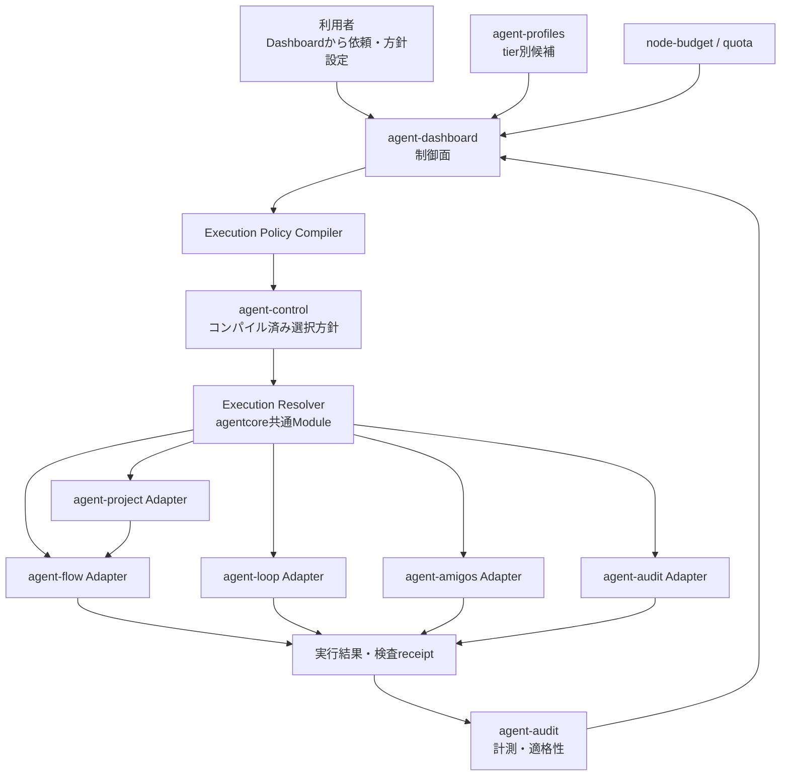
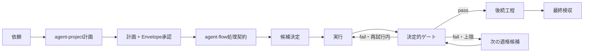

# agent-tools 候補ベース実行方針と agent-dashboard 設計

> 作成日: 2026-08-15  
> 状態: 承認済み  
> 対象: agent-dashboard / agent-project / agent-flow / agent-loop / agent-audit / agent-amigos  
> 制約: PC のハードウェアは増強しない。クラウド CLI は例外利用に留める。  
> 根拠: [`tools/agent-tools/eval/results/archive/`](../../tools/agent-tools/eval/results/archive/)

## 0. 決定の要約

1. 実行の選択単位は「ローカル / クラウド」ではなく、`agent_cli + model` の組み合わせとする。
   例: `aider / gemma4:e4b`、`ollama / gemma4:e4b`、`claude / sonnet`。
2. 実行場所とコストは候補の属性に下げる。将来、端末内実行が有料になったり、外部サービスに
   無料枠があったりしても、選択モデルを変えずに表現できるようにする。
3. 同じモデルでもエージェントが違えば別候補とする。`aider / gemma4:e4b` のコード修正能力と
   `ollama / gemma4:e4b` の構造化抽出能力は同一視しない。
4. `tier` は利用方針・品質・資源配分の軸として残す。処理への適格性は別の証拠として持ち、
   tier だけで候補を汎用 worker に昇格させない。
5. agent-dashboard を制御面、agent-audit を根拠面、各 agent-tools を実行面とする。
   エンジンは `agent-profiles` や監査データを直接読まず、コンパイル済みの `agent-control` だけを読む。
6. agent-project では、利用者が最初の計画と Execution Envelope、最後の成果を承認する。
   中間の候補選択、検査、限定的な再試行、代替候補への切り替えは通常自動で行う。
7. agent-dashboard の通常 UI は増やさない。「おまかせ（推奨）」「節約」「品質優先」
   「カスタム」の名称・推奨状態を維持する。候補と選択理由は折り畳みや実行詳細へ置く。
8. 現在の「エンジンごとに一つの agent/model が適用される」表示は廃止する。同じエンジン内でも
   処理ごとに候補が変わるため、実行方針では選択規則と候補を、実行詳細では実績を表示する。

本書は、[2026-08-14 のローカル主体運転計画](2026-08-14-agent-tools-local-first-operation-plan.md)の
評価記録と決定的ゲートの判断を引き継ぐ。一方、「ローカル / クラウドを第一級のレーンとする」
部分や、e4b を広い worker 帯へ割り当てる部分は本書で置き換える。

## 1. 背景と制約

クラウド CLI のトークン枠が厳しくなり、作成済みの agent-tools を通常運転しにくくなっている。
ハードウェアは M4 MacBook Air、メモリ 16GB で、CPU / GPU / RAM の増強は行えない。
したがって、解決策は大型モデルの常駐ではなく、次の組み合わせになる。

- モデルを仕事全体ではなく、検査できる処理単位で使い分ける。
- 小型モデルに任せる範囲を実測で限定する。
- 成否をモデルの自己申告ではなく、決定的ゲートで確定する。
- 適格な候補がない場合だけクラウド候補へ切り替える。
- クラウド候補も利用できない場合は、弱い候補へ黙って変更せず保留する。
- 端末内モデルは同時に一つだけ動かし、e4b と 12b を同時常駐させない。

利用者は agent-dashboard から agent-project / agent-flow へ依頼し、実行方針、計画承認、
要対応、最終検収を行う。よって、エンジン内部だけを変更しても運用は成立しない。
agent-loop、agent-audit、agent-amigos を含め、制御契約、実行記録、画面表示を同時に揃える。

## 2. 実測から確定している適用範囲

### 2.1 コード修正

| 課題 | 候補 | 結果 | 判断 |
|---|---|---:|---|
| T4: 1 関数と決定的 probe | `aider / gemma4:e4b` | 3方式合計 9/9、中央値約60秒 | 適格 |
| T2: 既存 failing test の修正 | `aider / gemma4:e4b` | 3方式合計 9/9、中央値129〜145秒 | 適格 |
| T1: 実装とテスト追加を一括 | `aider / gemma4:e4b` | 通算1/12 | 自動選択では不適格 |
| T1: 分解 + 決定的ゲート | `aider / gemma4:e4b` | 3/3、中央値952秒、4呼び出し | 定型化済みの場合だけ試行候補 |
| T3: 複数成果物と契約テスト | `aider / gemma4:e4b` | 0/3、9 attemptすべて契約テスト欠落 | 不適格 |
| コード worker | `aider / gemma4:12b` | wall 600 / 1800 とも収束せず | 不適格 |

出典:

- [ゲート一般化レポート](../../tools/agent-tools/eval/results/archive/2026-08-14-gate-generality-report.md)
- [T1 分解レポート](../../tools/agent-tools/eval/results/archive/2026-08-13-t1-decomposition-report.md)

e4b は「小さい仕事なら何でもよい」のではない。適格なコード修正は、少なくとも次の条件を満たす。

- 既存コード 1 ファイル、1 シンボル程度。
- 成果物が一つ。
- 既存テストまたは決定的 probe がある。
- テスト、schema、文書を新規作成しない。
- 複数モジュールの設計判断や広い探索を含まない。
- protected path の変更ではない。
- 変更量の目安が約30行以内。

条件を満たしても、検査なしでは完了扱いにしない。検査失敗時は診断を付けた再試行を最大1回行い、
それでも失敗すれば次の適格候補へ切り替える。作業の丸ごと欠落は再試行で直らないため、
同じ候補を何度も呼び続けない。

### 2.2 読解・分析・レビュー

| 処理 | `ollama / gemma4:e4b` | `ollama / gemma4:12b` | 判断 |
|---|---:|---:|---|
| 抽出 | 6/6 | 4/6 | e4b を適格候補にする |
| 分析 | 6/6 | 6/6 | 有界な分析は e4b を優先候補にできる |
| 制約付き要約 | 4/6 | 4/6 | 決定的制約検査がある場合だけ試行候補 |
| 提案 | 2/3 | 2/3 | 自動適格にはしない |
| レビュー | 2/6 | 6/6 | e4b は不適格、12b は適格候補 |

出典: [テキスト評価レポート](../../tools/agent-tools/eval/results/archive/2026-08-14-text-eval-report.md)

12b はレビュー能力を持つが、コード worker では停止性が悪く、端末制約下で使えない。
同じモデルを「12b」という名前だけで全用途へ展開せず、エージェントと処理の組み合わせで管理する。

### 2.3 agent-project への直接適用率

今回の既存データ棚卸しでは、agent-project の archive / backlog 13件に対し、上記の厳格な
局所修正条件へそのまま当てはまるものは0件だった。agent-flow の完了291ノードに対する
緩い候補抽出は44件だったが、探索、複数成果物、新規テスト等を除くと、T2 / T4相当の割合は
一桁パーセント程度と見込まれる。

したがって、局所パッチだけでは agent-project 全体をローカルモデル主体にできない。
抽出、retrieve、限定分析、決定的処理を含めた候補選択と、agent-flow による処理単位の分解が必要である。

## 3. 用語と概念モデル

### 3.1 実行候補

候補の識別子は `{agent_cli, model}` とする。

```json
{
  "agent_cli": "aider",
  "model": "gemma4:e4b"
}
```

同じモデルでも、エージェントが異なればツール契約、編集能力、停止性、出力形式が変わるため別候補である。

### 3.2 候補の属性

| 属性 | 意味 | 例 |
|---|---|---|
| `execution_site` | 実行場所 | `device` / `external` / `managed` |
| `estimated_cost` | 現時点の予想費用 | 0 JPY、従量単価等 |
| `quota_scope` | 利用枠の単位 | CLIアカウント、端末、モデル |
| `latency` | 実測所要時間 | p50、timeout率 |
| `resource_group` | 同時常駐できない資源群 | `local-llm` |
| `qualifications` | 処理別の適格性 | `qualified` / `trial` / `blocked` / `unknown` |

実行場所とコストは独立させる。`execution_site=device` が `estimated_cost=0` を意味する設計にはしない。
既存の `relative_cost=0` をローカルと同義に扱う箇所は、後方互換を残しつつ段階的に廃止する。

### 3.3 tier

`basic / small / medium / large` は利用方針と候補集合を制御する実行レベルとして維持する。
tier は処理への適格性を保証しない。候補は、現在の方針で許可された tier に含まれ、かつ
処理への適格性を満たした場合にだけ選択対象になる。

tier は `basic < small < medium < large` の順序を持ち、通常時・残量低下時の設定値は**上限**として
扱う。たとえば `medium` は basic、small、medium の候補を許可する。上限より上の候補を明示固定する
場合は、Execution Envelopeの追加承認時にrun限定の`tier_ceiling_override`を固定する。Resolverは
overrideを含む実効tier上限を通常のtier検査へ渡し、pinだけを無条件の例外にはしない。

### 3.4 処理契約

各実行単位は、自由文だけでなく次の処理契約を持つ。

```json
{
  "operation_class": "existing-test-repair",
  "scope": {
    "read": ["src/format.py", "tests/test_format.py"],
    "write": ["src/format.py"],
    "protected": ["schemas/", "docs/architecture/"]
  },
  "deliverables": ["src/format.py"],
  "acceptance": ["pytest tests/test_format.py が成功する"],
  "verification": {
    "commands": [["pytest", "tests/test_format.py"]]
  }
}
```

`operation_class`だけを信頼して候補を選ばない。scope、成果物数、検査の有無など、構造化された
条件も同時に照合する。

## 4. 全体アーキテクチャ



### 4.1 制御面

agent-dashboard と既存の Resource Controller が、利用者設定、候補、適格性、予算、quotaを読み、
各エンジンが実行できる形へコンパイルする。新しい常駐デーモンは作らない。

### 4.2 根拠面

agent-audit が評価台帳と本番receiptを収集し、候補ごとの適格性を生成する。agent-auditは
`control.json`を直接書き換えない。適格性の変更は次回のCompiler評価で反映する。

### 4.3 実行面

各エンジンは `agent-control` のみをpullする。agent-project、flow、loop、amigos、auditの
固有データを共通処理契約へ変換するAdapterを持つが、候補解決の優先順位や適格性判定を複製しない。

### 4.4 契約の所有者

| 契約 | writer | reader | 更新方法 |
|---|---|---|---|
| `agent-profiles` | Dashboard経由の利用者設定をResource Controllerが永続化 | Compiler | revision付きの原子的置換 |
| `agent-candidate-qualifications` | agent-audit | Dashboard、Controller、Compiler | revision付きの原子的置換 |
| `agent-control` | Execution Policy Compiler | Resolver、各エンジン | schema versionとrevision付きの原子的置換 |
| 実行receipt | flow / loop / amigos / auditの各Adapter | agent-audit、Dashboard、project集計 | append-only |

破損または途中書込をreaderが観測した場合は直前の正常revisionを使い、新しいrevisionを部分的に
混在させない。

## 5. Module と Interface

### 5.1 Execution Policy Compiler

管理面に置くdeepなModuleとする。

入力:

- 実行方針プリセットまたはカスタム設定。
- tier別の`agent_cli + model`候補と優先順位。
- 候補適格性。
- node-budget、quota、候補の可用性。
- 端末の同時実行・resource group制約。

出力:

- workloadごとのコンパイル済み候補選択方針。
- lifecycle、concurrency、予算縮退条件。
- 方針revisionと説明文。

Compilerを削除すると、適格性の解釈、quota判定、候補順位、説明文生成が各エンジンへ再出現する。
したがって、このModuleは判断のLocalityと、全エンジンに対するLeverageを持つ。

### 5.2 Execution Resolver

実行直前の候補決定を所有するagentcoreのdeepなModuleとする。

```text
resolve_execution(
  workload,
  purpose_or_role,
  execution_contract,
  explicit_pin,
  budget_state,
  compiled_control
) -> ExecutionDecision
```

`ExecutionDecision`:

```json
{
  "selected": {
    "agent_cli": "aider",
    "model": "gemma4:e4b"
  },
  "selection_source": "qualified-candidate",
  "qualification_id": "aider-gemma4-e4b-existing-test-repair-v1",
  "reason": "既存テストあり、書込1ファイル、候補順位1位",
  "fallback_candidates": [
    {"agent_cli": "cursor", "model": "grok-4.5"}
  ],
  "retry_limit": 1,
  "gate": "verification-command"
}
```

Interfaceが保証する不変条件:

- lifecycle、hard budget、scope、protected pathを候補固定で迂回できない。
- `blocked`候補を自動選択しない。
- `unknown`候補は通常方針では選択しない。
- `trial`候補はtrialが明示された実行だけで選択する。
- 同じ失敗候補を無制限に再試行しない。
- 適格候補がなければ、弱い候補へ黙って変更せず`park`を返す。
- 選択した候補と理由をreceiptへ残せる情報を必ず返す。

### 5.3 各ツールのAdapter

| Adapter | 共通契約へ変換する入力 |
|---|---|
| agent-project | purpose、計画、Execution Envelope、verify設定 |
| agent-flow | node kind、scope、deps、成果物、acceptance、read allocation |
| agent-loop | routine entry、statemachine state、acceptance、check |
| agent-amigos | role、責務、成果物、acceptance、ターン状態 |
| agent-audit | extract / distill / review purpose |

Adapterは選択判断を持たない。少なくとも5つのAdapterが同じSeamを使うため、共通Interfaceを
導入する根拠がある。

## 6. データ契約

### 6.1 agent-profiles

現在のtier別候補列を維持する。候補の識別子は引き続き`agent_cli + model`とする。
候補の追加、削除、同程度の候補間の優先順位は利用者が設定できる。

`agent-profiles`は管理面専用で、エンジンからは読まない。

### 6.2 agent-candidate-qualifications

管理面専用の新しい契約を追加する。候補単位で仕事別の実測を保持する。

```json
{
  "version": 1,
  "revision": 12,
  "candidates": [
    {
      "agent_cli": "aider",
      "model": "gemma4:e4b",
      "qualifications": {
        "existing-test-repair": {
          "qualification_id": "aider-gemma4-e4b-existing-test-repair-v1",
          "status": "qualified",
          "evaluation_profile_id": "existing-test-repair-v1",
          "samples": 9,
          "passed": 9,
          "p50_seconds": 141,
          "constraints": {
            "max_write_files": 1,
            "max_deliverables": 1,
            "requires_existing_verification": true,
            "forbids_new_contract_artifacts": true
          },
          "source": "eval-archive",
          "last_evaluated_at": "2026-08-14T00:00:00Z",
          "valid_until": "2026-11-12T00:00:00Z"
        },
        "multi-artifact-worker": {
          "qualification_id": "aider-gemma4-e4b-multi-artifact-worker-v1",
          "status": "blocked",
          "samples": 3,
          "passed": 0,
          "failure_modes": ["required-deliverable-omitted"]
        }
      },
      "execution_site": "device",
      "resource_group": "local-llm",
      "economics": {
        "estimated_cost": 0,
        "currency": "JPY"
      }
    }
  ]
}
```

適格性の状態:

| 状態 | 意味 |
|---|---|
| `qualified` | 必要サンプルと品質条件を満たす |
| `trial` | 限定的な本番試行を許可できる |
| `blocked` | 既知の失敗があり、自動選択しない |
| `unknown` | 証拠不足。通常は自動選択しない |

`qualification_refs`はORで評価し、参照先のうち一つでも処理契約へ完全一致すれば適格候補になる。
一つのqualification内にある`constraints`はすべてANDで満たす。参照は文字列名ではなく
`qualification_id`で固定し、`evaluation_profile_id`、候補、処理種別、制約versionが一致しない
古い証拠は使わない。

昇格条件は処理種別ごとのversion付きevaluation profileが所有する。profileは少なくとも必要サンプル数、
pass率、timeout率、許容する重大失敗、観測窓、`valid_for_days`を定義する。agent-auditはこの条件を
すべて満たす場合だけ`qualified`へ自動昇格し、重大なscope逸脱や成果物欠落では即時降格できる。
期限切れは`unknown`へ戻す。手動overrideは通常UIに出さず、実行者、理由、期限を監査記録へ残す。

### 6.3 agent-control

既存のpull型契約を維持し、workloadへコンパイル済みの`selection_policy`を加算的に追加する。

```json
{
  "schema_version": 2,
  "revision": 42,
  "valid_until": "2026-08-15T12:00:00Z",
  "workloads": {
    "flow": {
      "tier": "medium",
      "selection_policy": {
        "strategy": "balanced",
        "ranking_formula_version": 1,
        "qualification_revision": 12,
        "retry_limit": 1,
        "no_candidate": "park",
        "candidates": [
          {
            "agent_cli": "aider",
            "model": "gemma4:e4b",
            "qualification_refs": ["aider-gemma4-e4b-existing-test-repair-v1"],
            "rank": 1
          },
          {
            "agent_cli": "cursor",
            "model": "grok-4.5",
            "qualification_refs": ["cursor-grok-4.5-general-code-worker-v1"],
            "rank": 2
          }
        ]
      }
    }
  }
}
```

既存のworkload/purpose上書きと明示固定は互換読取を維持する。固定候補は自動順位より優先するが、
hard safetyと検査を迂回しない。`trial`はExecution Envelopeで候補、処理種別、最大attempt、期限を
明示承認したrunだけに許可する。`blocked / unknown`は明示固定でも実行不可とし、試したい場合は
本番実行ではなくagent-auditの隔離評価へ送る。

### 6.4 Execution Envelope

agent-projectの計画承認時に、次を一緒に固定する。

- 操作可能なrepositoryとpath。
- protected path。
- 受入条件。
- 許可する候補固定、trial、run限定の`tier_ceiling_override`。
- 外部候補の利用上限。
- 候補ごとの再試行上限。
- 再計画または利用者判断が必要になる条件。
- 端末外候補へ送信してよいrepository、path、データ分類。
- 送信禁止path、secret / 個人情報の検出とredaction方針。
- 端末外実行への同意を継承した実行方針revision。

Envelopeはagent-flowのrun metadataへsnapshotとして渡す。実行中に管理面の設定が変わっても、
承認済みscopeと受入条件は変えない。quotaや候補の可用性は実行時に再評価する。
端末外候補は`execution_site`だけで決めず、この送信許可と候補属性の両方を満たす場合だけ選べる。
receiptには送信したpathとデータ分類を記録するが、secretや本文そのものは複製しない。

### 6.5 実行receipt

flow result、loop run、amigos turn、audit callへ次を加算的に記録する。

```json
{
  "schema_version": 2,
  "run_id": "run-123",
  "work_unit_id": "node-7",
  "attempt_id": "node-7:aider-gemma4-e4b:1",
  "started_at": "2026-08-15T01:02:03Z",
  "finished_at": "2026-08-15T01:04:24Z",
  "operation_class": "existing-test-repair",
  "execution_decision": {
    "agent_cli": "aider",
    "model": "gemma4:e4b",
    "selection_source": "qualified-candidate",
    "qualification_id": "aider-gemma4-e4b-existing-test-repair-v1",
    "control_revision": 42,
    "qualification_revision": 12,
    "rank": 1,
    "reason": "既存テストあり、書込1ファイル、候補順位1位",
    "fallback_from": null,
    "eligible_candidate_ids": ["aider/gemma4:e4b", "cursor/grok-4.5"]
  },
  "resource_snapshot": {
    "budget_remaining": 0.63,
    "quota_scope": "device",
    "quota_remaining": 1.0
  },
  "verification": {
    "kind": "command",
    "verdict": "pass",
    "attempt": 1,
    "failure_class": null
  },
  "external_data_classes": []
}
```

Dashboardとagent-auditは設定から実モデルを再推測せず、このreceiptを正典にする。
`eligible_candidate_ids`は候補本文や秘密を含めない。完全な候補順位と除外理由は同じrunのdecision traceへ
revision付きで保持し、receiptから参照できるようにする。

### 6.6 新旧設定の優先順位と移行契約

新しいreaderは次の優先順位で解決する。

1. 当該runのExecution Envelopeにある明示固定。
2. `schema_version >= 2`の`selection_policy`。
3. `selection_policy`がない場合だけ、既存purpose override。
4. 既存workloadの単一`agent_cli / model`。
5. `agent-profiles`の既定候補。

移行中のCompilerは`selection_policy`と、旧reader向けの単一fallback候補をdual-writeする。旧readerは
新フィールドを無視し、新readerは`selection_policy`がある限りlegacy fallbackを再解釈しない。
rollbackはCompilerのschema v2出力を止め、残してあるlegacy fallbackへ戻すことで行う。

全Adapterがschema v2を申告し、対応releaseを2世代運用し、legacy readerのreceiptが観測されなくなった時点を
移行完了とする。それまではlegacyフィールドを削除しない。未知のschema versionを読んだエンジンは推測で
実行せず、最後に対応できたcontrolを`valid_until`まで使い、その後parkする。

## 7. 候補選択アルゴリズム

実行直前に次の順で決定する。

1. lifecycle、hard budget、Execution Envelopeを検査する。
2. 明示固定があれば候補を特定する。ただしscope、protected path、送信許可、検査は迂回させない。
3. 処理契約に一致しない候補と、`blocked / unknown`候補を除外する。
4. 現在の実行方針とtierで許可されない候補を除外する。
5. quota、timeout状態、resource groupを見て現在利用できない候補を除外する。
6. Compilerが方針のstrategyから確定した`rank`で順位付けする。
7. 同順位では利用者が設定した候補順、最後に`agent_cli/model`の昇順を使う。
8. 候補がなければ`park`し、理由と再開条件を記録する。

strategy:

| 方針 | strategy | 候補の選び方 |
|---|---|---|
| おまかせ | `balanced` | 適格性、品質実績、予想消費のバランス |
| 節約 | `economy` | 適格な候補のうち予想費用・消費が小さい順 |
| 品質優先 | `quality` | 適格性の信頼度と品質実績が高い順 |
| カスタム | 利用者指定 | 上記3種類から選択 |

`economy`は実行場所を見ない。候補の料金、トークン、所要時間、再試行率から予想消費を評価する。

strategyの計算はCompilerが所有し、式のversionと入力snapshotをdecision traceへ残す。v1は加重合計ではなく
次の辞書順で比較し、単位の異なる指標を直接加算しない。

| strategy | 比較キー（左が優先） |
|---|---|
| `balanced` | 重大失敗risk、期待成功率の信頼下限（降順）、予想quota消費率、予想費用、p50時間 |
| `economy` | 予想費用、予想quota消費率、失敗込み予想呼出回数、p50時間、期待成功率の信頼下限（降順） |
| `quality` | 重大失敗risk、期待成功率の信頼下限（降順）、評価の新しさ、サンプル数（降順）、予想消費 |

必要な指標がない候補はそのキーで最下位とし、`unknown`な品質をゼロ費用だけで上位へ出さない。
Compilerが出力した`rank`はcontrol revision中では不変であり、Resolverは実行時availabilityによる除外以外の
再採点をしない。これにより、同じ処理契約、control revision、resource snapshotから同じ決定を再現できる。

## 8. agent-project / agent-flow の実行設計

### 8.1 人の承認点

利用者が承認するのは次の2点とする。

1. 初期計画とExecution Envelope。
2. 最終成果と受入条件の充足。

中間の通常実行では、候補選択や限定的な代替候補切替の承認を求めない。



### 8.2 agent-project

- plan、plan review、delivery reviewなど、計画全体を決める呼び出しは未測定の小型候補へ移さない。
- 読み取り、抽出、限定分析、局所修正はagent-flowの処理契約へ分ける。
- 計画時に候補別の実行見込みを作るが、実行時のquotaや適格性変更で変わりうることを明示する。
- 実行後に予測と実績、候補切替、検査結果を集計する。

### 8.3 agent-flow

- plannerは各nodeへ処理契約を付ける。自由文goalだけで候補を決めない。
- `extract / retrieve`は既存の型付きnode contractを利用する。
- 局所修正はscope、成果物数、既存検査を機械判定する。
- 検査失敗は最大1回、測定した診断を付けて同候補へ再投入する。
- 作業欠落、scope逸脱、timeoutは同じ候補へ繰り返さず次の候補へ移る。
- 外部候補がquotaで使えない場合、未知・不適格候補へ黙って降格せずparkする。

## 9. agent-dashboard の実行方針 UI

### 9.1 維持するもの

- 「おまかせ（推奨）」「節約」「品質優先」「カスタム」の名称と並び。
- 「おまかせ」を推奨とする現在の状態。
- tierのUI表示名「単純作業 / 軽量 / 標準 / 高性能」。
- 利用上限、切替時期、上限到達時動作。
- engine / workload単位の利用量、優先度、停止、同時実行数。

### 9.2 廃止する表示

現在の「エンジンごとに適用中のagent/modelを一つ表示する」表を廃止する。同じagent-flow内でも、
抽出、局所修正、レビューで候補が変わるため、単一の実効候補を表示すると誤解を生む。

engine単位の表示は次へ限定する。

- 利用量と利用上限。
- lifecycle。
- concurrency。
- control revisionの反映状態。
- 稼働中 / 停止 / 応答なし。

### 9.3 通常表示

実行方針の主要部は短く保つ。

```text
実行方針

[ おまかせ（推奨）] [ 節約 ] [ 品質優先 ] [ カスタム ]

おまかせ
処理内容に適した候補から、品質と利用量のバランスを見て選択します。
利用上限がある場合は、残り20%未満で軽量候補へ切り替えます。

通常時       標準までの候補を利用
残量低下時   軽量までの候補を利用
候補選択     適格性 → 利用可能性 → 優先順位

エージェント／モデル候補: 6件
                              [候補の使い分けを見る]

                         [この方針を保存して反映]
```

通常表示では候補を全件列挙しない。
上例の20%は表示例であり、実値は選択中プリセットまたはカスタム設定から表示する。

### 9.4 候補の使い分け

「候補の使い分けを見る」を開いたときだけ、組み合わせと自動利用条件を表示する。

```text
▼ 候補の使い分け

aider / gemma4:e4b
  利用条件: 既存テスト付き局所修正
  優先度: 1
  適格性: 確認済み

ollama / gemma4:e4b
  利用条件: 抽出、限定的な分析
  優先度: 2
  適格性: 確認済み

ollama / gemma4:12b
  利用条件: 有界な文章レビュー
  優先度: 3
  適格性: 確認済み

cursor / grok-4.5
  利用条件: 一般的な実装、複数ファイル変更
  優先度: 4
```

適格性と利用条件はagent-auditの根拠から自動生成し、読み取り専用にする。利用者は候補の有効 / 無効、
tierへの所属、同程度の候補間の順序を設定できる。

### 9.5 プリセットの説明

| プリセット | 説明 |
|---|---|
| おまかせ | 適格な候補から品質と利用量のバランスを見て選ぶ |
| 節約 | 適格な候補から予想費用・消費の小さい組み合わせを優先する。適格候補がなければ保留する |
| 品質優先 | 適格性の信頼度と品質実績が高い組み合わせを優先する |
| カスタム | strategy、実行レベル、利用上限、切替時期、上限到達時動作を設定する |

「節約」を「ローカル優先」とは説明しない。端末内候補が将来有料になっても語義が変わらないよう、
予想費用と資源消費を基準にする。

### 9.6 カスタムで設定できる範囲

通常表示する項目は5つに限定する。

1. 候補の選び方: バランス / 利用量優先 / 品質優先。
2. 通常時の実行レベル。
3. 全体利用上限。
4. 切り替えるタイミング。
5. 上限到達時の動作。

```text
候補の選び方
  ○ バランス
  ○ 利用量を優先
  ○ 品質を優先

通常時の実行レベル   [標準 ▼]
全体利用上限         [       ]
切り替えるタイミング [標準 ▼]
上限到達時           [一時停止 ▼]
```

カスタムに処理種別×候補のマトリクスを持ち込まない。候補の追加、削除、tier所属、並べ替えは、
既存の「実行レベルの構成」で扱う。適格性の手編集は通常UIに出さない。

ここでいう「全体利用上限」は利用者が設定するhard budgetで、金額、token、またはCLI利用枠のうち
選択した単位を明記する。`quota`はproviderが返す外部制約、`resource_group`は端末資源の同時利用制約で、
相互に代用しない。「残りN%」の母数は、hard budgetがある場合はその上限、なければ取得可能なprovider
quotaとする。どちらも不明な場合は割合による自動切替を行わず、設定画面に「残量不明」と表示する。

### 9.7 機能ごとの上書き

engine / workloadはモデル選択単位ではなくなるが、予算と稼働制御の単位として残る。

機能ごとに設定できるもの:

- 優先度。
- 個別利用上限。
- 上限到達時の動作。
- 同時実行数。
- 実行許可・停止。

通常UIではengineごとのagent/model指定を新規作成しない。既存の`workloads.<wl>.agents`は
互換読取と開発者向け設定として残す。

## 10. agent-project の控えめな表示

agent-projectの主要導線、一覧カード、ホーム画面、グラフの色は変えない。候補利用を目立つ成果として
扱わず、利用者が詳細を開いた場合だけ確認できるようにする。

### 10.1 計画承認

計画本文と承認操作を主表示に保ち、末尾へ閉じた詳細を置く。

```text
▶ 使用予定のエージェントとモデル

aider / gemma4:e4b       4工程
ollama / gemma4:e4b      3工程
cursor / grok-4.5        2工程
モデル不使用             3工程
実行時に決定             1工程
```

見込みはquotaと実行時の適格性により変わることを併記する。

### 10.2 工程詳細

既存の「実行エージェント」行を拡張する。

```text
エージェント / モデル: aider / gemma4:e4b
選択: 自動
利用条件: 既存テスト付き局所修正
選択理由: 適格性確認済み、標準以内、優先順位1位
代替候補: cursor / grok-4.5
検証: 既存テスト PASS
```

グラフやノード一覧を実行場所やモデルで色分けしない。

### 10.3 最終検収

成果物と受入条件を主表示にし、その下へ候補別の実績を折り畳んで表示する。

```text
▶ エージェント / モデル利用内訳

aider / gemma4:e4b       4工程
ollama / gemma4:e4b      3工程
cursor / grok-4.5        2工程
モデル不使用             3工程
候補切替                 1工程
```

### 10.4 要対応

通常の自動選択や、許可された代替候補への切り替えは要対応に出さない。次の場合だけ利用者へ戻す。

- Execution Envelopeの拡張が必要。
- 外部候補の利用上限またはquotaの回復待ち。
- 利用上限を増やすか中止するかの判断が必要。
- 適格な候補が一つもない。
- 計画または最終成果の承認が必要。

## 11. 各ツールの変更

### 11.1 agent-flow

- nodeごとに処理契約を持つ。
- Execution Resolverを候補選択の唯一のSeamとして使う。
- claimとresultに実際の候補、選択理由、適格性、検査receiptを記録する。
- `aider / gemma4:e4b`は厳格な局所修正条件でのみ候補になる。
- planner、複数成果物、契約変更、曖昧な設計は、実測済み候補が現れるまで既存候補を維持する。

### 11.2 agent-loop

- routine entryへ`operation_class`、scope、acceptance、verificationを追加できるようにする。
- statemachineはworkflow全体ではなくstate単位で候補を決める。
- 既存の決定的checkを小型候補の必須ゲートとして再利用する。
- acceptanceのないsingle-shot実行を、自動で適格扱いにしない。
- 対話セッションは候補変更を即時反映できないため、既存の`restart_required`を維持する。
- Dashboardではroutine詳細を開いた場合だけ、前回使った候補と理由を表示する。

### 11.3 agent-amigos

- roleへ処理契約を追加する。既定はteam builderが生成し、手動roleでは`自動判定`を既定にする。
- team builder、architect、広いimplementerをe4bの汎用roleへしない。
- extract / retrieveの有界roleは`ollama / gemma4:e4b`の候補になりうる。
- 有界な文章reviewerは`ollama / gemma4:12b`の候補になりうる。
- integratorなど決定的に処理できるroleはモデルを使わない。
- eventsへ実際の候補、role、検査、fallback、tokenを記録する。
- ミッション一覧へ候補バッジを追加せず、メンバー詳細でのみ表示する。

### 11.4 agent-audit

- flow node、loop entry/state、amigos role turnを候補単位で収集する。
- eval archiveを初期適格性のseedとして取り込む。
- 評価データと本番receiptを混同せず、sourceを記録する。
- サンプル不足では`qualified`へ昇格しない。
- 品質低下、失敗モードの再発、期限切れを検知して`trial / blocked / unknown`へ戻せるようにする。
- 適格性を生成するが、`control.json`は直接変更しない。

現在のagent-auditはflowのnode resultを収集できるが、loopはエラーログ中心、amigosはミッション全体の
集計中心である。候補適格性を自動更新するには、loopとamigosのreceipt粒度を先に上げる必要がある。

### 11.5 agent-project

- 計画とExecution Envelopeを作成し、利用者の承認後にflowへsnapshotを渡す。
- project自身のplan / reviewを未測定候補へ移さない。
- 候補別の見込みと実績を詳細表示用に集計する。
- agent/model選択のロジックを持たず、Execution Resolverを使う。

## 12. 資源制御

端末内実行を第一級の選択概念にはしないが、resource schedulerには実行場所と常駐資源が必要である。

- `resource_group=local-llm`の同時実行数は1。
- e4bと12bを同時に常駐させない。
- 候補切替時はモデルのunload / load時間を観測する。
- 依存関係のない処理は、同じresource groupの候補をまとめられる場合だけbatchする。
- 依存順を変えてまでモデル切替を減らさない。
- RAMに収まらずswapする候補は`unavailable`として扱う。

これらは候補の`execution_site / resource_group`属性に基づく実装上の制約であり、Dashboardの通常UIでは表示しない。

## 13. 失敗時の扱い

| 失敗 | 動作 |
|---|---|
| 決定的ゲート失敗 | 診断を付けて同候補へ最大1回再投入 |
| 同じゲートが再度失敗 | 次の適格候補へ切替 |
| scope逸脱 / protected path | 再試行せず候補失敗、必要なら利用者へEnvelope拡張を要求 |
| timeout / 停止性 | 同じ時間上限へ繰り返さず次の候補へ切替 |
| quota / rate limit | reset時刻が分かればpark、別の適格候補があれば切替 |
| 適格候補なし | park。弱い候補へ黙って変更しない |
| Controller停止 | controlの`valid_until`までは継続しstale表示。期限後は実行中attemptの完了だけ許可し、新規model callはpark |
| 監査データ破損 | 最後の正常な適格性を保持するかunknownへ倒し、自動昇格しない |

`park`は所有エンジンのrun / work unit状態へ`reason`、`parked_at`、`next_check_at`、control revisionを
永続化する。quotaのreset時刻が既知でEnvelopeが有効なら自動再開できる。reset不明、適格候補なし、
Envelope変更が必要な場合はDashboardの「要対応」に出し、busy pollingしない。qualificationまたはcontrol
revisionの更新も再評価triggerになる。

再試行上限はCompiler、qualification、Execution Envelopeの最小値を採用する。attemptは候補ごとに数え、
fallback先はattempt 1から始める。同じ処理契約でhard failureになった候補は、そのrunでは再選択せず、
利用者の再承認または新しいcontrol / qualification revisionが出た場合だけ再評価する。

## 14. 実装順序

1. 実行receiptの共通項目と`agent-candidate-qualifications` schemaを追加する。
2. archiveの計測を初期候補適格性へ変換する。
3. Execution Resolverをagentcoreへ実装し、契約テストを作る。
4. Dashboard / Resource ControllerのExecution Policy Compilerを候補ベースへ変更する。
5. agent-flowへ処理契約、候補解決、ゲートreceiptを入れる。
6. agent-projectへExecution Envelopeと控えめな詳細表示を入れる。
7. 実行方針UIのエンジン別agent/model表を、方針要約と折り畳み候補一覧へ置き換える。
8. agent-loopをentry/state単位の候補選択へ移す。
9. agent-amigosへrole処理契約とターンreceiptを追加する。
10. agent-auditの継続評価、昇格、退役を候補単位へ移す。

各段階で既存の`agent-control`読取を維持し、一括移行を要求しない。

## 15. テストと受入条件

### 15.1 共通契約

- 同じ入力、control revision、qualification revisionから同じ候補が選ばれる。
- `blocked / unknown`候補が通常方針で選ばれない。
- explicit pinがlifecycle、hard budget、scope、gateを迂回しない。
- 候補枯渇時に`park`となり、未適格候補へ降格しない。
- receiptに実際の`agent_cli + model`と選択理由が残る。
- `medium`指定でbasic / small / mediumだけが候補になり、largeは除外される。
- `tier_ceiling_override=large`を承認したrunだけ、medium設定からlargeへの明示固定がtier検査を通る。
- 明示固定でも`blocked / unknown`や未許可の端末外送信を実行できない。
- schema v2 readerはlegacy fallbackを二重適用せず、schema v1 readerはdual-writeされたfallbackで動ける。
- control期限後は新しいmodel callを開始せずparkする。
- receiptとdecision traceから、使用したrevision、候補順位、quota snapshot、fallbackを再現できる。

### 15.2 Dashboard

- 「おまかせ（推奨）」「節約」「品質優先」「カスタム」が維持される。
- 通常表示にエンジン別agent/model表が出ない。
- 候補一覧は初期状態で閉じている。
- カスタムの主要入力が5項目を超えない。
- 機能別上書きにはagent/model選択を出さない。
- agent-project一覧、ホーム、フローグラフへ候補表示を追加しない。
- 工程詳細と最終検収の折り畳みから、実際の候補と理由を確認できる。
- 通常の候補切替だけで要対応件数が増えない。

### 15.3 エンジン

- flowの局所修正条件を一つでも欠くnodeは`aider / gemma4:e4b`を選ばない。
- loopのcheckが落ちた場合、モデルの成功申告だけで遷移しない。
- amigosの広いroleへe4bを汎用割当しない。
- auditがflow / loop / amigosの候補別結果を同じ語彙で集計できる。
- resource groupの同時実行数1が守られる。

## 16. 非目標

- ローカルモデルでクラウド候補を完全に置き換えること。
- 「ローカル = 無料」「クラウド = 有料」という分類を契約に固定すること。
- 利用者に処理種別×候補の完全な適格性マトリクスを編集させること。
- 小型モデルへ広い自由文ミッションを渡し、長いagent loopで自己修正させること。
- 検査不能な成果を、モデルの自己申告だけでdoneにすること。
- ハードウェア増強や、RAMに収まらないモデルのswap運転。
- Dashboardを全エンジンの親プロセスにすること。

## 17. Decision Record

| 項目 | 内容 |
|---|---|
| 決定日 | 2026-08-15 |
| 決定者 | ユーザー |
| 採用案 | `agent_cli + model`候補を処理適格性、tier、予算、quotaで選ぶ候補ベース実行方針 |
| 制御面 | agent-dashboard / Resource Controller |
| 根拠面 | agent-audit |
| 実行面 | agent-project / agent-flow / agent-loop / agent-amigos / agent-audit Adapter + agentcore Execution Resolver |
| UI | 既存プリセットを維持し、エンジン別agent/model表を方針要約＋折り畳み候補一覧へ変更 |
| agent-project表示 | 一覧・ホームでは強調せず、計画・工程・検収の詳細で候補と理由を表示 |
| カスタム範囲 | strategy、通常tier、上限、切替時期、上限到達時。候補管理は別パネル、適格性は読取専用 |
| 却下案 | ローカル / クラウドを第一級レーンにする、エンジンごとに単一モデルを表示する、適格性マトリクスを通常UIで編集させる |
| 主な理由 | 実行場所と費用は将来変わり、同一モデルでもエージェントにより能力が異なる。処理ごとの候補選択を正確に表しながら通常UIを簡潔に保てるため |
| 再評価条件 | 候補適格性を処理契約から安定して判定できない、ユーザーが候補の自動選択を理解できない、または本番receiptで自動選択が品質を下げる場合 |

## 18. 参考

- [Agent Dashboard 統一実行方針設計](2026-08-11-agent-dashboard-unified-execution-policy-design.md)
- [agent-flow tier適格性設計](2026-08-12-agent-flow-tier-eligibility-strategy-design.md)
- [human / extract / retrieve設計](2026-08-10-agent-tools-human-extract-retrieve-design.md)
- [agent-loop headless候補設計](2026-08-11-agent-loop-headless-agent-cli-design.md)
- [ローカルLLM運用に関する外部見解](https://zenn.dev/chooser/articles/lc-007-local-llm)
