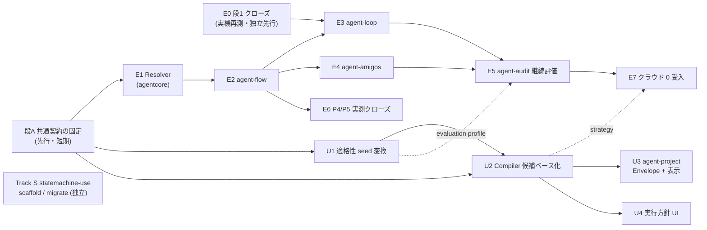

# 候補ベース実行方針の実装計画 — 契約先行でエンジン側と制御面を並列に進める

> 作成 2026-08-15
> 基盤: [ローカル主体運転計画（2026-08-14）](2026-08-14-agent-tools-local-first-operation-plan.md)（段1 実行中）と
> [候補ベース実行方針と agent-dashboard 設計（2026-08-15）](2026-08-15-agent-tools-candidate-execution-policy-dashboard-design.md)（承認済み）。
> 本書は両者を 1 つの実装順序に統合し、並列作業できる単位へ分解する。

## 0. 結論の先出し

- **4 本立てにする。** 先行の**段A（共通契約の固定）**を短く済ませたあと、
  **Track E（エンジン側）**と **Track U（ユーザー設定・制御面）**を並列に走らせる。
  **Track S（statemachine-use の作成・移行自動化）**は他と依存が無く、いつでも並行できる。
- **並列化の要は「契約を先にファイルで固定する」こと。** E と U は同じ 3 契約
  （実行 receipt v2・`agent-candidate-qualifications`・`agent-control` v2）を挟んで進む。
  契約に触る変更はどちらのトラックでも段A の正典ファイルを先に直す。
  これを守る限り、両トラックの作業ディレクトリはほぼ交差しない。
- **段1 の残り（実機再測）は Track E の先頭（E0）で閉じる。** 作業ツリーにある
  `write:` 割付と `agents/ollama-verify.json` は E0 の一部として仕上げる。
- **旧計画の段2（P3 ローカル主体プリセット）は独立実装しない。** 設計書が
  「ローカル / クラウドを第一級レーンにする」部分を置き換えたので、
  P3 の意図は Compiler の strategy（`economy` ほか）と方針プリセットの実値に吸収する。
- **旧計画の残余は E6 / E7 で閉じる。** 段3 の完了条件だった P4 / P5 の実測は E6、
  段2 の受入（定型 flow のクラウド 0 完走・昇格だけがクラウドを呼ぶ）は E7。
  これで旧計画側に残るのは独立レバー（P7 / P8 / P9 / P11）だけになる。
- **statemachine-use には定義の作成・移行を自動化する手段が無い**（scripts は
  engine / next_state / run_machine の実行系 3 本のみ。作成は SKILL.md の手作業手順）。
  スキーマは `check`（コミット済み）に続き `write`（作業ツリー）と拡張が続いているので、
  scaffold と migrate を足し、正規化・検証は engine.py の 1 実装に寄せる。

## 1. 現在地と旧計画の吸収

- 段0（P10）済み。段1 実行中: P1 配線はコミット済み（a8c5602）。実機再測は 2026-08-15 に
  一度失敗し（制御周で小型モデルが pytest / pip の調査ループに落ちる機序）、その対処として
  `write:` 割付（schema.md・gated_implement.yaml・statemachine.py・tests）が作業ツリーにある。
  `agents/ollama-verify.json`（P2 の 12b 検証役定義）も未コミット。
- 設計書は旧計画の評価記録と決定的ゲートの判断を引き継ぎ、レーン概念だけを置き換えた。
  旧計画の各提案は次のように扱う。

| 旧計画 | 本計画での扱い |
|---|---|
| P1 検査コマンド | 実装済み。実機再測だけ E0 で閉じる |
| P2 ルーティング宣言 | E0（agents 定義）と U0（dashboard カタログ）に分割 |
| P3 常用ローカルのプリセット | **独立実装しない。** U2（Compiler の strategy）へ吸収 |
| P4 判定の決定化 / P5 制約ゲート | 処理契約と `check` の語彙内で続行。実装は E2 以降の flow 処理契約に載せ、**実測（旧段3 の完了条件）は E6 で閉じる** |
| P6 クラウド消費の規律 | receipt v2 + E5（audit の候補単位集計）で実現される。**旧段2 の受入（定型 flow のクラウド 0 完走）は E7 で確認する** |
| P7 bge-m3 / P10 / P11 / P8 / P9 | 独立のまま。本計画に混ぜない |

## 2. トラック構成と依存

合流点は 2 つだけ。**E2↔U3**（Envelope snapshot を flow run meta で受ける——契約は段A で
固定済みなので実装は独立に進み、結合テストだけ一緒にやる）と、**E5←U1**
（自動昇格は U1 が定義する evaluation profile を読む）。

## 3. 段A — 共通契約の固定（先行・1 セッション・小）

設計書 §6 を、実装が import / 参照できる正典ファイルへ写す。ここで決めるのは形だけで、
判断ロジックは書かない。

| # | 内容 | 出典 | 規模 |
|---|---|---|---|
| A1 | 実行 receipt v2 の共通項目（`execution_decision` / `verification` / `resource_snapshot`）の JSON Schema + 代表 fixture | 設計書 §6.5 | 小 |
| A2 | `agent-candidate-qualifications` の JSON Schema + evaluation profile の形（必要サンプル数・pass 率・観測窓・`valid_for_days`） + fixture | §6.2 | 小 |
| A3 | `agent-control` v2 `selection_policy` の JSON Schema + 新旧優先順位（§6.6 の 5 段）と dual-write 仕様の文書 + fixture | §6.3 / §6.6 | 小 |

- 置き場は repo ルートの `schemas/`（ツール横断契約の既存正典置き場。verification-plan /
  agent-control と同じ規約——jsonschema への実行時依存は持たず、schema は文書化と
  テスト突き合わせに使う）。語彙と検証の 1 実装は `agentcore/executioncontract.py`、
  fixture は各 schema の `examples`（Python / JS 両側のテストが同じファイルを読む）。
- **完了条件**: 3 契約の schema と fixture が入り、E1（Resolver）と U2（Compiler）が
  同じ fixture で契約テストを書き始められる。

**実装記録（2026-08-15・完了）。** `schemas/agent-candidate-qualifications.schema.json`（A2）・
`schemas/execution-receipt.schema.json`（A1）を新設、`schemas/agent-control.schema.json` へ
version 2（`selection_policy` / `valid_until`）を additive 追加（A3。設計書の
`schema_version` は既存 `version` フィールドへ対応させ、第 2 の版数キーは足さない）。
語彙・検証は `agentcore/executioncontract.py`、契約テストは
`agentcore/tests/test_executioncontract.py`（13 件——examples の合格・schema enum と
モジュール定数の一致・dual-write 実例・壊れた形の拒否）。既存エンジンは control.json の
`version` を検査していないことを確認済み（additive で安全）。

## 4. Track E — エンジン側

| # | 内容 | 主に触る場所 | 依存 | 規模 |
|---|---|---|---|---|
| E0 | **段1 クローズ。** 作業ツリーの `write:` 割付を仕上げてコミットし、T1gate 相当を実機経路で再測して 3/3 帯を確認。`agents/ollama-verify.json` も同時に確定 | `tools/agent-loop/` `agents/` `.github/skills/statemachine-use/` | なし（最優先） | 中 |
| E1 | **Execution Resolver。** `resolve_execution()` を agentcore の新モジュールへ。§5.2 の不変条件（blocked/unknown 除外・pin の非迂回・park・decision の receipt 情報）を契約テストで固定 | `tools/agent-tools/agentcore/agentcore/` | A | 中 |
| E2 | **agent-flow。** node 処理契約（`nodecontract.py` の拡張）、Resolver 統合、claim/result への decision + 検査 receipt 記録、局所修正条件の機械判定（§2.1 の条件） | `tools/agent-flow/`（agentcore 経由） | E1 | 大 |
| E3 | **agent-loop。** routine entry へ `operation_class` / scope / acceptance / verification、statemachine の state 単位で候補決定、既存 `check` を小型候補の必須ゲートに、`restart_required` 維持 | `tools/agent-loop/` | E0・E2 | 中 |
| E4 | **agent-amigos。** role 処理契約（既定は team builder 生成・手動 role は自動判定）と turn receipt | `tools/agent-amigos/` | E2 | 中 |
| E5 | **agent-audit。** flow / loop / amigos を候補単位で収集し、evaluation profile による自動昇格・降格・期限切れ。qualifications を生成するが control は直接書かない | `tools/agent-audit/` | E3・E4・U1 | 大 |
| E6 | **P4 / P5 の実測クローズ（旧計画 段3 の完了条件）。** E2 の flow 処理契約へ載せた決定化パイプ（機械が測れる基準は決定的チェッカーで足切り → モデルには残候補 × 単基準だけ）で、filter / judge の多基準セル（F2 / J1 相当）を引き直し **F1 並み（3/3 帯）**を確認。制約つき生成（字数・合計値・必須語）は `check` の語彙の機械検査 + 再投入で受かることを同じハーネスで確認する。段0 で think も空振りと確定し、決定化がローカル唯一の解 | `tools/agent-tools/eval/` `tools/agent-flow/` | E2 | 中 |
| E7 | **旧計画 段2 の受入の明文化。** strategy=economy 相当の方針で定型 flow を完走させ、**クラウド消費 0・昇格だけがクラウドを呼ぶ**ことを候補単位 receipt（E5 の台帳）で確認する。昇格率が恒常的に高い定型は (b) 族＝ローカル不適として定型から外す（旧計画リスク表の運用をここで開始） | `tools/agent-flow/` `tools/agent-audit/` | E5・U2 | 小 |

E5 を E3 / E4 の後に置くのは receipt 粒度の都合そのもの——設計書 §11.4 の指摘どおり、
loop と amigos の receipt が候補単位になるまで自動昇格の入力が揃わない。
E6 / E7 は旧計画から引き取った測定・受入で、実装の乗り物（E2 / E5・U2）が
入ってから閉じる。

## 5. Track U — ユーザー設定・制御面

| # | 内容 | 主に触る場所 | 依存 | 規模 |
|---|---|---|---|---|
| U0 | **P2 の残り。** `flow-tiers.js` カタログと `tiers.basic` 候補へ 12b 検証役を反映（verify テキストは「軽量＝ローカル 12b」で適格）。コード側候補に 12b を入れない | `tools/agent-dashboard/src/features/orchestration/main/flow-tiers.js` ほか | E0 のコミット後 | 小 |
| U1 | **初期適格性 seed。** eval archive の実測を A2 の schema へ変換（`source: eval-archive`・`valid_until` 付き）。§2.1 / §2.2 の表がそのまま入力になる | `tools/agent-tools/eval/` → qualifications | A | 小 |
| U2 | **Execution Policy Compiler。** Resource Controller / dashboard 側を候補ベースへ。strategy v1 の辞書順比較・`rank` 出力・dual-write（legacy fallback 併記） | `tools/agent-dashboard/` | A・U1 | 大 |
| U3 | **agent-project。** Execution Envelope の作成・承認・flow run meta への snapshot、計画承認/工程詳細/最終検収の控えめ表示（§10） | `tools/agent-project/` `tools/agent-dashboard/` | U2 | 中 |
| U4 | **実行方針 UI。** エンジン別 agent/model 表を廃止し、方針要約 + 折り畳み候補一覧へ（§9）。受入は §15.2 | `tools/agent-dashboard/` | U2 | 中 |

U0 の注意: `agents/*.json` の argv は dashboard 側のテスト・README・コメントに散在している。
定義を触ったら golden 以外も grep して揃える（過去に踏んだ轍）。

## 6. Track S — statemachine-use の作成・移行自動化（独立・いつでも）

**背景。** スキーマはこの 2 日で `check` / `check_on_exhausted`（コミット済み）、
`write`（作業ツリー）と拡張が続いた。だが scripts にあるのは実行系（engine.py /
next_state.py / run_machine.py）だけで、**定義の新規作成は SKILL.md 作成モードの手作業
（ステップ3/4 でフォルダとファイルを手で書く）、既存定義を新スキーマへ揃える手段は無い**。
拡張のたびに手持ちの YAML が静かに古びる構造なので、ここを自動化する。

| # | 内容 | 規模 |
|---|---|---|
| S1 | **scaffold**（`scripts/scaffold.py`）。状態列の宣言から `workflow.yaml` + `actions/*.md` スタブを生成。新スキーマの口（`check` / `check_on_exhausted` / `write` / `output_validator`）をコメント付きで含め、生成直後に検証を通す | 小 |
| S2 | **migrate / lint**（`scripts/migrate.py`）。既存 YAML を検査して dry-run で差分提示、`--apply` で書き換え。検出項目: (a) `check_*` を読む遷移があるのに `check` 宣言が無い state（現行エンジンでは検証エラー——対象列挙と修正案）、(b) メタ文字入り `check` 宣言（シェル不介在なので投入前に落ちる）、(c) headless 編集 state の `write` 未割付（編集対象が一意に決まる場合に提案）、(d) `check_on_exhausted` の暗黙既定の明示化提案。**正規化・検証は engine.py を import して 1 実装に保つ**（P1 で決めた規律） | 中 |
| S3 | SKILL.md 作成モードを scaffold 前提へ更新、examples 4 本を migrate で round-trip して無差分を確認、tests 追加 | 小 |

- 移行対象はスキル内 examples と、利用者が `agent-loop statemachine --workflow PATH` へ渡す
  YAML（置き場が定まっていないので、migrate はパス / glob 指定で受ける）。
- **却下案: スキーマへ version フィールドを足す。** ここまでの拡張はすべて加算的で、
  lint がフィールドの有無から判別できる。破壊的変更が入った時に初めて導入する。

## 7. 並列運用のルール

- **セッション割当**: E = agentcore + agent-flow / loop / amigos / audit、
  U = agent-dashboard + agent-project（表示）+ eval seed、S = `.github/skills/statemachine-use/`。
- **交差点は 2 つだけ**で、順序で解く: `agents/*.json`（E0 を先にコミットしてから U0）、
  agent-project（エンジン変更 E2 と表示 U3——Envelope の契約は段A で固定済みなので、
  結合テストのタイミングだけ合わせる）。
- **契約変更の手順**: どちらのトラックでも、段A の schema / fixture を先に直してコミットし、
  相手トラックはそれを rebase してから続ける。契約ファイルを経由しない「実装同士の忖度」で
  形を合わせない。
- テストはルートの `.venv` を使い、ツールごとに cwd を分けて pytest（まとめると
  `_shared.py` が衝突する）。dashboard の `npm test` は macOS で liveness-host /
  path-wsl-equality の 2 件が既存要因で落ちる——変更起因と誤認しない。

## 8. 里程と完了条件

| 里程 | 内容 | 完了条件 |
|---|---|---|
| M1 | 段A 完了 | 3 契約の schema + fixture が入り、両トラックが契約テストを書ける |
| M2 | E0 + U0（段1 クローズ） | T1gate 相当を実機経路で 3/3 帯。12b 検証役が dashboard カタログに載る |
| M3 | E1 + U2 | Compiler の出力 control を Resolver が読み、同じ fixture で契約テストが噛み合う（§15.1 の再現性・park・pin 非迂回） |
| M4 | E2 + U3 | project 承認 → Envelope snapshot → flow 実 run が receipt v2 を書く。通常の候補切替で要対応が増えない |
| M5 | U4 + E3 + E4 | エンジン別表が消え方針要約へ。loop / amigos が候補単位 receipt を書く |
| M6 | E5 | 本番 receipt からの自動昇格・降格が evaluation profile どおり動く |
| M7 | E6 + E7（ローカル主体運転の受入クローズ） | 多基準 filter / judge が決定化パイプで F1 並み（3/3 帯）。定型 flow がクラウド 0 で完走し、昇格だけがクラウドを呼ぶことを候補単位台帳で確認 |
| 独立 | Track S | scaffold で作った定義がそのまま実行を通り、examples の migrate round-trip が無差分 |

## 9. やらないこと

- **一括移行**（設計書 §14 の通り、各段階で既存 `agent-control` 読取を維持する）。
- **契約未固定のままの UI 先行**。画面は U2 の Compiler 出力が固まってから。
- **qualifications の手編集 UI**（設計書の非目標そのまま）。
- **P8 / P11 / P7 をこの計画へ混ぜる**こと。独立レバーは独立のまま。
- **statemachine スキーマへの version フィールド導入**（§6 の却下案）。
