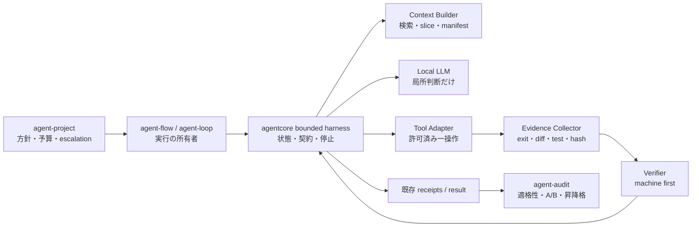

# 小型モデルを局所判断器として使う agent-tools ハーネス改善案

> 作成: 2026-08-27
>
> 状態: 提案
>
> 対象: agent-project / agent-flow / agent-loop / agent-amigos / agent-audit / agent-dashboard / agentcore
>
> 入力: Gemma 4 E4B 向けハーネスについて提示された文章。文中の外部ベンチ値は未検証のため、
> 本提案では着想としてのみ扱い、採否は agent-tools 自身の eval archive と決定的 checker で決める。

## 0. 結論

agent-tools に適用すべき中心案は、Gemma 4 E4B を「自律エージェント」に近づけることではない。
**agentcore が有限状態・契約・停止・証跡を所有し、E4B を一回一判断の局所関数として呼ぶ
`bounded harness` を共通化すること**である。

```text
task
  -> deterministic classify / context select
  -> PLAN (LLM, structured, once)
  -> validate plan (machine)
  -> ACT_ONE (LLM or deterministic tool, exactly one action)
  -> collect evidence (machine)
  -> VERIFY (machine first, optional read-only LLM)
       -> pass: next action or done
       -> fail: classified recovery recipe
       -> unknown / exhausted: escalate or needs
```

これは新しい万能エージェントを追加する案ではない。既存の agent-flow のノード、verification plan、
agent-loop / agent-herd の共有 tool loop、execution / verification receipt、agent-audit の適格性台帳を
**一つの有限実行契約へ揃える案**である。

**効く柱・原則:** 柱 2（自己申告でなく証拠で done を決め、人への無駄な差し戻しを減らす）と
柱 3（弱いローカルモデルへ安全に仕事を降ろし、クラウド枠を温存する）、C5 / C7 / C9 に効く。

## 1. 入力文から採る仮説と、採らない結論

### 1.1 採る仮説

1. 小型モデルは自由な ReAct を長く回すほど良くなるとは限らず、正しい途中状態を後続ターンで
   壊すことがある。
2. 精度改善の主レバーはモデルへの追加思考要求ではなく、状態遷移、狭い tool contract、外部検証、
   typed evidence、文脈圧縮、失敗別 recovery である。
3. 一回の呼び出しを `PLAN`、`ACT_ONE`、`VERIFY_TEXT` のいずれか一つに限定すると、複合指示の
   取りこぼしと反復暴走を減らせる。
4. 反復的・定型的な処理ほど、小型モデルへ移す経済効果を得やすい。

### 1.2 そのまま採らない結論

- 入力文にある Argus 等の成功率を agent-tools の能力根拠にはしない。課題、tool、checker、停止条件が
 違うため、`agent-audit` の同一 task A/B で再現して初めて採用する。
- すべてのローカル呼び出しを 2〜3 ターンへ一律固定しない。既定値の候補にはするが、処理種別ごとの
  `evaluation profile` が上限を所有する。
- LLM verifier を oracle にしない。コンパイラ、テスト、lint、path / hash、exit code を優先し、
  自然文基準だけを読み取り専用 verifier に残す。
- 新しい memory DB、別の workflow engine、別の receipt は作らない。既存正典へ加算的に載せる。

## 2. agent-tools の現状に対する差分

| 補助輪 | 既にある資産 | 足りない接続 |
|---|---|---|
| 有限状態 | agent-flow の DAG / replan、共有 tool loop | 小型モデル向けの共通 `PLAN -> ACT_ONE -> VERIFY -> RECOVER` 契約 |
| 一回一操作 | `one-change-per-step` method、flow のノード分割 | tool loop 自体が一回の action 数を強制し、違反を実行前に拒否する仕組み |
| schema 制約 | agent node / workflow / receipt schemas、Ollama JSON variant | plan と action の最小 envelope、および validator の単一実装 |
| 外部検証 | verification plan、codd-gate、acceptance path / judge | action ごとの expected evidence と観測結果の対応付け |
| 根拠文脈 | context slice、read allocation、repair brief | file / symbol / line / command の typed manifest と入力予算 |
| 失敗別回復 | retry ladder、repair hint、failure classification | 失敗クラスから許可する次遷移を引く決定表 |
| 強制停止 | retry / token / node budget | 重複 action、無改善 diff、連続 verifier fail を横断して止める共通 guard |

したがって新規実装の価値は部品の追加より、**既存部品が同じ attempt ID、状態、evidence ID、
停止理由を受け渡すこと**にある。

## 3. 提案アーキテクチャ

### 3.1 責務境界



| 所有者 | 所有するもの | 所有しないもの |
|---|---|---|
| agent-project | workload 方針、総予算、escalate / needs | 個々の tool call |
| agent-flow / agent-loop | run、node / routine、成果物への反映 | モデル別の停止判定実装 |
| agentcore | 状態機械、schema validation、guard、evidence 正規化 | プロジェクト固有の合否コマンド |
| codd-gate / verification plan | 決定的な受入判定 | 次のモデル選択 |
| agent-audit | 実測、適格性、profile 昇降格 | 本番 run 中の動的な自己改変 |
| agent-dashboard | 方針の表示・選択、停止理由の説明 | 根拠値や適格性の生成 |

### 3.2 最小状態機械

| 状態 | 実行主体 | 許可出力 | 次状態 |
|---|---|---|---|
| `PREPARE` | harness | task class、context manifest、budget | `PLAN` / `BLOCKED` |
| `PLAN` | LLM | 1〜3 個の step 候補。tool 実行は禁止 | `VALIDATE_PLAN` |
| `VALIDATE_PLAN` | harness | valid / error codes | `ACT_ONE` / `RECOVER` |
| `ACT_ONE` | LLM + adapter または deterministic tool | **一つだけ**の action | `COLLECT` |
| `COLLECT` | harness | typed evidence | `VERIFY` |
| `VERIFY` | machine、必要時だけ read-only LLM | pass / fail / unknown | `DONE` / `PLAN` / `RECOVER` |
| `RECOVER` | harness | recipe と縮小 context | `ACT_ONE` / `PLAN` / `ESCALATE` |
| `ESCALATE` | policy | 上位候補、他ノード、needs のいずれか | 外部 run / `BLOCKED` |
| `DONE` | harness | receipt + evidence refs | 終端 |

`PLAN` が全手順を一度に実行すること、`ACT_ONE` が次の action を連鎖的に選ぶこと、`VERIFY` が
成果物を編集することを禁止する。状態ごとに tool disclosure も切り替え、PLAN には読み取り情報だけ、
ACT_ONE には選択済み tool 一つ、VERIFY には読み取り tool と verifier 結果だけを見せる。

### 3.3 最小 envelope

新 schema を直ちに増やす前に、agentcore 内部型として次を試す。A/B で有効性が確認され、複数 engine
間の永続交換が必要になった時点でだけ共有 schema へ昇格する。

```json
{
  "attempt_id": "task-17:gemma4-e4b:1",
  "state": "ACT_ONE",
  "action": {
    "kind": "edit",
    "tool": "aider",
    "args_ref": "sha256:...",
    "target_paths": ["src/parser.py"]
  },
  "expected_evidence": [
    {"kind": "git_diff", "path": "src/parser.py"},
    {"kind": "command_exit", "command_id": "unit-parser", "equals": 0}
  ]
}
```

原則は以下である。

- モデルに shell 文字列、無制限パス、任意 tool 名を生成させない。カタログ ID を選ばせ、adapter が
  実引数へ解決する。
- `expected_result` を自由文だけにしない。`kind` ごとの機械比較可能な条件を最低一つ要求する。
- 出力 parse / schema error は tool error ではなく `contract_error` として分類し、tool を実行しない。
- receipt には envelope 全文を複製せず、digest、状態遷移、evidence refs、停止理由を加算する。

## 4. 7 つの具体案

### A. `bounded-local` execution profile（最優先）

候補の `agent_cli + model` だけでなく、小型モデル用の実行 profile を選べるようにする。

```yaml
profile: bounded-local-v1
max_model_calls: 3
max_actions: 2
max_actions_per_call: 1
max_replans: 1
max_same_action: 1
max_verifier_failures: 2
require_typed_evidence: true
```

profile はモデル名から暗黙推測しない。Execution Policy Compiler が適格性台帳に基づき workload へ
焼き、execution receipt に実効 profile ID と版を残す。上限へ達した場合は「失敗」一般ではなく
`stop_reason` を確定する。

### B. action fingerprint と progress guard

次を LLM なしで計算する。

- action fingerprint = tool ID + 正規化 target + args digest
- artifact fingerprint = 対象 path 群の tree / content digest
- verifier fingerprint = command ID + exit code + failure excerpt digest

同じ action fingerprint が再出現し artifact / verifier fingerprint が改善しなければ、その action は
再実行しない。`RECOVER -> PLAN` へ一度だけ戻し、再発時は escalate する。「同じ操作 2 回」のような
表面的ルールより、**同一操作かつ観測進展なし**を条件にすることで、正当な再試行を残す。

### C. evidence manifest を context の正本にする

モデルへリポジトリ全体や全ログを渡さず、Context Builder が次の順で manifest を作る。

1. task の明示 path / acceptance path
2. `rg` 等の決定的検索結果
3. import / symbol から導いた read-only slice
4. 直前の failing command の最小 excerpt
5. 適用 rules / skill の ID と digest

各 chunk に `source`、`path`、`line_start` / `line_end`、`digest`、`reason` を付ける。圧縮文だけを
根拠にせず、元 evidence ref を保持する。budget 超過時は重要度の低い chunk を決定的に落とし、
何を落としたかを記録する。

### D. failure classifier と recovery recipe

| failure class | 検知 | 次の入力 | 許可遷移 |
|---|---|---|---|
| `contract_error` | JSON / schema / tool ID 不正 | schema error + 有効な列挙値 | ACT_ONE を 1 回だけ再生成 |
| `syntax_or_compile` | compiler exit と分類規則 | 該当 path + error excerpt | 同じ step の repair |
| `test_failure` | test command exit | failing test と関連 diff | repair、全 test log は渡さない |
| `tool_environment` | adapter の既存 error class | retry-after / config evidence | 待機・別候補・別ノード。LLM repair 禁止 |
| `no_progress` | fingerprint guard | plan + diff summary + stop reason | replan 1 回、その後 escalate |
| `scope_violation` | allowlist 外 diff | 違反 path 一覧 | rollback + escalate。モデルに正当化させない |
| `unknown` | 上記に一致しない | evidence refs | 安いモデルで反復せず escalate |

recipe は prompt 自由文ではなく版付きカタログにし、agent-audit が `failure class × recipe × candidate`
の成功率を集計できる形にする。

### E. machine-first verification ladder

検証順序を固定する。

1. 契約検査: 必須成果物、path allowlist、diff 存在、schema
2. task 固有 command: test / compile / lint
3. 静的 acceptance: path、hash、正規表現、件数など
4. 自然文 acceptance が残る場合だけ read-only verifier
5. 判定不能は pass にせず `unknown`

LLM verifier には作業会話を渡さず、acceptance criterion、diff、evidence manifest だけを渡す。
worker と同じ attempt の自己申告は evidence に数えない。

### F. plan の機械縮退

小型 planner が複数 step を返しても、そのまま長い TODO として worker に渡さない。validator が
依存順、path scope、tool capability、各 step の expected evidence を検査し、先頭の executable step
一つだけを ACT_ONE へ射影する。後続 step はモデルの会話履歴ではなく harness state に保存する。

plan が不正な場合は全再生成より先に、機械的に直せるものだけ直す（重複削除、未知フィールド拒否、
順序の安定化）。意味を変える補完はしない。

### G. 適格性を「モデル」から「モデル × profile × operation」へ広げる

同じ E4B でも free loop と bounded profile では別候補として比較する。ただし候補 UI を増殖させず、
agent-audit 内部の evaluation arm として扱い、おすすめ構成は勝った profile だけを提示する。

主要指標:

- acceptance pass rate
- false completion rate
- scope violation rate
- no-progress / duplicate action rate
- model calls / actions / replans
- tokens in / out、wall time
- cloud escalation rate と escalation 後の最終 pass
- 人への needs 回数

品質下限を先に固定し、同等以上の品質で model calls、wall time、クラウド消費が下がる場合だけ昇格する。

## 5. ツール別の適用

| ツール | 最初に適用する面 | 適用しない面 |
|---|---|---|
| agent-flow | 局所 work の retry、extract / classify、verification 前の一操作 | 横断 planner 全体を E4B に置換 |
| agent-loop / herd | 共有 tool loop の action cap、fingerprint、acceptance ladder | 対話セッションの全 turn を一律 3 に制限 |
| agent-project | profile 選択、総予算、escalation / needs | tool call の逐次制御 |
| agent-amigos | 定型ロールの一手、evidence 付き成果 | 合議・曖昧な裁定を弱いモデルだけで完結 |
| agentcore | 状態機械、validator、guard、receipt 射影 | workload 固有 acceptance の所有 |
| agent-audit | A/B、失敗クラス別集計、昇降格 | 本番中の profile 自動書換え |
| agent-dashboard | 実効 profile、残り call、停止・回復理由の表示 | 生の chain-of-thought や全 prompt の表示 |

## 6. 導入順序

### Phase 0: 基準線を固定する

既存 E4B の適格 task から、短い局所編集、extract、失敗修復を各 2〜3 ケース選ぶ。free-loop 相当の
現行経路で calls、重複 action、最終 pass、wall time を記録する。入力文の公開値は比較対象にしない。

### Phase 1: guard だけを既存 tool loop へ入れる

新 schema や UI より先に、`max_model_calls`、`max_actions_per_call=1`、action / artifact fingerprint、
明示 `stop_reason` を agentcore の共有 tool loop に opt-in で実装する。engine ごとに別実装しない。

**採用ゲート:** false completion と pass rate を悪化させず、平均 call 数または no-progress 率が改善する。

### Phase 2: typed evidence と recovery table

既存 verification plan / receipt を参照する evidence manifest を追加し、上位 4 failure class
（contract、compile、test、environment）だけ recipe 化する。unknown を無理に細分類しない。

**採用ゲート:** 同一失敗の二重実行減、repair 成功率向上、scope violation なし。

### Phase 3: PLAN / ACT_ONE 分離

効果が出た operation だけ、plan schema と validator を導入する。agent-flow の既存 DAG と二重の
planner を作らず、単一 node 内の bounded attempt として扱う。

**採用ゲート:** 複合 task の取りこぼし率低下。ただし tokens / wall time の増加を含め総合比較する。

### Phase 4: profile の本番選択

agent-audit で qualified になった `candidate × operation × bounded-local-v1` だけを Execution Policy
Compiler が workload へ焼く。dashboard は recommended / trial / blocked と停止理由を表示する。

## 7. 最小実験マトリクス

| arm | 状態分離 | hard cap | typed evidence | recovery recipe | 目的 |
|---|---:|---:|---:|---:|---|
| A 現行 | 現行 | 現行 | 現行 | 現行 | 基準線 |
| B cap | なし | あり | なし | なし | 「余計なターンを切る」効果の単離 |
| C guard | なし | あり | あり | なし | evidence / no-progress guard の寄与 |
| D bounded | あり | あり | あり | あり | 完成形 |

同じ task、repo revision、モデル設定、context budget、checker で各 arm を反復する。D が勝っても、
B と差がなければ複雑な状態分離は入れない。成功率だけでなく false completion と総資源を同時に見る。

## 8. 停止と escalation の規約

次のいずれかでローカル attempt を必ず終える。

1. acceptance が機械的に pass した。
2. model call / action / replan / verifier failure のいずれかが profile 上限へ達した。
3. 同一 action かつ artifact / verifier に進展がない状態が再発した。
4. allowlist 外変更、test tampering、秘密参照など重大違反を検出した。
5. 必須 evidence が取得不能で `unknown` になった。
6. node / workload token または wall-clock budget が尽きた。

停止後は品質ゲートを緩めない。順に、同一 operation で qualified な上位 profile、他ノードへの委譲、
人の needs へ進む。`unknown` を `pass` に倒すこと、上限を増やして同じ E4B を無期限に回すこと、
verification を省いて成果を採用することは禁止する。

## 9. やらないこと

- SmallCTL / Argus 等を新しい実行基盤として丸ごと導入する。
- モデルに repository analyzer、scheduler、executor、reviewer を一つの prompt で兼任させる。
- 自由 shell、全 tool、全 repository context を E4B へ開示する。
- 「もっとよく考えて」の追加だけを改善として本番投入する。
- retry のたびに会話履歴と全ログを積み増す。
- LLM-as-judge の多数決で決定的 test failure を覆す。
- profile 名から品質を仮定し、operation 別 A/B なしで全 workload へ展開する。
- 新しい中央 coordinator、memory DB、証跡正本を作る。

## 10. 完了の定義

この提案が有効だったと言えるのは、対象 operation で次をすべて満たすときである。

1. 決定的 checker の pass rate が基準線以上である。
2. false completion と scope violation が増えていない。
3. 重複 action、no-progress turn、平均 model call のいずれかが減っている。
4. receipt から実効 profile、状態遷移、evidence、stop reason、escalation を追跡できる。
5. 上限到達時も run が偽の done にならず、上位候補 / 他ノード / needs のいずれかへ有限に着地する。
6. engine ごとに guard / validator / classifier の第 2 実装が存在しない。

## 11. Decision Record

- **決定:** 小型モデル改善の第一候補を prompt 強化ではなく bounded harness とする。
- **決定:** モデルは局所判断、状態・tool 実行・証跡・停止・done 判定は harness が所有する。
- **決定:** 最初の実装は hard cap + progress guard の opt-in A/B とし、完成形を一括実装しない。
- **決定:** 外部ベンチは着想であり採用根拠ではない。agent-tools の checker 付き実測を正とする。
- **保留:** 既定 call 数、action 数、replan 数は operation 別実測後に確定する。
- **棄却:** 自由 ReAct の長時間運転、自己検証による done、別 harness / receipt / memory 正本の新設。

## 12. 関連文書

- [agent-tools コンセプト正典](../designs/agent-tools-concept.md)
- [ローカル LLM の効果的な改善案](./2026-08-27-agent-tools-local-llm-effective-improvement-proposals.md)
- [Gemma 4 system policy 設計](./2026-08-13-agent-aider-gemma4-system-policy-design.md)
- [おすすめ構成の単純化](./2026-08-26-agent-tools-recommended-setup-simplification-design.md)
- [統一 task verify 設計](./2026-07-30-unified-task-verify-design.md)
- [verification 決着設計](./2026-08-09-verification-settlement-design.md)
- [statemachine 決定的 check 設計](../designs/statemachine-deterministic-check-design.md)
